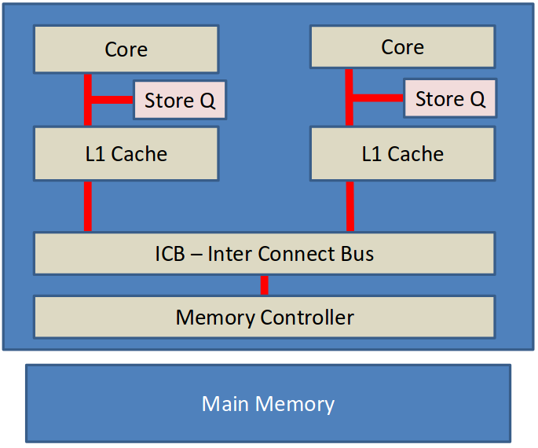
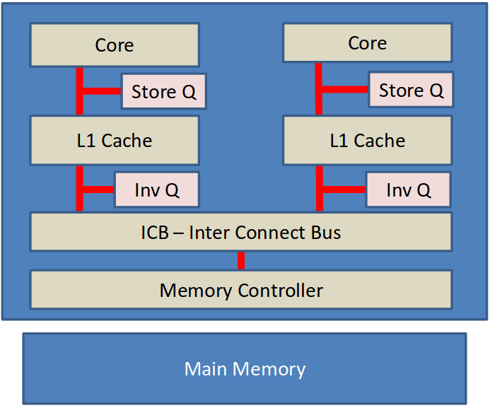

# 疑問[Questions]

- どのようにキャッシュはコア間のデータを共有するのか？
- 複数コアが同時にメモリを更新しているとき、どのようにデータの整合性を保つ[stay consistent]のか？

# 単純な2コアCPU[Simple 2-core CPU]

{width=400px}

# キャッシング[Caching]

{width=400px}

- データはキャッシュラインに格納される(64/128バイト)。
- 最近使われたキャッシュラインへは高速にアクセスできる。

# メモリは遠く離れている[Memory Is Far Away]

{width=400px}

# ICB --- インターコネクトバス[ICB - Inter Connect Bus]

- コアを接続する。
- 単なるデータではない。
- キャッシュコヒーレンスのプロトコル。
- "キャッシュコヒーレンスの分野[domain]"。
    - 通常はすべてのプロセッサとすべてのコア。

# MESIプロトコル[MESI Protocol]

- キャッシュコヒーレンス。
- キャッシュラインは一度にひとつのコアでのみ変更することができる。
- キャッシュラインは4つの状態を取ることができる。^[訳注:文言に関して[@Wikipedia:MESI]を参考にした。]
    - **M** 変更[Modified]
        - そのキャッシュだけに存在し、メインメモリ上の値から変更されている。
    - **E** 排他[Exclusive]
        - そのキャッシュだけに存在し、メインメモリ上の値と一致している(コピーを持つ)。
    - **S** 共有[Shared]
        - 他のキャッシュにも存在し、すべてがメインメモリ上の値と一致している(コピーを持つ)。
    - **I** 無効[Invalid]
        - キャッシュラインが古くなり、もはや正しくない。

# MESIプロトコルのメッセージ[MESI Protocol Message]

- メッセージはキャッシュ間のコヒーレンシーを維持するためICBで送られる。
- ICB上の誰もが'読み込み[Read]'メッセージに応答することができる。
    - メモリコントローラだけでなく他のコアも。

# MESIのメッセージタイプ[MESI Message Types]

- メッセージタイプ(キャッシュラインに関連するもの)
    - 読み込み/読み込みACK[Read / Read Acknowledge]
    - RWITW --- 書き込み目的の読み込み[Read With Intent To Write]
        - 読み込み＋無効化
    - 無効化/無効化ACK[Invalidate / Invalidate Acknowledge]
        - このキャッシュラインを無効化するよう他のコアに依頼する。
    - 書き戻し[Writeback]
        - キャッシュラインをメインメモリに書き戻す。

# キャッシュライン遷移[Cache line transitions]

- キャッシュラインを読み込む。
    - 無効 -> 排他
        - ひとつのコアだけがコピーを持つ場合
    - 無効 -> 共有
        - 他のコアもコピーを持つ場合
- キャッシュラインに書き込む。
    - 排他 -> 変更
    - 共有 -> 変更
        - 他のすべてのコアはそのコアが持つこのキャッシュラインを無効化する。
- 無効化するよう指示する。
    - 排他/共有 -> 無効
    - 変更 -> 無効
        - メインメモリへの'書き戻し'が誘発する。
- 別のコアが変更済みキャッシュラインを読み込もうとする。
    - 変更 -> 共有
        - メインメモリへの'書き戻し'が誘発する。

# 選手入場[The Players...]

- 例
    - コア0 --- プロデューサー
        - `void foo() {data = 1; flag = 1;}`
    - コア1 --- コンシューマー
        - `void bar() {while (flag == 0); assert(data);}`

# キャッシュ所有権の例[Cache Ownership Example]

```c
if (a) {
    b = 4;
}
```

<!-- p.14--20 -->

1. 前提として、
    - 初期値は`a = 1`、`b = 0`とする。
    - `a`と`b`は別のキャッシュライン上にあるとする。
    - コア0のキャッシュは空である。
    - コア1のキャッシュは`a`と`b`を"排他"状態で持つとする。
1. コア0が`if (a)`を評価しようとするとき、
    1. コア0は自身のキャッシュに`a`を持っていないので、`a`を要求するために'読み込み(a)'メッセージを送る。
    1. コア1は要求に応答して'読み込みACK(a = 1)'メッセージを送り、`a`を"共有"状態にする。
    1. コア0は応答を受け取って自身のキャッシュにインストールする。これで、コア0は'a'による分岐を評価できるようになる。
1. コア0が`b = 4`を評価しようとするとき、
    1. コア0は自身のキャッシュに`b`を持っていないので、`b`を要求するために'RWITW(b)'メッセージを送る。
        - 今回は読み込み後に書き込む必要があるので、その意向を示すために'RWITW[書き込み目的の読み込み]'を送る。
    1. コア1は要求に応答して'RWITW(b = 0)'メッセージを送り、`b`を"無効"状態にする。
        - 'RWITW'メッセージは'無効化'の要求でもある。
    1. コア0は応答を受け取って自身のキャッシュに"排他"状態でインストールする。これで、コア0は`b`を単独で持っていることになる。
    1. コア0は`b`に4を格納して"変更"状態にする。このときはまだメインメモリに書き戻していない。

# 2コアCPU＋StoreQ^[訳注:Qはqueueのこと？][2-core CPU + Store Qs]

{width=400px}

# StoreQの理由[Reasons for Store Q]

- 不足分の/無効なキャッシュラインを待っている間のCPU実行ストールを軽減する。
- キャッシュラインがより容易に利用可能である場合、ロードはストアを"通過[pass]"する。
    - すでにローカルキャッシュで、または、隣接するコアによって利用可能かもしれない。
- メモリが局所的に動作しているコアに対して同じに見えることを保証するためにロードに対するStoreQのスヌーピング(覗き見)[snooping]を要求する。
    - ストアがキャッシュに入れなかったとしても、続くロードは格納された値をロードするべきである。

# StoreQ問題の例[Store Q Issue Example]

```c
void foo() {
    data = 1;
    flag = 1;
}
```
: コア0

```c
void bar() {
    while (flag == 0);
    assert(data);
}
```
: コア1

<!--  -->

1. 前提として、
    - コア0は`foo`を実行する。
    - コア1は`bar`を実行する。
    - `flag`のキャッシュラインはコア0が所有する。
    - `data`のキャッシュラインはコア1が所有する。
1. コア0が`data = 1;`を評価するとき、
    1. コア0はストア命令をStoreQに保存する。`data`がキャッシュに存在しないので、`data`の'RWITW'メッセージを送る。
1. コア1が`while (flag == 0);`を評価するとき、
    1. コア1は、`flag`がキャッシュに存在しないので、`flag`の'読み込み'メッセージを送る。
1. コア0が`flag = 1;`を評価するとき、
    1. コア0は`flag`を所有しているので、キャッシュを1に更新して"変更"状態にする。
    1. コア0は`flag`の読み込み要求に応答して'読み込みACK(flag = 1)'を送り、`flag`を"共有"状態にしてメインメモリに書き戻す。
    1. コア1は応答を受け取って自身のキャッシュに"共有"状態でインストールする。
1. コア1が`assert(data);`を評価するとき、
    1. `data`は"排他"状態で持っているので、そのまま読み込まれる。アサート!!
        - `data = 1;`はここまでコア0のStoreQに保存されたままである。
    1. コア1は遅れてきたRWITW要求に応答して'RWITW(data = 0)'を送り、`data`を"無効"状態にする。
    1. コア0は応答を受け取り、自身のキャッシュに"排他"状態でインストールする。
    1. コア0のStoreQは`flag`への書き込みをコミットできるが、時すでに遅し。コア1は停止[halt]し、実行がストップする。

# どうやってこの問題を解決するか？[How do we solve this issue?]

- すべてのキャッシュはメインメモリの一貫性のある視点を持つが、ローカルな書き込みはその範疇ではない。
- 格納されるデータは'キャッシュコヒーレントな領域[domain]'の一部であることを保証する方法が必要である。
    - すなわち、他のコアによって見えている。
        - すなわち、他のコアによってフェッチされることができる。
- StoreQをキャッシュにフラッシュできる？
    - メモリストアバリア(`__mb_release`)

# メモリストアバリア[Memory Store Barirers]

- メモリバリアより先行しているStoreQ中のすべてのデータがキャッシュ中に存在するようになるまで返らないCPU命令。
    - CPUは悪である！
- コンパイラがこのバリアをまたいでメモリストアを最適化するのを防ぐ。
    - コンパイラは悪である！
- キャッシュ中にデータが存在するようになれば、すべての他のキャッシュでキャッシュラインが無効化されるため、すべての他のキャッシュによって確認できるようになる。
    - RWITW(書き込み目的の読み込み)
        - 読み込み＋無効化

# StoreQ問題の例(修正版)

```c
void foo() {
    data = 1;
    __mb_release();
    flag = 1;
}
```
: コア0

```c
void bar() {
    while (flag == 0);
    assert(data);
}
```
: コア1

<!--  -->

1. 前提として、
    - コア0は`foo`を実行する。
    - コア1は`bar`を実行する。
    - `flag`のキャッシュラインはコア0が所有する。
    - `data`のキャッシュラインはコア1が所有する。
1. コア0が`data = 1;`を評価するとき、
    1. コア0は書き込み命令をStoreQに保存する。その後、`data`がキャッシュに存在しないので、`data`の'RWITW'メッセージを送る。
1. コア1が`while (flag == 0);`を評価するとき、
    1. コア1は、`flag`がキャッシュに存在しないので、 `flag`の'読み込み'メッセージを送る。
1. コア0が`__mb_release();`を評価するとき、
    1. コア0はキャッシュをフラッシュするためにStoreQに対するメモリバリアでブロックする。
    1. コア0は`flag`の読み込み要求を受け取って'読み込みACK(flag = 0)'応答を送り、`flag`を"共有"状態にする。
    1. コア1は読み込み応答を受け取り、自身のキャッシュに"共有"状態でインストールする。
    1. コア1は遅れてきたRWITW要求に応答して'RWITW(data = 0)'を送り、`data`を"無効"状態にする。
    1. コア0は応答を受け取り、自身のキャッシュに"排他"状態でインストールする。
    1. コア0はStoreQの`data`への書き込みをキャッシュにコミットして、`data`を"変更"状態にする。
1. コア0が`flag = 1;`を評価するとき、
    1. コア0は`flag`に1をセットしたいが`flag`は"共有"状態なので、まず`flag`の無効化要求メッセージを送る。
    1. コア1は無効化要求を受け取って'無効化ACK(flag)'を送り、`flag`を"無効"状態にする。
    1. コア0は応答を受け取ると`flag`を変更することができるようになる。
1. コア1が`while (flag == 0);`を再び評価するとき、
    1. コア1は`flag`が"無効"状態なので`flag`の'読み込み'メッセージを送る。
    1. コア0は`flag`の読み込要求に応答して'読み込みACK(flag = 1)'を送り、`flag`をメインメモリに書き戻して"共有"状態にする。
    1. コア1は応答を受け取り、自身のキャッシュに`flag`を"共有"状態でインストールする。これで`while (flag == 0)`のループから抜け出すことができる。
1. コア1が`assert(data);`を評価するとき、
    1. コア1は同様にして`data`を読み込む。

# 2コアCPU＋StoreQ＋InvQ[2-core CPU + Store Qs + Inv Q]



# InvalidateQの理由[Reasons for Invalidate Q]

- 他のコアからのより高速な無効化応答
    - ビジーなコアは応答するのに時間がかかる可能性がある。
    - '無効化ACK'応答はキャッシュがキャッシュラインを実際に無効化するまで送ることができない。
- 契約: キューに入れたそのキャッシュラインに対するすべてのメッセージが処理され終わるまで、そのキャッシュラインに関するMESIメッセージがこのコアによって送られることはない。

# InvalidateQ問題の例[Invalidate Q Issue Example]

1. 前提として、
    - コア0は`foo`を実行する。
    - コア1は`bar`を実行する。
    - `flag`のキャッシュラインはコア0が所有する。
    - `data`のキャッシュラインはコア1が所有する。
1. コア0が`data = 1;`を評価するとき、
    1. コア0は書き込み命令をStoreQに保存する。その後、`data`がキャッシュに存在しないので、`data`の'RWITW'メッセージを送る。
1. コア1が`while (flag == 0);`を評価するとき、
    1. コア1は、`flag`がキャッシュに存在しないので、 `flag`の'読み込み'メッセージを送る。
1. コア0が`__mb_release();`を評価するとき、
    1. コア0はキャッシュをフラッシュするためにStoreQに対するメモリバリアでブロックする。
    1. コア1はRWITW要求に応答して'RWITW(data = 0)'を送り、`data`の無効化をInvQに記録する。
    1. コア0は応答を受け取り、自身のキャッシュに"排他"状態でインストールする。
    1. コア0はStoreQの`data`への書き込みをキャッシュにコミットして、`data`を"変更"状態にする。
1. コア0が`flag = 1;`を評価するとき、
    1. コア0は、`flag`が"排他"状態であるため、`flag`を直接更新する。
    1. コア0は`flag`の読み込み要求を受け取って'読み込みACK(flag = 0)'応答を送り、`flag`をメインメモリに書き戻して"共有"状態にする。
    1. コア1は読み込み応答を受け取り、自身のキャッシュに"共有"状態でインストールする。
1. コア1が`assert(data);`を評価するとき、
    1. コア1は、`data`が"排他"状態であるため、メッセージは送らずに自身の古なった値を読み込む。
        - `data`の無効化処理はInvQに保存されたままである。
    1. コア1はInvQから`data`の無効化を適用するが遅すぎる。クラッシュ!!

# どうやってこの問題を解決するか？[How do we solve this issue?]

- 今回は、ローカルコアは読み込みを処理するときに持っているすべての情報を使っていない。
    - なぜ？
        - スピード、スピード、スピード
- すべての情報を使うことをコアに強制する方法はあるのか？
    - はい、'InvalidateQ'をフラッシュできる。
    - メモリロードバリア(`__mb_acquire`)

# メモリロードバリア[Memory Load Barriers]

- CPU命令
- InvalidateQ内のすべてのメッセージが処理される。
- バリアに先立つすべてのロードが完了する。
    - CPUは悪だって言ったよな！
- コンパイラがこのバリアをまたいだメモリロードを最適化しないようにさせる。
    - コンパイラは悪！
- バリア後のデータ読み込みは他のキャッシュ/メインメモリから新しく引き出されることを保証する。
    - 古くなったキャッシュラインを効果的に立ち退かせる。

# InvalidateQ問題の例(修正版)

```c
void foo() {
    data = 1;
    __mb_release();
    flag = 1;
}
```
: コア0

```c
void bar() {
    while (flag == 0);
    __mb_acquire();
    assert(data);
}
```
: コア1

1. 前提として、
    - コア0は`foo`を実行する。
    - コア1は`bar`を実行する。
    - `flag`のキャッシュラインはコア0が所有する。
    - `data`のキャッシュラインはコア1が所有する。
1. コア0が`data = 1;`を評価するとき、
    1. コア0は書き込み命令をStoreQに保存する。その後、`data`がキャッシュに存在しないので、`data`の'RWITW'メッセージを送る。
1. コア1が`while (flag == 0);`を評価するとき、
    1. コア1は、`flag`がキャッシュに存在しないので、 `flag`の'読み込み'メッセージを送る。
1. コア0が`__mb_release();`を評価するとき、
    1. コア0はキャッシュをフラッシュするためにStoreQに対するメモリバリアでブロックする。
    1. コア1はRWITW要求に応答して'RWITW(data = 0)'を送り、`data`の無効化をInvQに記録する。
    1. コア0は応答を受け取り、自身のキャッシュに"排他"状態でインストールする。
    1. コア0はStoreQの`data`への書き込みをキャッシュにコミットして、`data`を"変更"状態にする。
1. コア0が`flag = 1;`を評価するとき、
    1. コア0は、`flag`が"排他"状態であるため、`flag`を直接更新する。
    1. コア0は`flag`の読み込み要求を受け取って'読み込みACK(flag = 0)'応答を送り、`flag`をメインメモリに書き戻して"共有"状態にする。
    1. コア1は読み込み応答を受け取り、自身のキャッシュに"共有"状態でインストールする。
1. コア1が`__mb_acquire();`を評価するとき、
    1. コア1はメモリバリアに到達し、InvalidateQが空になるまで待機する。
    1. コア1はInvalidateQを処理し、`data`を"無効"状態にする。
    1. InvalidateQが空になったので、待機が明け実行を再開する。
1. コア1が`assert(data);`を評価するとき、
    1. コア1は`data`が"無効"状態なので`data`の'読み込み'メッセージを送る。
    1. コア0は`data`の読み込要求に応答して'読み込みACK(flag = 1)'を送り、`data`をメインメモリに書き戻して"共有"状態にする。
    1. コア1は応答を受け取り、自身のキャッシュに`data`を"共有"状態でインストールする。これで`assert(data)`を通過できる。

# 解決法(メモリバリア)[The Solutions (Memory Barriers)]

- 2種
    - 解放[release]セマンティック`__mb_release`
        - StoreQをフラッシュする。
        - プロデューサーの挙動
        - コンパイラがバリアをまたいでストアを移動できなくする。
    - 取得[acquire]セマンティック`__mb_acquire`
        - キャッシュInvalidateQをフラッシュする
        - 先立つロードが完了する。
        - コンシューマーの挙動
        - コンパイラがバリアをまたいでロードを移動できなくする。

# メモリバリア --- 解放セマンティック[Memory Barriers - Release Semantics]

- コンパイラやCPUによる書き込みの並べ替え[reordering]を防ぐ。
    - データへのアクセス権を配るときに使われる。
- x86/x64: `_ReadWriteBarrier();`、`_mm_sfence();`
    - コンパイライントリンシック、コンパイラの並び替えを防ぐ。
- PowerPC: `__lwsync();`
    - ハードウェアバリア、CPUの書き込み並び替え変えを防ぐ。
- **位置取りが重要である！**
    - データを書き込む。
    - `__mb_release()`
    - 制御値を書き込む。

# メモリバリア --- 取得セマンティック[Memory Barriers - Acquire Semantics]

- コンパイラやCPUによる読み込みの並び替えを防ぐ。
    - データへのアクセス権を得るときに使われる。
- x86/x64: `_ReadWriteBarrier();`、`_mm_lfence();`
    - コンパイライントリンシック、コンパイラの並び替えを防ぐ。
- PowerPC: `__lwsync();`または`isync();`
    - ハードウェアバリア、CPUの読み込み並び替え変えを防ぐ。
    - `__lwsync();`
        - これはStoreQ、InvQ、読み込み待機を同期する。
    - `__isync();`
        - これはInvQを空にして、命令キャッシュ[I-cache]をクリアする。これは命令プリフェッチ、すなわち、投機的な読み込みを防ぐ。これはあとで読み込まれるいかなるデータも最新であることを保証する。
- **位置取りが重要である！**
    - 制御値を読み込む。
    - `__mb_aquire()`
    - データを読み込む。

# lwsyncについての簡単なメモ[A quick note on lwsync()]

TODO

# 参考文献[References]
