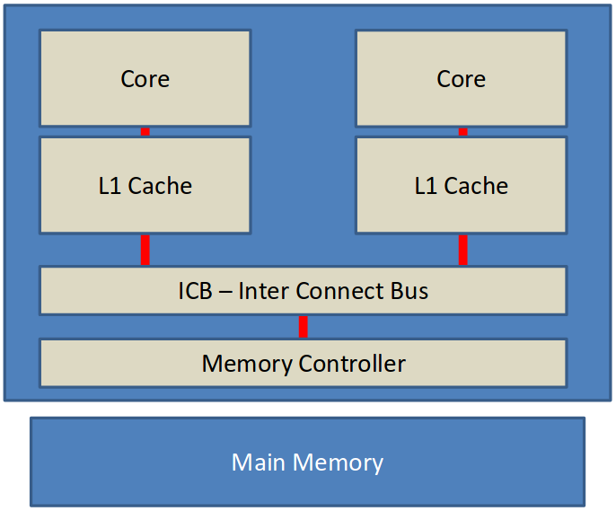
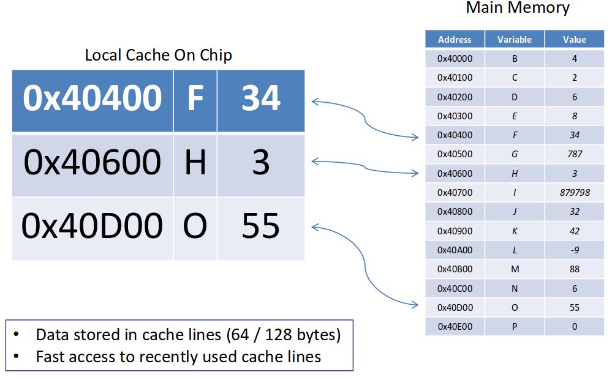
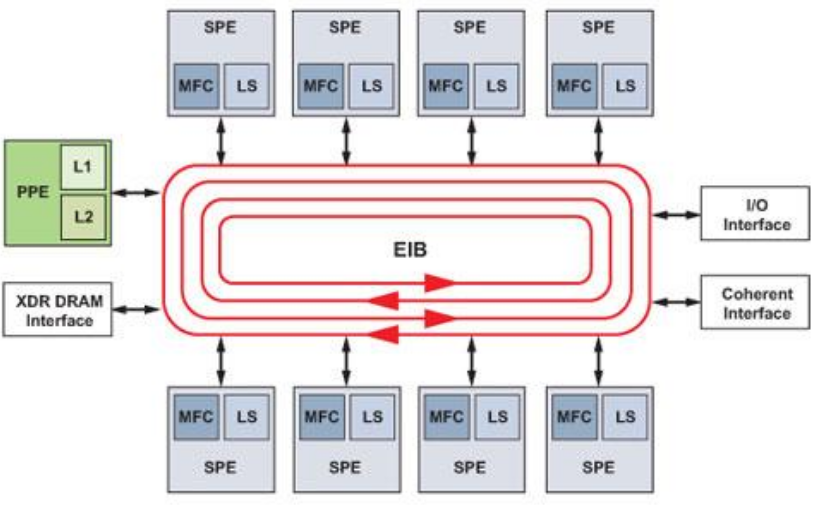

# 疑問[Questions]

- どのようにキャッシュはコア間のデータを共有するのか？
- 複数コアが同時にメモリを更新しているとき、どのようにデータの整合性を保つ[stay consistent]のか？

# 単純な2コアCPU[Simple 2-core CPU]

{width=400px}

# キャッシング[Caching]

{width=400px}

- データはキャッシュラインに格納される(64/128バイト)。
- 最近使われたキャッシュラインへは高速にアクセスできる。

# メモリは遠く離れている[Memory Is Far Away]

{width=400px}

# ICB --- インターコネクトバス[ICB - Inter Connect Bus]

- コアを接続する。
- 単なるデータではない。
- キャッシュコヒーレンスのプロトコル。
- "キャッシュコヒーレンスの分野[domain]"。
    - 通常はすべてのプロセッサとすべてのコア。

# MESIプロトコル[MESI Protocol]

- キャッシュコヒーレンス。
- キャッシュラインは一度にひとつのコアでのみ変更することができる。
- キャッシュラインは4つの状態を取ることができる。^[訳注:文言に関して[@Wikipedia:MESI]を参考にした。]
    - **M** 変更[Modified]
        - そのキャッシュだけに存在し、メインメモリ上の値から変更されている。
    - **E** 排他[Exclusive]
        - そのキャッシュだけに存在し、メインメモリ上の値と一致している(コピーを持つ)。
    - **S** 共有[Shared]
        - 他のキャッシュにも存在し、すべてがメインメモリ上の値と一致している(コピーを持つ)。
    - **I** 無効[Invalid]
        - キャッシュラインが古くなり、もはや正しくない。

# MESIプロトコルのメッセージ[MESI Protocol Message]

- メッセージはキャッシュ間のコヒーレンシーを維持するためICBで送られる。
- ICB上の誰もが'読み込み[Read]'メッセージに応答することができる。
    - メモリコントローラだけでなく他のコアも。

# MESIのメッセージタイプ[MESI Message Types]

- メッセージタイプ(キャッシュラインに関連するもの)
    - 読み込み/読み込み応答[Read / Read Acknowledge]
    - RWITW --- 書き込み目的の読み込み[Read With Intent To Write]
        - 読み込み+無効化
    - 無効化/無効化応答[Invalidate / Invalidate Acknowledge]
        - このキャッシュラインを無効化するよう他のコアに依頼する。
    - 書き戻し[Writeback]
        - キャッシュラインをメインメモリに書き戻す。

# キャッシュライン遷移[Cache line transitions]

- キャッシュラインを読み込む。
    - 無効 -> 排他
        - ひとつのコアだけがコピーを持つ場合
    - 無効 -> 共有
        - 他のコアもコピーを持つ場合
- キャッシュラインに書き込む。
    - 排他 -> 変更
    - 共有 -> 変更
        - 他のすべてのコアはそのコアが持つこのキャッシュラインを無効化する。
- 無効化するよう指示する。
    - 排他/共有 -> 無効
    - 変更 -> 無効
        - メインメモリへの'書き戻し'が誘発する。
- 別のコアが変更済みキャッシュラインを読み込もうとする。
    - 変更 -> 共有
        - メインメモリへの'書き戻し'が誘発する。

# プレイヤーたち…[The Players...]

TODO

# 参考文献[References]
