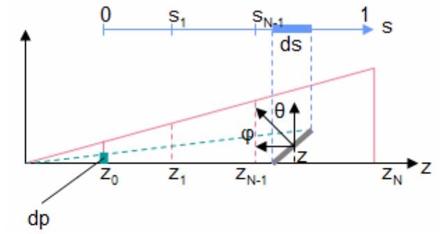
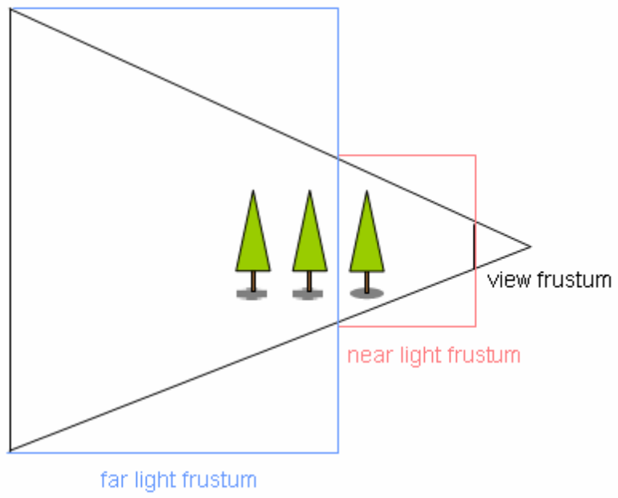

# Introduction

Cascaded Shadow Maps (CSM)

# Related Work

スクリーン空間のエイリアシング誤差を改善しようとする人気のアプローチがいくつかある。これらは伝統的に視錐台全体に作用する。これらのテクニックはCSMのすべての錐台スライスに適用できるが、品質はそれほど改善せず、アルゴリズムの複雑さを増やすことになるだけだろう。実際、CSMはPerspective Shadow Mapsの離散化であると考えることができる。

Perspective Shadow Maps (PSM)[@Stamminger2002]は視錐台と同じ空間を占める[coincide]ようにライト錐台を歪ませる。大まかに言うと、これは現在のカメラの射影後[post-perspective]の空間で標準のシャドウマッピングを適用することで達成される。この手法の欠点は光源の位置やタイプが直観的に変化しないことであり、それ故に、コンピュータゲームにおいてあまり一般的ではない。

Light Space Perspective Shadow Maps (LiPSM)[@Wimmer2004]は光源の方向を変更しない方法でライト錐台を歪ませる。この錐台はライト方向に垂直(シャドウマップに平衡)な視線を持つように作られ、カメラ錐台と可能性のあるシャドウキャスタを含むよう適切に大きさが決められる。PSMと比べて、LiPSMには特殊なケースはそれほどないが、シャドウマップテクスチャを完全には使えていない。

Trapezoidal Shadow Maps (TSM) [@Martin2004]はライトから見えるようなカメラ錐台の境界台形[bounding trapezoid]を構築する。そのアルゴリズムは他のアプローチと似たように行われる。

# Detailed Overview

## Shadow-map generation

ある意味で、ライトの錐台は、遮蔽物足り得るモノすべてを捕らえるよう近場が十分に拡張された、カメラ錐台スライスのバウンディングボックスである。木の上に遮蔽物Bがあった場合、そのボックスは適切に拡張されるべきであり、そうでなければ、Bはシャドウをキャストしないだろう。

{#fig:2-1}

アルゴリズムの第一段階ではカメラアイ空間での視錐台のスプリットのZ値を計算する。シャドウマップのピクセルが辺の長さ$ds$を持つとする。キャストするシャドウはスクリーンの$dp$分を占める。これは影付けされるオブジェクトの法線と位置に依存する。

$$
\frac{dp}{ds} = n \frac{dz}{zds} \frac{\cos\phi}{\cos\theta}
$$

ここで、$n$は視錐台のニア距離である。

理論上、スクリーンできっちり同じ誤差を出すには、$dp/ds$は定数となるはずである。加えて、我々はパースペクティブ誤差のみを最小化するので、コサイン依存のファクタも定数として扱うことができ、それはプロジェクション誤差の原因となる。故に以下となる。

$$
\frac{dz}{zds} = \rho, \quad \rho = \ln(f / n)
$$

ここで、$\rho$の値は制約$s \in [0; 1]$により強制される。

$z$に対して上記の式を解いて離散化することで、以下のようにスプリットポイントが指数関数的に分布するはずである(スプリット数$N$は大きいと仮定する)。

$$
z_i = n (f / n)^{i / N}
$$

ここで、$N$はスプリットの総数である。より詳細な導出は[@Zhang2006]を参照ください。

{#fig:2-2}

しかし、一般的に$N$は1や4となるので、この式ではシャドウ解像度が急激に変化することでスプリットポイントが分かってしまう。[@fig:2-2]はこの不一致[discrepancy]の理由を示す: 視錐台の外でありライト錐台の中であるエリアは見えないので無駄になっている。ただし、$N \rightarrow \infty$となるたびにこのエリアは0に近づく。

この効果に対抗するために$i$に線形な項を追加することで、その差異はもはやほとんど分からなくなる。

$$
z_i = \lambda n (f / n)^{i / N} + (1 - \lambda)(n + (i / N)(f - n))
$$

ここで、$\lambda$は補正の強さを制御する。

$z$でのスプリットが分かった後は、スクリーンの視野角とアスペクト比から現在の錐台スライスの角の点を計算する。詳細は[@Fernandes2011]を参照のこと。

その間に、ライトのモデルビュー行列$\boldsymbol{M}$がライト方向を向くようにセットされ、汎用正射影行列$P$が単位行列にセットされる。その後、カメラ錐台スライスの各角の点$\boldsymbol{p}$がライト同次空間で$\boldsymbol{p}_h = \boldsymbol{P}\boldsymbol{M}\boldsymbol{p}$に射影される。各方向における最小値$m_i$と最大値$M_i$はライト錐台(ボックス)と並行となるバウンディングボックスを形成し、これから、しっかり一致する[coincide]ように汎用ライト錐台を構築するスケーリングやオフセットを決定する。実際に、これは$z$では最良の精度を、$x$と$y$ではできるだけ緩みの少ない精度を得ることを確実にし、クロップ行列$C$を構築することで達成される。最後に、ライトの射影行列$P$は$P = CP_z$に修正される。ここで、$P_z$はニア面とファー面に$m_z$と$M_z$を持つ直交行列であり、$C$は以下の行列である。

$$
C = \left( \begin{array}{c}
    S_x & 0 & 0 & O_x \\
    0 & S_y & 0 & O_y \\
    0 & 0 & 1 & 0 \\
    0 & 0 & 0 & 1
\end{array} \right), \quad \begin{array}{rcl}
    S_x & = & \frac{2}{M_x - m_x} \\
    S_y & = & \frac{2}{M_y - m_y} \\
    O_x & = & -0.5 (M_x + m_x) S_x \\
    O_y & = & -0.5 (M_y + m_y) S_y
\end{array}
$$

ライトの錐台が錐台スライスときっちり一致するようにすることができるが、これはPerspective Shadow Mapsのようにライトの方向やタイプを変更することに注意する。

また、シーンは錐台スライス$i$ごとに錐台カリングされ、モデルビューと射影の行列として$(CP_fM)_ i$を用いてすべてが深度レイヤにレンダリングされる。そして、すべての錐台パーティションに対して手続き全体が繰り返される。

### Final scene rendering

前のステップで生成されたシャドウマップ$1 \dots N$は、このステップではオブジェクトが影の中にいるかどうかを決定するのに使われる。レンダリングされたピクセルごとに、そのZ値が以前に計算したN個のZ範囲と比較される。以降、$i$番目の範囲に含まれるとする。ピクセルシェーダはこの値を射影後の空間で受け取ることに注意する。

そして、フラグメントの位置は、カメラのモデルビュー逆行列$Mc^{-1}$を用いてワールド空間に変換される。その後、スライス$i$のライトの行列で乗算される。この変換は複合的な行列$(CP_fM)_ i Mc^{-1}$に捕捉される。最後に、射影された点が$[-1; 1]$から$[0; 1]$に線形にスケールされる。この変換の後、フラグメントのXY位置は$i$番目の深度マップのテクスチャ座標であり、Z座標はライトからパーティクルへの距離を示す。ルックアップを行うことで、同じ方向におけるライトからもっとも近い遮蔽物への距離が分かる。これら2つの値を比較することで、フラグメントが影の中にあるかが分かる。

# Code Overview

# Results

# Conclusion

# References
