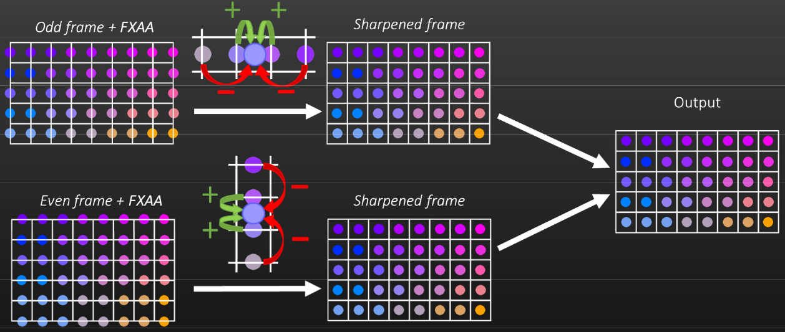

# デシマエンジン[Decima Engine]

コイツが何なのか知らない人たち用:
Decima EngineはKillzoneシリーズのためにGuerrilla Gamesによって作られたゲームエンジンである。
しかし、より大きくより美しい世界をサポートするため、それ以来拡張と最適化を行い続けた。そこには、Horizon Zero Dawnのそれも含まれる。
そして近年、コジマプロダクションとのDecima Engineの共有も始まり、彼らは現在それをDeath Strandingの開発に用いている。

# トピックス[Topics]

- GGXの球エリアライト
- 高さフォグ
- 1080pにおけるAA
- PS4Proでの2160pチェッカーボード

# GGX球エリアライト[GGX spherical area light]

- 形状上でGGXを積分するのは難しい。
- 様々な近似アプローチ
    - パフォーマンス vs クオリティ
    - 形状固有(例えば、多角形ライトの[@Hill2016])
- 球ライトでは: ポイントライトを'たわませる[warp]'安価なトリック[@Karis2013]
    - 歪みを引き起こし得るが、改善できる。

Decima Engineは恐らくエリアライトを用いるライティングをサポートする最初のゲームエンジンのひとつであった。
ただし、初期の実装はGGXをサポートしておらず、我々を制限する要因となっていた。
そこで、最近エリアライトシステムをアップグレードし始め、まずは我々の球エリアライトにGGXを追加しようとした。
しかしながら、GGXのようなマイクロファセットBRDFをエリアライトに統合することは難しく、ある種の近似的なテクニックを必要とする。
実際に、まさにそれを行うためにいくつかの異なるテクニックがここ数年で出現してきた。これらのテクニックのいくつかはパフォーマンスよりクオリティを優先しており、いくつかはその逆を優先している。そして、これらのテクニックの多くは形状タイプのただひとつに対して特に適するようになっている。我々の新しい球エリアライトでは、色々と調べた結果、Brian Karisによって述べられるライト曲げ[bending]トリックを選択することとした。
これは安価であり、多くの様々なゲームエンジンで上手く使われている。
そして、その結果はしばしばかなりまともである。
しかし、特にグレージング角で、予期せぬ形状が現れることがある。
左側の画像でそれをはっきりと確認することができる。しかし、我々はそのテクニックを改善する方法をひとつ見つけ、右側の画像に見えるものがそれである。では、これはどうやって動作するのだろう？

<!-- p.6 -->

- どうやってピクセルあたり1つのポイントライトを用いてエリアライトを近似するのだろう？

まずはBrian Karisのテクニックを調べることから始めよう。その発想は単一のポイントライトで右図のような結果を近似したいということである。
そして、反射ベクトルの方向でエリアライトの外周[perimeter]に向かってポイントライトを動かすことでそれを行うことができる。

<!-- p.7 -->

- ピクセルの反射ベクトルに向かってポイントライトを動かすことで[@Karis2013]
    - Phongモデルに対して素晴らしい[@Picott1992]
    - マイクロファセットモデルではあまり良くない。依然としてピーク応答を'取り逃がす'可能性がある。

これはPhongベースのライティングではとてもうまく動作し、1992年にはすでに述べられていた。
しかし、GGXのようなマイクロファセットベースのモデルではそのように常にうまく動作するわけではない。
これはポイントライトに対して選択される位置が最も支配的な影響を常に上手に代表するわけではないためである。

言い換えれば、ここでの一般的なアイデアはピクセルにピークを持ち込むことであるが、この方法だとピクセルは依然としてピークを取り損なう可能性がある。

<!-- p.8 -->

- アイデア: **その応答を最大化する** ために外周上でポイントライトを動かす。
    - 支配因子[dominant factor]: $N \cdot H$

代わりにしたいことは、エリアライトの外周における異なる位置にポイントライトを動かすことである。
そして、我々はポイントライトが最も強くピクセルを照らすであろう位置を選択する。
Fresnel項、ジオメトリ項、$N \cdot L$項を無視すると、これは法線$N$とハーフベクトル$H$が最も近いときに起こる。

言い換えれば、我々は$N \cdot H$を最大化するライトベクトルを探したい。

<!-- p.9 -->

- 反射ベクトルに向かって光を曲げる[@Karis2013]。

この問題を解決するため、ちょっとした数学を必要になる。なので、必要な変数を定義するところから始めよう。

法線$N$、視線ベクトル$V$、反射ベクトル$R$があるとする。
そして、球エリアライトがあるとする。

このライトの中心が単位方向$L_c$にあると仮定しよう。
そして、その距離上の外周の半径に等しい正弦$s$で球の形状を定義しよう。

<!-- p.10 -->

$$
T = \frac{R - (L \cdot R) L}{\|R - (L \cdot R) L\|} \\
L = \sqrt{1 - s^2} L_c + sT
$$

$$
N \cdot H = H \cdot \frac{L + V}{\|L + V\|}
$$

$L_c$と正規直交でありつつ$R$を指す単位ベクトル$T$も定義しよう。
ようは、$T$は$L_c$に垂直な平面へ投影した反射ベクトル$R$であり、再正規化されている。

この単位ベクトル$T$を使って、ライトの外周を指し、反射ベクトル$R$に最も近い単位ベクトル$L$を簡単に見つけることができる。
すでに得ている正弦$s$と$s$から計算できる余弦を用いて$L_c$を$L$に回転することでこれを行う。

そして、この$L$はハーフベクトル$H$を計算するのに用いることができる。

これがまさにKarisのアプローチで用いられるハーフベクトルである。

<!-- p.11 -->

- 代わりに、$L \cdot H$を最大化するために$L$を曲げる。

$$
B = T \times L_c \\
L = \sqrt{1 - s^2} L_c + s(\cos(\varphi) T + \sin(\varphi) B)
$$

- $N \cdot H$を最大化する$\varphi$は何だろう？

我々は$B$と呼ぶ別のベクトルを導入することでこのアイデアを容易に拡張できる。

$B$はbi-tangent^[従接線？]であり、$L_c$、$T$、$B$と共に正規直交基底を作る。
エリアライトの外周にある任意の点を指す正規化されたライト方向$L$を定義するためにこれを用いることができる。

…角度$\varphi$により外周上を回転するものを含む。

元の問題を振り返ってみると、このトリックは最も大きい$N \cdot H$へと導く$\varphi$を見つけることである。
この方法で、陰影付けしたいピクセルに対するより支配的なスペキュラ応答を見つけるだろう。
そして今度は、これがエリアライトにより良い近似をもたらす。

<!-- p.12 -->

- $N \cdot H$を最大化する$\varphi$を解くのは難しい。
    - sqrt、sin、cos…
- 代わりに、等価な問題を解く。
    - $\varphi$の代わりに$x = \tan(\varphi / 2)$を解く。
    - $N \cdot H$の代わりに$f(x) = (N \cdot H)^2$を最大化する。
- $f(x)$は有理式[rational polynomial]として書き直すことができる。
    - $f(x) = \frac{ax^4 + bx^3 + cx^2 + dx^2 + e}{gx^4 + hx^3 + ix^2 + jx^2 + k}$
- 繰り返し$f(x)$を最大化する。

$\varphi$を直接解くことはむしろ難しい。
これは関係する大量の平方根、正弦、余弦が存在するためである。

しかし、より解きやすい等価な問題にこの問題を再定式化できる。
例えば、角度$\varphi$を解く代わりに、半分の$\varphi$の正接である$x$を解くことができる。
この導出はここで示すには少々長ったらしい[tedious]であるが、一般的な半角の公式を用いるすべての正弦と余弦を取り除くことができる。
更に推し進めて、$N \cdot H$の代わりに$(N \cdot H)^2$を最大化しようとすることができる。これは残りの平方根から我々を解放する。

そして、最後に残るものは$f(x)$と呼ばれる比較的単純な有理式である。

そして、今すべきことはこの$f(x)$を最大化する$x$を見つけることであり、それは$(N \cdot H)^2$を最大化する。
残念ながら、これは未だに解析的に解くには非自明な問題である。
しかし、未だに反復的なアプローチを用いて数値的にこれを解くことができる。

<!-- p.13 -->

- $x$の初期推定値から始める。
    - $x_0 = 0$
    - $f(x_0)$はKarisのアプローチの$(N \cdot H)^2$に等しい。
- ニュートン法を用いて$x_1$を計算する。
    - $x_{n+1} = x_{n} - \frac{f'(x_n)}{f''(x_n)}$
- 我々の最終$(N \cdot H)^2$として$f(x_1)$を用いる。

反復的なアプローチは推測から始まり、それを改善しようとする。
Karisのアプローチから始める。これは$x = 0$で始めることに等しい。

そして、$x_1$を得るためにニュートン法のイテレーションを一回だけ適用する。
これはすでに最大値にかなり近くなるので、我々は単純に最終的な推定値として用いることとする。

$x_1$を$f(x)$に接続することは我々が探していた$(N \cdot H)^2$をもたらし、GGX関数への入力として直接これを用いる。

<!-- p.14 -->

$N \cdot H$最大化なし[@Karis2013]

```hlsl
float GetNoHSquared(float radiusTan, float NoL, float NoV, float VoL) {
    // radiusTanがディレクショナルライトである場合、radiusCosは事前計算できる。
    float radiusCos = rsqrt(1.0 + radiusTan * radiusTan);

    // Rがディスク内に収まる場合、早期離脱する。
    float RoL = 2.0 * NoL * NoV - VoL;
    if (RoL >= radiusCos)
        return 1.0;

    float rOverLengthT = radiusCos * radiusTan * rsqrt(1.0 - RoL * RoL);
    float NoTr = rOverLengthT * (NoV - RoL * NoL);
    float VoTr = rOverLengthT * (2.0 * NoV * NoV - 1.0 - RoL * RoL);

    // 曲がったライトベクトルに基づいて(N.H)^2を計算する。
    float newNoL = NoL * radiusCos + NoTr;
    float newVoL = VoL * radiusCos + VoTr;
    float NoH = HoV + newHoL;
    float HoH = 2.0 * newVoL + 2.0;
    return max(0.0, NoH * NoH / HoH);
}
```

実装がどれだけ複雑かを感じてもらうため、これがHLSLでどうなるかをここに示す。
これはKarisのアプローチの実装であり、すべてスカラの計算である。

<!-- p.15 -->

$N \cdot H$最大化あり

```hlsl
float GetNoHSquared(float radiusTan, float NoL, float NoV, float VoL) {
    // radiusTanがディレクショナルライトである場合、radiusCosは事前計算できる。
    float radiusCos = rsqrt(1.0 + radiusTan * radiusTan);

    // Rがディスク内に収まる場合、早期離脱する。
    float RoL = 2.0 * NoL * NoV - VoL;
    if (RoL >= radiusCos)
        return 1.0;

    float rOverLengthT = radiusCos * radiusTan * rsqrt(1.0 - RoL * RoL);
    float NoTr = rOverLengthT * (NoV - RoL * NoL);
    float VoTr = rOverLengthT * (2.0 * NoV * NoV - 1.0 - RoL * RoL);

    // dot(cross(N, L), V)を計算する。これはすでに計算され、利用可能である。
    float triple = sqrt(saturate(1.0 - NoL * NoL - NoV * NoV - VoL * VoL + 2.0 * NoL * NoV * VoL));

    // 曲がったライトベクトルを改善するためにニュートン法のイテレーションを一回行う。
    float NoBr = rOverLengthT * triple, VoBr = rOverLengthT * (2.0 * triple * NoV);
    float NoLVTr = NoL * radiusCos + NoV + NoTr, VoLVTr = VoL * radiusCos + 1.0 + VoTr;
    float p = NoBr * VoLVTr, q = NoLVTr * VoLVTr, s = VoBr * NoLVTr;
    float xNum = q * (-0.5 * p + 0.25 * VoBr * NoLVTr);
    float xDenom = p * p + s * ((s - 2.0 * p)) + NoLVTr * ((NoL * radiusCos + NoV) * VoLVTr * VoLVTr + q * (-0.5 * (VoLVTr + VoL * radiusCos) - 0.5));
    float twoX1 = 2.0 * xNum / (xDenom * xDenom + xNum * xNum);
    float sinTheta = twoX1 * xDenom;
    float cosTheta = 1.0 - twoX1 * xNum;
    NoTr = cosTheta * NoTr + sinTheta * NoBr;  // NoTrを更新するために新しいTを使う
    VoTr = cosTheta * VoTr + sinTheta * VoBr;  // VoTrを更新するために新しいTを使う

    // 曲がったライトベクトルに基づいて(N.H)^2を計算する。
    float newNoL = NoL * radiusCos + NoTr;
    float newVoL = VoL * radiusCos + VoTr;
    float NoH = HoV + newHoL;
    float HoH = 2.0 * newVoL + 2.0;
    return max(0.0, NoH * NoH / HoH);
}
```

そして、これがニュートン法のイテレーションを一回分追加したときにどうなるかを示す。
ご覧の通り、これは割と多くの命令の追加を行うが、ライトシェーダ全体を比較すれば、これは比較的小さい変更であるのかもしれない。
これがどれだけ使われるかによって、パフォーマンスの違いは目立つかもしれないし、事実上タダになるかもしれない。

<!-- p.16 -->

ここでは$N \cdot H$最大化ありとなしでの太陽の反射を確認する。
ご覧の通り、小さな角度でより自然に見える反射を得るので、かなりうまく動作している。

しかし、このスクリーンショットがHorizon Zero Dawnで作られているとしても、このテクニックはHorizonを出荷した後に出来上がったことは言及しておくべきだろう。
しかし、内部使用のために増設[retro-fit]され、他のタイトルのために使う用意が整っている。

# 高さフォグ[Height fog]

- 背景
    - フォトリアリスティックな大気[atmosphere]を必要とする。
    - 事前計算された大気散乱モデル[@Bruneton2008; @Elek2009]はフォトリアリスティックなゲーム[@Hillaire2016]に対する最適解のひとつである。
    - 空気遠近[aerial perspective]はルックアップテーブルに依存する。
    - アーティストフレンドリーな高さフォグを必要とする。
- 要約[abstract]
    - 解析的高さフォグモデル
        - 事前計算された散乱モデルに組み込まれる。
        - 現実的な空気遠近＆アーティスティックな高さフォグ
- (コジマプロダクションによるDecima Engineの独自改造)

このセクションでは、コジマプロダクションによって作成されたDecima Engineの独自改造である高さフォグモデルを紹介しようと思う。

まずはじめに、この最適化が必要になった理由を説明させてください。
Decima Engineは雲と屋外ライティングに接続された柔軟な大気散乱システムを持っている。
しかし、コジマプロダクションでは、フォトリアリスティックなレンダリングに最適化された大気散乱システムに対する要求があった。
事前計算された大気散乱はフォトリアリスティックなゲームに対する最適な手法のひとつである。
このモデルでは、空気遠近は事前計算されたルックアップテーブルに強く依存している。
フォトリアリスティックな大気に対してうまく動作するが、実際のゲームでの濃い[dense]フォグや色付きフォグのようなアーティスティックな量をしばしば表現する必要がある。

フォトリアリスティックな空気遠近やアーティスティックな高さフォグをひとつの高さフォグモデルで表現できるなら、それは良いことだろう。これを達成するため、解析的な高さフォグモデルを導入し、事前計算された大気散乱モデルと組み合わせた。この組み合わせがどのように動作するかをお見せしよう。

# 高さフォグ: 組み合わせ[Height fog: Combination]

- ボリュームレンダリング方程式[@Chandrasekhar1960; @Jensen2001]

$$
\frac{dL(s, \omega)}{ds} = \sigma_a(s) L_e(s, \omega) - \sigma_t(s) L(s, \omega) + \sigma_s(s) \oint p(s, \omega, \omega') L_i(s, \omega') d\omega'
$$ {#eq:1}

- 地球の大気条件[atmospheric condition][@Nishita1993]
    - Rayleigh[レイリー]散乱、Mie[ミー]散乱
    - 標高[altitude]で空気密度[air density]が指数関数的に減少する。
- [@eq:1] --- 数値積分、散乱情報をLUTに --->
    - 事前計算された散乱モデル[@Bruneton2008; @Elek2009]
- [@eq:1] --- 単一散乱 --->
    - 解析的一様フォグ[@Hoffman2002]
    - 解析的高さフォグ(in-scattering^[内への散乱。外から入って来た光が散乱して最終値に合算される。参考:[memoRANDOM](https://rayspace.xyz/CG/contents/VLTE1/)]なし)[@Wenzel2007]

これが我々のアプローチの概要である。

**ボリュームレンダリング方程式**:
開始地点はボリュームレンダリング方程式であり、地球の大気条件である。
地球の大気条件はRayleigh散乱、Mie散乱、標高で空気密度が指数関数的に減少する関与媒質によって説明される。
事前計算されるモデルと解析的モデルの両方はこれらの条件を共有する。

**事前計算された大気散乱モデル**:
事前計算された大気散乱モデルは数値積分を行い、in-scatteringと透過率[transmittance]の情報をルックアップテーブルに格納する。

**高さフォグモデル**:
対して、高さフォグモデルはシーンをレンダリングするときに直接フォグを計算する。
この計算は単一散乱を仮定するボリュームレンダリング方程式の解析解である。
この種の解析解は一様フォグモデル[@Hoffman2002]として知られるが、高さフォグモデルとして申し分のない[satisfactory]解を見つけることはできなかった。

<!-- p.20 -->

なので、独立してそれを導出した。
それを導出するため、単一の散乱と単一のスケールハイト[scale-height]を仮定した。
ここで、スケールハイトは標高でフォグ密度がどれだけ減少するかを述べるためのパラメータである。

**組み合わせ**:
我々のアプローチでは、事前計算された大気散乱モデルから高さフォグモデルへ天空光[skylight]と太陽光[sunlight]の情報を提供した。

以上で基本的な概要を終了する。
次のスライドでは、この組み合わせに注目しようと思う。

<!-- p.21 -->

地球外から[extraterrestrial]の太陽光
↓
事前計算された大気散乱モデル
$L_{inscatter}^{(LUT)}$ → $L_{background}$
$L_{sun}^{(LUT)}$ → $L_{sun}$
$L_{sky}^{(LUT)}$ → $L_{amb}$
↓
高さフォグモデル
$$
L = L_{background} \alpha(y) + (L_{sun} + L_{amb})(1 - \alpha(y))
$$

我々が仮定する組み合わせはボリュームレンダリング方程式の階層的な近似である。

まず、太陽光があると仮定しよう。

この地球外からの太陽光は地球に降り注ぎ、空気と相互作用する。
我々の事前計算されたモデルは複数散乱の情報を生成し、LUTの$L_{inscatter}$、$L_{sun}$、$L_{sky}$として格納する。

高さフォグモデルは事前計算されたLUTから背景放射[background radiation]、太陽光、天空光を受け取る。

適切に事前計算ツールを開発するならば、この種のLUTを達成することは自明のタスクのように思われる。
しかし、この問題は、特に一様でないフォグに対して、高さフォグのような解を得られるか否かである。

続くスライドでは、事前計算されたモデルと高さフォグモデルを詳細に説明しようと思う。

# 高さフォグ: 事前計算[Height Fog: Precomputation]

- 事前計算された大気散乱[@Bruneton2008; @Elek2009]
    - 最適化[@Hillaire2016]
        - in-scatterカラーエンコーディング[@Bruneton2008]
        - $\theta_{sv}$^[光源方向と視線方向とのなす角]依存性を無視する[@Elek2009]。
        - 改善されたLUTパラメータ化[@Yusov2013]
- 我々のLUT
    - $L_{inscatter}^{(LUT)}(\theta_s, \theta_v, y, t)$
        - $\theta_s$: 上方向と光源方向とのなす角
        - $\theta_v$: 上方向と視線方向とのなす角
        - $y$: 視点の高さ
        - $t$: 2つの散乱係数設定間の補間率
    - $L_{sun}^{(LUT)}(\theta_s, y, t)$: 代表的な位置$r(x, y, z)$に到達する太陽光
    - $L_{sky}^{(LUT)}(\theta_s, y, t)$: 代表的な位置$r(x, y, z)$に到達する天空光

我々の事前計算された大気散乱モデルは特別なことは何もないが、LUTは典型的なモデルと異なる。
我々の実装は主にいくつかの最適化[@Hillaire2016]を伴う @Bruneton2008 と @Elek2009 のモデルに基づく。
事前計算アルゴリズムの詳細については、このスライドに示された参考文献を参照してください。

典型的な事前計算された大気モデルはin-scatterと透過率のLUTを持つ。
しかし、我々は、太陽光と天空光の情報を解析的高さフォグモデルに直接与えたいので、透過率LUTを太陽光と天空光のLUTに置き換える。

ところで、2種の天候をLUTに事前計算した。
ここで、"2種の天候"とは2つの異なる散乱設定を意味する。
これは、ベースとして快晴と濃霧の気象条件があれば、実行時の事前計算なしに様々な気象条件を説明できることを発見したためである。

<!-- p.23 -->

- 我々のLUT(一例)
    - $L_{inscatter}^{(LUT)}(\theta_s, \theta_v, y, t)$: (8, 64, 8, 4)、128KB
    - $L_{sun}^{(LUT)}(\theta_s, y, t)$: (64, 1, 4)、4KB
    - $L_{sky}^{(LUT)}(\theta_s, y, t)$: (64, 1, 4)、4KB

これが我々のLUTの一例である。
これらのサイズは地面上やその近くにいるゲーム用に最適化されている。

3つのLUTとして散乱情報を持っている。
次のスライドでは、これらのLUTが高さフォグモデルでどのように使われるかを見ていこう。

# 高さフォグ: 解析的モデル[Height fog: Analytic model]

- 背景放射(空)[@Elek2009]
    - $i \in {\text{Rayleigh}, \text{Mie}}$
    - $p_i$: 位相関数$[-]$

$$
L_{background} = \sum_i p_i(\theta_sv)L_{inscatter}^{(LUT)i}
$$

- 高さフォグ
    - $\beta_{si}$: 散乱係数$[m^{-1}]$
    - $\beta_{ai}$: 吸収係数$[m^{-1}]$
    - $\beta_{ti}$: 消散[extinction]係数$[m^{-1}]$
        - ($\beta_{ti} = \beta_{si} + \beta_{ai}$)
    - $H$: スケールハイト$[m]$
    - $s$: カメラまでの距離$[m]$

$$
L = L_{background} \alpha + (L_{sun} + L_{amb})(1 - \alpha) \\
L_{sun} = \frac{\sum_i \beta_{si} p_i(\theta_sv)}{\sum_i \beta_{ti}} L_{sun}^{(LUT)} \\
L_{amb} = \frac{\sum_i \beta_{si}}{\sum_i \beta_{ti}} L_{sky}^{(LUT)} \\
\alpha = \exp \left( -\frac{\int_i \beta_{ti} He^{-\frac{y(0)}{H}}}{y(s) - y(0)} \left( 1 - e^{-\frac{1}{H}(y(s) - y(0))} \right) s \right)
$$

高さフォグモデルに入る前に、空について一言。
背景放射、すなわち空はin-scatterのLUTと位相関数でできている。
これは @Elek2009 のモデルと同じである。

それじゃあ、解析的高さフォグモデルを見ていこう。
このモデルは背景と太陽光＋アンビエントを$\alpha$でブレンドするという形を取る。
$L_{background}$は背景放射、すなわち空を意味する。
$L_{sun}$は太陽光の単一散乱要素を述べる。
そして、$L_{amb}$は空からの一定の環境光の要素である。
$\alpha$は背景とのブレンド因子である。標高によるフォグ密度の減少はここで説明される。
一見すると、このアルファブレンディング構造はゲームのために調整されたモデルのように見える。
しかし、ボリュームレンダリング方程式からこれを直接導出することができる。
このモデルの導出に興味があるなら、このセッション後に声をかけてください。

<!-- p.25 -->

```hlsl
/*
    高さフォグのin-scatterと透過率を計算する。
        使い方:
        float3 background;
        ...
        float inscatter, transmittance;
        HeightFog(.., inscatter, transmittance);
        background = background * transmittance + inscatter;
*/
void HeightFog(
    HeightFogParam inParam,          // フォグのパラメータ
    float          inDistance,       // 距離 [m]
    float          inCameraPosY,     // カメラ位置の標高 [m]
    float          inWorldPosY,      // ワールド位置の標高 [m]
    float          inSoV,            // dot(sun_dir, view_dir) [-]
    out float3     outInscatter,     // in-scatter [-]
    out float3     outTransmittance) // 透過率 [-]
{
    const float3 beta_t = inParam.mBetaRs + (inParam.mBetaMs + inParam.mBetaMa);

    // 透過率
    float t = max(1e-2, (inCameraPosY - inWorldPosY) / inParam.mScaleHeight);
    t = (1.0 - exp(-t)) / t * exp(-inWorldPosY / inParam.mScaleHeight);
    float3 transmittance = exp(-inDistance * t * beta_t);

    // Inscatter
    float3 single_r = inParam.mAlbedoR * inParam.mBetaRs * Rayleigh(inSoV);
    float3 single_m = inParam.mAlbedoM * inParam.mBetaMs * Mie(inSoV, inParam.mMieAsymmetry);
    float3 inscatter = inParam.mSunColor * (single_r + single_m);
    inscatter += inParam.mAmbColor * (inParam.mBetaRs + inParam.mBetaMs);

    outInscatter = inscatter * (1.0 - transmittance);
    outTransmittance = transmittance;
}

float Rayleigh(float mu) {
    return 3.0 / 4.0 * 1.0 / (4.0 * PI) * (1.0 + mu * mu);
}

float Mie(float mu, float g) {
    // Henyey-Greensteinの位相関数
    return (1.0 - g * g) / ((4.0 * PI) * pow(1.0 + g * g - 2.0 * g * mu, 1.5));
}

struct HeightFogParam {
    float3 mBetaRs;        // Rayleigh散乱の散乱係数 [1/m]
    float  mBetaMs;        // Mie散乱の散乱係数 [1/m]
    float  mBetaMa;        // Mie散乱の吸収係数 [1/m]
    float  mMieAsymmetry;  // Mie散乱の非対称性[asymmetry]因子 [-]
    float  mScaleHeight;   // スケールハイト [-]
    float3 mAlbedoR;       // Rayleigh散乱色の制御パラメータ [-]
    float3 mAlbedoM;       // Mie散乱色の制御パラメータ [-]
    float3 mSunColor;      // [-]
    float3 mAmbColor;      // [-]
}
```

これが高さフォグモデルのサンプルコードである。

# 高さフォグ: 結果[Height fog: Results]

これがその結果である。
左端から順に説明していこうと思う。
左端は最終結果である。
次は背景放射である。
次は$\alpha$を乗算した背景放射である。透過率$\alpha$が日没の色を引き起こしているかを確認できる。
次は太陽光の要素である。
右端はアンビエントの要素である。

右の3つを合わせると、左の結果になる。

<!-- p.27 -->

これはDecima Engineによるサンプルシーンである。
アーティスティックな大気の導入に伴う晴れから曇りにかけての空気遠近を確認できる。

この結果を以て、単一の高さフォグモデルで現実的な空気遠近とアーティスティックな高さフォグを達成する。

# 1080pでのAA[AA in 1080p]

- モーフォロジカルAAだけでは複合的な'自然'のシーンに対して十分ではない。
    - 曲がっている、サブピクセル幅
    - すべての草木[vegetation]はアルファテストされる。
    - 透明
- モーフォロジカルAAは高価である可能性がある。
    - 例えば、SMAA[@Jimenez2012]は草木で遅くなる可能性がある。
- FXAAを補うためにTAAを用いる。

|テクニック|空のみ|草のみ|
|-|-|-|
|AAなし*|0.31ms|0.31ms|
|FXAA|0.35ms|0.69ms|
|SMAA|0.66ms|2.08ms|
|FXAA+TAA|0.65ms|0.99ms|

* 我々のすべてのAAテクニックは個別のフルスクリーンUIバッファオーバーレイも適用する。

スーパーサンプリング、マルチサンプリング、ポストプロセッシング、テンポラルAAを含む、アンチエイリアシングを行うとても様々な方法がある。

<!-- p.30 -->

Horizonでは、FXAAのみを使おうとした…

<!-- p.31 -->

…そして、しばらくの間はSMAAを使っていたが、ポストプロセッシングに純粋に基づくいかなるテクニックもそれをカットしないであろうことは明らかであった。
これらのテクニックは綺麗で明確な入力からジャギーを除去するという点ではかなり良いが、Hrizonではそういったものはあまりない。
代わりに、我々のAAソリューションは大きく曲がり、アンダーサンプルされ、曖昧で、アルファテストされ、アルファブレンドされる入力をうまく処理[cope]する必要がある。

ただし、加えてに言うなら、ポストプロセッシングテクニックは想定以上に高価であったり、シーン依存であったりする可能性もある。
例えば、SMAAはHorizonでは草を覗き込むと最大2ミリ秒かかることがある。これは空を見上げるよりも3倍遅い。

<!-- p.32 -->

明らかに、モーフォロジカルポストプロセッシングテクニックの代わりに、例えば、マルチサンプリングテクニックか解析的テクニックを考えていたかもしれない。
しかし、我々はトータルで1ミリ秒以下のコストとなる何かを探していたので、単純にそれがもたらす複雑さやパフォーマンスのオーバーヘッドを受け入れることはできなかった。

そこで、その他大勢のように、複数フレームにかけてアンチエイリアシングを効果的にに行うテンポラルアンチエイリアシングに方向転換した。

そして、最終的には、FXAAと我々のTAAのバリエーションの組み合わせに決定し、できるだけ効果的にそれぞれの強みを用いる。それを使って、これを得る…

そして、必要な最適化ののち、FXAA＋TAA＋UI合成システムはPS4において1080pでフレームあたり最大1ミリ秒かかっている。

<!-- p.33 -->

より詳細な比較を見ていこう。

強調したエリアに注目しよう。

<!-- p.34 -->

これはAAテクニックを使っていないエリアを拡大したものである。
ここには、階段の上のジャギー、石の間のアンダーサンプリング、髪の粗いルックがはっきりと見える。

<!-- p.35 -->

そして、これはFXAAありのものである。若干役立っているが、階段[stair steps]の間の水平な線のような、明らかな直線でジャギーを隠すのみである。

<!-- p.36 -->

これはSMAAありのものである。これは前のものより若干良い。

だが、依然としてこれらのエリアを修正していない。

<!-- p.37 -->

そして、これがFXAA＋TAAのものである。TAAは奇数フレームと偶数フレームとで異なるサンプル位置を使い、2フレームの後にこれを解決する。どれだけアンダーサンプルされたエリアが閉じられ、滑らかになったかに注目。

暗い斜めの線の周囲の若干のハロー[halo]にも恐らく気が付くだろう。これは少しだけTAAの出力を鮮鋭化しているためである。

<!-- p.38 -->

我々のTAAはさらなる詳細をサンプリングするのに役立つだけではない。
時間的な安定性にも役立つ。

ここにHrizonの典型的な環境の短いクリップがある。

少し拡大してみよう。

これはAAなしである。短い草と長い草のルック両方のノイズとフリッカーの具合に注目。

これはSMAAである。これは明らかに役立っているが、まだかなりノイジーである。

これはTAAである。すべてのルックがどれだけ落ち着いているかに注目。

<!-- p.39 -->

- TAAは前フレームのデータが必要であるが、Horizonは以下があった。
    - 大量の薄いジオメトリ
    - 他すべての後に適用されるAA
    - 低クオリティのモーションベクトル

TAAは多くを助けてくれた。しかし、確実に動作させることはちょっとした挑戦であった。

それはすべてのTAA実装はある履歴の再利用の形式に依存しているためである。
そして、これは一般的に数回に渡って累積した大量のフレームによって行われ、上手に動作する可能性がある。
しかし、Horizonではうまく行かなかった。

この理由は我々のAAがとても薄いジオメトリにしばしば適用され、大量の視覚効果やすべてのポストエフェクトがすでにオーバーレイされた後にのみAAを適用するためである。
そこには被写界深度と口径食が含まれる。

最後に、恐らく理想的ではない、ハーフ解像度のモーションバッファをTAAの再投影の基礎とする。
ある種のオブジェクトはモーションベクトルをまったく出力しない。

- TAAは前フレームのデータが必要であるが、Horizonは以下があった。
    - 大量の薄いジオメトリ
    - 他すべての後に適用されるAA
    - 低クオリティのモーションベクトル
- フィードバックループを持つ累積した履歴を持たない。

これらの理由のため、我々はあまりにも前のフレームを使わないことを好む。
そして、前フレームからの出力を累積する何かの代わりに、出力ではなく、前フレームからAAシステムへ入力のみを再利用することを選択する。

これは、前フレームと現フレームと生のレンダリング結果を用いるが、それ以上は用いない。
そうすると、誤ったリジェクトを引き起こす長いゴーストの跡[trail]を軽減し、2フレームのみで安定した最終結果に到達する。これにより、我々のテクニックの応答性をとても高速にする。

<!-- p.41 -->

- TAA: 適応的な1D鮮鋭化を持つ、2つのフレームでピクセルあたり4xエッジサンプル



我々の解決法の詳細を見ていこう。

ひとつに、ピクセル中心でレンダリングを一切せず、ピクセルのエッジでのみ行う。
実際には、奇数フレームではピクセル中心の水平の間を、奇数フレームではピクセル中心の垂直の間をレンダリングする。
この正確なパターンにおいてカメラをジッタリングすることによりこれを行い、EQAAのようなマルチサンプルハードウェアのいかなる形式にも依存しない。
別々にピクセルシェーダを処理または出力しなくても良い。

ジッタしたフレームをレンダリングした後、すべてのポストエフェクトを適用し、ピクセルのエッジにおけるこれらのサンプルでFXAAを実行する。
FXAAの後、そのサンプルはピクセルのエッジからピクセルの中心へリサンプルされる。

各ピクセルの中心に最も近い2つのサンプルを単純に平均化することでこれを行うことができるだろう。
しかし代わりに、我々はテクスチャブラーを打ち消すためのネガティブローブを持つ4タップのリサンプリングカーネルを用いる。
これは若干Catmull-Romリサンプリングのようだが、より安価であり、鮮鋭化量は局所的なコントラストに基づいて決定される。

<!-- p.42 -->

最終解決は鮮鋭化した現フレームと鮮鋭化した前フレームをマージしようとする。
履歴が許容される場合、これは事実上ピクセルあたり4つのデータのサンプルを与える。
履歴がリジェクトされる場合、ピクセルあたり2つのFXAAですでに扱われたサンプルを使うために取得する。

実装の詳細として、実際にはこれらすべてを行うために2パスのみを実行する。
まず、我々はFXAAパスを実行する。
そして、第2パスで、現フレームを鮮鋭化し、2つの履歴バッファのひとつに出力する。
その間に、同じシェーダの内部から、前フレームの鮮鋭化バージョンを含む、もう一方の履歴バッファからも読み込み、リジェクトまたは再投影のいずれかのためにこれを用いる。

履歴からのピクセルが再投影される場合、現在の鮮鋭化したフレームと半々でプレンドされ、最終バックバッファに出力する。
履歴サンブルがリジェクトされる場合、できるだけ上手に潜在的なエイリアシングを隠すために、鮮鋭化せずに現フレームのピクセルを単純に出力する。

<!-- p.43 -->

- サンプルパターンはFLIPQUAD[@Akenine-Moeller2002]に似ている、が。
    - より鮮鋭
    - 追加のMIPMAPロジックなし
    - MSAA/EQAAハードウェアを必要としない
    - 線やグリッドからジャギーを除去する点で劣る。
        - FXAAで解決される。
- [@Drobot2015]で議論される。

2つのフレームを正常にマージしたり鮮鋭化を無視したりする場合、左に見えるサンプルパターンを効果的に取得する。

ある点では、特許取得されたFLIPQUADテクニックにすこし似ている。これもピクセルのエッジでサンプルするのに使う。
しかし、

- 我々のパターンは、サンプルが中心により近いので、若干鮮鋭である。
- 2フレーム上でFLIPQUADパターンをレンダリングするのと異なり、正しいMIPMAPサンプリングを得るために追加のロジックや機能を必要としないが、これは2015年にMichal Drobotによりすでに示唆されていた。
- 我々のバターンのもうひとつの利点は正しいサンブル位置でレンダリングするのにマルチサンプル機能を必要としないことである。我々はフレームごとにカメラをジッタリングすることを必要とするだけである。
- しかし、欠点は直線や矩形のような非常に規則的な直線のパターンからジャギーを取り除くという点においては劣るということであるが、我々が適用するFXAAパスにより大幅に修正される。

うむ。テンポラル再投影や近傍ベースリジェクションの基準のようなTAAソリューションの他の側面では、いくつかのより昔ながらのアプローチを用いたので、ここでは触れない。

# Ps4Proでの2160pチェッカーボード[2160p checkerboard on PS4 Pro]

TODO

# 参考文献[References]
