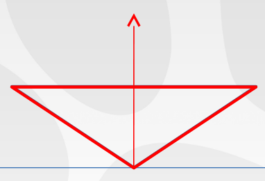
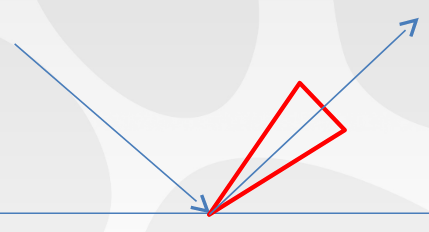

# ディファードライティング(DEFERRED LIGHTING)

# 目標と動機付け(Goals and Motivations)

- マテリアルデータの読み込み/修正を行う必要がある多数のスクリーンスペースエフェクト。
    - パーティクル。
    - デカール。
    - より重要: SSR、キューブマップ、間接シャドウ、など。
- マテリアルデータの節約から逃れられない。

# 選択肢(Options)

- フォワードジオメトリパスに伴ういくつかの出力(色、法線、支配的間接方向、など)を持った"安価"なGバッファパスで実験した。
    - 現在のハードウェアにおいてジオメトリパスは安価ではない。
    - 我々は…密なオブジェクト…がある。

<!-- p.13 -->

- フォワードシェーダでのライティングの複雑さは信じられないレジスタプレッシャーを追加する。これはジオメトリパスをさらに遅くする。
- 両方の世界の最善となる方法はあるのか？

# 解決法(Solution)

- 完全にディファード化する！

<!-- p.16 -->

- Gバッファはゲーム中のすべてのマテリアルを残念ながらサポートしなければならない。
- 幸運なことに、我々には大量のメモリと大量の帯域幅がある。

# Gバッファ(GBuffer)

- 16ビット毎ピクセルの符号なしバッファ。
- プロダクション中は機能の間を巡ってビットが絶えず移動していて、どれだけのビットが様々な機能に対して必要とされたかを厳密に決定するための大量のビジュアルテストを行った。
- GCNのパラメータパッキング命令を多用。
- さらなる詳細は水曜日の"The Technical Art of Uncharted 4"を確認して。

||||
|-|-|-|-|
|R|r|g||
|G|b|spec||
|B|normalx|normaly||
|A|iblUseParent|normalExtra|roughness|
: Gバッファ0

||||||
|-|-|-|-|-|
|R|ambientTranslucency|sunShadowHigh|specOcclusion||
|G|hightmapShadowing|sunShadowLow|metallic||
|B|dominantDirectionX|dominantDirectionY|||
|A|ao|extraMaterialMask|sheen|thinWallTranslucency|
: Gバッファ1

# 任意のGバッファ(Optional GBuffer)

- 任意の第3Gバッファはより複雑なマテリアルで使われる。マテリアルのタイプに基づいてさまざまに解釈される。
- 任意のGバッファを用いるマテリアルの例として織物(fabric)、髪、肌、絹(silk)がある。
- Gバッファの解釈は相互に排他的である(つまり、織物と肌を同じピクセルに持つことはできない)。この制約はマテリアルオーサリングパイプラインで強制される。
- 任意のGバッファはマテリアルが必要としない限り読み書きされない。

# 問題(Problems)

- ディファードシェーダはすぐさま肥大化する。
- すべてのライトタイプは言うまでもなく、肌、織物、植物、金属、髪などをサポートシなければならない。

# ディファードパイプライン(Deferred Pipeline)

- マテリアル"ID"テクスチャを保存する。
    - 実際ホントのマテリアルIDではなく、単なる使用するシェーダ機能のビットマスクである。
    - 12ビットが8ビットに圧縮される。(機能の相互排他性を計算に入れることで)

# 分類(Classification)

- 16x16タイルごとに、ルックアップテーブルを指すためにタイル全体に対するマテリアルマスクを用いる。
- ルックアップテーブルは事前計算され、タイル内ですべての機能をサポートするできるだけ最も単純なシェーダを保持する。

```hlsl
uint materialMask = DecompressMaterialMask(materialMaskBuffer.Load(int3(screenCoord, 0)));

uint orReducedMaskBits;
ReduceMaterialMask(materialMask, groupIndex, orReducedMaskBits);

short shaderIndex = shderTable[orReducedMaskBits];

if (groupIndex == 0) {
    uint tileIndex = AtomicIncrement(shaderGdsOffsets(permutationIndex));

    tileBuffers[shaderIndex][tileIndex] = groupId.x | (groupId.y << 16);
}
```

<!-- p.22 -->

- シェーダがライティングするタイルのリストへタイル座標をアトミックにプッシュする。
- アトミック整数はDispatchIndirectの引数バッファのディスパッチ数でもある。

<!-- p.23 -->

- すでに大きな改善がなされている。
- [@Coffin2011]以前には似たテクニックが使われていた。

# 最適化(Optimization)

- 織物シェーダを例に見てみる。
- すべてのピクセルが織物である(すなわち、織物のマテリアルマスクビットが1に設定されている)タイルに対して、この分岐が行うすべてのオーバーヘッドを追加する。
- 我々はそれが常に真に評価するべきであることを**知っている**。

```hlsl
if (setup.materialMask.hasFabric) {
    ...
}
```

<!-- p.25 -->

- タイル内のすべてのピクセルが同じマテリアルマスクを持つときに使われるもうひとつの事前計算されたテーブルである、"分岐なし"順列テーブルを生成する。
- 分類中の条件を確認して適切なテーブルを使う。
- 分岐を取り除くだけでなく、大局的なコンパイラ最適化の機会を開く。

```hlsl
short shaderIndex = shaderTable[orReducedMaskBits];
```
: 以前。

```hlsl
bool constantTileValue = IsTileConstantValue(...);
short shaderIndex = constantTileValue ?
        branchlessShaderTable[orReducedMaskBits] :
        shaderTable[orReducedMaskBits];
```
: 以後。

# 結果(Results)

- 最悪ケースの高価なカットシーンでのパフォーマンス改善。
    - 最適化なし("Uberシェーダ"): 4.0ms
    - 最適シェーダの選択: 3.4ms (-15%)
    - 分岐なしシェーダの使用: 2.7ms (-20%、全体で-30%)
- 平均で、分岐なしシェーダは非常に小さなコストで追加の10-20%の改善をもたらす。最適なシェーダを選択しながらだと、平均で、20-30%の改善になる。

<!-- p.29 -->

- ベースの場フォーマンスに影響を与えずにマテリアルの複雑さやバリエーションを持つことができる。
    - ひとつのシェーダに複雑さ(例えば、絹シェーダ)を加えるだけで、ゲームの残りの部分には影響を与えない。
- インターフェイスが明確に透過的に実装される。
    - 何度かのイテレーションの後に。:)
- おまけ: 分類のコンピュートシェーダは非同期コンピュートで動作する --- ランタイムにほとんど影響を与えない。

# 議論(Discussion)

- システムを更に高めることができるか。
    - 同様にライトタイプに基づいた異なるコンピュートシェーダをディスパッチする。
    - 少数のライトタイプは複雑さやコストの大部分を追加する。
- イテレーションが辛い。
    - 1ビットの重要性を本当に学ぶ。:)
    - 最終的には良いシステムに到達する。
- 単純な方が常により優れている。わずかなパフォーマンス向上のためにとある機能を犠牲にしたかもしれない。

# スペキュラオクルージョン(SPECULAR OCCLUSION)

<!-- p.34 -->

- キューブマップはローカルな遮蔽を計算に入れていない。
- この解決策として、時々遮蔽物の中/周囲にキューブマップを追加する。
    - ジオメトリの配置の仕方によって常にできるとは限らない。
    - 言うまでもなくパフォーマンス/メモリコストがかかる。
- そのサンプル位置においてAOの値のみを使うことができる。例えば、Frotbiteのスペキュラオクルージョン[@Lagarde2014]。
- うまく動作するが、指向性(directionality)についてはどうだろう？

# 定式化(Formulation)

- より正確なオクルージョンを得るため、どうにかしてスペキュラローブをサンプルポイントが遮蔽されている方法とその方向をエンコードする何かで遮蔽する。

# ベントコーン(Bent Cone)



- オフライン処理中に、 [@Klehm2011]で概説される手法を用いてベントコーンを生成する。
    - 最小遮蔽の方向は以下のように定義される。
        - $N_{SS}(i) := \sum_{j \in P_i} d(\Delta_{ij})^{-1} \sum_{j \in P_i} \frac{\Delta_{ij}}{|\Delta_{ij}|} d(\Delta_{ij})$
        - ここで、レイの長さがある距離より短い場合、$d(\vec{v})$は$1$となる。
    - そして、その角度は以下のように定義される。
        - $C(i) := (1 - \text{max}(0, 2|N_{SS}(i)| - 1)) \frac{\pi}{2}$

# リフレクションコーン(Reflection Cone)



- Phong/GGXローブに対する @Drobot2014 のフィッティングに似たアイデアを用いる。ローブエネルギーの90%にフィットするコーン角度を見つける。
- GGXに対する単純なフィッティングを発見した。

$$
cosAngle(r) := \begin{cases}
0.1925 \log_2(-72.56r + 42.03) & r \ge 0.5656 \\
0.0005 & \text{otherwise}
\end{cases}
$$

# 交差(Intersection)

- 両方のコーンを交差させる。
- そして、交差の立体角を得る。

<!-- p.41 -->

- 以下の数式を用いて交差するコーンの立体角を計算することができる[@Mazonka2012]。
- 2つのコーン角度$\theta_1$と$\theta_2$とそのなす角$\alpha$が与えられれば、交差の立体角は即座に分かる。

$$
\begin{array}
&
\Omega &= \Omega(\theta_1, \gamma_1) + \Omega(\theta_2, \gamma_2) \\
\Omega(\theta, \gamma) &= 2(\beta - \phi \cos \theta) \\
\cos \phi &= \frac{\tan \gamma}{\tan \theta} \\
\cos \beta &= \frac{\sin \gamma}{\sin \theta} \\
\tan \gamma_1 &= \frac{\cos \theta_2 - \cos\alpha \cos\theta_1}{\sin\alpha \cos\theta_1}
\end{array}
$$

# 実装(Implementation)

- ルックアップテーブルへの入力として$\cos\theta$及び$\sin\theta$を含めるために変数の若干の変更を行う。
- 遮蔽率を得るためにBRDFコーンの立体角$\frac{1 - \cos\theta_1}{2\pi}$で交差の立体角を除算する。

```hlsl
float IntersectionSolidAngle(float cosTheta1, floatcosTheta2, float cosAlpha) {
    float sinAlpha = sqrt(clamp(1.f - cosAlpha * cosAlpha, 0.0001f, 1.f));

    float tanGamma1 = (cosTheta2 - cosAlpha * cosTheta1) / (sinAlpha *     float tanGamma2 = (cosTheta1 - cosAlpha * cosTheta2) / (sinAlpha * cosTHeta2);

    float sinGamma1 = tanGamma1 / sqrt(1 + tanGamma1 * tanGamma1);
    float sinGamma2 = tanGamma2 / sqrt(1 + tanGamma2 * tanGamma2);

    // 1番目のコーンの立体角を計算する。
    // (これは2*PIで除算されている。このファクタはテクスチャ内で計算に入れられている。)
    float solidAngle1 = 1 - cosTheta1;

    return (SegmentSolidAngleLookup(cosTheta1, sinGamma1) + SegmentSolidAngleLookup(cosTheta2, sinGamma2)) / solidAngle1;
}
```

# 議論(Discussion)

- サンプルがかなり遮蔽されているときはディレクショナルライトマップのスペキュラへフォールバックする。
    - エネルギーを維持するが、反射ディテールは失われる。
    - 大抵の場合は良好に見える。

<!-- p.46 -->

- 手法は比較的高価である。
    - ひとつのパラメータが固定されると関数は単純化される。たぶんラフネスパラメータを固定して、ラフネスに基づいて最終結果を調整することになる可能性があった。
    - パフォーマンス的な理由でいくつかのレベルでは無効化された。
- 動的オブジェクト(例えば、キャラクター)では動作しない。この場合、前述のより単純なオクルージョン手法にフォールバックする。
- 物理ベースではない。

<!-- p.47 -->

- しかし、多くのオクルージョンの問題を解決する。
- 推し進めることができる。
    - 他の表現を用いたより正確なオクルージョン。
    - まったく異なる方向に進む。

# 参考文献(References)
