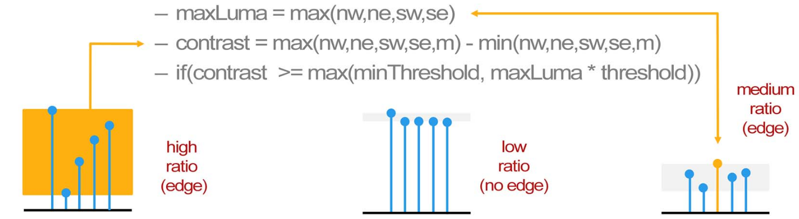

# FXAA 3.11とは？[What Is FXAA 3.11?]

- 高速近似的アンチエイリアシング[Fast approXimate Anti-Aliasing]
    - 2つのアルゴリズム
        - FXAA 3.11 Console (360とPS3)
        - FXAA 3.11 Quality (PC)
- 固定の制約セット
    - ひとつのシェーダパス、色入力のみ、色出力のみ
    - すべてのAPIで動作する(GL、DX9、DX11、など)。
    - Certainly better can be done under other constraints!

"近似的[approXimate]"に注目！
FXAAは正しい解に近い一切のことを試みない。
それよりも、ビジュアル的に十分良好に見えて高速なことを試みる。

# なぜFXAA 3.11なのか？[Why FXAA 3.11?]

- 解像度＋ディファード＋MSAA＝問題発生！
    - 5760 x 1080 x ステレオ = 12.5Mpix
        - メモリの問題 @ 12.5Mpix
            - 非MSAAのGバッファだけで238MB (@ 極小の20B/pixel)
        - テクスチャの問題 @ 12.5Mpix
            - 6.25tex/pix/msのみ (GTX590)
            - 比較: Xbox360の 8tex/pix/ms @ 1Mpix (~720p)

(1.) メモリの問題

ディファードレンダリングを伴う巨大な解像度では、レンダターゲットやバックバッファに使われるメモリはMSAAなしでも非常に大きくなる可能性がある。
4xMSAAでさえ実践的ではないかもしれない。(例えば、より大きなFP16の精度のGバッファで)
ソフトウェアポストプロセスフィルタリングAAはこのメモリプレッシャーを緩和する。

(2.) テクスチャパフォーマンスの問題

巨大な解像度に対するピクセルあたりのPCのGPUテクスチャパフォーマンスは5歳になるコンソール機^[訳注:当時(2011年)の最新機種であるXbox360/PS3の発売日は2005/2006年頃。]で一般的なそれを下回る可能性がある。
コンソールに対して必要とする性能より高速なものが必要である。

(3.) 増え続ける解像度セット

iPhone4のpixels/inchの水準がデスクトップディスプレイにやって来るとき、
ケータイと異なるとすると、デスクトップは解像度競争の終わりが見えていない。
ケータイでさえも解像度競争の終わりは見えていないのかも。

# MSAAはいくらかかる？[What Does MSAA Cost?]

- コストはシーン、エンジンの種類、GPUなどに応じて変化する。
- MSAAに対する平均の追加ms/frameそ%frameの例
    - 8xMSAA、World Of Warcraft @ 1920x1080
        - 2.0ms (GTX570) = 17%, 2.2ms (HD 6950) = 17%
    - 4xMSAA、Lost Planet 2 @ 1920x1080
        - 2.5ms (GTX570) = 14%, 3.3ms (HD 6950) = 13%
    - 4xMSAA、Crysis @ 1280x720
        - 4.0ms (GTS450) = 18%, 1.4ms (HD 6850) = 11%
    - 4xMSAA、Just Cause 2 @ 1280x720
        - 2.5ms (GTS450) = 11%, 3.1ms (HD 6850) = 16%
    - 4xMSAA、Metro 2003 @ 1280x720
        - 8.2ms (GTS450) = 32%, 3.5ms (HD 6850) = 23%

MSAAは実際にどれだけのコストがかかるのだろう？

これらの例は複数種類のグラフィクスエンジンをカバーする。

# FXAA 3.11 Console

FXAA Consoleは局所的コントラスト適応型ディレクショナルエッジブラー[Local Contrast Adaptive Directional Edge Blur]である。

(要するに) 2|4タップの可変長バイディレクショナルフィルタ
(利点) 非常に高速で、ピクセルとサブピクセルのエイリアシングでコントラストを下げる。
(欠点) 水平および垂直に近いエッジであまり良くない。

```hlsl
/*============================================================================
FXAA3 CONSOLE - PC VERSION
------------------------------------------------------------------------------
PCではこれを用いる代わりに、
#define FXAA_QUALITY__PRESET 10
か
#define FXAA_QUALITY__PRESET 20
とするFXAA Qualityを用いることを提案したい。
モダンなPCのGPUでは、どちらでもより高品質であり、これとほとんど同じくらい高速である。
============================================================================*/
#if (FXAA_PC_CONSOLE == 1)
/*--------------------------------------------------------------------------*/
FxaaFloat4 FxaaPixelShader(
    // 入力のドキュメントはFXAA QualityのFxaaPixelShader()のソースを参照のこと！
    FxaaFloat2 pos,
    FxaaFloat4 fxaaConsolePosPos,
    FxaaTex tex,
    FxaaTex fxaaConsole360TexExpBiasNegOne,
    FxaaTex fxaaConsole360TexExpBiasNegTwo,
    FxaaFloat2 fxaaQualityRcpFrame,
    FxaaFloat4 fxaaConsoleRcpFrameOpt,
    FxaaFloat4 fxaaConsoleRcpFrameOpt2,
    FxaaFloat4 fxaaConsole360RcpFrameOpt2,
    FxaaFloat fxaaQualitySubpix,
    FxaaFloat fxaaQualityEdgeThreshold,
    FxaaFloat fxaaQualityEdgeThresholdMin,
    FxaaFloat fxaaConsoleEdgeSharpness,
    FxaaFloat fxaaConsoleEdgeThreshold,
    FxaaFloat fxaaConsoleEdgeThresholdMin,
    FxaaFloat4 fxaaConsole360ConstDir
) {
/*--------------------------------------------------------------------------*/
    FxaaFloat lumaNw = FxaaLuma(FxaaTexTop(tex, fxaaConsolePosPos.xy));
    FxaaFloat lumaSw = FxaaLuma(FxaaTexTop(tex, fxaaConsolePosPos.xw));
    FxaaFloat lumaNe = FxaaLuma(FxaaTexTop(tex, fxaaConsolePosPos.zy));
    FxaaFloat lumaSe = FxaaLuma(FxaaTexTop(tex, fxaaConsolePosPos.zw));
/*--------------------------------------------------------------------------*/
    FxaaFloat4 rgbyM = FxaaTexTop(tex, pos.xy);
#if (FXAA_GREEN_AS_LUMA == 0)
    FxaaFloat lumaM = rgbyM.w;
#else
    FxaaFloat lumaM = rgbyM.y;
#endif
/*--------------------------------------------------------------------------*/
    FxaaFloat lumaMaxNwSw = max(lumaNw, lumaSw);
    lumaNe += 1.0/384.0;
    FxaaFloat lumaMinNwSw = min(lumaNw, lumaSw);
/*--------------------------------------------------------------------------*/
    FxaaFloat lumaMaxNeSe = max(lumaNe, lumaSe);
    FxaaFloat lumaMinNeSe = min(lumaNe, lumaSe);
/*--------------------------------------------------------------------------*/
    FxaaFloat lumaMax = max(lumaMaxNeSe, lumaMaxNwSw);
    FxaaFloat lumaMin = min(lumaMinNeSe, lumaMinNwSw);
/*--------------------------------------------------------------------------*/
    FxaaFloat lumaMaxScaled = lumaMax * fxaaConsoleEdgeThreshold;
/*--------------------------------------------------------------------------*/
    FxaaFloat lumaMinM = min(lumaMin, lumaM);
    FxaaFloat lumaMaxScaledClamped = max(fxaaConsoleEdgeThresholdMin, lumaMaxScaled);
    FxaaFloat lumaMaxM = max(lumaMax, lumaM);
    FxaaFloat dirSwMinusNe = lumaSw - lumaNe;
    FxaaFloat lumaMaxSubMinM = lumaMaxM - lumaMinM;
    FxaaFloat dirSeMinusNw = lumaSe - lumaNw;
    if(lumaMaxSubMinM < lumaMaxScaledClamped) return rgbyM;
/*--------------------------------------------------------------------------*/
    FxaaFloat2 dir;
    dir.x = dirSwMinusNe + dirSeMinusNw;
    dir.y = dirSwMinusNe - dirSeMinusNw;
/*--------------------------------------------------------------------------*/
    FxaaFloat2 dir1 = normalize(dir.xy);
    FxaaFloat4 rgbyN1 = FxaaTexTop(tex, pos.xy - dir1 * fxaaConsoleRcpFrameOpt.zw);
    FxaaFloat4 rgbyP1 = FxaaTexTop(tex, pos.xy + dir1 * fxaaConsoleRcpFrameOpt.zw);
/*--------------------------------------------------------------------------*/

    FxaaFloat dirAbsMinTimesC = min(abs(dir1.x), abs(dir1.y)) * fxaaConsoleEdgeSharpness;
    FxaaFloat2 dir2 = clamp(dir1.xy / dirAbsMinTimesC, -2.0, 2.0);
/*--------------------------------------------------------------------------*/
    FxaaFloat4 rgbyN2 = FxaaTexTop(tex, pos.xy - dir2 * fxaaConsoleRcpFrameOpt2.zw);
    FxaaFloat4 rgbyP2 = FxaaTexTop(tex, pos.xy + dir2 * fxaaConsoleRcpFrameOpt2.zw);
/*--------------------------------------------------------------------------*/
    FxaaFloat4 rgbyA = rgbyN1 + rgbyP1;
    FxaaFloat4 rgbyB = ((rgbyN2 + rgbyP2) * 0.25) + (rgbyA * 0.25);
/*--------------------------------------------------------------------------*/
#if (FXAA_GREEN_AS_LUMA == 0)
    FxaaBool twoTap = (rgbyB.w < lumaMin) || (rgbyB.w > lumaMax);
#else
    FxaaBool twoTap = (rgbyB.y < lumaMin) || (rgbyB.y > lumaMax);
#endif
    if(twoTap) rgbyB.xyz = rgbyA.xyz * 0.5;
    return rgbyB;
}
/*==========================================================================*/
#endif
```

# FXAA 3.11 Consoleの早期脱出[FXAA 3.11 Console Early Exit]

- AAの必要のないピクセルに対する早期脱出[early exit]
    - 4つのフィルタ済み輝度値と中央(M)の輝度をフェッチする。
        - コントラストが最大輝度maxLumaと比べて大きい場合、AAが必要。
            - maxLuma = max(nw, ne, sw, se)
            - contrast = max(nw, ne, sw, se, m) - min(nw, ne, sw, se, m)
            - if (contrast >= max(minThreshold, maxLuma * threshold))




PS3では、早期脱出は存在しない。

`minThreshold`ファクタは暗い所で早期脱出するのに役立つ。

輝度はAに事前にパックされる、または、FXAA_GREEN_AS_LUMAはAの代わりにGを使う。

# FXAA 3.11 Consoleのタップ[FXAA 3.11 Console Taps]

- 脱出しなかったすべてのピクセルはこの2タップフィルタを得る。
    - 局所的な輝度の勾配に垂直な方向
        - 4つの2x2ボックスフィルタされた輝度値を使う。
            - dir.x = -((NW + NE) - (SW + SE))
            - dir.y = ((NW + SW) - (NE + SE))
            - dir.xy = normalize(dir.xy) * scale
- 任意の追加の2タップ
    - 1/minDirでdir.xyをスケールする。
        - minDir = min(|dir.x|, |dir.y|) * sharpness
    - そして、フィルタ幅を8ピクセルに制限する。

`scale`ファクタはブラー量を制御する。

この2タップフィルタは対角に近いエイリアシングとサブピクセルエイリアシングを扱う。

そうしないと勾配が0になる、単一のホットピクセル[hot pixel]の場合に直したブラー方向を保証する`NE += 1.0/384.0`の隠れファクタがある。

# FXAA 3.11 Consoleの追加タップ[FXAA 3.11 Console Extra Taps]

- 完全な4タップフィルタが不正である場合に確認する。
    - 4タップフィルタ輝度を近傍輝度と比較する。
        - もとの4サンプルの最大および最小輝度範囲を使う。
            - {NW, NE, SW, SE}
        - 4タップフィルタ輝度がこの範囲を超過する場合、
            - 不正であると仮定して、最初の2タップだけを使う。

全幅[full-width]フィルタ幅推定が大きすぎる場合、フィルタカーネルがローカルなエッジから離れた領域からサンプルするチャンスがある。

この場合では、フィルタカーネルによりノイズが引き起こされる。

このステップではこのノイズの除去を試みる。

# Xbox360でのFXAA 3.11 Console[FXAA 3.11 Console on 360]

- 1.0ms/frame @ 1280x720 @ 30Hz = 3%
    - シェーダで0.8ms＋EDRAMの解決で0.2ms
    - FXAA_GREEN_AS_LUMAを使用
- 最適化
    - タダのテクスチャサンプラーの指数バイアスを使う。
        - 複数のサンプラーを同じ入力テクスチャにエイリアスする。
    - オフセットを含めるための手動のtfetch2Dアセンブリ
    - 早期脱出の分岐を使う。
    - 一定の使い方に最適化する。

# PS3でのFXAA 3.11 Console[FXAA 3.11 Console on PS3]

- 1.2ms/frame @ 1280x720 @ 30Hz = 3.6%
    - RGBL入力とFXAA_EARLU_EXITを使用
    - 15clk/pixelの推定したNVShaderPerfにかなり近い
- 最適化
    - レジスタ数を3から7に増やして0.15ms/frame節約する。
        - TEX$ヒットが増加
    - 以下を含むPS3のRSXピクセルパイプラインに最適化する。
        - FP16精度、non-perspective interpolation
        - シェーダエントリでde-vectorizeおよびスカラ命令を手でスケジュールする。
        - half4からhalf2のxyとzwの組み合わせに再ベクトル化する。
        - タダの2の累乗の乗算と除算を活用する。
        - 早期脱出を条件付き代入に切り替える(分岐なし)。

# FXAA 3.11 Console FSS

より高品質な出力を得るためのアイデア、Fractional Super-Sampling with FXAA Console

(1.) 出力の解像度より若干大きくレンダリングする。

(2.) スケーリングコピーの代わりにFXAA Consoleを使う。(FXAAは大きい元フレームを読み、小さい出力フレームに直接書き込む)

(3.) set frame rateを維持するために出力解像度を動的に調整する。

FXAA 3.11 Consoleのコストは(小さい)出力解像度によって設定される。

技術的に、FXAA 3.11 Consoleは最大2倍に増大する可能性がある。
結果はノイジーな絵画的効果を持つバイリニアサンプリングの拡大アーティファクトに隠れる。

この画像は最悪のケースのエイリアシングの例を、そして、FSS with FXAA Consoleの制限を示す。
