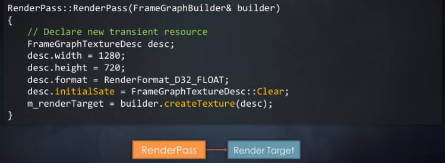
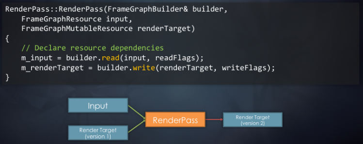
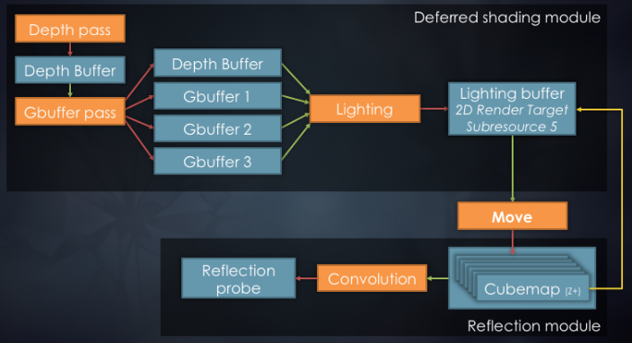
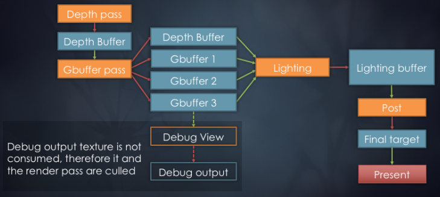
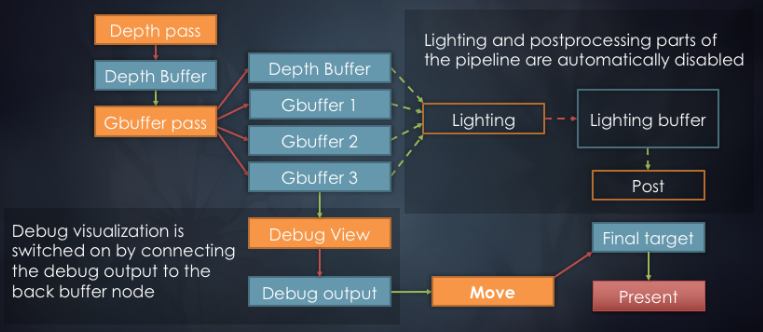
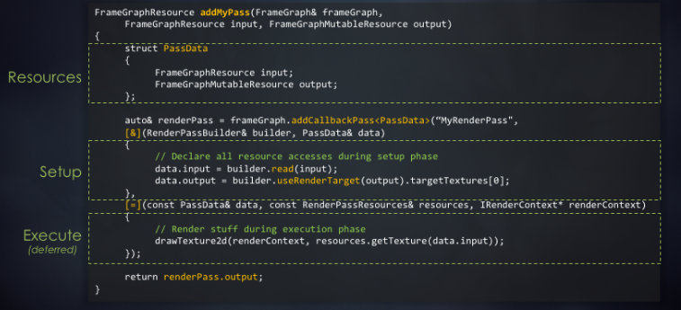
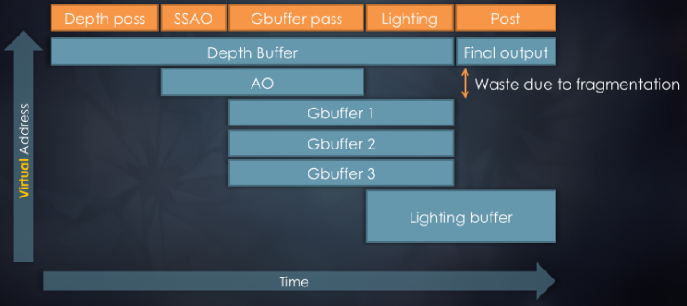
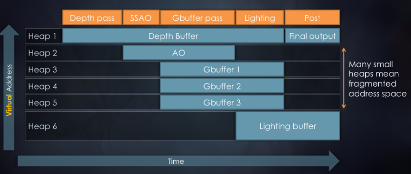
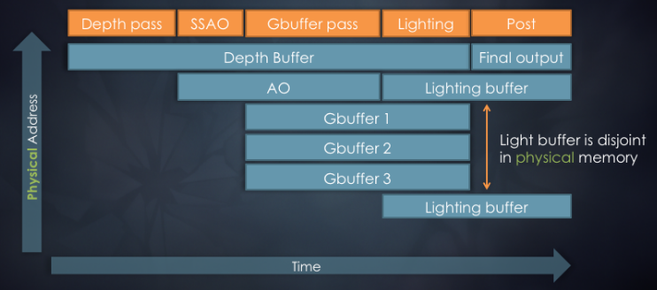

# 2007年と2017年におけるFrostbiteの比較(Frostbite 2007 vs 20017)

- 2007年
    - DICEの次世代エンジン。
    - 以下を下地に作られた。
        - Xbox 360
        - PlayStation 3
        - マルチコアPC
        - シェーダモデル3.0のDirectX9とDirect3D 10
    - 今後のDICEのゲームで使うために。
- 2017年
    - The EAのエンジン。
    - 以下のために発展(evolve)・拡大(scale up)した。
        - Xbox One
        - PlayStation 4
        - マルチコアPC
        - DirectX 12
    - 約15のEAのゲームで使われる。
        - もうバトルフィールドのエンジンではない。
        - 使われるジャンルはRPG、レース、スポーツ、アクションなど多岐にわたる。

# 2007年のレンダリングシステムのあらすじ(Rendering system overview '07)

# 2017年のレンダリングシステムのあらすじ(Rendering system overview '17)

- このグラフはエンジンを完璧にあらわしているわけではない。システムの広がりを図式化しただけ。
- 複雑に絡み合ったシステムが無数に存在する以外は基本的に同じ。
- このトークではWorld Rendererとレンダリング機能についての話をする。

# レンダリングシステムのあらすじ(簡略化バージョン)(Rendering system overview(simplified))

# WorldRenderer

- すべてのレンダリングを指揮する。
    - **コード駆動**アーキテクチャ。
    - メインのワールドジオメトリ(Shadeing System経由)。
    - ライティング、ポストプロセス(Render Context経由)。
    - すべてのビューとレンダパスについて知っている。
- 設定とリソースのシステム間マーシャリング(表現の変換)を行う。
- リソース(レンダターゲットやバッファ)の割り当てを行う。

# バトルフィールド4のレンダリングパス(Battlefield 4 rendering passes (Features))

- 上記は数年前にバトルフィールド4用にFrostbiteに蓄えたレンダリングパスである。
- 現在のパイプラインはPBR化されており、パスはさらに増えて複雑になっている。

# WorldRendererの課題(WorldRenderer challenges)

- 明示的な即時モードレンダリング。
- 明示的なリソース管理。
    - オーダーメイドによる職人技的な手作りのESRAM管理。(Bespoke, artisanal hand-crafted)
    - 様々なゲームチームによる複数の実装。
- レンダリングシステムとの強固な結合。
- 制限された拡張性。
- カスタマイズのためにフォーク/分岐が必須。
- 4k SLOCから15k SLOCへの組織的な成長。
    - 2k SLOC超の関数。
    - 維持、拡張、統合が高価。

# モジュール式WorldRendererの目標(Modular WorldRenderer goals)

- フレーム全体の高レベルな知識を得る。
- **拡張性**を改善する。
    - 分離された構成可能なコードモジュール。
    - 自動的なリソース管理。
- よりより可視化と診断。

- 蓄積した技術的負債の対処と拡張性と保守性の改善を行うため2016年に主要な部分を再構築した。
- 明示的なパスとリソースのミクロな管理なし。
- エンジンコード内のモノリシックな関数のハックなし。
- メモリ割り当てと別名付け(aliasing)の子守(baby-sitting)なし。

# 新アーキテクチャの要素(New architectural components)

- **FrameGraph**
    - **レンダパス**と**リソース**の高レベル表現。
    - フレームの完全な知識。
- **Transient Resource System**
    - リソース割り当て。
    - メモリ別名付け。

# FrameGraphの目標(Frame Graph goals)

- フレーム全体の**高レベル知識**を構築する。
    - リソース管理の単純化。
    - レンダリングパイプライン構成の単純化。
    - 非同期コンピュートやリソースバリアの単純化。
- 自己充足的で**効率的なレンダリングモジュール**を可能にする。
- 複雑なレンダリングパイプラインを可視化・デバッグする。

# FrameGraphの例(Frame Graph example)

- ディファードシェーディングパイプラインを実装したFrameGraphの例。
- グラフにはレンダパス(橙)とリソース(青)がノードとして表される。
- アクセス宣言や依存関係は辺で表される。

# Battlefield 4のフレームのグラフ(Graph of a Battlefield 4 frame)

- 一般に数百のノードからなる。
- デバッグ用グラフはGraphVizで可視化され、検索可能なPDFとして出力される。
- グラフは驚くほど巨大で複雑になり得る。
- このグラフはいくつかの場合で役に立ち得るが、我々が最終的に用いた主要な可視化ツールでは断じてない。

- カスタムの可視化スクリプト(HTML+Javascriptとランタイムから書き出したJSONデータ)を書いた。
- JSONデータはすべてのレンダパスとリソースの情報が含まれている。
- 各レンダパスがどのリソースが作成し、読み込み、書き出しているかを知ることができる。
- 各リソースのメモリレイアウトと各種メタデータ(デバッグ名、サイズ、フォーマットなど)を知ることができる。
- 可視化はインタラクティブであり、PIXのように、フレームで行ったことの概要をより便利に提供してくれる。

# FrameGraphの設計(Frame Graph design)

- 即時モードレンダリングからの脱却。
- レンダリングコードをパスに分ける。
- マルチフェーズ保持(retained)モードレンダリングAPI
    1. セットアップフェーズ。
        - 比較的安価であることを前提とする。
    2. コンパイルフェーズ。
    3. 実行フェーズ。
- 毎フレームにゼロから組む。
    - シーンの変化に対応するため。
- コード駆動アーキテクチャ。

# FrameGraphのセットアップフェーズ(Frame Graph setup phase)

- レンダパスとコンピュートパスを定義する。
- 各パスで入力リソースと出力リソースを定義する。
- コードの流れは即時モードレンダリングと似ている。
    - ただし、GPUコマンドは生成しない。

- すべてのリソースはグラフ構築中は**仮想的**である。
- レンダパスの入出力は仮想リソースハンドルを用いて宣言される。

# FrameGraphのリソース(Frame Graph resources)

- レンダパスは使うリソースを全て宣言しなければならない。
    - 読み込み。
    - 書き込み。
    - 生成。
- 外部の永続的(permanent)リソースはFrameGraphに**インポート**される。
    - TTA用ヒストリーバッファ。
    - バックバッファ。
    - などなど。

- FrameGraphから見えない効果(例えば、GPUからのデータの読み出し)を持つ場合、その副次的効果を明示的にマークする。
- 持続的(persistent)レンダターゲットが必要になる場合(TTA、SSR、など)、FrameGraphにインポートすることができる。
- インポートしたリソースへの書き込みは、コンパイルフェーズ中にカリングされないようにするため、レンダパスの副次的効果として数える。

# FrameGraphリソースの例(Frame Graph resource example)

- レンダターゲットリソースを生成するレンダパスのダミーコード。
- 初期リソースステート(クリアや破棄/未定義)を指定する以外は、通常のテクスチャ生成と似ている。

# FrameGraphセットアップの例(Frame Graph setup example)

- テクスチャから読み出して他のテクスチャに書き出すレンダパス。
- テクスチャへの書き出しはリネームされたハンドルを生み出すことで、リソースが未定義の順番で変更されたときにエラーを捉えることができる。
- リソースのリネーミングはレンダパスを特定の実行順に強制する。

# 高度なFrameGraph処理(Advanced FrameGraph operations)

- 遅延生成するリソース。
    - 先にリソースを宣言して、実際に使うときになって初めて割り当てる。
        - 例:デプスプリパスがあれば、移行は深度バッファに書き込まない。
    - 使い方に応じた、自動的なリソースバインドフラグ。
- 派生するリソースパラメータ。
    - 入力サイズやフォーマットに基づくレンダパス出力を生成する。
        - 例:ダウンサンプリングで縦横1/2になる場合。
    - 使い方に応じたバインドフラグを引き出す。
        - 例:レンダテクスチャ。
- `MoveSubresource`
    - あるリソースをもうひとつに送る。
    - サブリソースビュー/エイリアスを自動的に作成する。
    - "タイムトラベル"を可能にする。
        - 後のレンダパスで生成されるリソースのエイリアスを生成する。

# MoveSubresourceの例(MoveSubresource example)

- 一般的なレンダリングパイプラインは2D画像リソースである出力テクスチャを生成することで実装できる。
- キューブマップを入力として受け取る反射プロブフィルタリングパイプラインを組み合わせることができる。
- Move処理は"Lighting buffer"のリソースをキューブマップの一面に割り当てに使うことができる。
- これにより、ディファードシェーディングモジュールはキューブマップの面に直接書き出すことができる。
- 同じディファードシェーディングモジュールを他のところでMove処理なしで使うこともできる。

# FrameGraphコンパイルフェーズ(Frame Graph compilation phase)

- リソースとパスのうち**使わないものをカリングする**
    - 宣言フェーズを若干雑にすることができる。
    - 構成の複雑さを減らすのが目的。
    - 条件付きパス、デバッグレンダリング、などを単純化する。
- **リソースの寿命**を計算する。
- 使い方に応じて具体的な(concrete)GPUリソースを割り当てる。
    - シンプルな貪欲法(greedy algorithm)による割り当て。
    - 初めて使う前に正しく取得し、最後に使った後に解放する。
    - 非同期コンピュートのために寿命を拡大する。
    - 使い方に応じてリソースバインドフラグを引き出す。

## FrameGraphデータ構造

- RenderPassごとの使うリソースハンドルの一次元配列。
- FrameGraph内のRenderPassの一次元配列。
- ResourceRegistry内のリソースの一次元配列。
    - リソースハンドルはこの配列の中の単なるインデックスである。
- コンパイルフェーズはすべてのRenderPassを渡り歩く。
    - リソースの参照カウントを計算する。
    - リソースの最初と最後の使用者を計算する。
    - 非同期待機地点とリソースバリアを計算する。
- RenderPassの実行順はセットアップ順で定義される。
    - コンパイル中は並び替えしない。

## カリングアルゴリズム

- 未参照リソースから、単純なグラフの塗りつぶし(flood-fill)。

~~~cpp
初期ステートを計算し、参照カウントを渡す
    renderPass.refCount++ for すべてのリソース書き込み
    resource.refCount++ for すべてのリソース読み込み
refCount == 0となるリソースを識別し、スタックにプッシュする
    while スタックが空でない
        リソースをポップして、producerの参照カウントを減らす
        if producer.refCount == 0
            producerが読み込むリソースの参照カウントを減らす
            減らした参照カウントが0なら、そのリソースをスタックに加える

~~~

# サブグラフカリングの例(Sub-graph culling example)

- 最初に必要とするかどうかをチェックせずに、レンダパスやリソースを追加できると時折便利である。
- 例えば、デバッグ可視化や深度バッファの線形化のような特殊化パスを常に追加できる。
- これはレンダリングパイプライン構成の複雑さを多少切り詰める。

- エンジンは数多くの機能を有している。
- レンダリングパスを実行するかどうか決めることは退屈な仕事(chore)になる可能性がある。
- これにはパス同士の連結も含まれる。
- ライティングパスはデバッグパスについてなにも知る必要はない。
- デバッグが有効になると、ライティングの出力が上書きされ、結果、カリングされる。
- これはさらなる分離/モジュール化コードを導く。

# FrameGraphの実行フェーズ(Frame Graph execution phase)

- カリングされなかった各レンダパスごとにコールバック関数を実行する。
- 即時モードレンダリングコード。
    - 親しみのあるRenderContext APIを使う。
    - ステート、リソース、シェーダを設定する。
    - 描画、ディスパッチ。
- セットアップフェーズで生成したハンドルから**実際の(real)**GPUリソースを得る。

- このフェーズはFrameGraph以前に行われたレンダリング方法とほぼ同一である。
- FrameGraphのリソースを実体化する以外はRenderContext APIを使うだけである。

# 非同期コンピュート(Async compute)

- 依存グラフから自動的に引き出すことができるかもしれない。
- 手動制御が望ましい。
    - パフォーマンス節約に関する素晴らしい潜在能力を持つ。しかし…
    - 必要なメモリが増える。
    - 間違えて用いるとパフォーマンスを害する可能性がある。
- レンダパス単位でオプトインする。
- メインのタイムラインで始める。
- 他のキューで出力リソースを最初に使うときを同期ポイントとする。
- リソースの寿命は自動的に同期ポイントに拡充される。

- 効率的な非同期コンピュートには手厚い指導(hand-holding)が必要になる。
- グラフ中のすべての依存関係を持っていても、実行中にはGPUでどんなボトルネックが存在するかは分からない。
- 帯域ヘビーなコンピュートパスと帯域ヘビーなグラフィクスパスは一緒に動かしたくない。
- 非同期処理はリソース寿命を拡張させる(同時に生存しているリソースが増加する)ため、メモリ水位を上昇させる。
- 最終的には手動のオプトインするメカニズムをとった。
- 非同期パスは直列に実行するメインタイムライン上で始める(パスの順序変更はしない)。
- 同期ポイントは非同期パスの出力を消費する最初のレンダパスの前に自動的にメインパイプライン上に追加される。

# C++によるパスの宣言(Pass declaration with C++)

- RenderPassごとにC++クラスを作るだけでもできたかもしれない。
    - コードフローが壊れる。
    - 大量のオマジナイ(boilerplate)が必要になる。
    - 既存のコードをポートするのが高価。
- **C++ラムダ**にする。
    - コードフローが維持される。
    - レガシーコードの変更が最小限で済む。
    - リソースの使い方の宣言を追加する。

- 初めは仮想関数つきクラスでやろうとした。
    - すぐに大量のコードを移す必要があることに気がついた。
    - セットアップフェーズから実行フェーズへデータを送るための配管工事(plumbing)も必要になる。
- ラムダを使うと、レガシーコードのポートが単純化できた。
    - はじめは巨大なコードを単純にラップして、徐々にリソースを新しいシステムに置き換えつつコードを切り出していった。

# C++ラムダによるパスの宣言(Pass declaration with C++ lambdas)

- `addCallbackPass`はラムダを呼び出すレンダパスクラスを作成するテンプレート関数である。
- セットアップフェーズのラムダはその場で呼び出されるため参照でキャプチャする。
- 一方の実行フェーズのラムダは後で呼び出されるため値でキャプチャする。
    - 値でキャプチャする場合、その値が解放済みポインタだったり、大きすぎたりする危険性をはらむ。
    - 実行フェーズのラムダはあるサイズ(我々の場合は1kB)以下になるようコンパイル時に強制される。

# レンダモジュール(Render modules)

- レンダモジュールには2つ種類がある。
    1. 独立した**ステートレス**関数。
        - 入出力がFrameGraphのリソースハンドルである。
        - ネストしたレンダパスを作ってもよい。
        - Frostbiteでは最も一般的なモジュール。
    2. 永続的(persistent)レンダモジュール。
        - いくつかの永続的なデータを持ってもよい。(LUT、history buffer、など)
- WorldRendererはいまでもハイレベルなレンダリングを指揮する。
    - GPUリソースの割り当てには関わらない。
    - ハイレベルでレンダリングモジュールを実行するだけ。
    - 拡張がさらに容易になる。
    - コードサイズが15k SLOCから5k SLOC程度へ減った。

# モジュール間コミュニケーション(Communication between modules)

- モジュールは**黒板(blackboard)**を通してコミュニケーションしてもよい。
    - 要素のハッシュテーブル。
    - 要素の型ID経由でアクセスする。
    - **結合度を制御**できる。

- モジュールはセットアップフェーズでblackboardを生成することができる。
- blackboardは結合度を下げるのに有効だが、コードの理解を妨げやすい。
- 受け取る側が明示しなければ、送る側はデータにアクセスされたかどうかを知ることはできない。
- 不正なアクセスはランタイムでのみ検証できる。
- 総合的に見て(on balance)、我々は利点のほうが多いと考えている。

# Transientリソースシステム(Transient resource system)

- Transient
    - [形] 短い時間でのみ続くこと。一時的な(impermanent)。
- 1フレーム以上生存しないリソース。
    - バッファ、深度やカラーターゲット、UAV。
    - フレームの**内側**でリソース寿命を最小化するよう努力する。
- 使われるところでリソースを割り当てる。
    - *末端(leaf)*のレンダリングシステムで直接的に。
    - できるだけすぐに割り当てを解除する。
    - 自己充足的な機能を記述しやすくなる。
- **FrameGraphの最重要要素。**

# Transientリソースシステムのバックエンド(Transient resource system back-end)

- 実装はプラットフォームの能力に依存する。
    - 物理メモリでの別名付け。(XB1)
    - 仮想メモリでの別名付け。(DX12、PS4)
    - オブジェクトプール。(DX11)
- **バッファ**用のアトミックな線形アロケータ。
    - 別名付け無し。just blast through memory
    - 大抵はGPUにデータを送るために使われる。
- **テクスチャ**用のメモリプール。

# PS4でのTransientテクスチャ(Transient textures on PlayStation 4)

- 単一の大きな**仮想メモリ**プールを予約する。
- 最初に使用時に仮想メモリブロックにテクスチャを割り当てる。
    - 一般用途の非ローカルメモリアロケータを使う。
    - 必要ならGNM(訳注:PS4のグラフィクスAPI)リソースデスクリプタをパッチするか割り当てる。
- 最後の使用時に仮想メモリブロックを返す。
- 現在のフーレムで使われているVA範囲をカバーするために物理メモリをコミットする。
    - オンデマンドで物理メモリプールを成長させる。
    - 最後のNフレームの最大消費量(high water mark)へシュリンクする。
- リソースは**仮想アドレス**空間でオーバーラップする。
    - PS4のグラフィクスデバッグツール(Razor)でネイティブに理解される。

# DX12でのTransientテクスチャ(Transient textures on DirectX 12 PC)

- PS4のときとすこし似ているが、分離した(disjoint)アドレス範囲を複数持つ。
- 単一の範囲を使うことができないため、GPUをストールさせずにシュリンクしたり一時的にメモリ使用量を増加させたりはできない。
- これら欠点にも関わらず、メモリを再利用や全体規模のウォーターマークリダクションをできるようにしてある。

- Frostbiteでは現在グローバルメモリ割り当ての最適化を行っていないが、理論的には実装可能である。グローバル最適化パスがあれば、上図のHeap2とHeap6をマージできるようなる。そうすれば、全体的なヒープ数やメモリ水位は下がる。

## 現在のD3D12のリソースヒープにおける具体的な問題

- Tier1ヒープは置くことができるリソースがバッファのみ、テクスチャのみ、レンダターゲットと深度バッファのみの**いずれか**でなければならないという制限がある。リソースの種類が異なれば、別のヒープを生成シなければならない。我々が別名を付けているほとんどのtransientリソースはRTかDSであり、それほど深刻な影響は無い。我々はユーザが特段指定しなかったとしても、transientテクスチャにはRTフラグを強制している。

- Tier2ヒープは制限が軽く、すべてのリソースタイプに別名を付けることができる。だが、多くのヒープを割り当ててその中で副割り当てを行わなければならないため、まだ理想形とはいえない。これは単一の大きなアドレス範囲に割り当てる方法と比べるとより多くの断片化を引き起こす。しかし、単一の巨大なヒープを割り当てることも、それをシュリンクすることもできないため、妥協案として、ひとつの大きいと思えるくらいの永続的なtransientリソースヒープを作成し、より小さな*overflow*ヒープを作成することとした。

- リソースは一度作ると動かせなくなる。これはメモリ割り当て"スケジュール"が少しでも変化すると、いくつかのオブジェクトの配置が変化して再生成されなければならないことを意味する。配置されたD3Dオブジェクト(リソースやビュー)をキャッシュしたり可能な限り(潜在的にはかなりのフレームが経過した後で、割り当てスケジュールが互換性のあるものにもう一度変化するとき)再利用したりすることによってある程度までならこの問題を回避することができる。リソース割り当てスケジュールはプレイヤーの行動、カットシーン、UIなどに基づいて変化してもよい。しかし、典型的には少数のユニークなスケジュールのみが存在し、そうして、LRUキャッシュを用いることができる。

- こうした問題はコンソールには単純に存在しない。Tiledリソースは将来非常に便利なものになる可能性がある(XB1のメモリエイリアシングとほぼ同レベルの効率になる)。しかし、2016年10月の時点では、これらをRTVやDSVとして使うと重大なCPUとGPUのオーバーヘッドが発生する。加えて、リソースヒープtierの制限がCopyTileMappings経由の効率的なタイルマッピングの更新を妨げている。我々は時折単一のリソースに戻すためのページ元として複数のヒープを使うことを求める。現在のUpdateTileMappingsのAPIは単一のヒープポインタのみを受け取るため、複数回のAPI呼び出しが必要になる。

# XB1でのTransientテクスチャ(Transient textures on Xbox One)

- **断片化から開放された**動的メモリ割り当てとエイリアシング。
- 最適なESRAM利用率に自動的に近づく。
    - 連続したメモリブロックを必要としない。
    - リソースは全部または一部をESRAMに格納してもよい。
    - すべてのESRAMページが使用中ならDRAMへオーバーフローする。
- プロファイリングに基づく手動調整のメモリ割り当て。
    - いくつかのリソースではESRAMを禁止する。
    - トップダウンまたはボトムアップにESRAMを割り当てる。
    - ESRAMをリソースの何%かに制限し、残りをDRAMに置く。

.png)

- ESRAMとDRAMのページの**物理メモリ**プールを使う
- ユニークな仮想アドレスにすべてのリソースを割り当てる。
    - `VirtualAlloc`、`CreatePlacedResourceX`
- 最初の使用時にプールから物理メモリページを割り当ている。
    - ESRAMページを先にして、あふれた分はDRAMに。
    - DRAMプールは随時拡張する。
    - 最後のNフレームの最大メモリ消費量に基づいてDRAMプールをシュリンクする。
- 最後の使用後にプールへ物理ページを返す。
- 他のコマンドを実行する前にGPUページテーブルを更新する。
    - XB1固有の`ID3D12CommandQueue`API。
    - 概念的には`CopyTileMappings`に似ている。
    - **ページテーブルの更新はGPUのタイムラインで起こる。**

# メモリエイリアシングの検討事項(Memory aliasing considerations)

- **気をつけて**行わなければならない。
- 有効なリソースのメタデータ状態を保証する。(FMASK、CMASK、DCC、など)
    - 高速クリア(fast clears)を行うか、リソースを破棄/上書きするか、メタデータの無効化する。
- リソース寿命が正しくあることを保証する。
    - 考えているよりも難しい。
    - コンピュートとグラフィクスのパイプライン化を計算に入れる。
    - 非同期コンピュートを計算に入れる。
    - 物理ページが再利用される前にきちんと書き込まれることを保証する。

# DiscardResource & Clear

- 新たに割り当てたリソースにおける初めての処理でなければならない。
- リソースが**レンダターゲット**か**深度書き込み**ステートにある必要がある。
- リソースのメタデータを初期化する。(HTILE、CMASK、FMASK、DCC、など)
    - 高速クリアを行うのと似ている。
    - リソースの中身は未定義として残される(実際にはクリアされていない)。
- 可能ならば`Clear`以上に`DiscardResource`が好ましい。

# エイリアシングバリア(Aliasing barriers)

- GPU処理間の同期を追加する。
- キャッシュのフラッシュが必要な所に追加する。
- パフォーマンスコストを最小化するために正確なバリアを用いる。
- 困難なケースでは**ワイルドカード**バリアを使うこともできる(が、IHVが悲しむ(expect IHV tears))。
- **DirectX 12ではすべてのほかのリソースバリアを持ってバッチ処理しよう。**

- 様々なレンダリングパスが同じ物理メモリを使うことがあるため、並列に動作したり互いのメモリを上書きしたりしないようにするために同期ポイントを追加する必要がある。
- 我々はパイプラインやキャッシュのフラッシュが必要なところに追加するエイリアシングバリアを用いてこれを行った。

# まとめ(Summary)

- **完全なフレームの知識**から多くの利点を得た。
    - リソースエイリアシングによる大量のメモリの節約。
    - 半自動的な非同期コンピュート。
    - レンダリングパイプライン構成の単純化。
    - よい可視化と診断のツール。
- **グラフ**はレンダリングパイプラインを表現する方法として魅力的(attractive)である。
    - 直観的で親しみのある概念。
    - CPUジョブグラフやシェーダグラフと似ている。
- モダンなC++機能は維持モードAPIの痛みを和らげる。

# 今後の課題(Future work)

- **リソースバリアのグローバルな最適化。**
- 非同期コンピュートをブックマークする。
- プロファイルに基づく(profile-guided)最適化。
    - 非同期コンピュート。
    - メモリ割り当て。
    - ESRAM割り当て。

# References
