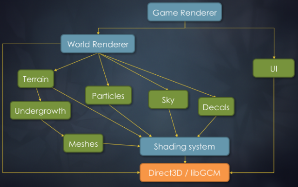
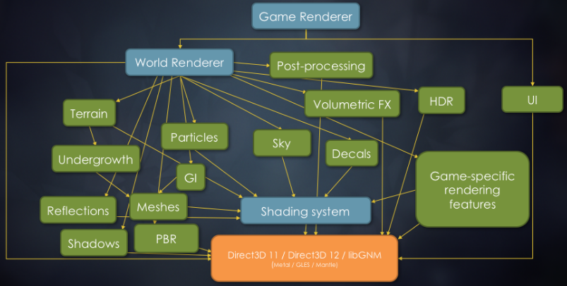
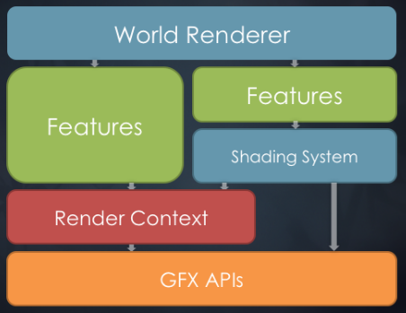
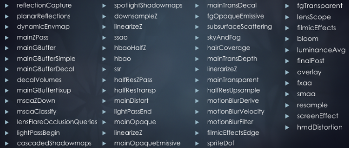
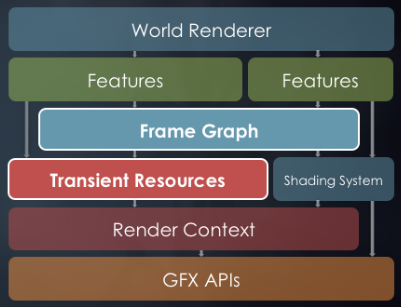
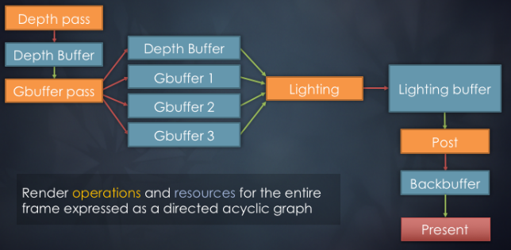

# 2007年と2017年におけるFrostbiteの比較(Frostbite 2007 vs 20017)

- 2007年
    - DICEの次世代エンジン。
    - 以下を下地に作られた。
        - Xbox 360
        - PlayStation 3
        - マルチコアPC
        - シェーダモデル3.0のDirectX9とDirect3D 10
    - 今後のDICEのゲームで使うために。
- 2017年
    - The EAのエンジン。
    - 以下のために発展(evolve)・拡大(scale up)した。
        - Xbox One
        - PlayStation 4
        - マルチコアPC
        - DirectX 12
    - 約15のEAのゲームで使われる。
        - もうバトルフィールドのエンジンではない。
        - 使われるジャンルはRPG、レース、スポーツ、アクションなど多岐にわたる。

# 2007年のレンダリングシステムのあらすじ(Rendering system overview '07)

# 2017年のレンダリングシステムのあらすじ(Rendering system overview '17)

- このグラフはエンジンを完璧にあらわしているわけではない。システムの広がりを図式化しただけ。
- 複雑に絡み合ったシステムが無数に存在する以外は基本的に同じ。
- このトークではWorld Rendererとレンダリング機能についての話をする。

# レンダリングシステムのあらすじ(簡略化バージョン)(Rendering system overview(simplified))

# WorldRenderer

- すべてのレンダリングを指揮する。
    - **コード駆動**アーキテクチャ。
    - メインのワールドジオメトリ(Shadeing System経由)。
    - ライティング、ポストプロセス(Render Context経由)。
    - すべてのビューとレンダパスについて知っている。
- 設定とリソースのシステム間マーシャリング(表現の変換)を行う。
- リソース(レンダターゲットやバッファ)の割り当てを行う。

# バトルフィールド4のレンダリングパス(Battlefield 4 rendering passes (Features))

- 上記は数年前にバトルフィールド4用にFrostbiteに蓄えたレンダリングパスである。
- 現在のパイプラインはPBR化されており、パスはさらに増えて複雑になっている。

# WorldRendererの課題(WorldRenderer challenges)

- 明示的な即時モードレンダリング。
- 明示的なリソース管理。
    - オーダーメイドによる職人技的な手作りのESRAM管理。(Bespoke, artisanal hand-crafted)
    - 様々なゲームチームによる複数の実装。
- レンダリングシステムとの強固な結合。
- 制限された拡張性。
- カスタマイズのためにフォーク/分岐が必須。
- 4k SLOCから15k SLOCへの組織的な成長。
    - 2k SLOC超の関数。
    - 維持、拡張、統合が高価。

# モジュール式WorldRendererの目標(Modular WorldRenderer goals)

- フレーム全体の高レベルな知識を得る。
- **拡張性**を改善する。
    - 分離された構成可能なコードモジュール。
    - 自動的なリソース管理。
- よりより可視化と診断。

- 蓄積した技術的負債の対処と拡張性と保守性の改善を行うため2016年に主要な部分を再構築した。
- 明示的なパスとリソースのミクロな管理なし。
- エンジンコード内のモノリシックな関数のハックなし。
- メモリ割り当てと別名付け(aliasing)の子守(baby-sitting)なし。

# 新アーキテクチャの要素(New architectural components)

- **FrameGraph**
    - **レンダパス**と**リソース**の高レベル表現。
    - フレームの完全な知識。
- **Transient Resource System**
    - リソース割り当て。
    - メモリ別名付け。

# FrameGraphの目標(Frame Graph goals)

- フレーム全体の**高レベル知識**を構築する。
    - リソース管理の単純化。
    - レンダリングパイプライン構成の単純化。
    - 非同期コンピュートやリソースバリアの単純化。
- 自己充足的で**効率的なレンダリングモジュール**を可能にする。
- 複雑なレンダリングパイプラインを可視化・デバッグする。

# FrameGraphの例(Frame Graph example)

- ディファードシェーディングパイプラインを実装したFrameGraphの例。
- グラフにはレンダパス(橙)とリソース(青)がノードとして表される。
- アクセス宣言や依存関係は辺で表される。

# Battlefield 4のフレームのグラフ(Graph of a Battlefield 4 frame)

- 一般に数百のノードからなる。
- デバッグ用グラフはGraphVizで可視化され、検索可能なPDFとして出力される。
- グラフは驚くほど巨大で複雑になり得る。
- このグラフはいくつかの場合で役に立ち得るが、我々が最終的に用いた主要な可視化ツールでは断じてない。

- カスタムの可視化スクリプト(HTML+Javascriptとランタイムから書き出したJSONデータ)を書いた。
- JSONデータはすべてのレンダパスとリソースの情報が含まれている。
- 各レンダパスがどのリソースが作成し、読み込み、書き出しているかを知ることができる。
- 各リソースのメモリレイアウトと各種メタデータ(デバッグ名、サイズ、フォーマットなど)を知ることができる。
- 可視化はインタラクティブであり、PIXのように、フレームで行ったことの概要をより便利に提供してくれる。

# FrameGraphの設計(Frame Graph design)

- 即時モードレンダリングからの脱却。
- レンダリングコードをパスに分ける。
- マルチフェーズ保持(retained)モードレンダリングAPI
    1. セットアップフェーズ。
        - 比較的安価であることを前提とする。
    2. コンパイルフェーズ。
    3. 実行フェーズ。
- 毎フレームにゼロから組む。
    - シーンの変化に対応するため。
- コード駆動アーキテクチャ。

# FrameGraphのセットアップフェーズ(Frame Graph setup phase)

- レンダパスとコンピュートパスを定義する。
- 各パスで入力リソースと出力リソースを定義する。
- コードの流れは即時モードレンダリングと似ている。
    - ただし、GPUコマンドは生成しない。

- すべてのリソースはグラフ構築中は**仮想的**である。
- レンダパスの入出力は仮想リソースハンドルを用いて宣言される。

# FrameGraphのリソース(Frame Graph resources)

- レンダパスは使うリソースを全て宣言しなければならない。
    - 読み込み。
    - 書き込み。
    - 生成。
- 外部の永続的(permanent)リソースはFrameGraphに**インポート**される。
    - TTA用ヒストリーバッファ。
    - バックバッファ。
    - などなど。

- FrameGraphから見えない効果(例えば、GPUからのデータの読み出し)を持つ場合、その副次的効果を明示的にマークする。
- 持続的(persistent)レンダターゲットが必要になる場合(TTA、SSR、など)、FrameGraphにインポートすることができる。
- インポートしたリソースへの書き込みは、コンパイルフェーズ中にカリングされないようにするため、レンダパスの副次的効果として数える。

# FrameGraphリソースの例(Frame Graph resource example)

TODO

# References
