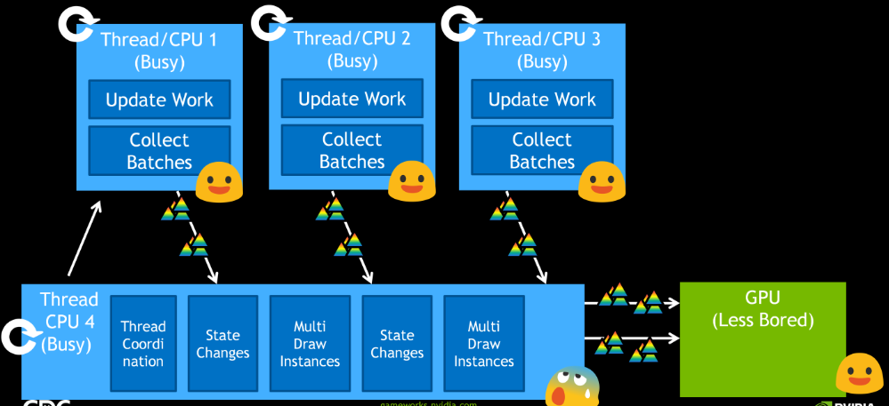

# What is this talk (not) about?

- アプリケーションは一般的にCPUとGPUの限界の間の範囲に向かってゆく。
- アプリケーションそれ自体がCPU限界である場合の話はしない。
- GPUが制限要因(limiting factor)であるシナリオの話はしない。
- ドライバのCPUコストが制限要因であるケースを調査してゆく。

# What is the issue?

- 慣例的なAPIはシングルスレッドの世界で出現した。
- １つのコアで１つのスレッドがレンダリングするオブジェクトを集めるためにシーンを走査する。
- 描画ステートの変更とトライアングルのレンダリングのためにドライバへ大量の呼び出しを発行する。
- コアが飽和するため、GPUにデータを送れない。
- 同時に、他のスレッドがアイドル状態になる。

# Bottlenecks in Rendering Loop

- ほとんどのアプリケーションは、シーン記述における出現頻度でソートされたループを持つ。
    - 例:レンダパス->シェーダ->マテリアル->ジオメトリの順でネストする。
<!--  -->
- バッファ、テクスチャ、シェーダのバインディング変更はよく起こる。
- 変更はコストが高すぎるので、実践だとこれらのCPUコストにより全体的なビジュアルの複雑さが低下することがある。

# More Triangles Help Increasing Complexity

- テッセレーションやインスタンシングによりGPUで複雑さを上げられる。

# But We Actually Want This

- しかし、説得力のあるコンテンツは密で非均質である。
    - 多種多様なマテリアル。
    - 様々なジオメトリで、独立にアニメーションするキャラクター。
- 開発者は高レートで複雑なレンダリングを扱うことができるAPIを必要としている。

# Traditional 3D APIs: Use "Heavy" Contexts

- API呼び出しはスレッドに束縛されたコンテキストを通して行われていた。
- スレッドのコンテキストを変化するのは高価。
- コンテキストやスレッド間で効率的にリソースを共有するのは扱いにくい(tricky)。
- スレッディングフレンドリーではない。
    - アイドル状態のコアを働かせて、処理に参加させたい。

# Traditional 3D APIs: Perform Implicit Work

- **暗黙的**な処理の例。
    - シェーダのコンパイル。
    - テクスチャのダウンロード。
    - ダウンサンプリング。
    - 同期。
    - 検証とエラーチェック。
- いつ、どんな場合に起こるかは**予測不可能**！
- **症状**として、以下を変更した後の描画でストールが起こる。
    - シェーダ。
    - ブレンドモード。
    - 頂点データレイアウト。
    - フレームバッファアタッチメントのフォーマット。
- 開発者は**明示的**にこれらをスケジューリングしたい。

# Updating OpenGL: "AZDO"

- **A**pproaching **Z**ero **D**river **O**verhead
- 改善された動的データ更新モデル。
    - SSBO。
    - persistentマッピング。
- `MultiDrawIndirect`で、より多様なジオメトリを一度に描画する。
    - 描画呼び出しの引数をGPUで計算できる。
        - GPUベースのオクルージョンカリング。
        - GPUベースの動的LOD。
- "バインドレス"リソースで、より多様なマテリアルを一度に描画する。

# Threading with Multi Draw Indirect

- ワーカースレッドはシーンを走査して、描画バッチのためのデータを集める。
    - スレッド間コミュニケーションを使うかpersistentマップしたバッファを使う。
- メインスレッドは描画呼び出しとステート変更を行う。
- 結果として、描画呼び出しが減り、より多くのトライアングルをレンダリングできる。

# Multi Draw Indirect Limitations

- 頂点バッファやインデックスバッファのバインディングを"インライン"で**変更できない**。
    - パッキングしたIBやVBの異なる部分からデータを引き出す。
- 以下を**変更できない**。
    - シェーダ。
    - テクスチャバインディング。
    - FBO。
    - UBO。
- 本質的に、バッチは異なるジオメトリを同じマテリアルでレンダリングされることになる。

# What if...?

(以下、GL_NV_command_listの解説)

# Vulkan

(一部略)

# The Best Sub-allocator: YOU!

- 寿命やパインティングのパターンでメモリサブアロケーションを分ける。
    - アプリケーション全体。
    - レベルごと。
    - フレームごと。

(一部略)

# Threaded Data Updates: "Safety"

- 複数フレームが処理中になることがあるので、バッファ領域を複数用意してラウンドロビン的にアクセスする。
- `VkEvent`はリソースが描画で使い終わったことを通知することができる。
- 一番いいのは待機しないように十分なリソースを用意することだが、これは対象のシステムによる。

# Command Buffer Thread Safety

- 実行中でなくなるまで再書き込みのためにコマンドバッファをリサイクルしてはならない。
- 各フレームにキューをフラッシュしたくない。
- キューのサブミッションに伴うフェンスをテストして、コマンドバッファがリサイクルできるかどうかを確認する。

# Vulkan Threads: Command Pools

- コマンドバッファは親となる`VkCommandPool`オブジェクトから割り当てられる。
    - コマンドバッファの処理はメモリアロケーションのような親となるコマンドプールの処理を引き起こすことがある。
- スレッドごとに異なるコマンドプール由来のコマンドバッファを使う。
    - もしくは、スレッド間で同期すれば良いが、そこまでする価値はない。

# Threads: Command Pools

- スレッドごとに加えて、フレームごとにもコマンドプールを持つようにする。
    - コマンドプールはそのコマンドバッファを一括でリセットできる。
        - ただし、リセットは実行が完了してから行う。
    - 内部のフラグメンテーションを避けることができる。

# Threads: Descriptor Pools

- デスクリプタセットはデスクリプタプールから割り当てられる。
- デスクリプタセットを動的に生成するなら、デスクリプタプールをスレッドごとに作ることを考える。
- プール単位でリセットできるので、寿命ごとにプールを分けることもできる。
-

# References
