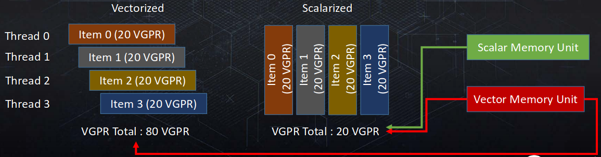
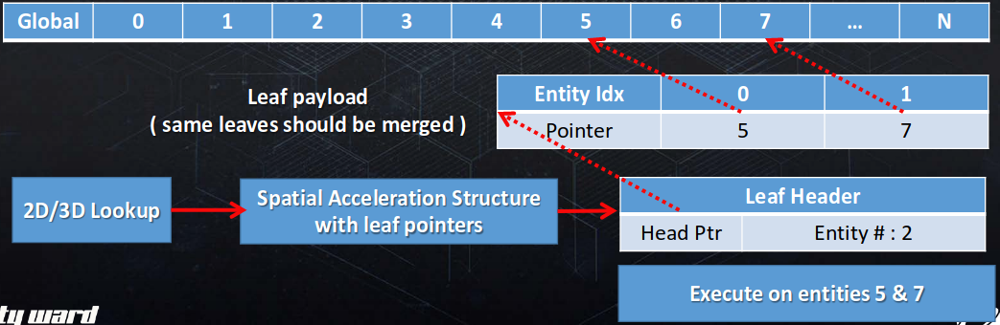

# Plus Methods: Introduction

# Plus Methods: Algorithm Steps

- レンダリングエンティティのリスト。
- カリングされるエンティティリストを持つ空間的高速化構造(spatial acceleration structure)。
- サンプリングポイントごとに実行されるアルゴリズム。
    - 高速化構造を走査する。
    - 存在するエンティティ上を反復する。
- Tiled/Clustered Forward+/Deferred+としても知られる。

# Spatial acceleration structure: Frustum

- タイル。
    - 深度プリパス。
    - タイル境界と最大最小深度でエンティティをカリングする。
    - 2Dの密なグリッド。
        - つまり、8x8ピクセルのタイル。
    - 深度の不連続性に苦しめられる。
<!--  -->
- クラスタ。
    - 深度プリパスの必要なし --- 3Dクラスタでエンティティをカリングする。
    - 任意の3D(錐台内)ルックアップができる。
    - メモリをより多く使えば、深度の不連続性をより和らげることができる。
        - Zスライスの分布。
    - メモリ消費のため、2Dで疎である可能性が高い。

# Data Structure Divergence performance issues

- タイル。
    - フォワードでは、１つのトライアングルが複数のタイルにまたがることがあり得る。
    - ディファードでは、wavefrontがタイルサイズにマッチすることがあり得る。
- クラスタ。
    - フォワードでは、１つのトライアングルが複数のクラスタにまたがることがあり得る。
    - ディファードでは、wavefrontが複数のZスライスにまたがることがあり得る。
- ボクセルツリー。
    - wavefrontが複数のボクセルにまたがることがあり得る。
- トライアングル/テクセル。
    - wavefrontが複数のトライアングル/テクセルにまたがることがあり得る。

# Divergence performance issues

- 高いVMEMとVALUのコスト。
    - divergence点を通り過ぎた(すなわち、タイル内の)すべての計算はベクトルごとに起こる。
    - すべてのメモリ読み込みは、コヒーレントであっても、ベクトルごとに起こるので、TCCユニットに無差別に送りつける(spam)。
    - メモリ算術命令はベクトルごとに起こるため、VALUコストに加えられる。
- 高いVGPRコスト。
    - すべての処理はベクトルベースのため、(エンティティのデスクリプタのような)すべての定数データはVGPRに読み込まれなければならない。

# Data Structures & Scalarization

# Scalarization

- 一度に1つのdivergentアイテムでのみwavefrontを実行する。
- wavefrontによりサンプルされたすべてのアイテム上で繰り返す。
    - 選択されたアイテムにのみ動かすためにすべてのwavefrontレーンをマスクする。
    - 次に移る。
- ディファードと同じようにフォワードでも使える。

# Data Container: Hierarchical

- リーフクラスタへのポインタ。
    - リーフクラスタは各エントリ中の見えているエンティティへのすべてのポインタを格納する。
    - エンティティ番号に束縛されない。
    - 間接参照により走査が高価になる。
    - 可変なメモリストレージコスト。

~~~c
// 典型的な階層的コンテナイテレータ
address = containerAddressFromSamplePosition(samplePosition); // 2D及び3D位置からコンテナのアドレスを見つける
// 初めのエントリはそのヘッダ。読み出して、ポインタを進める
header = g_EntityClusterData[address++];
entityCount = GetEntityCountFromHeader( header );
// コンテナ内のエンティティを反復する
for ( entityItr = 0; entityItr < entityCount; entityItr++)
    ProcessEntity(g_EntityClusterData[address++]);
~~~

~~~c
// コンテナ上でスカラ化した階層的コンテナイテレータ
address = containerAddressFromSamplePosition(samplePosition); // 2D及び3D位置からコンテナのアドレスを見つける
uniformAddress = address;
currentLaneID = WaveGetLaneIndex();
execMask = ~ulong(0); // 111...111にマスクを初期化する – すべてのレーンを開放する
ulong currentLaneMask = ulong(ulong(1) << ulong(currentLaneID));
while ((execMask & currentLaneMask) != 0) {  // 残りのレーンにEXECをセットする
    uniformAddress = WaveReadFirstLane(address);
    laneMask = WaveBallot(uniformAddress == address); // 現在のイテレーションで処理されるレーンのマスク
    execMask &= ~laneMask; // マスクから現時点で生きているレーンを取り除く
    if (uniformAddress == address) { // コヒーレントなアドレスに一致するレーンを実行する
        header = g_EntityClusterData[uniformAddress++]; // 初めのエントリはそのヘッダ。読み出してポインタを進める
        entityCount = GetEntityCountFromHeader(header);
        // コンテナ内のエンティティを反復する
        for (entityItr = 0; entityItr < entityCount; entityItr++)
            ProcessEntity(g_EntityClusterData[uniformAddress++]);
    }
}
~~~

# Scalarization: Hierarchical Container

- シェーダは完全にスカラ化されている。
    - VMEM/SMEMとVALU/SALUの均衡がいい感じに保たれている。
    - VGPRの使用率が低い(フォワードの定数読み込みに似ている)。
- パフォーマンスは大きく変化する。
    - wavefrontは、同じエンティティが異なるコンテナにある場合、複数回エンティティを処理する可能性がある。
    - データの一貫性/冗長性に依存して、結果として遅くなることがある。
- 理想的には、エンティティレベルでスカラ化する。
    - これは順序付いたコンテナが必要になる --- Flat Bit Array。

# Data Container: Flat

- Flat Bit Array
    - ビットのコレクション --- N番目のビットはグローバルリストでのN番目のエンティティの可視性を表す。
    - 単純な走査 --- ビットを通して反復する。
    - メモリ/エンティティ束縛 --- 錐台ごとのコンテキストでほぼ使われる。

~~~c
// 典型的なFlat Bit Arrayイテレータ
wordMin = 0;
wordMax = max(MAX_WORDS - 1, 0);
address = containerAddressFromSamplePosition(samplePosition);
// 可視性ビットのワードの範囲を読む
for (uint wordIndex = wordMin; wordIndex <= wordMax; wordIndex++) {
    // Load bit mask data per lane
    mask = entityMasksTile[address + wordIndex];
    while ( mask != 0 ) { // レーンごとに処理される
        bitIndex = firstbitlow( mask );
        entityIndex = 32 * wordIndex + bitIndex;
        mask ^= (1 << bitIndex);
        ProcessEntity(entityIndex);
    }
}
~~~

~~~c
// エンティティでスカラ化されたFlat Bit Arrayイテレータ
wordMin = 0;
wordMax = max(MAX_WORDS -1, 0);
address = containerAddressFromSamplePosition(samplePosition);
// 可視性ビットのワードの範囲を読む
for (uint wordIndex = wordMin; wordIndex <= wordMax; wordIndex++) {
    // レーンごとにビットマスクデータを読み込む
    mask = entityMasksTile[address + wordIndex];
    // wavefrontの全てのレーンでワードのビットマスクをコンパクト化する
    mergedMask = WaveReadFirstLane(WaveAllBitOr(mask));
    while (mergedMask != 0) { // マージする得たビットマスクうでスカラを処理する
        bitIndex = firstbitlow(mergedMask);
        entityIndex = 32 * wordIndex + bitIndex;
        mergedMask ^= (1 << bitIndex);
        ProcessEntity(entityIndex);
    }
}
~~~

# Scalarization: Flat Container

- ビットマスクのスカラ化。
    - シェーダは完全にスカラ化されていて、各エンティティごとに一度だけ実行する。
    - VGPRの使用率が低い。
    - ベースラインよりさらに大幅に効率的。
    - 間違いなく(arguably)よりエレガントなコード。
- 作った(synthetic)テストシェーダでのスカラ化の結果。
    - スカラ化は密に照らされる環境でライトルックアップに適用した。

||VGPR数|占有率|コスト|
|-|-|-|-|
|ベースのF+|56|5|100%|
|スカラ化された階層的F+|32|8|98%|
|スカラ化されたフラットF+|32|8|72%|

# Scalarization

- 階層的なデータコンテナはコンテナレベルでスカラ化することができる。
    - タイル/クラスタ/ボクセルのアドレス。
- フラットなデータコンテナは格納したエンティティレベルでスカラ化することができる。
    - ライト/プロブ/デカールのインデックス。

# Z-Binning

||深度の非連続性|空間解像度|Zによるメモリスケーリング|
|-|-|-|-|
|タイル|-|+|+|
|クラスタ|+|-|-|

- オープンワールドの深度範囲。
    - 深度の複雑さが大きい所では高効率なクラスタリングのパフォーマンスやメモリは実践的ではない。

# F+ Renderer: Z-binning algorithm

- CPU:
    - ライトをZでソートする。
    - 可能性のある深度の合計範囲の上に均一に分布するbin(容器)を設定する。
    - 各bin境界内の最大最小のライトIDを持つ16ビットLUTを2つ生成する。
- GPU(PSかCS):
    - Vector load ZBIN
    - Wave uniform LIGHT MIN / MAX ID
    - Wave uniform LOAD of light bit WORDS from MIN / MAX range
    - ライトの最大最小IDからベクトルビットマスクを生成する。
    - ベクトルZ-Binマスクでユニフォームのライトをマスクする。

~~~c
// Z-Binのマスクされたワードを持つエンティティでスカラ化されたフラットビット配列のイテレータ
wordMin = 0;
wordMax = max(MAX_WORDS - 1, 0);
address = containerAddressFromScreenPosition(screenCoords.xy);

zbinAddr = ContainerZBinScreenPosition(screenCoords.z);
zbinData = maskZBin.TypedLoad(zbinAddr, TYPEMASK_NUM_DATA(FORMAT_NUMERICAL_UINT, FORMAT_DATA_16_16));
minIdx = zbinData.x;
maxIdx = zbinData.y;
mergedMin = WaveReadFirstLane(WaveAllMin(minIdx)); // この点からのスカラ値
mergedMax = WaveReadFirstLane(WaveAllMax(maxIdx)); // この点からのスカラ値
wordMin = max(mergedLightMin / 32, wordMin);
wordMax = min(mergedLightMax / 32, wordMax);

// 可視性ビットのワードの範囲を読む
for (uint wordIndex = wordMin; wordIndex <= wordMax; wordIndex++) {
    // レーンごとにビットマスクデータを読み込む
    mask = entityMasksTile[address + wordIndex];
    // ZBinマスク単位によるマスク
    localMin = clamp((int)minIdx - (int)(wordIndex * 32), 0, 31);
    uint maskWidth = clamp((int)maxIdx - (int)minIdx + 1, 0, 32);
    // BitFieldMask命令は手動で32のサイズラップをサポートする必要がある
    uint zbinMask = maskWidth == 32 ? (uint)(0xFFFFFFFF) : BitFieldMask(maskWidth, localMin);
    mask &= zbinMask;
    // wavefrontのすべてのレーン上のワードビットマスクをコンパクト化する
    mergedMask = WaveReadFirstLane(WaveAllBitOr(mask));
    while (mergedMask != 0) {  // マージされたビットマスク上で処理されるスカラ値
        bitIndex = firstbitlow(mergedMask);
        entityIndex = 32 * wordIndex + bitIndex;
        mergedMask ^= (1 << bitIndex);
        ProcessEntity(entityIndex);
    }
}
~~~

# F+ Renderer: Memory Performance

|構造(256ビット配列)|XY解像度|Z解像度|複雑さ|ストレージ|エンティティあたりのカリング処理数|
|-|-|-|-|-|-|
|Tiled Buffer|240x135|1|O(X*Y)|1036KB|32400|
|Tiled+ZBin|240x135|8096|O(X*Y+Z)|1036KB+32KB|32400+8096(単純)|
|Clustered|60x32|18|O(X*Y\*Z)|1106KB|34560|

# F+ Renderer: Z-Bin Performance

|構造(256ビット配列)|不透明レンダリング時間|
|-|-|
|Tiled Buffer|9.00ms|
|Tiled+Zbin|7.65ms(15%削減)|
: Hangar Fire Scene (PS4 1080p)

# F+ Renderer: Optimization Performance

|構造(256ビット配列)|不透明レンダリング時間|不透明パスの平均占有率|
|-|-|-|
|Base Tile|5.7ms(100%)|~3|
|Based Tile+Zbin|5.2ms(91%)|~3|
|Scalarized Tile|5.1ms(88%)|~4.3|
|Scalarized Tile+Zbin|4.6ms(80%)|~4.3|
: Zombies opening scene (PS4 1080p)

# Rasterization based culling

# Classic compute culling issues

- 正確性。[@Wronski2017]
- オクルージョン。[@Kasyan2011]
- 複雑な形状。[@Heitz2016]

- 解決策？
    - Classic Rasterized Deferred Rendering [@Hargreaves2004]

# Conservative Rasterized Culling

- ライトはメッシュである(ライトプロキシ)。
- タイル/クラスタにアトミックに書き込む。
    - Flat Bit ArrayのlightBitをInterlockedORする。
- ハードウェアサポートのない保守的ラスタライゼーション。
    - フル解像度でラスタライズする。
    - 高速化のために4xMSAA。[@Drobot2017b]
- 固定パイプラインのハードウェア最適化。
    - 早期Z(HiZ)
    - 深度境界テスト(HiZ)
    - ステンシル(HiS)
<!--  -->
- 1パスでのタイルラスタライゼーション。
    - ライトメッシュボリュームの中にあるピクセルはPSを実行し、タイルにlightBitをInterlockORする。
    - カメラがライトメッシュの内にある場合、
        - ZモードをGREATERにして、
        - 背面をレンダリングする。
    - カメラがライトメッシュの外にある場合、
        - ZモードをLESS_EQUALにして、
        - 前面をレンダリングする。
        - メッシュのZ範囲(spans)に深度境界テストを設定する。
<!--  -->
- 2パスでのタイルラスタライゼーション。
    - カメラがライトメッシュの外にある場合、(2パスのピクセルパーフェクトテスト)
        - 第1パスで前面をステンシルする。
        - 第2パスで背面をステンシルして、PSを実行する。
        - 詳しくは[@Thibieroz2011]を参照。

~~~c
// Flat Bit Arrayで使う。
[earlydepthstencil] // UAVありでEarlyZが有効か確かめる
void ps_main(const PixelInput pixel) {
    uint tileIndex = FrustumGrid_TileFromScreenPos(rasterizerScale * pixel.position.xy); // MSAAラスタライザにスケールする
    uint lightIndex = uint(entityID.x);
    const uint lightBit = 1 << (lightIndex % 32); // 正しいライトビットを見つける
    const uint word = lightIndex / 32;
    const uint wordIndex = (tileIndex * FRUSTUM_GRID_FRAME_WORDS_LIGHTS) + word; // 正しいワードを見つける
    {
        InterlockedOr(lightMasksTile[wordIndex], lightBit); // 正しいワードにあるライトビットを更新する
    }
}
~~~

# Atomic Contention

- ピクセルごとにピクセルより粗いタイルごとの値に書き込むため、重複した無駄な書き込みが発生する。
- タイルIDでアトミックの余剰分を取り除く(prune)必要がある。

~~~c
uint WaveCompactValue(uint checkValue) {
    ulong mask;  // レーンユニークなコンパクションマスク
    for (;;) {  // すべてのアクティブなレーンが取り除かれるまでループする
        uint firstValue = WaveReadFirstLane(checkValue);
        mask = WaveBallot(firstValue == checkValue); // マスクは残りのアクティブレーンに対してのみ更新される
        if (firstValue == checkValue) break; // 次の反復由来のfirstValueを持つレーンすべてを除外する
    }

    // この地点では、マスクの各レーンは同じ値を持つ異なるすべてのレーンのビットマスクを含むべき。
    uint index = WavePrefixCountBits(mask); // これは各レーンに対して異なるマスクで独立して行われることに注目。

    return index;
}

// Flat Bit Arrayで使う。
[earlydepthstencil] // UAVありでEarlyZが有効か確かめる
void ps_main(const PixelInput pixel) {
    uint tileIndex = FrustumGrid_TileFromScreenPos(rasterizerScale * pixel.position.xy); // MSAAラスタライザにスケールする
    uint lightIndex = uint(entityID.x);
    const uint lightBit = 1 << (lightIndex % 32); // 正しいライトビットを見つける
    const uint word = lightIndex / 32;
    const uint wordIndex = (tileIndex * FRUSTUM_GRID_FRAME_WORDS_LIGHTS) + word; // 正しいワードを見つける

    const uint key = (wordIndex << FRUSTUM_GRID_MAX_LIGHTS_LOG2);
    const uint hash = WaveCompactValue(key);

    [branch]
    if (hash == 0) {  // wavefront内でユニークキーが初めて発生したときのみ分岐する。
        InterlockedOr(lightMasksTile[wordIndex], lightBit); // 正しいワードにあるライトビットを更新する
    }
}
~~~

# Tile Rasterizer Performance

|アルゴリズム|カリング時間|
|-|-|
|Atomic Raster|1.44ms(100%)|
|Atomic Raster + 4xMSAA|0.27ms(18%)|
|Atomic Raster + Compaction|0.36ms(25%)|
|Atomic Raster + Compaction + 4xMSAA|0.10ms(7%)|
: 3x フルシーンライト - 240x135 - (PS4)

- 多くの最適化バリアントは、per draw basisで十分な活用がなされていないことから、セットアップに縛られ始める。
- バッチ処理が必要である。
- 非同期コンピュートによる並列化が良い候補である。

# Cluster Rasterizer

- ライトメッシュボリュームの内にあるクラスタでlightBitを保守的にマークする。
- カメラがライトメッシュ(コンベックス)の内にある場合、
    - 背面をレンダリングする。
    - near平面から保守的な背面の深度にZ方向にクラスタを渡り歩く。
        - プリパスから早期リジェクトまで保守的深度を使う --- 可能ならば。
<!--  -->
- カメラがライトメッシュの外にある(または、非コンベックスの内にある)場合、
    - 第1パス: MARK
        - 背面をレンダリングする。
        - 背面と保守的に交差するクラスタをマークする。
    - 第2パス: WALK
        - 前面をレンダリングする。
        - マークされたクラスタに当たるまで前面の保守的深度からクラスタを渡り歩く。
        - プリパスから早期リジェクトまで保守的深度を使う --- 可能ならば。

# Triangle Conservative Depth

- MARK/WALKはトライアングルに対する保守的深度を必要とする。

~~~c
// 微分からトライアングルの深度境界を推定する
// 微分はほぼWQMを起動するようなもの。レーン幅の処理が正しく振る舞うことを確かめる。
// Derivatives will most likely trigger WQM! Make sure your lane wide operations behave correctly
float w = pixel.position.w;
float wDX = ddx_fine(w);
float wDY = ddy_fine(w);
tileMinW = max(tileMinW, w - abs(wDX) - abs(wDY));
tileMaxW = min(tileMaxW, w + abs(wDX) + abs(wDY));
// トライアングル頂点の深度チェックからトライアングル深度境界を推定する。[@Drobot2014]
// トライアングルの外にある微分の場合に保守的にカリングする。
float w0 = GetVertexParameterP0(pixel.posW);
float w1 = GetVertexParameterP1(pixel.posW);
float w2 = GetVertexParameterP2(pixel.posW);
tileMinW = max(tileMinW, min3(w0, w1, w2));
tileMaxW = min(tileMaxW, max3(w0, w1, w2));
~~~
: [@Drobot2014]。WQM = WHOLE_QUAD_MODE([参考](https://www.x.org/docs/AMD/old/AMD_HD_6900_Series_Instruction_Set_Architecture.pdf))

# Cluster Rasterizer Performance

|アルゴリズム|カリング時間|
|-|-|
|Atomic Raster|0.99ms(100%)|
|Atomic Raster + 4xMSAA|0.51ms(55%)|
|Atomic Raster + Compaction|0.66ms(73%)|
|Atomic Raster + Compaction + 4xMSAA|0.32ms(35%)|
: Zombiesオープニングシーンの256個のライト - 60x40x32 - (PS4)

- より十分な活用がなされず、XY解像度が低いため、タイルよりスケーリングが鈍い。
- バッチ処理が必要である。
- WALKモードのためレイテンシーが高い。
- 非同期コンピュートによる並列化が良い候補である。

# Light Proxy

- 解析的ライト形状は遮蔽関係を尊重しない。
- 高価な過剰なシェーディングが結果として起こる。
    - シャドウマップにより見た目として正しくなる。
<!--  -->
- ライトプロキシのジオメトリはレベルジオメトリにタイトに切り詰められる(最大300トライアングル)。
- 正確なカリングが結果として起こる。
- 最小限の過剰なシェーディング。
<!--  -->
- プロキシはすべてのステーショナリーライトに対して生成される。
    - 保守的シャドウマップレンダリング。
    - 保守的シャドウマップの三角形化。
        - 三角形化の最適化。
    - 少ないトライアングルのプロキシのための保守的シャドウマップの深度への貪欲な平面フィッティング。
<!--  -->
- 8x8タイルバッファを生成するために使われる。
    - マスクされていなければ、プロキシの交差は視覚的に8x8タイルの"厳しい"ものになる。
    - 静的シャドウマップはすべてのライトに必要。
    - シャドウマップキャッシング[@Drobot2017b]を使う。

# Light Proxy Performance

|ライト形状|フレーム時間|
|-|-|
|デフォルト|16.5ms|
|ライトプロキシ|15.6ms|
: Open vista in Zombies (最小のライトオクルージョン) - (PS4)

|ライト形状|フレーム時間|
|-|-|
|デフォルト|17.5ms|
|ライトプロキシ|14.4ms|
: Space ship corridor (良好なライトオクルージョン) - (PS4)

- 非同期オーバーラップの良い候補。
    - 仕事の大多数はGPUの固定パイプラインを利用する。
    - 長いアトミックキュー。
    - 長いWALKループ。
- "単純な"ケースではCSベースカリングジョブで良いバランスを取る。

# Improvements

- さらなるレンダリングエンティティへプロキシを拡張する。
    - 複雑な形状のデカール。
    - 複雑な形状の反射プロブ。
- ラスタライゼーションバッチ処理の改善。
    - Zによるソートは効率的なバッチ処理を可能にする。
    - lightBit % 32のグループにメッシュをマージする。
        - InterlockedOrのまえにWaveAllBitOr(lightBit)する。
    - lightBit % 32 のグループにステンシルパスをバッチする。
        - (R32_UINTテクスチャへ)手動のステンシル書き込み/読み込み。<HiSなし>
        - manualStencil.StoreのまえにWaveAllBitOr(lightBit)
        - ベースのステンシル最適化があなたのコンテンツの助けになるときだけ試す。
    - 8xMSAA

# Bonus Slides

# Spatial acceleration structure : World

- ボクセルツリー。
    - ワールド空間八分木。
        - 各リーフは"キューブ"/ボクセルである。
    - オクルージョンも事前計算する。
        - つまり、ライトは影付けされ、影響のあるボリュームのみを含まれる。
    - 簡単な事前計算/キャッシュされた錐台外の3Dルックアップを可能にする。
    - 高価な走査。
        - 階層の走査、複数のキャッシュミス、間接読み込みを必要とする。
    - 大きなメモリ消費(解像度依存)。
    - 重大な事前計算時間。
<!--  -->
- メッシュ毎トライアングル/テクセル。
    - オクルージョンの事前計算。
    - メッシュごとのルックアップを可能にする。
    - トライアングルごと(triID)かテクセルごと(ライトマップのようなもの)を格納する。
    - ほどほどのメモリ消費(解像度依存)。
    - フォワードでは一度キャッシュされれば間違いなく最も効率的。
    - 複雑なパイプライン --- 大きなキャッシング時間。
- 出荷しなかった面白い実験。
    - 次のプロジェクトでもう一度やるのが楽しみ。

# References
