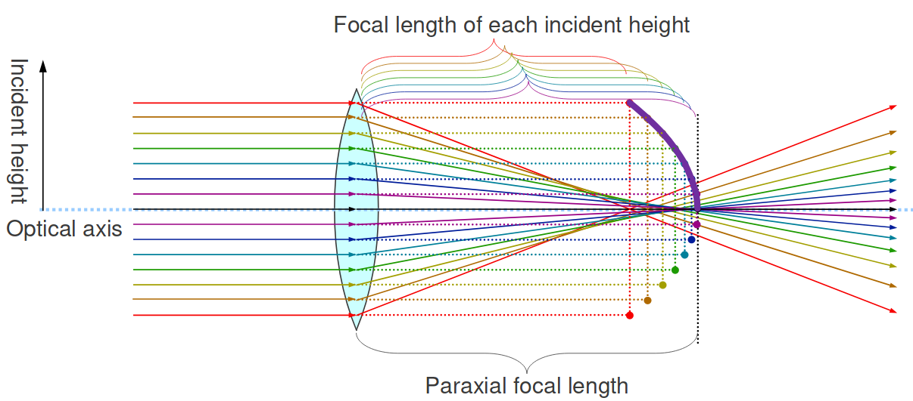
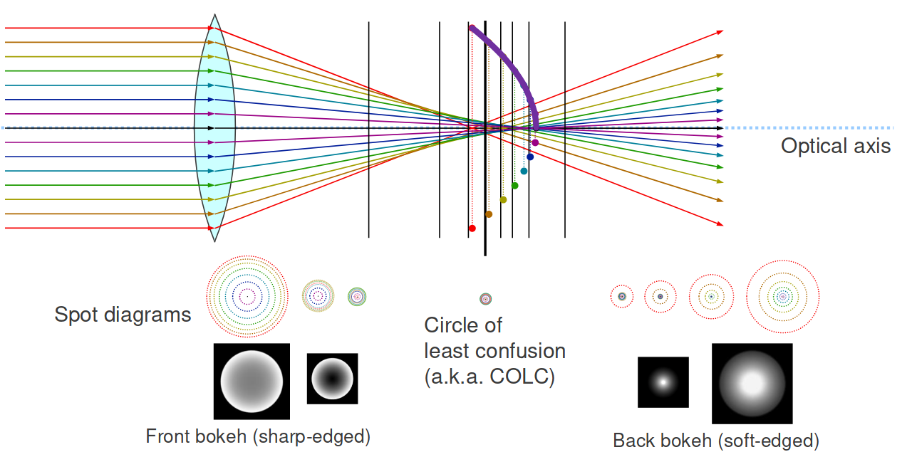
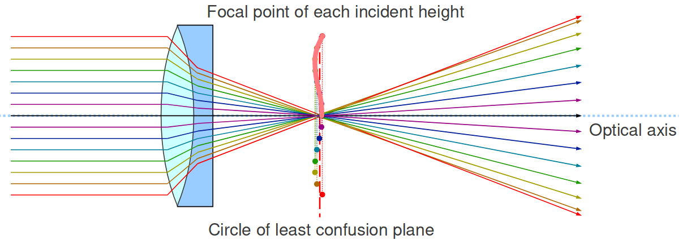
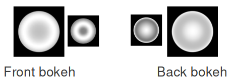
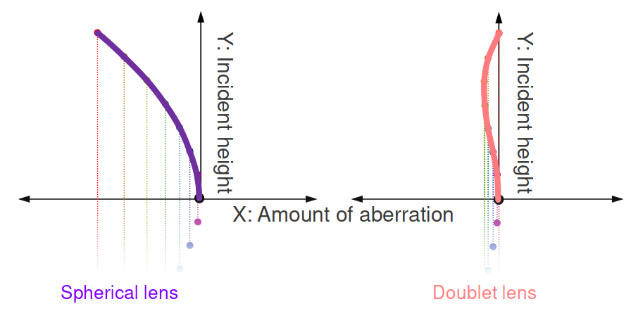
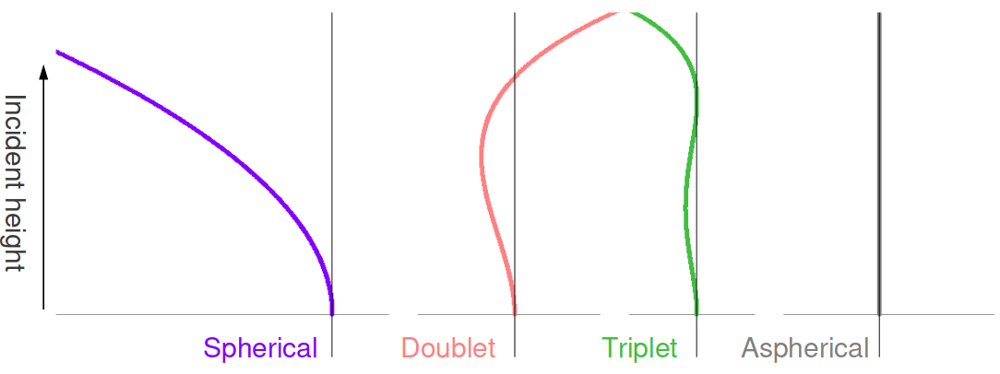
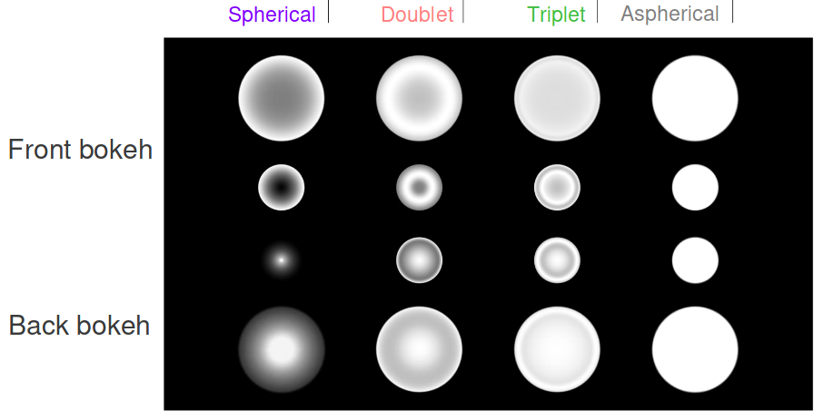
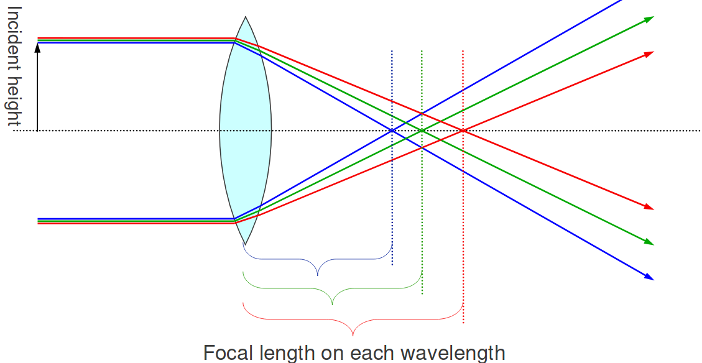
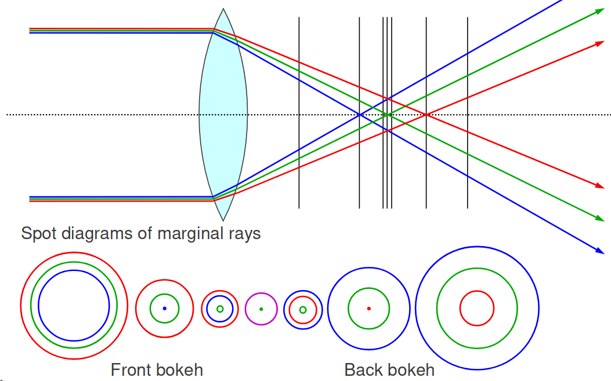

# 収差と補正[Aberrations and Corrections]

# 光学的収差[Optical Aberrations]

- 実際のレンズは理想的に像を作らない。
    - 不完全なフォーカス
    - 画像の歪み
    - 分散[dispersion]
    - などなど…

# 主な収差[Major Aberrations]

- 単色[monochromatic]収差
    - 単波長光線でも発生する。
    - Seidel[ザイデル]の5収差としても知られる。
- 色[chromatic]収差
    - 分散によって発生する。
        - 異なる色への可視光の分離
        - 多波長光線における異なる屈折率
    - 多波長光線によって発生するが、
        - モノクロフィルムではブラーとして発生する。
        - 短波長光線によるカラーフィルムでは発生しない。
            - ナトリウムランプ[sodium-vapor lamps]のようなもの。

# 単色および有色収差[Monochromatic and Chromatic Aberrations]

- 単色収差(Seidelの5収差)
    - 球面収差(SA)[spherical aberration]
    - コマ収差[coma]
    - 像面湾曲[field curvature]
    - 非点収差[astigmatism]
    - 歪曲収差[distortion]
- 色収差(CA)
    - 横色収差(倍率色収差)[lateral chromatic aberration(CA of magnification)]
    - 縦色収差(軸上色収差)[logitudinal chromatic aberration(axial CA)]

# ボケに影響を与える重要な収差の詳細[Details of Important Aberrations Which Affect Bokeh]

# 球面収差[Spherical Aberration]

- 光軸に平行な光線の焦点距離のズレ
- 収差は球面レンズに起因する。
    - 球状の表面は、
        - レンズとして理想的ではない。
        - 高い製造可能性[manufacturability]のために一般的に使われる。

# 球面収差の原理[Principle of Spherical Aberration]

- 入射高[incident height]
- 光軸[optical axis]
- 各入射高の焦点距離[focal length of each incident height]
- 近軸の焦点距離[paraxial focal length]
<!--  -->
- 光線が光軸から離れるほど、光軸との交点がレンズに近くなる。

# 球面レンズのボケ[Spherical Lens Bokeh]

- スポットダイアグラム[spot diagrams]
- 前ボケ(シャープな輪郭)[front bokeh(sharp-edged)]
- 最小錯乱円(COLCとして知られる)[circle of least confusion(a.k.a. COLC)]
- 後ボケ(ソフトな輪郭)[back bokeh(soft-edged)]

# 球面収差に対する補正[Corrections for Spherical Aberration]

- ダブレットレンズ[doublet lens]
    - 凸[convex]レンズと凹[concave]レンズのペア。
    - 凹レンズの収差が凸レンズの収差を打ち消す。
    - 完璧に打ち消すことはできない。
- トリプレットレンズ[triplet lens]
    - ダブレットにもうひとつレンズを追加する。
    - 依然として完璧ではないが、更に良くなる。
- 非球面レンズ[aspherical lens]
    - 表面は理想に近い
    - 作るのが高価
    - 球面収差を完璧に取り除く

# ダブレットレンズ補正の例[Example of Doublet Lens Correction]

<!--  -->
- 球面レンズより更に複雑なボケ

# 球面収差のチャート(縦色収差のダイアグラム)[Spherical Aberration Charts(Longitudinal Aberration Diagrams)]

- Y軸:入射高(独立変数)
- X軸:球面収差量(従属変数)

<!-- p.16 -->

# ダイアグラムとボケ[Diagrams and Bokeh]

- 垂直に近いほど、補正が優れている。
    - 鮮明なフォーカス
    - 平坦なボケ

# 軸上色収差[Axial Chromatic Aberration]

- 光線波長の違いが収差を引き起こす。
- 波長によって屈折率が異なる。

# 軸上CAの原理[Principle of Axial CA]

# 軸上CAのボケ[Bokeh of Axial CA]

# 参考文献[References]
