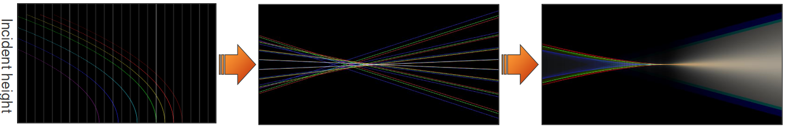
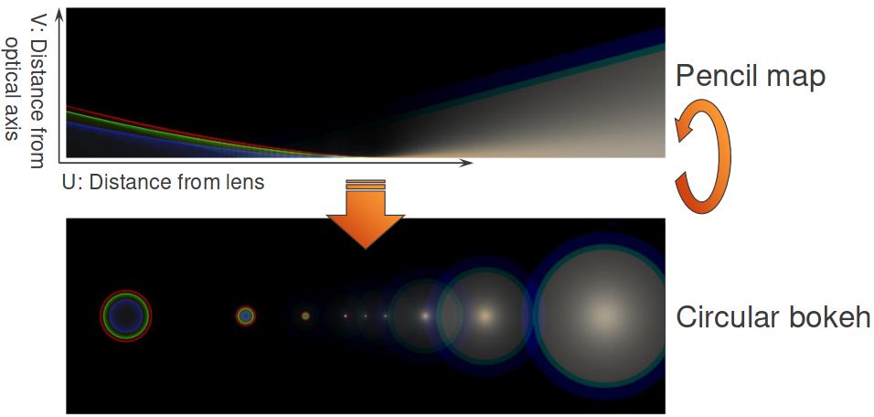
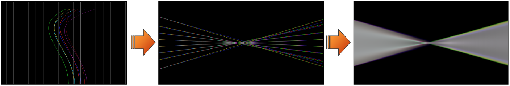
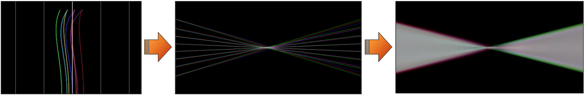
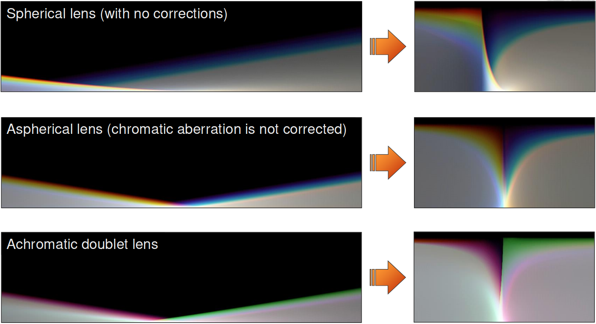

# はじめに[Introduction]

- 基本的なアイデアと理論[@Kawase2008]
    - 円形開口のみ
- 実践的な実装と最適化[@Kawase2012]
    - 任意の開口形状の種類

# ペンシルマップの生成[Creating the Pencil Map]

- 収差ダイアグラムから光路[light path]を事前計算する。
    - 球面色収差や軸上色収差を計算に入れる

# 円形ボケレンダリング[Circular Bokeh Rendering]

- V座標は光軸からの距離を表す。
    - 各スライスを円にマッピングすることで円形の'ボケ'を生成する。

# 離散化された結果…[Discretized Result...]

- 色収差は問題である。
- 3つの波長(R/G/B)では分散を表現するのに不十分である。

# 波長サンプリングの増加[Increasing Wavelength Samplings]

- より多くの波長でマップを計算する。
- RGB空間に変換する。

# 球面および色収差におけるボケ[Bokeh with Spherical and Chromatic Aberration]

- 不完全なフォーカス
- 赤の鋭いエッジを持つ前ボケ
- 青の柔らかいエッジを持つ後ボケ

# ダブレットのペンシルマップの生成[Creating the Pencil Map of Doublet]

- 縦収差ダイアグラムからマップを計算する。
- 実際のレンズパラメータを使う(それらが存在するならば)。
    - 各波長の光線経路のみが必須とされる。

# 写真との比較[Comparison with photographs]

- 一般的な補正
    - 前ボケは柔らかい紫のエッジを持ち、中心が暗くなる。
    - 後ボケは鋭い緑のエッジを持ち、中心が明るくなる。

# 異なるダブレットのタイプ[Different Type of Doublet]

- 残存色収差は残存球面収差より見えやすい。

# ペンシルマップの最適化[Optimization of Pencil Map]

- テクスチャでの無駄な部分
    - 疎で、多くのテクセルが空白である。
    - より重要な'焦点が合う'テクセル周辺の精度が十分でない。

<!-- p.21 -->

- 最大の高さ(ボケのサイズ)によってすべての距離(U軸)でかたまり[bundle]の高さを正規化する。
- 空白のテクセルが少なくなり、焦点が合うテクセル周辺の精度が大きく改善する。

# 任意の開口形状への応用[Application to Arbitrary Aperture Shapes]

TODO

# 参考文献[References]
