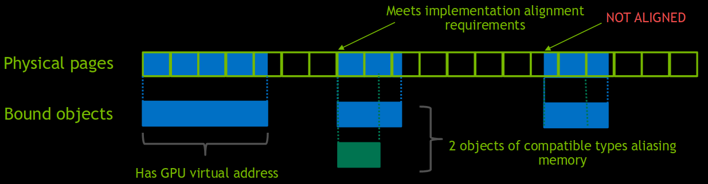

# CPU -> GPU Transfers

# Low-level memory control --- Console-like access to memory

- Vulkanは物理メモリプールを開示している --- device local、host visible、など。
- アプリケーションはバッファやイメージの仮想メモリを物理メモリにバインドする。
- アプリケーションは副割り当て(sub-allocation)に責任を持つ。

# Resource management --- Allocation and Sub allocation

- あるメモリタイプをサポートするヒープからメモリを割り当てる。
- リソースが要求するサイズ、アライメント、メモリタイプに合致するようにメモリの部分領域(subregion)をリソースに割り当てる。
- リソースの部分範囲(subrange)にビューを生成する。

# Resources --- Give Vulkan something to work with

- さまざまなタイプのヒープが開示されている。
- ヒープはさまざまな特性をサポートする。
    - `VK_MEMORY_PROPERTY_DEVICE_LOCAL_BIT` -> GPUからのアクセスが最速。
    - `VK_MEMORY_PROPERTY_HOST_VISIBLE_BIT` -> 遅くなるがCPUから見える。
    - `VK_MEMORY_PROPERTY_HOST_COHERENT_BIT` -> flushやinvalidateする必要がなくなる。
    - `VK_MEMORY_PROPERTY_HOST_CACHED_BIT` -> より速いが、flushやinvalidateが必要になるかも。
    - `VK_MEMORY_PROPERTY_LAZILY_ALLOCATED_BIT` -> デバイスのみだが、あとで割り当てられる。

# Resources --- PCIe vs SoC(UMA)

- 外付けGPU(Geforce GTXなど)では`HOST_VISIBLE`と`DEVICE_LOCAL`は排他的。
    - Type1: `DEVICE_LOCAL`
    - Type2: `HOST_VISIBLE | HOST_COHERENT`
    - Type3: `HOST_COHERENT | LAZILY_ALLOCATED`
- 組み込み系GPU(Teglaなど)では`HOST_VISIBLE`と`DEVICE_LOCAL`は同時に付く。
    - Type1: `DEVICE_LOCAL`
    - Type2: `DEVICE_LOCAL | HOST_VISIBLE | HOST_COHERENT`
    - Type3: `DEVICE_LOCAL | HOST_COHERENT | LAZILY_ALLOCATED`

# Staging memory --- Using staging buffers

- host visibleメモリをマップしてホストからデータをコピーする。
    - いつコピーが完了するか？
        - `HOST_COHERENT`であれば、ヒープが適当にやってくれる。
        - そうでなければ、`vkFlushMappedMemoryRanges`でflushする。
- host visibleメモリからdevice localメモリをコピーする。
    - グラフィクスキューかDMAキューを使う。

# Memory synchronisation --- Using pipeline barriers

- いずれのアプリケーションでも、メモリの読み書きは頻繁に起きる。
- シングルスレッドでさえハザードの可能性がある。
- 一例:
    - ステージング用の大きなユニフォームバッファや頂点バッファを更新する。
    - 前のパスでレンダリングされたテクスチャからの読み込み。
    - コンピュート処理のためのステージング用の大きなバッファ。

# Staging memory --- Using pipeline barriers

- ちゃんとdevice localメモリにデータはコピーされているのか？
    - 読み出す前に`vkCmdPipelineBarrier`を挿入する。
- `vkCmdPipelineBarrier`
    - `dstStageMask`で指定したステージが実行される前に、
    - `srcStageMask`で指定したステージが完了するのを待つ。
    - `VkMemoryBarrier`
        - `srcAccessMask`は`srcStageMask`で対象とするアクセスタイプを指定する。
        - `dstAccessMask`は`dstStageMask`で対象とするアクセスタイプを指定する。
    - `VkImageMemoryBarrier`ではレイアウト遷移を行うこともできる。

# Updating Buffers --- vkCmdUpdateBuffer

- `vkCmdUpdateBuffer`
    - UBOや小さなVBOで有効。
    - ステージングする必要がない。
    - パフォーマンスパスによりより良くなる。
    - 64kBの転送に制限される。
    - 依然として転送処理として取り扱われるため、メモリバリアを使う。
    - レンダパスの外で行わなければならない。

# Optimal Transfers --- A few tips.

- 転送を最小限に抑える。
    - できるだけバッチ処理する。
- できるだけGPUにデータを留める。
    - 更新にコンピュートを使い、push constantsとしてパラメータを渡す。
- 転送をパフォーマンスパスで行われるようにする。
    - 時間があるときに転送する。
- できるだけあとでバリアを使う。
    - 不必要にキューを立ち止まらせない。
- ピンポン/ダブルバッファリング。
    - ひとつが転送している間にもう一方を使う。

# Conclusion --- Takeaways

- Vulkanのメモリはプログラマブルである。
- 実現可能ならいつでも副割り当てを行う。
- 正しいジョブのために正しいヒープを使う。
- 適切な最速のヒープにメモリをステージングする。
- メモリを必要とするときにキャッシュがflushされていることを確実にする。
- メモリを必要とするときに転送が完了していることを確実にする。
- 転送が最小限にパフォーマンスパスで行われるようにする。

# References
