# まえがき(Introduction) {id="sec:1"}

# リファレンス(Reference) {id="sec:2"}

# マテリアル(Material) {id="sec:3"}

## マテリアルモデル(Material models) {id="sec:3.1"}

### 外観(Appearance)

### マテリアルモデル(Material models)

### エネルギー保存則(Energy conservation)

### 形状の特徴(Shape characteristics)

### Frostbiteの標準モデル(*Frostbite* standard model)

## マテリアルシステム(Material system) {id="sec:3.2"}

### マテリアル(Material) {id="sec:3.2.1"}

### レンダループ(Render loop)

## PBRとデカール(PBR and decals) {id="sec:3.3"}

# ライティング(Lighting) {id="sec:4"}

## 一般(General) {id="sec:4.1"}

## 解析的ライトパラメータ(Analytical light parameters) {id="sec:4.2"}

## ライト単位(Light unit) {id="sec:4.3"}

$$
EV = \log_2 \left( \frac{L_{\text{avg}} S}{K} \right)
$$ {#eq:11}

## パンクチュアルライト(Punctual lights) {id="sec:4.4"}

## 測光ライト(Photometric lights) {id="sec:4.5"}

## 太陽(Sun) {id="sec:4.6"}

## エリアライト(Area lights) {id="sec:4.7"}

### エリアライトの単位(Area light unit) {id="sec:4.7.1"}

### ディフューズエリアライト(Diffuse area lights) {id="sec:4.7.2"}

#### 一般(General) {id="sec:4.7.2.1"}

#### 球型エリアライト(Sphere area lights) {id="sec:4.7.2.2"}

#### ディスク型エリアライト(Disk area lights)

#### 球型とディスク型のエリアライトのマージ(Sphere and disk area light merging)

#### 矩形型エリアライト(Rectangular area lights)

#### チューブ型エリアライト(Tube area lights)

### 5倍ルール(Five times rule) {id="sec:4.7.3"}

### Disneyのディフューズによるディフューズエリアライト(Diffuse area light with Disney's diffuse) {id="sec:4.7.4"}

以前の導出のすべてはランバートBRDFに対して行われていた。しかし、マテリアルモデルの節で言及されるように、我々の標準マテリアルはDisneyのディフューズ項を用いる。これは解析的手法に対応しておらず、構造化されたサンプリングのアプローチで各サンプルのモデルに対する評価を呼び出すのが高価になる可能性があった。これを扱うために、我々はランバートエリアライトの照度へ単一のライト方向に対するDisneyのディフューズ評価を適用することとした。

$$
L_{\text{out}} = f_d(\boldsymbol{v}, \boldsymbol{l}) E(n)
$$ {#fig:45}

$\boldsymbol{l}$に対する最も単純な選択はライト位置を使うことである。いくつかのライトタイプでは、この近似は十分に良好である([@fig:45]参照)。しかし、より良い選択はDrobotのアプローチのように最も代表的な点の方向を取ることである([@fig:46]参照)。Frostbiteでは、パフォーマンス的な理由によりDisneyのディフューズ項に対して入力としてライト位置を使う。

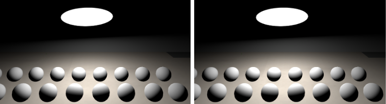{#fig:45}

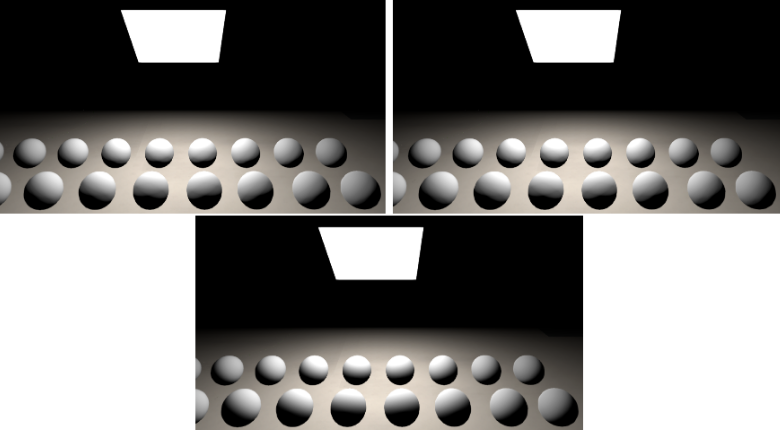{#fig:46}

BRDFローブの支配的な方向を計算に入れることでこの近似を改善することが可能である。この支配的な方向の処理は[@sec:4.9.3]にてその詳細を述べる。我々は表面の法線のシフトによりこれを取り戻す([@lst:15]参照)。しかし、その差異はとても微妙であるので、シェーダコストを減らすためにこのシフトを適用しないことにした。

~~~ {.c .numberLines id="lst:15"}
float3 getDiffuseDominantDir(float3 N, float NdotV, float roughness) {
    float a = 1.02341f * roughness - 1.51174f;
    float b = -0.511705f * roughness + 0.755868f;
    float lerpFactor = saturate((NdotV * a + b) * roughness);

    return normalize(lerp(N, V, lerpFactor));
~~~
: エリアライトを評価するとき、Disneyのディフューズ項のローブの支配的な方向を計算するための関数。

### スペキュラエリアライト(Specular area lights)

スペキュラエリアライトはリアルタイム制約下では本当に複雑な問題である。BRDFの入力(視線ベクトル、f0、ラフネス)の数と矩形(幅、高さ、向き、定数でない強度)のような標準ライトの形状のひとつはライトプロブと同様に事前計算アプローチを困難にする。文献で使える現在の解決法はGGXスペキュラモデルのリファレンスとの比較に耐えうるものではない。@Drobot2014b のMRPアプローチはPhongモデルに限りうまく行き、@Karis2013 の反射レイからの最短距離はうまいエネルギー保存の項が失われていおり、グレージング角でうまく動作しない。他の数学ヘビーな解決法と同じくエリアライトのためのフィルタされた重点サンプリング[@Colbert2010]に触発された他の解決法を試したが、シェーダコストは法外である。我々はground truthと一致させず、単純に最適なビジュアルを持つより安価な解決法を取ることを決めた。我々のライトはKarisのアプローチを用いているが、ディスクと矩形については、うまい粗いエネルギー保存の項をいずれも見つけられなかった([@fig:47]参照)。

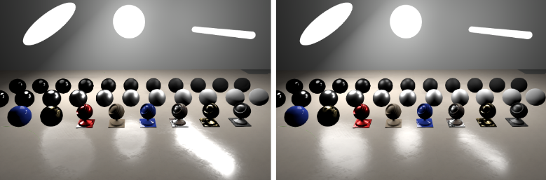{#fig:47}

粗い表面に対するスペキュラエリアライトの積分を多少改善するため、我々はBRDFローブの支配的な方向を計算に入れた。支配的な方向の処理は[@sec:4.9.3]でその詳細を述べている。鏡面方向のシフトによりそれを取り戻す([@lst:16])。エリアライトのバージョンはライトプロブで使われるそれよりも単純である。我々の場合ではそれで十分である事が判明した。[@fig:48]には鏡面と支配的な方向を使った比較を示す。これは相関ありと相関なしの両方のSmishのG項でうまく働く。

~~~ {.c .numberLines id="lst:16"}
float3 getSpecularDominantDirArea(float3 N, float3 R, float NdotV, float roughness) {
    // 単純な線形近似
    float lerpFactor = (1 - roughness);

    return normalize(lerp(N, R, lerpFactor));
}
~~~
: エリアライトを評価するとき、マイクロファセットGGXベースのスペキュラ項に対するローブの支配的な方向を計算する関数。

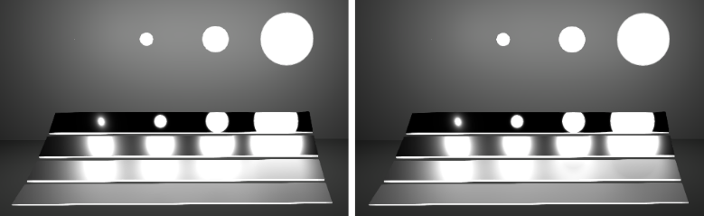{#fig:48}

**備考**: ライトと表面の特性に依存すると、ディフューズエリアリアライトで計算される照度はスペキュラエリアライトには適切でないことがある(Lambertのコサインが常にディフューズとスペキュラの両方の項に適用されるパンクチュアルライトの場合とは異なる)。確かに、ライトの形状とBRDFの重点コーンの交差に対する立体角は異なる可能性があり、Lambertのコサインに関する積分結果が異なるはずである。

## エミッシブな表面(Emissive surfaces) {id="sec:4.8"}

現実世界では、エミッシブな表面はエリアライトと同等である。これらは光源のように近くの表面を照らす光を放射する。ゲームでは、パフォーマンス制約により伝統的なライトとして表面のエミッシブな部分を扱うことはできない。Frostbite内では、1)元となる表面に表示されるエミッシブライト、2)光を放つエリアライト、の2つの区別を設けた。エミッシブライトは他のライトと同様にエミッシブ色とエミッシブ強度値を与えることによりシェーダ内でピクセル精度で生成される。強度は輝度($\frac{cd}{m^2}$)かEV値で渡される。これらのエミッシブライトはライティングを生み出さず、見えている色のみを生み出す。しかし、その強度がカメラセンサーを飽和させたとき、これらはブルームを生み出す([@sec:5.1]参照)。我々は3つのエミッシブな表面のケースを大まかに示すことができる([@fig:49]を参照)。

- A. エミッシブマテリアルが非エミッシブマテリアルの下にある。
- B. エミッシブマテリアルが非エミッシブマテリアルの上にある。
- C. マテリアル全体がエミッシブである。

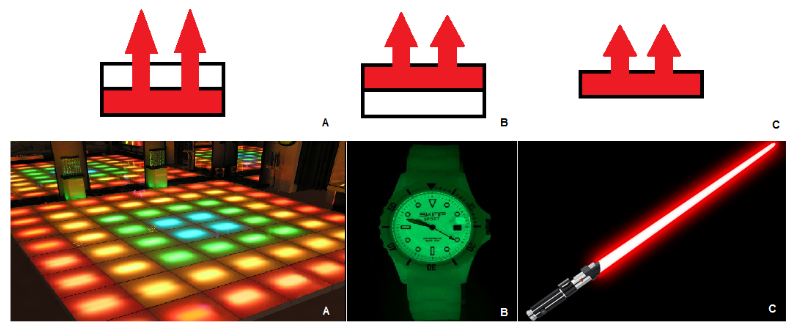{#fig:49}

ケースBとCは、Bでエミッシブ層の下のマテリアルが覗けること以外、非常に近い。Frostbiteでは、暗黙的にケースCをサポートするケースBのみを扱う。エミッシブな表面を効率的にレンダリングするのは簡単ではない。ディファードなやり方でエミッシブな不透明オブジェクトを適切にレンダリングして、(Gバッファ生成パスの後にレンダリングされる)ディファードデカールとの互換性を保つためには、エミッシブ情報をGバッファに格納する必要がある。これはコストの高い追加のバッファを必要とする。Frostbiteでは様々なパスを持つ。

|||
|-|-|
|透明オブジェクト|エミッシブは表面のレンダリング中に適用される|
|フォワード不透明オブジェクト|エミッシブは表面のレンダリング中に適用される|
|完全なエミッシブを持つディファード不透明オブジェクト|エミッシブは表面の追加のレンダリングパスで適用される、つまり、表面は2回レンダリングされる|
|安価なエミッシブを持つディファード不透明オブジェクト|エミッシブはラジオシティバッファに格納され、間接ライティングとして同時に適用される|

間接ディフューズライティングはGバッファ生成時のディフューズアルベドで構成されていないが、これは後にディフューズアルベドを調整することをデカールで可能にするためである。アーティストがパフォーマンスを正確性とトレードしたいときに備えて、エミッシブ値をラジオシティバッファに格納できるようにしてある。このアプローチで問題になるのはエミッシブ色がディフューズアルベドと結合してしまうことである。ラジオシティバッファが適用されるとき、ディフューズアルベドをラジオシティバッファに乗算する。エミッシブでも同様である。ディフューズアルベドを調整するデカールはこの場合エミッシブも調整する。これが"安価"なエミッシブと呼ぶ所以である([@lst:17])。もうひとつの制約はこのテクニックがディフューズを持たないような金属質のオブジェクトで動作しないことである。

~~~ {.c .numberLines id="lst:17"}
// Gバッファ生成中に
float3 radiosity = ...;
// エミッシブをラジオシティにパックする(同じ単位(輝度)で)
radiosity += emissive * emissiveIntensity;
gBufferRadiosity = packLightingRGBA(gbufferRadiosity);

// ラジオシティアプリケーション中に
float3 unpackedRadiosity = unpackLightingRGBA(gbufferRadiosity);
indirectDiffuse = unpackedRadiosity * data.diffuseAlbedo;
~~~
: ディファードのケースで管理される安価なエミッシブ。

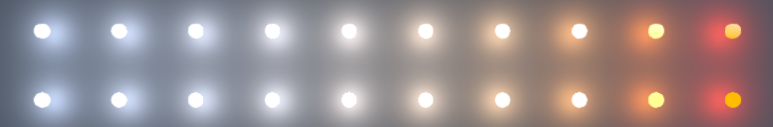{#fig:50}

**備考**: エリアライトの場所に正確な強度を持つエミッシブ球を自動的に生成するツールを開発した。例を[@fig:51]に示す。これは実際に説得力のあるビジュアルシーンを生み出し、アーティストがこれらのライトをデバッグするのに役立つ。

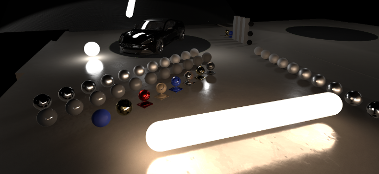{#fig:51}

## 画像ベースライト(Image based lights) {id="sec:4.9"}

画像ベースライト(IBL)は点を取り囲む入射するライティングを表すことができる。この取り囲むライティングはオブジェクトをその環境に"フィット"させるために重要である。アーティストから"反射"と呼ばれることが時折あるため、この入射ライティングはBRDFの式$f$、つまり、標準マテリアルに対するスペキュラ$f_r$の部分だけでなく$f_d$の部分も含めて、すべての部分に矛盾なく適用される必要がある。レイヤードマテリアルのようなさらに進化したマテリアルでは、すべてのレイヤがこのライティングによって影響を受ける必要がある。シェーダで反射テクスチャを直接追加することでこのライティングを"見せかけること(faking)"はライティングとマテリアルの情報の間の*鍵分離(key separation)* を破壊してしまい、異なる環境でアセットの再利用を難しくしている。IBLの$L$とBRDFの$f$との間の相互作用の計算は以下の積分を評価する必要があるコストの高い処理である。

$$
L(\boldsymbol{v}) = \int_{\Omega} f(\boldsymbol{l}, \boldsymbol{v}, \Theta) L(\boldsymbol{l}) d\boldsymbol{l}
$$ {#eq:46}

視線方向$\boldsymbol{v}$、マテリアルモデル$f$、パラメータ$\Theta$(Fresnel、ラフネス、アルベドなど)を持つ。連続的にオブジェクトを環境に合わせ、未だに良い反射の近似を提供するため、すべての状況で反射を提供できるようにする必要がある。このため、@Drobot2013 に触発された4つのタイプのIBLに頼る。こららのタイプのそれぞれは入射ライティングの特定のタイプか範囲を表現することを可能にする。

- **ディスタントライトプロブ**: 取り囲む遠く離れたライティングをキャプチャする。これはいかなる視差(parallax)を含まない(空、遠方の建物、背景の水滴など)。これは最も正確でない反射タイプであるが、いつでも利用できる。
- **ローカルライトプロブ**: ビューの単一の点からあるエリアに含まれるすべてのオブジェクトをキャプチャする(キューブマップ)。これらのキャプチャは、取り囲むジオメトリを一致させるためにアーティストにより慎重に調整された、単純なプロキシジオメトリに再投影される(例えば、球か箱)。この反射タイプはディスタントライトプロブより正確であるが、オブジェクトライティングと視差は完璧にキャプチャされない。
- **スクリーンスペース反射**: 深度バッファに対するレイマーチングによりライトバッファに基づく反射をキャプチャする。これは小から中の範囲の反射を捕らえ、良好なcontact hardening[^contact_hardening]反射を保証する。これは最も正確な反射源のひとつである。
- **平面反射(Planar Reflections)**: エンジンによる自動かアーティストによる手動いずれかでセットアップされた平面に反射したシーンをレンダリングすることで反射をキャプチャする。この反射タイプは反射が道路、建物、水面といったほぼ平坦な表面でうまく働く平面に横たわると仮定する。

[^contact_hardening]: 投影先への距離が近いほど像が正確になるような特徴。

**静的vs動的**: ディスタントライトプロブとローカルライトプロブは、ある瞬間における周辺のライティングをキャプチャした、通常"静的"なライティング情報を含む。これらのコンテンツは、要件や割り当てられたパフォーマンス予算に従い、要求に応じて又は毎フレームにリフレッシュさせることができる。SSRや平面反射は、それらの視点に依存するという特徴により毎フレーム更新されるため、"動的"なライティング情報を含む。これらの計算はそのコストを減らすためにいくつかのフレームに分散させることもできる。

簡単にSSRや平面反射を述べるが、この節は主にローカルライトプロブとディスタントライトプロブに焦点を当てる。まず、ライトプロブの取得とそのライティング単位を説明する。そして、それらのフィルタリング、評価、さまざまなIBLの合成を説明する。

### ライトプロブの取得と単位(Light probes acquisition and unit) {id="sec:4.9.1"}

Frostbiteでは、IBLは画像データに関連する定義によるものである。それらすべては、ライティングパイプラインの出力であるので、輝度単位を使う。

#### ディスタントライトプロブ(Distant light probe)

ディスタントライトプロブはキューブマップとして表される周囲の環境をキャプチャする。アーティストにはディスタントライトプロブを取得するための2つの方法がある。

- 任意に背景に合成される物理ベーススカイを通してライティングを取得する。
- 現実世界のカメラから取得したハイダイナミックレンジ画像(HDRI)を使う。

Frostbiteはディスタントライトプロブをキャプチャするために使われることがある物理ベーススカイを使う。ディスタントライトプロブは状況の変化(時刻サイクル、天候の変化など)に対処するときに必要に応じてリフレッシュさせることができる。スカイライティングはその他のライトのように輝度に変換される。キャプチャする時は、ライティングパイプラインのみを考慮する。我々はいかなる色管理処理(トーンマッピング、カラーグレーディング…)を含むポストプロセスを取り除き、HDRテクスチャフォーマットRGBA16Fに結果の輝度を格納する。

現実世界のディスタントライトプロブをうまく使うには何が取得されていたかを理解する必要がある。取得したHDR画像は静的な特徴によりインゲームで最終的なライティングにまれに使われる。これらはむしろ、アセットを設計したり、マテリアル特性が自然なライティングで正しく反応することを検証したりするために、入射ライティングとして使われる。しかし、取得したHDRIをインゲームライティングと混ぜ合わせる必要があるとき、注意して行う必要がある。HDRIのテクセルに格納してあるものが明確ではない。カメラが輝度値を出力すると考えられるかもしれないが、カメラの応答とポストプロセスステップは最高と最低の輝度値をカットする。出力されたピクセルはもはや輝度値を表さしておらず、むしろそれはもとのシーン輝度に関係するデバイス依存の値である。輝度からピクセル値への変換を詳しく述べる実際のプロセスは[@sec:5.1]にその詳細を述べる。

**HDRI生成**: LDRカメラでは、続くキャプチャの複雑なプロセスと再構築が **絶対輝度範囲(absolute luminance range)**[@Debevec1997]でHDR画像を得ることを可能にする。このプロセスは、複数の露出でシーン受け取り、(輝度HDR[@Anastasia]のような)ソフトウェアで後にそれらを組み合わせるということを暗に示す。ソフトウェアはデバイス依存の応答曲線によりもとのシーン輝度を再構成する。良い画像[^footnote36]を取得することと、カメラ応答曲線を識別できることという二重の困難は、アーティストによって生み出されたほとんどのHDR画像が **相対的輝度** か露出前の輝度を表現するだけになっている、ということを暗に示している([@fig:52]参照)。他のライトタイプとそのようなディスタントライトプロブを混ぜ合わせるために、我々は相対的輝度値を調整するためのマルチプライヤをアーティストに提供する。Mac-Bethチャート、カメラ設定、よく知られた輝度値に基づく手動のキャリブレーションにより、アーティストは絶対輝度を取り戻すために良いファクタを見つけることができる[^footnote37]。正しく再構築された画像では、晴れた空は約$8000[\frac{cd}{m^2}]$の輝度を持ち、曇り空では約$2000[\frac{cd}{m^2}]$の輝度を持つ。夜のシーンでは、$3000[\frac{cd}{m^2}]$から$5000[\frac{cd}{m^2}]$の値はストリートのライト照明では珍しくない。月の輝度は約$2500[\frac{cd}{m^2}]$で、他のオブジェクトは、環境光でのみ照らされるときは、$1[\frac{cd}{m^2}]$以下になるためかなり暗くなる[@McNeel2015]。

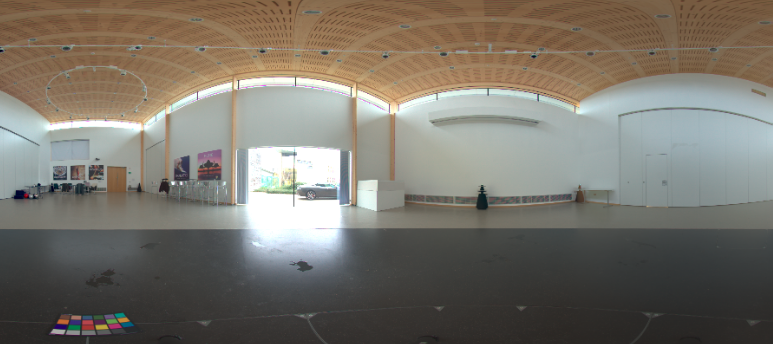{#fig:52}

[^footnote36]: 脚注36: 自然な密度フィルタを使うと、特に太陽をキャプチャしようとする[@Reinhard2005]ときに、適切な輝度を再構築するのに役立つ。

[^footnote37]: 脚注37: MaxwellやVRayはHDRIを輝度単位ではなく放射輝度単位として考えていることを確認した。我々の結果と合わせるためにこのソフトウェアのHDRIを683で除算する必要がある。CañadaはMaxwellにおいて、これが下手に取得された古いHDRIに関する歴史的な理由によるものであることを確認していた。

**強い光源**: 取得したHDRIでは、事前のインテグレーション間のノイズを避け(次節を参照)、それらの可視性を扱うためにライトプロブから強い光源を取り除くことが必要である。例えば、ライトプロブにベイクする代わりに太陽をディレクショナルライトとすると、適切に太陽のシャドウイングを扱うことができる。HDRIから太陽を取り除くことは太陽に周囲の空の小さな部分を単純にコピペする必要がある。

#### ローカルライトプロブ(Local light probes) {id="sec:4.9.1.2"}

ローカルライトプロブはそれらのボリュームの周りの限られたエリアにある周囲のオブジェクトをキャプチャする。その目標はローカルな環境を一致させることである。この取得は常にエンジン内で処理され、オフラインで"ベイク"又は一度だけキャプチャされる、要求に応じてリフレッシュされる、実行時に毎フレームリフレッシュさせる、のいずれかを行うことができる。その選択は予算や必要条件(動くオブジェクト、ライティング状況の変化、など)に依存する。ローカルライトプロブをキャプチャすると、レンダリングの問題が生じる。

- **順序依存性(Order-dependency)**: ローカルライトプロブをキャプチャし終わるまで、シーンはローカルライトプロブで照らすことができない。この鶏と卵[^chicken_and_egg]の問題は、ローカルライトプロブがあるものの後に別のものをキャプチャする場合にキャプチャの順序依存性を生じさせる。
- **メタリックな表面**: メタリックな表面はキャプチャ時にディフューズの寄与もスペキュラの寄与も持たないために問題となり、結果として真っ黒な見た目になる。光のバウンスをシミュレートするために何回かローカルライトプロブをキャプチャすることが可能になる。もうひとつの可能性として、ディスタントライトプロブのライティングに頼ることが挙げられるが、屋内の環境で明らかなライトリークが現れる可能性がある。
- **ビュー依存の効果**: ローカルライトプロブ単一の点(つまり、キューブマップの中心)でキャプチャされる。そして、光沢のある鏡のような表面から入射するこのライティングは、ビュー依存性のために、キャプチャされた点以外の視点では誤りである。

[^chicken_and_egg]: 生命の起源として鶏と卵のどちらが先に現れたのか、という循環する因果関係のジレンマ。

これらの問題を解決するため、我々はライトプロブの取得中にマテリアルのスペキュラ要素を無効化する。スペキュラ項のみを含むメタリックな表面はディフューズアルベドとしてFresnel$f_0$を用いることでディフューズ表面として近似される。キャプチャ中に、アルファチャンネルに周囲のオブジェクトの可視性も格納する。これはローカルライトプロブの寄与をフェードするためにIBL合成の間で後に使われる。[@fig:53]はキャプチャされたローカルライトプロブの例を示す。

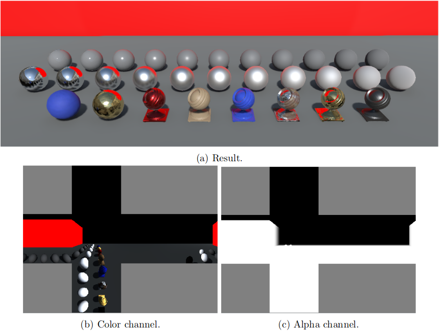{#fig:53}

**関与媒質**: 例えば霧がかった環境では、ローカルライトプロブの寄与を評価するときに、理想としては媒質の透過率を計算に入れるべきである。フォグをローカルライトプロブに直接的に取得するのは、それが3D($\theta$、$\phi$、深度)ではなく2D($\theta$、$\phi$)の関数をモデル化するので、正しく動作しない。なので、この単純な2D関数では、陰影付けされる点とローカルライトプロブのプロキシジオメトリとの間の実際の透過率を計算することはできない。

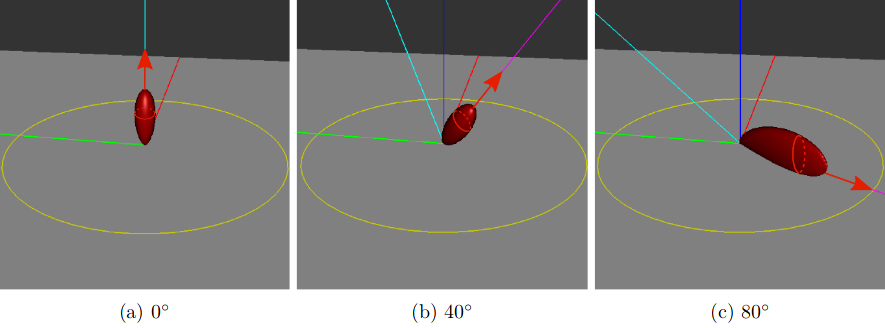{#fig:54}

### ライトプロブのフィルタリング(Light probe filtering) {id="sec:4.9.2"}

[@eq:46]の積分は視線方向$\boldsymbol{v}$、マテリアルモデル$f$、そのパラメータ$\Theta$に依存する。通常はそのような積分は解析解を持たず、一般的にはMonte-Carloのような確率的な積分のテクニックによる、数値的な評価を必要とする。そのような積分を直接評価するには毎フレームに各ピクセルごとに大量のサンプルを必要になると思われる。これは可能であるが、ゲームのようなハイパフォーマンスアプリケーションの文脈では現実的ではない。重点サンプリングはサンプル数を減らすことができるが、複数重点サンプリング(multiple-importance sampling; MIS)でさえ各フレームで各ピクセルを評価するために必要とするサンプル数は多すぎる。

**スペキュラの事前統合**: この評価を単純化するため、いくつかの近似を作ることで積分を事前統合することができる。すべての$\boldsymbol{v}$と$\Theta$に対してこの式を事前に統合することは巨大なメモリフットプリントを必要とするだろう。そのため、初めの近似はビュー依存を取り除くことである。これはBRDFの粗い近似を引き起こすが、マイクロファセットフレームワーク及び/又は半角パラメータ化に基づくBRDFの形状は[@fig:54]に示されるように見る角度に強く依存するため、許容できるトレードオフである。法線入射方向では、BRDF形状は等方的である。グレージング角では、BRDF形状は異方的である。[@eq:46]を事前統合することでビュー依存を取り除くことはBRDF形状がすべての角度から見て等方的であるという仮定を行う。これは、引き伸ばされた反射(stretched refrections)を妨げるような、重要な(key)ビジュアルの差異を引き起こす。この近似は[@fig:55]に示されるように平坦な表面でかなり目立つ可能性があるが、曲がった表面では多少目立ちにくくなる[^footnote38]。

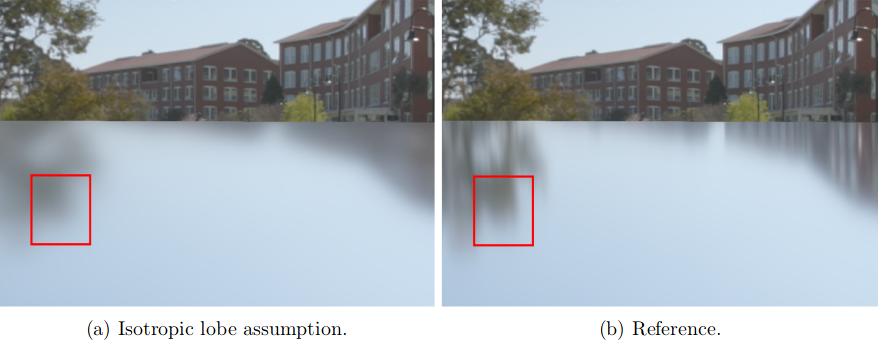{#fig:55}

[^footnote38]: 脚注38:積分を正しく評価し、引き伸ばされた反射を復元するために事前にフィルタした重点サンプリング[@Krivanek2008]を使うか、事前統合と @Green2007 に示されるような等方的なローブの分解を使うかのいずれかが可能である。

事前統合の次元性をさらに減らすため、ラフネス$\alpha$と0°の入射角でのFresnel値$f_0$による$\Theta = (f_0, \alpha)$へパラメータ数を減らす必要がある。先に述べたように、[@eq:46]は数値積分する必要がある。"事前にベイク"されたローカルライトプロブにおいて、この積分は、すべての計算がオフラインで行われるため、あらゆるパフォーマンスに関する懸念を持たずに行うことができる。しかし、オンデマンドなライトプロブ、連続的にリフレッシュされるローカルライトプロブ、アーティストによる高速な操作(ローカルライトプロブの配置、ディスタントライトプロブの回転)では、パフォーマンスが重要(critical)であり、良好な質/速度の比率を達成する必要がある。重点サンプリング[^footnote39]は被積分関数の重要な部分での計算に注力することで集束を早めるために使うことができる。

[^footnote39]: 脚注39:我々は事前統合でMISを使おうとしたが、確率テーブルの構築コストと各サンプルごとのバイナリサーチコストは収束の利得と比べて大きすぎた。

$$
L(v) = \frac{1}{N} \sum_i^N \frac{f_r(\boldsymbol{l}_i, \boldsymbol{v}, \Theta) L(\boldsymbol{l}_i)}{p_r(\boldsymbol{l}_i, \boldsymbol{v}, \Theta)} \langle \boldsymbol{n} \cdot \boldsymbol{l}_i \rangle
$$ {#eq:47}

$p_r$はBRDFのPDFを表す。$\boldsymbol{l}_i$は$p_r$から生成されたサンプルである。@Karis2013 はマイクロファセットBRDFの場合には、[@eq:47]の積分はLDとDFGの2つの項の積に分けることで近似することができることを示した。$p_r = D(\boldsymbol{h}, \alpha) \langle \boldsymbol{n} \cdot \boldsymbol{h} \rangle J(\boldsymbol{h})$とハーフベクトルからライティングベクトルへの変換のヤコビアン$J(\boldsymbol{h}) = \frac{1}{4 \langle \boldsymbol{v} \cdot \boldsymbol{h} \rangle}$により、以下を得る。

$$
L(v) = \frac{1}{N} \sum_i^N \frac{f_r(\boldsymbol{l}, \boldsymbol{v}, \Theta) L(\boldsymbol{l}_i)}{p_r(\boldsymbol{l}, \boldsymbol{v}, \Theta)} \langle \boldsymbol{n} \cdot \boldsymbol{l} \rangle
$$ {#eq:48}

$$
= \frac{1}{N} \sum_i^N \frac{D(\boldsymbol{h}, \alpha) F(\boldsymbol{v}, \boldsymbol{h}, f_0, f_{90}) G(\boldsymbol{l}, \boldsymbol{v}, \boldsymbol{h}, \alpha)}{4 \langle \boldsymbol{n} \cdot \boldsymbol{l} \rangle \langle \boldsymbol{n} \cdot \boldsymbol{v} \rangle} \frac{1}{p_r(\boldsymbol{l}, \boldsymbol{v}, \Theta)} L(\boldsymbol{l}) \langle \boldsymbol{n} \cdot \boldsymbol{l} \rangle
$$ {#eq:49}

$$
= \frac{1}{N} \sum_i^N \frac{D(\boldsymbol{h}, \alpha) F(\boldsymbol{v}, \boldsymbol{h}, f_0, f_{90}) G(\boldsymbol{l}, \boldsymbol{v}, \boldsymbol{h}, \alpha)}{4 \langle \boldsymbol{n} \cdot \boldsymbol{v} \rangle} \frac{1}{p_r(\boldsymbol{l}, \boldsymbol{v}, \Theta)} L(\boldsymbol{l})
$$ {#eq:50}

$$
= \frac{1}{N} \sum_i^N \frac{D(\boldsymbol{h}, \alpha) F(\boldsymbol{v}, \boldsymbol{h}, f_0, f_{90}) G(\boldsymbol{l}, \boldsymbol{v}, \boldsymbol{h}, \alpha)}{4 \langle \boldsymbol{n} \cdot \boldsymbol{v} \rangle} \frac{4 \langle \boldsymbol{v} \cdot \boldsymbol{h} \rangle}{D(\boldsymbol{h}, \alpha) \langle \boldsymbol{n} \cdot \boldsymbol{h} \rangle} L(\boldsymbol{l})
$$ {#eq:51}

$$
= \frac{1}{N} \sum_i^N \frac{F(\boldsymbol{v}, \boldsymbol{h}, f_0, f_{90}) G(\boldsymbol{l}, \boldsymbol{v}, \boldsymbol{h}, \alpha)}{\langle \boldsymbol{n} \cdot \boldsymbol{v} \rangle \langle \boldsymbol{n} \cdot \boldsymbol{h} \rangle} \langle \boldsymbol{v} \cdot \boldsymbol{h} \rangle L(\boldsymbol{l})
$$ {#eq:52}

$$
\approx \frac{1}{N} \sum_i^N \frac{F(\boldsymbol{v}, \boldsymbol{h}, f_0, f_{90}) G(\boldsymbol{l}, \boldsymbol{v}, \boldsymbol{h}, \alpha)}{\langle \boldsymbol{n} \cdot \boldsymbol{v} \rangle \langle \boldsymbol{n} \cdot \boldsymbol{h} \rangle} \langle \boldsymbol{v} \cdot \boldsymbol{h} \rangle \frac{1}{\sum_i^N \langle \boldsymbol{n} \cdot \boldsymbol{l} \rangle} \sum_i^N L(\boldsymbol{l}) \langle \boldsymbol{n} \cdot \boldsymbol{l} \rangle
$$ {#eq:53}

この分離はDFGとLDの2つの独立した項を導く。これらは個別に事前計算することができる。LD項は各ライトプロブごとに計算する必要があるが、DFGは一度だけ計算してすべてのライトプロブで再利用できる。[@lst:18]はDFG項を示す。ここでは、異なる重み付け$\frac{1}{\sum_i^N \langle \boldsymbol{n} \cdot \boldsymbol{l} \rangle}$と同様にLD項の追加の$\langle \boldsymbol{n} \cdot \boldsymbol{l} \rangle$に注意したい。これらの経験的な項は、この積分の分割可能性の粗い仮定に悩まされている再構築されたライティング積分を改善できるようにKarisにより導入された。これらの項には数学的な導出が存在せず、定数$L(\boldsymbol{l})$に完全一致することが目標であった[^footnote40]。[@Karis2013]で示されるように、Fresnel項のSchlickの式を用いることで、

[^footnote40]: 脚注40:我々は分離を若干の改良を加えて数学的に定義してみた。しかし、理論がよくなったとしても、ビジュアル結果はKarisの分離で得たものより常に悪くなった。

$$
F(\boldsymbol{v}, \boldsymbol{h}, f_0, f_{90}) = f_0 + (f_{90} - f_0)(1 - \langle \boldsymbol{v} \cdot \boldsymbol{h})^5
$$ {#eq:54}

DFG項は見る角度$v$とラフネス$\alpha$にのみ依存する2D関数で表す事ができる。$f_0$と$f_{90}$は事前計算の外に出す。この2D関数は$DFG_1$と$DFG_2$の2つの項を格納する。

$$
DFG(\boldsymbol{v}, \boldsymbol{l}, f_0, f_{90}, \alpha) = \frac{1}{N} \sum_i^N \frac{(f_0 + (f_{90} - f_0)(1 - \langle \boldsymbol{v} \cdot \boldsymbol{h} \rangle)^5) G(\boldsymbol{l}, \boldsymbol{v}, \boldsymbol{h}, \alpha)}{\langle \boldsymbol{n} \cdot \boldsymbol{v} \rangle \langle \boldsymbol{n} \cdot \boldsymbol{h} \rangle} \langle \boldsymbol{v} \cdot \boldsymbol{h} \rangle
$$ {#eq:55}

$$
= \frac{1}{N} \sum_i^N (f_0 + (f_{90} - f_0) F_C) G_{\text{Vis}} \text{ with } G_{\text{Vis}} = \frac{G(\boldsymbol{l}, \boldsymbol{v}, \boldsymbol{h}, \alpha)}{\langle \boldsymbol{n} \cdot \boldsymbol{v} \rangle \langle \boldsymbol{n} \cdot \boldsymbol{h} \rangle} \langle \boldsymbol{v} \cdot \boldsymbol{h} \rangle, F_C = (1 - \langle \boldsymbol{v} \cdot \boldsymbol{h} \rangle)^5
$$ {#eq:56}

$$
\frac{1}{N} \sum_i^N f_0 G_{\text{Vis}} + f_{90} F_C G_{\text{Vis}} - f_0 F_C G_{\text{Vis}}
$$ {#eq:57}

$$
f_0 \frac{1}{N} \sum_i^N (1 - F_C) G_{\text{Vis}} + \frac{1}{N} \sum_i^N f_{90} F_C G_{\text{Vis}}
$$ {#eq:58}

~~~ {.c .numberLines id="lst:18"}
void importanceSampleCosDir(in float2 u, in float3 N, out float3 L, out float NdotL, out float pdf) {
    // ローカルなreferencial
    float3 upVector = abs(N.z) < 0.999 ? float3(0, 0, 1) : float3 (1, 0, 0);
    float3 tangentX = normalize(cross(upVector, N));
    float3 tangentY = cross(N, tangentX);

    float u1 = u.x;
    float u2 = u.y;

    float r = sqrt(u1);
    float phi = u2 * FB_PI * 2;

    L = float3(r * cos(phi), r * sin(phi), sqrt(max (0.0f, 1.0f - u1)));
    L = normalize(tangentX * L.y + tangentY * L.x + N * L.z);

    NdotL = dot(L, N);
    pdf = NdotL * FB_INV_PI;
}

float4 integrateDFGOnly(in float3 V, in float3 N, in float roughness) {
    float NdotV = saturate(dot(N, V));
    float4 acc = 0;
    float accWeight = 0;

    // 事前統合を計算する
    Referential referential = createReferential(N);
    for (uint i = 0; i < sampleCount; ++i) {
        float2 u = getSample(i, sampleCount);
        float3 L = 0;
        float NdotH = 0;
        float LdotH = 0;
        float G = 0;

        // 実装は[@Karis2013]を参照
        importanceSampleGGX_G(u, V, N, referential, roughness, NdotH, LdotH, L, G);

        // スペキュラGGXのDFG事前統合
        float NdotL = saturate(dot(N, L));
        if (NdotL > 0 && G > 0.0) {
            float GVis = G * LdotH / (NdotH * NdotV);
            float Fc = pow(1 - LdotH , 5.f);
            acc.x += (1-Fc) * GVis;
            acc.y += Fc * GVis;
        }

        // ディフューズDisneyの事前統合
        u = frac(u + 0.5);
        float pdf;
        // pdfは他の項で打ち消されるため使われない
        // (ディフューズBRDFから1/PIとLambertの法則からNdotL)
        importanceSampleCosDir(u, N, L, NdotL, pdf);
        if (NdotL > 0) {
            float LdotH = saturate(dot(L, normalize(V + L));
            float NdotV = saturate(dot(N, V));
            acc.z += Fr_DisneyDiffuse(NdotV, NdotL, LdotH, sqrt(roughness));
        }

        accWeight += 1.0;
    }

    return acc * (1.0f / accWeight);
}
~~~
: スペキュラGGXとディフューズDisneyBRDFの両方についての事前統合されたDFG関数。

LD項は時刻変化のように入射ライティングが変化するたびに再計算される必要がある。これはLDが実行時に計算される必要があり、つまり、高速でロバストである必要があることを意味している。重点サンプリングを使うと収束が改善されるが、かなりのサンプルが必要になる。@Krivanek2008 によって導入された事前にフィルタした重点サンプリングは低確率のサンプルのための事前にフィルタされた値に頼ることでサンプル数を削減できる。これは収束を著しく改善する(小さなバイアスを導入するコストについては[@fig:56]を参照)[^footnote41]。[@lst:19]はLD項を示す。ハイコントラストな環境において、特に中または高ラフネス$\alpha$の値で、依然としてノイズが観測される可能性がある。これは、ハイコントラストなライトプロブ(本当に高い強度を持ついくつかのピクセル)を伴う(特にGGXのようなロングテールのNDFで)半球球上のBRDFローブの幅広いサポートに主に起因する。このノイズを取り除くには、サンプル数を増やすか、ピクセルごとにサンプルパターンを回転/ジッタリングしない相関のあるバイアスとこのノイズをトレードするかのいずれかを行う。これはゴーストのアーティファクトを引き起こすが、通常はノイズより目立たない。

[^footnote41]: 脚注41:Frostbiteでは、インテグレーションに32個のサンプルを使う。

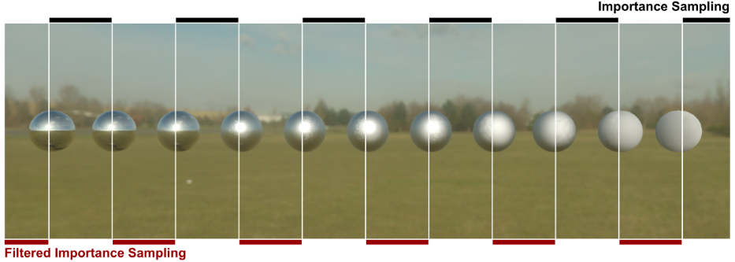{#fig:56}

~~~ {.c .numberLines id="lst:19"}
float3 integrateCubeLDOnly(in float3 V, in float3 N, in float roughness) {
    float3 accBrdf = 0;
    float accBrdfWeight = 0;
    for (uint i = 0; i < sampleCount; ++i) {
        float2 eta = getSample(i, sampleCount);
        float3 L;
        float3 H;
        importanceSampleGGXDir(eta, V, N, roughness, H, L);
        float NdotL = dot(N, L);
        if (NdotL > 0) {
            // 事前フィルタされた重点サンプリングを使う(つまり、分散を減らすために低確率のサンプルをフェッチするために低いMIPMAPレベルを使う)。
            // (参照: GPU Gem 3)
            //
            // 法線方向で結果を事前統合するため、N == Vであり、NdotH == LdotHである。これがBRDFのpdfを単純化できる理由である。
            // pdf = D_GGX_Divide_Pi(NdotH, roughness) * NdotH / (4 * LdotH);
            //     = D_GGX_Divide_Pi(NdotH, roughness) / 4;
            //
            // MIPMAPレベルはキューブマップフィルタリングの問題を避けるために8x8より低い某かへクランプされる。
            //
            //   - OmegaS: サンプルに関する立体角。
            //   - OmegaP: キューブマップのピクセルに関する立体角。
            float NdotH = saturate(dot(N, H));
            float LdotH = saturate(dot(L, H));
            float pdf = D_GGX_Divide_Pi(NdotH, roughness) * NdotH / (4 * LdotH);
            float omegaS = 1.0 / (sampleCount * pdf);
            float omegaP = 4.0 * FB_PI / (6.0 * width * width);
            float mipLevel = clamp (0.5 * log2(omegaS / omegaP), 0, mipCount);
            float4 Li = IBLCube.SampleLevel(IBLSampler, L, mipLevel);

            accBrdf += Li.rgb * NdotL;
            accBrdfWeight += NdotL;
        }
    }
    return accBrdf * (1.0f / accBrdfWeight);
}
~~~
: 事前フィルタされた重点サンプリング関数。

**ディフューズ事前統合**: いままでは、スペキュラ$f_r$の部分の入射ライティングの
積分のみを考えてきた。以前に言及したように、すべてのマテリアルの部分が同じ入射ライティングを受け取ることが重要(crucial)である。故にライティングはディフューズ部分$f_d$に対しても統合される必要がある。$f_d$はDisneyのディフューズBRDFを使うために見る角度$\boldsymbol{v}$とラフネス$\alpha$に依存するので、DFGとLDの2つの項に分離することで、スペキュラ部分と同じような事前統合に頼る。LD項では、入射ライティングは$\langle \boldsymbol{n} \cdot \boldsymbol{l} \rangle$で重み付けされた定数のランバートローブと統合される。これは @Ramamoorthi2001 によって示されるような球面調和基底や重点サンプリングで効率的に行うことができる。我々は、(Disneyのローブ分布に従う代わりに)コサイン分布に従うサンプル分布を伴う重点サンプリングを、この低角周波ローブを採用するために、用いる[^footnote42]。

[^footnote42]: 脚注42: @Ashikhmin2000 は我々のものと類似性を持つ彼のディフューズモデルで同じ調査を行っている。$p_r = \frac{\langle \boldsymbol{n} \cdot \boldsymbol{l} \rangle}{\pi}$とすると、

$$
L(v) = \frac{1}{N} \sum_i^N \frac{f_d(\boldsymbol{l}, \boldsymbol{v}, \Theta) L(\boldsymbol{l})}{p_r(\boldsymbol{l}, \boldsymbol{v}, \Theta)} \langle \boldsymbol{n} \cdot \boldsymbol{l} \rangle
$$ {#eq:59}

$$
= \frac{1}{N} \sum_i^N \frac{\pi f_d(\boldsymbol{l}, \boldsymbol{v}, \Theta) L(\boldsymbol{l})}{\langle \boldsymbol{n} \cdot \boldsymbol{l} \rangle} \langle \boldsymbol{n} \cdot \boldsymbol{l} \rangle
$$ {#eq:60}

$$
= \frac{1}{N} \sum_i^N \pi f_d(\boldsymbol{l}, \boldsymbol{v}, \Theta) L(\boldsymbol{l})
$$ {#eq:61}

$$
= \frac{\pi}{N} \sum_i^N f_d(\boldsymbol{l}, \boldsymbol{v}, \Theta) \frac{1}{N} \sum_i^N L(\boldsymbol{l})
$$ {#eq:62}

LD項の計算は[@lst:20]で確認できる。DFG項は様々なビュー角度$\boldsymbol{v}$とラフネス$\alpha$でDisneyのディフューズBRDFを統合することで計算される([@lst:18]参照)。

~~~ {.c .numberLines id="lst:20"}
float4 integrateDiffuseCube(in float3 N) {
    float3 accBrdf = 0;
    for (uint i = 0; i < sampleCount; ++i) {
        float2 eta = getSample(i, sampleCount);
        float3 L;
        float NdotL;
        float pdf;
        // 付録の参考コードを参照のこと。
        importanceSampleCosDir(eta, N, L, NdotL, pdf);
        if (NdotL > 0)
            accBrdf += IBLCube.Sample(incomingLightSampler, L).rgb;
    }
    return float4(accBrdf * (1.0f / sampleCount), 1.0f);
}
~~~
: ディフューズ重点サンプリング関数。

**ストレージ**: これらの事前統合の結果を格納することは文献ではしばしば無視されるが、重要な詳細である。DFG項は128x128の解像度を持つ2Dテクスチャに簡単に格納できる。LD項は16ビット浮動小数点キューブマップのセットに格納できる3D関数である(Frostbiteでは、望ましいクオリティに依存して128x128から512x512までを解像度に使うが、滑らかな/鏡のような表面を良質に表現するとこができる最小限度は256x256であることを発見した)。事前統合されたライティングの周波数は$\alpha$が増加するたびにだんだんと小さくなるので、事前統合された結果をMIPレベルに格納することができる[^footnote43]。このストレージは$\alpha_{\text{lin}}$(知覚的に線形なラフネス)から$mipLevel$への関数マッピングで定義される。[@fig:57; @fig:58]で示されるように、$\alpha_{\text{lin}}$のexponent-2マッピングが良い結果をもたらす。線形マッピングは全体的により良い分布をもたらし、中範囲のラフネスを維持するが、低ラフネスで若干のブラーをもたらす。我々はexponent-2で行くことに決めた。

[^footnote43]: 脚注43:最初のMIPレベルは完璧なスペキュラ反射をサポートするために事前畳み込みをしない。これは同時にいくつかの計算を節約することができる。

$$
mipLevel = \sqrt{\alpha_{\text{lin}}}
$$ {#eq:63}

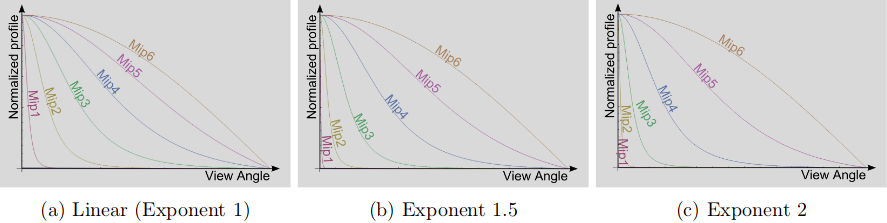{#fig:57}

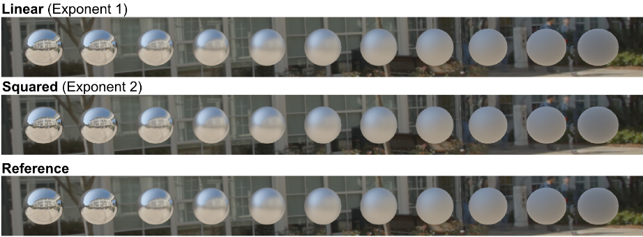{#fig:58}

### ライトプロブの評価(Light probe evaluation) {id="sec:4.9.3"}

ランタイムでは、ローカルとディスタントの両方のライトプロブは環境から来る光を計算に入れるために評価される。ディフューズとスペキュラの両方の事前統合がビューに依存しない方法で行われるが、実際のディフューズ$f_d$とスペキュラ$f_r$項はビュー依存である。これはそれらのローブ方向がビューベクトル$\boldsymbol{v}$に依存していることを意味する。スペキュラの$f_r$項では、事前統合された値をフェッチするためにミラー反射を使う代わりに、我々は主要方向(つまり、[@sec:3.1]に見られる"オフスペキュラピーク")でBRDFを評価する。

このズレをモデル化するため、我々は見る角度とマテリアルのラフネスに依存する最高の偏差値を調査した。完全な解析はこの文書の付属のMathematicaファイルとして利用できる。我々の提案したモデルは見る角度が小さいと誘電体マテリアルでは正しい振る舞いをキャプチャするには不十分である。これは実際のローブがある角度でのみ"出現"するためである。幸いにも、Fresnel値は見る角度によって緩やかに増加するため、この誤差はほとんど目立たず、この近似は十分なままである([@lst:21]参照)。いくつかの実験ののちに、スペキュラローブの支配的な方向のもっと単純な近似がオリジナルのベストフィットする近似よりよい結果をもたらすかについても調査した([@lst:22]参照)。手法の評価と比較の結果は[@fig:59]に示される。我々は相関ありのSmithのG項と相関なしのG項に対して支配的な方向の近似を行った。我々の単純な数式は両方でうまく動作しているように見える。

~~~ {.c .numberLines id="lst:21"}
// これはスペキュラピークの正確なフィッティングであるが、
// 分離処理中の他の近似によりうまく動作しない。
float3 getSpecularDominantDir(float3 N, float3 R, float  NdotV, float  roughness) {
#if GSMITH_CORRELATED
    float lerpFactor = pow(1 - NdotV, 10.8649) * (1 - 0.298475 * log(39.4115 - 39.0029 * roughness)) + 0.298475 * log(39.4115 - 39.0029 * roughness);
#else
    float lerpFactor = 0.298475f * NdotV * log (39.4115f - 39.0029f * roughness) + (0.385503f - 0.385503f * NdotV) * log(13.1567f - 12.2848f * roughness);
#endif

    // 結果はキューブマップでフェッチするので正規化されていない。
    return lerp(N, R, lerpFactor);
}
~~~
: ライトプロブを伴うスペキュラマイクロファセットのGGXベースのスペキュラ項の支配的な方向を計算する関数。

~~~ {.c .numberLines id="lst:22"}
// オフスペキュラピークの近似としてはもっと良い方法があるが、
// 他の近似との兼ね合いでこれがベターであることを発見した。
// Nは法線方向。
// Rは鏡面反射方向。
// この近似はSmithのGが相関をあってもなくてもうまく動作する。
float3 getSpecularDominantDir(float3 N, float3 R, float roughness) {
    float smoothness = saturate(1 - roughness);
    float lerpFactor = smoothness * (sqrt(smoothness) + roughness);
    // 結果はキューブマップでフェッチするので正規化されていない。
    return lerp(N, R, lerpFactor);
}
~~~
: ライトプロブを伴うスペキュラマイクロファセットのGGXベースのスペキュラ項の支配的な方向を計算する単純な関数。

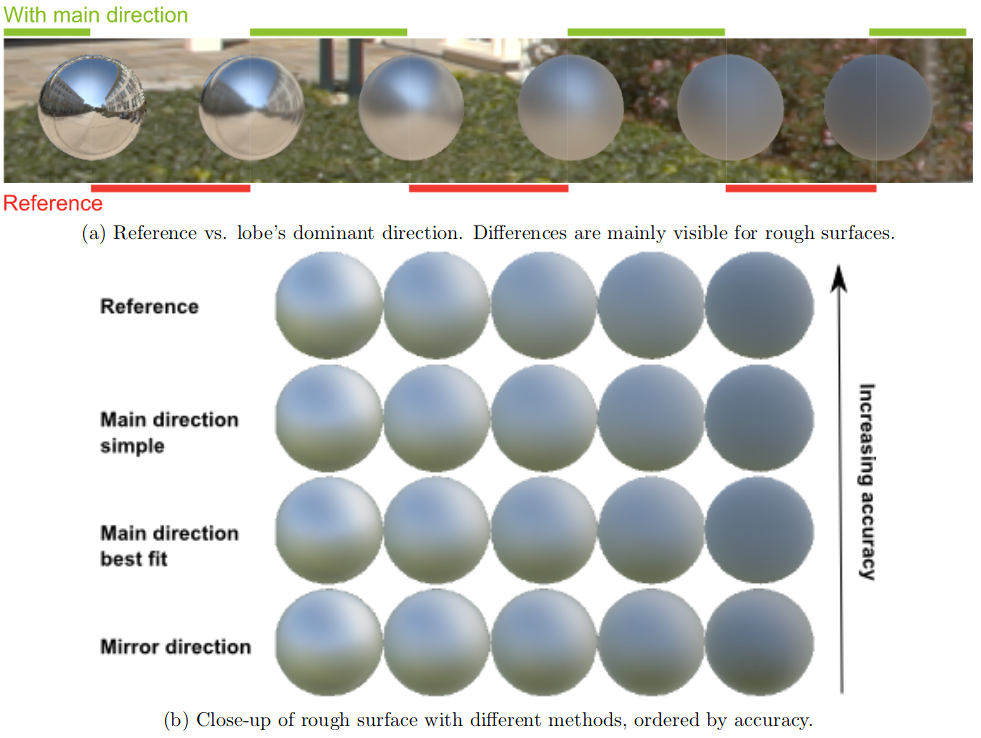{#fig:59}

純粋なランバート表面では、BRDFがビューに依存しないので方向のズレは起こらない。しかし、Disneyの自己反射ディフューズ項では、ローブの支配的な方向はビュー方向に依存する。支配的な方向は非線形なやり方でズレてしまう。スペキュラ項のときと同じ解析を適用すると、単純な線形モデルがこの挙動を比較的正確にキャプチャすることができることが判明した([@lst:23]参照)。Frostbiteでは、間接ディフューズライティングはGバッファ生成中に適用される。なので、支配的な方向を正確に扱うためにこのステップでこれを適用することが必要である。正確な支配的な方向を扱うことで得られる差異は微妙であり、我々はこれを採用しないことを決めた。更に、[@sec:3.3]で示すように、デカールは正しくサポートされない。

~~~ {.c .numberLines id="lst:23"}
// Nは法線方向。
// Vはビュー方向。
// NdotVはビューベクトルと法線とのなす角のコサイン。
float3 getDiffuseDominantDir(float3 N, float3 V, float NdotV , float roughness) {
    float a = 1.02341f * roughness - 1.51174f;
    float b = -0.511705f * roughness + 0.755868f;
    lerpFactor = saturate ((NdotV * a + b) * roughness);
    // 結果はキューブマップでフェッチするので正規化されていない。
    return lerp(N, V, lerpFactor);
}
~~~
: ライトプロブを伴うDisneyの自己反射ディフューズ項の支配的な方向を計算する関数。

スペキュラとディフューズの両方の項におけるディスタントライトプロブでのライティングを評価するためのコードを[@lst:24]に示す。

~~~ {.c .numberLines id="lst:24"}
float3 evaluateIBLDiffuse(...) {
    float3 dominantN = getDiffuseDominantDir(N, V, NdotV, roughness);
    float3 diffuseLighting = diffuseLD.Sample(sampler, dominantN);

    float diffF = DFG.SampleLevel(sampler, float2(NdotV, roughness), 0).z;

    return diffuseLighting * diffF;
}

float3 evaluateIBLSpecular(...) {
    float3  dominantR = getSpecularDominantDir(N, R, NdotV , roughness);

    // 関数を再構築する。
    // L.D.(f0.Gv.(1 - Fc) + Gv.Fc).cosTheta / (4.NdotL.NdotV)
    NdotV = max(NdotV, 0.5f / DFG_TEXTURE_SIZE);
    float mipLevel = linearRoughnessToMipLevel(linearRoughness, mipCount);
    float3 preLD = specularLD.SampleLevel(sampler, dominantR, mipLevel).rgb;

    // 事前統合されたDFGをサンプルする。
    //   Fc = (1 - H.L)^5
    //   PreIntegratedDFG.r = Gv.(1 - Fc)
    //   PreIntegratedDFG.g = Gv.Fc
    float2 preDFG = DFG.SampleLevel(sampler, float2(NdotV, roughness), 0).xy;

    //   LD.(f0.Gv.(1 - Fc) + Gv.Fc.f90)
    return preLD * (f0 * preDFG.x + f90 * preDFG.y);
}
~~~
: スペキュラとディフューズの両部分に対するディスタントライトプロブの評価コード。

**エネルギー保存**: 先に述べたように、ライトプロブは一貫したライティングのためにマテリアルのスペキュラとディフューズの両方の部分で評価される。ある人はこの場合なら、特に両方の積分が半球上で行われる粗い表面の場合には、ライティングを2回適用しようかと考えられるかもしれない。しかし、DisneyディフューズBRDFに対する我々の修正のおかげで、マテリアルモデルのエネルギー保存則が保証されているので、入射エネルギーはエネルギーの追加なしにスペキュラとディフューズの項に正しい割合で影響を与える。

**再投影**: 周辺環境の視差を計算に入れるために、ローカルライトプロブは取得したライティング情報を再投影するためにプロキシジオメトリを使う。Frostbiteでは、球と向きを持つ箱(oriented box)2つの再投影ボリュームタイプをサポートする。これらのボリュームは周囲のジオメトリにできるだけ近くなるよう近似するためにアーティストにより手動で配置されてセットアップされる。実行時に、ローカルライトプロブ内のオブジェクトはサンプリング方向とプロキシジオメトリとの交差を計算し、この交差に基づく補正された方向でローカルライトプロブを評価する[@Lagarde2012]。ライトプロブはボリュームの中心から事前畳み込みされている。アーティファクト(鋭い不連続性)を制限するため、我々はラフネスに基づいて補正された方向をもとの方向へ滑らかに補間する。さらに、キューブマップのキャプチャ中心に移動するためのオフセットベクトルを提供する。これはアーティストに重要な箇所で解像度をあげることができるようになり、ボリュームの中心の望ましくないオブジェクト場所を迂回することができる。

我々のローカルライトプロブはマテリアルのスペキュラ部分でのみ使われる。スペキュラ部分のローカルライトプロブに対するライティングを評価するコードは[@sec:F]に提供される。ディフューズ要素では、ライティング情報はラジオシティシステムに由来する。これは、ライトマップかプロブボリュームを通した入射ライティングを問い合わせることができる。このディフューズライティングは自己反射ローブの支配的な方向で評価される。

**距離ベースラフネス**: BRDFローブはどのように入射ライティングが半球上で積分されるかを説明する。この角度の説明はBRDFフットプリントを距離依存にする。与えられた陰影付けされる点に対して、オブジェクトの反射はこのオブジェクトが陰影付けされる点に近ければシャープになり、離れるごとにぼやけてゆく([@fig:60; @fig:61]参照)。ローカルライトプロブのプロキシジオメトリは陰影付けされる点と入射ライティングの間の距離を計算できるようになる。この情報をもって、我々は環境にキャストされるBRDFフットプリントを粗く近似できる。評価中では、似たようなフットプリントに一致させるためにBRDFラフネスを修正して、この"距離ベースラフネス"を近似する([@lst:25]参照)。

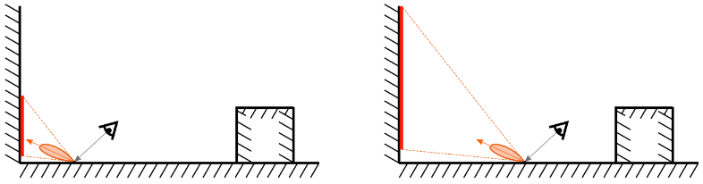{#fig:60}

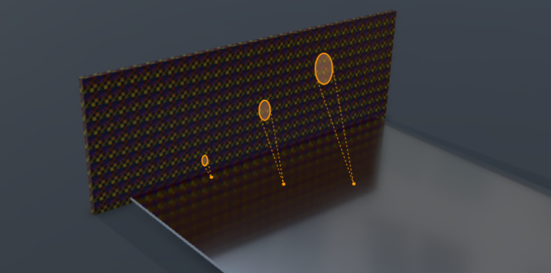{#fig:61}

~~~ {.c .numberLines id="lst:25"}
float computeDistanceBaseRoughness(float distInteresectionToShadedPoint, float distInteresectionToProbeCenter, float linearRoughness) {
    // アーティファクトを回避するため、もとのlinearRoughnessへクランプする。
    // これは、許容可能なバイアスを引き起こし、滑らかな表面において鏡面反射の振る舞いの維持を可能にする。
    float newLinearRoughness = clamp(distInteresectionToShadedPoint / distInteresectionToProbeCenter * linearRoughness, 0, linearRoughness);
    return lerp(newLinearRoughness, linearRoughness, linearRoughness);
}
~~~
: 距離ベースラフネスの計算。

このラフネス補正を計算するため、NDFを境界として支配的なBRDF方向に平行なコーンを計算する。境界コーンの角度$\theta_{\text{lim}}$は$\theta_{\text{lim}} = \text{atan}(\frac{E \alpha^2}{1 - E})$によりラフネス$\alpha$と関係する。ここで、$E$は保存されたエネルギーのパーセンテージであり、$E = 75\%$であれば、コーンは75%のNDFボリュームを含んでいるということになる(詳細なプロットは付属のMathematicaファイルで利用可能)。この半径$R$から、ライトプロブの中心から始まるコーンを計算できる。そこから、対応するラフネスを推論する。この完全な連鎖的な操作は項のほとんどを排除することができ、"距離ベースラフネス"はこの単純な式$\alpha' = \frac{distanceInteresectionToShadedPoint}{distanceInteresectionToProbeCenter} \alpha$によるラフネスと関連させることができる。これは粗い近似であることに注目することが重要である。近似された交差に加えて、スケールされたフットプリントとして事前に畳み込まれた輝度を使ってみる。これは低ラフネス値ではまともに動作するが、高ラフネスでは不正確になる。この問題を回避するため、また、この効果が低ラフネス値でより鮮明になるようにするため、我々はラフネス値に基づいて"距離ベースラフネス"をもとのラフネスと線形に補間する。我々はlinerRoughnessを用いた処理がより良い結果をもたらすことも発見した。

後の[@sec:4.9.5]で説明されるように、SSRパスが与えられたピクセルに対して反射情報を提供できないときにSSRはローカルライトプロブにフォールバックする。異なるライティングインテグレーション(SSRはBRDFを適切に統合して完全な視差の世話をしてくれるが、ローカルライトプロブは単一点から事前統合されて視差は近似される)により、この距離ベースラフネスを計算に入れることはSSRとローカルライトプロブとの間を合わせることができ、結果としてより良い遷移が現れる。

### スクリーンスペースリフレクション(Screen space reflections) {id="sec:4.9.4"}

スクリーンスペースリフレクション(SSR)は近から中範囲の反射をキャプチャすることができ、小さなオブジェクト/ディテールではこれが正確な遮蔽をもたらすために非常に重要である。我々のテクニックはシーンの深度バッファの頂点で構築されるHierarchical-Z構造に頼っている。これは長いレイを素早くトレースして、利用可能なシーン情報をできるだけ多く使うことができる。入射ライティングはマテリアルBRDFに対して統合される。我々のアプローチは @Uludag2014 の"Hi-Z Screen-Space Cone-Traced Reflections"により説明される。

**SSRとエミッシブ**: [@sec:4.8]に見られるように、エリアライトは2つの部分で構成する必要がある。

- 放射(emission)特性を説明したり、BRDFで統合されたりする**解析的ライト**。
- 放射する光(emitting light)の実際の形状を説明する**エミッシブ表面**。

最初の部分は解析的ライティング評価パス中に評価される。純粋に視覚的なことである次の部分はSSRパスかローカルライトプロブパスでキャプチャされることができる。ここではエミッシブ形状のキャプチャは入射ライティングとして取り扱われるため、この場合の光は、解析的評価中に1回、画像ベース評価中に
1回、の2回分寄与することになる。残念ながら、この問題に対処するための簡単な解法は存在しない。

### 画像ベースライト合成(Image based lights composition) {id="sec:4.9.5"}

各IBLタイプは異なる入射ライティングを表し、それら自身の制限を持つ。環境に継続的に合わせるオブジェクトを持つことを可能にするため、これらすべてのIBLを階層的な方法で組み合わせる。

SSRは正しい反射を得る良いテクニックであるが、スクリーンスペース制限によりかなり頻繁に失敗する(現在の錐台に制限された情報、単一の深度レイヤ情報)。様々なヒューリスティクスを用いることで主な失敗ケースを特定することができる(スクリーンボーダー付近、レイの向き、交差タイプ、などなど)。SSRが失敗するとき、ローカルライトプロブ情報にフォールバックする。単一の視点からキャプチャされるが、ライトプロブはSSRパスで欠けている情報を滑らかに埋めるためにそれらのプロキシジオメトリへキャプチャされた情報を再投影することができる。ローカルライトプロブはレベルのすべてでアーティストにより手動で配置される。ローカルライトプロブは小さいボリュームから大きなボリュームまで反射情報が完全に復元されるまで階層的に評価される。そのため、アーティストはこれらをネストして、ある位置で反射を局所的に洗練することができる。反射情報が依然として欠けている場合、ディスタントライトプロブが評価される。

[@fig:62]はこの合成の概要を示し、様々なステップの疑似コードをいかに示す。

~~~
// 短距離反射
SSRを評価する
RGB = SSR.rgb
Alpha = SSR.a

// 中距離反射
While　ローカルライトプロブ And Alpha < 1 do
    ローカルライトプロブを評価する
    a = saturate(localLightProbe.a - Alpha)
    RGB += localLightProbe.rgb * a
    Alpha = saturate(a + Alpha)

// 長距離反射
If Alpha < 1 Then
    ディスタントライトプロブを評価する
    RGB += distantLightProbe.rgb * (1-Alpha)
~~~

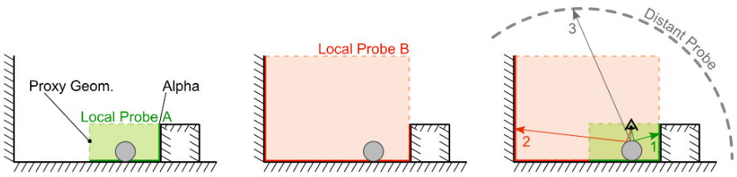{#fig:62}

ローカルライトプロブのアルファチャンネルは与えられたピクセルが近い周囲の環境に属しているかを示している。このタグ付けは空のピクセルをリジェクトし、ディスタントライトプロブをフェッチすることを強制することができる。これには、ディスタントライトプロブは(動く雲[^footnote44]のような)動的な要素を低コストで含むことができる、ディスタントライトプロブは通常ローカルライトプロブより高解像度であり、詳細がより鮮明になる、といったいくつかのアドバンテージがある。この欠点は入射ライティングの統合結果がこの方法で組み合わせたときに完全に正しくならないことである。

[^footnote44]: 脚注44:フローマップのテクニックによるHDRIで動く雲っぽさ(the impression of moving clouds)を与えることができる。[@Guerrette2014a]

だいたい中くらいの範囲の反射は計算を重み付けする。各ローカルライトプロブの重複部分が同じ可視性情報を含み、厳密に同じ方法でBRDFローブを遮蔽すると仮定する。10個の可視性0.1を持つオーバーラップしたローカルライトプロブを追加した場合、0.1を得るようにすべきである。このスキームは、階層のライトプロブの可視性が1にならない場合に、ディスタントライトプロブの寄与を常に持つことを可能にする。このアルゴリズムはローカルライトプロブの順に依存することに注意する。

**平面反射**: 加えて、平面反射情報が利用可能であるとき、フォワードでオブジェクト毎の基準によってか、ディファードでオブジェクトが受け取るタグによってかのいずれかを適用できる。平面反射は通常、単一の深度レイヤ制約や錐台制限の両方を緩和するため、平坦な表面でのSSRの良好な代替となり、さらにロバストにする。

## 影と遮蔽(Shadow and occlusion) {id="sec:4.10"}

### ディフューズ遮蔽(Diffuse occlusion) {id="sec:4.10.1"}

@McGuire2010 はアンビエントオクルージョンを定式化し、物理的基礎を与える。可視性関数は表面から$\boldsymbol{l}$方向に視線を遮るものがない場合$V(\boldsymbol{v}) = 1$、そうでなければ$0$として定義される。レンダリング式のアンビエント項は以下となる。

$$
L(\boldsymbol{v}) = \int_{\Omega} f(\boldsymbol{l}, \boldsymbol{v}) L_a(\boldsymbol{l}) V(\boldsymbol{l}) \langle \boldsymbol{n} \cdot \boldsymbol{l} \rangle d\boldsymbol{l}
$$ {#eq:64}

ここで、$L_a$はアンビエントライティングである。粗く近似するには可視性の項をBRDFと入射ライティングから分割することである。

$$
L(\boldsymbol{v}) = \left[ \pi \int_{\Omega} f(\boldsymbol{l}, \boldsymbol{v}) L_a(\boldsymbol{l}) d\boldsymbol{l} \right] \left[ \frac{1}{\pi} \int_{\Omega} V(\boldsymbol{l}) \langle \boldsymbol{n} \cdot \boldsymbol{l} \rangle d\boldsymbol{l} \right]
$$ {#eq:65}

この分割は$f_r(\boldsymbol{l}, \boldsymbol{v})$と$L_a(\boldsymbol{l})$が定数である場合にのみ正しい。これはランバートな表面は一定のディスタントライトによって照らされることを意味する。この近似は両方の関数が球の周りで滑らかである場合に理に適っている。右の項は0から1の間のスカラファクタであり、点のアクセシビリティを示している。アンビエントオクルージョンこのアクセシビリティの反数(opposite)として定義される。

$$
AO = 1 - \frac{1}{\pi} \int_{\Omega} V(\boldsymbol{l}) \langle \boldsymbol{n} \cdot \boldsymbol{l} \rangle d\boldsymbol{l}
$$ {#eq:66}

ゲームでは、パフォーマンス的な理由により、アンビエントライティング$L_a(\boldsymbol{l})$を様々な位置で何回もキャプチャして、ライトマップ、キューブマップ、球面調和関数のいずれかにベイクするのが一般的である。しかし、このベイクはシーンでの動的オブジェクトの知識が失われる。実行時に、この情報は陰影付けされる点でベイクされた情報を補間することでシーンをシェーディングするために使われる。これは陰影付けされる点がベイク時よりも異なるアクセシビリティを持つことができることを暗に示している(例:静的オブジェクトの動的オブジェクトの合成)。これを補うため、一般的には入射ライティングを再構築することでアンビエントオクルージョン項を適用する[^footnote45]。可視性と入射ライティングの間を分割できるとする仮定は正確ではないが、パフォーマンス的な理由のためにトレードオフされる。

[^footnote45]: 脚注45:アンビエントオクルージョン項はベイクされたライティングを暗くするのみを可能とし、光を生み出さない。ベイクされたライティングはしばしば遮蔽物なしに処理されるので、アクセシビリティが高いときに、ゲーム中ではアクセシビリティを減らす文脈で暗くするのが理に適っている。

### スペキュラ遮蔽(Specular occlusion) {id="sec:4.10.2"}

アンビエントオクルージョンの導出はランバートな表面を仮定する。つまり、間接ディフューズライティングでのみ"正しい(valid)"。光沢のある、または、スペキュラな表面、つまり間接スペキュラライティングではどうだろう？間接スペキュラライティングを再構築するときにアクセシビリティの知識を持たないと、間接ディフューズのときよりはるかに酷い。高いライティング強度や物理ベースBRDFは大量の可視ライトのリークを引き起こす([@fig:63]参照)。さらに、高周波の間接スペキュラライティングは大容量のストレージを必要とするため、キャプチャポイントの数が制限され、アクセシビリティのばらつきがより大きくなる。

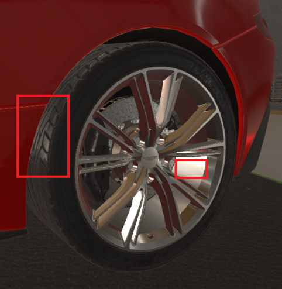{#fig:63}

これを解決するために光沢のある、または、スペキュラ遮蔽に対してアンビエントオクルージョン項を直接使うことは理想的ではない。アンビエントオクルージョンはコサインローブ形状、つまり、半球上の広いローブのアクセシビリティの反数を表す。対して、光沢のある表面はラフネスが減少するたびに狭くなるBRDFローブ形状を示す。[@fig:64]は様々なラフネス値でのローブのBRDFに関連するアクセシビリティのコーン[^footnote46]を図示している。これはスペキュラライティングでキューブマップを事前統合する方法に密接に関係している。

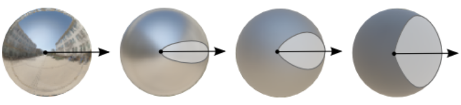{#fig:64}

[^footnote46]: 脚注46:BRDFローブは半球全体で定義されるが、ピークから外れるいくつかの値は破棄しても良いくらいとても小さい。これはラフネスをコーンの角度に変換できるようになる。[@sec:4.9]を参照。

しかし、そのようなアクセシビリティのコーンでさえ、期待される結果をもたらさない。例えば、クロムの球のような完璧に滑らかな表面では、アクセシビリティは単一の方向でテストされ、0か1の二値で結果を得る。その結果、このアクセシビリティ情報を用いるクロム球は遮蔽された所が黒色になる。この小さな例はアンビエントライティングの積分で可視性を分割することが光沢のある及びスペキュラな表面では間違いであることを単純に強調している。

しかし、@Kozlowski2007 は光沢のあるシーンの大多数がある程度まで近似でき、球面調和関数を用いるディレクショナルアンビエントオクルージョンの近似が最も効果的な手法であることを示した。

@Gotanda2013 はアンビエントオクルージョン項から導出されたスペキュラ遮蔽の項を提案した。彼は高い強度でのアンビエントオクルージョンが正しいスケールを持たないこと気が付き、BRDFローブ形状を計算に入れるべきであるとしている。Frostbiteでは、GGXのラフネスに経験的に適合させた、似たアプローチを現時点では採用した([@lst:26]参照)。この結果は物理的なアプローチと相関がなくてもビジュアル的に良いものにであった。これはそのクオリティを改善するためのさらなる研究から恩恵を受けると思われる。[@fig:65]は0.5のアンビエントオクルージョンでのこの関数の振る舞いを示している。表面が完全に粗いとき、関数は未修正のアンビエントオクルージョン項を返す。滑らかな表面では、垂直入射ではアンビエントオクルージョンの影響は減少するが、グレージング角では増加する。

~~~ {.c .numberLines id="lst:26"}
float computeSpecOcclusion(float NdotV, float AO, float roughness) {
    return saturate(pow(NdotV + AO, exp2(-16.0f * roughness - 1.0f)) - 1.0f + AO);
}
~~~
: 与えられたラフネスでスペキュラ遮蔽を計算する関数。

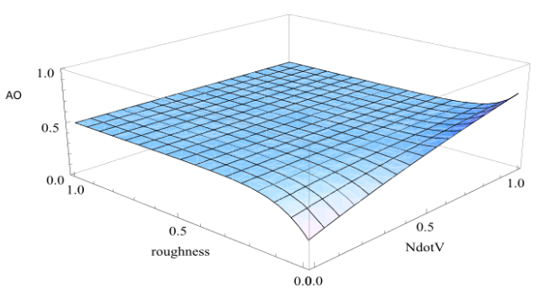{#fig:65}

**備考**: ご覧の通り、スペキュラ遮蔽は物理ベースではない。しかし、我々のスクリーンスペースリフレクションでもたらされる値は物理ベースである([@sec:4.9.4]参照)。これはアンビエントレンダリングの式の積分を可視性を分割せずに評価する。なので、我々のSSR項は理論上のスペキュラ遮蔽より良い項である。それにも関わらず、スペキュラ遮蔽を考慮しない場合、SSRは一般的なスクリーンスペースのアーティファクトに加えて、間接キューブマップによって引き起こされるライトリークのアーティファクトに悩まされることになるだろう。故に、スペキュラ遮蔽を適用することは未だに役に立つ。

### 複数解像度のアンビエントオクルージョン(Multi resolution ambient occlusion) {id="sec:4.10.3"}

前の節では、ディフューズ遮蔽とスペキュラ遮蔽が入射ライティングを再構築し、ベイクしたライトの制限を迂回し、ライトリークを減らすために、暗くするファクタであることを見てきた。これらのファクタは物理ベースではないが、画像のクオリティのためには望ましいものである。ディフューズ遮蔽のファクタを生み出すためにこんにち用いられるテクニックには2つのタイプがある。

- **オフライン事前計算**: 中〜遠距離から遮蔽情報をキャプチャする。
- **スクリーンスペーステクニック**: 中距離から遮蔽をキャプチャする。これは、HBAO、SSAO、ボリューメトリックAO、ambient obscurance、など、といった大量の様々なテクニックをカバーする。

これらのテクニックは中から大の遮蔽スケールを管理することが可能になるが、これらのいずれも小スケールの遮蔽を扱うことはできない。折り目(creases)、空洞(cavities)、小さな穴はエンジンよってもこれらの中〜長距離の遮蔽のテクニックによっても自動的に扱うことができない。この観察結果は"複数解像度の遮蔽"[@Quilez2012]の必要性を示している。我々はスペキュラとディフューズ両方に対する遮蔽を、小、中、大の3つの範囲に分類できる。

**小スケール遮蔽**: Frostbiteでは、アーティストにテクスチャ内に直接マイクロ遮蔽をベイクさせることで小さな遮蔽を扱う。空洞、折り目、ひび割れもシャドウマップで扱うには小さすぎる。そのため、マイクロ遮蔽は直接ライティングと間接ライティングの両方で適用される。我々はマイクロ遮蔽をディフューズとスペキュラの2つの部分に分けることにした。これらは両方共同じマイクロ遮蔽情報から導かれる[^footnote47]。

[^footnote47]: 脚注47:このマイクロ遮蔽情報は伝統的なアンビエントオクルージョンテクスチャのようにオフラインプロセスで生成される可能性があるが、その場合レイ範囲がより短くなる。

- **ディフューズマイクロ遮蔽**: ディフューズマイクロ遮蔽は視点非依存であり、命令数を節約するためにディフューズアルベドテクスチャに事前に掛け合わせられている([@fig:67]参照)。
- **スペキュラマイクロ遮蔽**: スペキュラマイクロ遮蔽は視点依存であり、ShaderX7の @Schueler2009 で提供される解法に頼っている。その目標は、特定のしきい値の下でいずれの値でもFresnel反射率を徐々に小さくするように、Schlickの近似を修正することである。我々は現実世界のマテリアルが0.02より小さい$f_0$の値を持つことがないことを知っているので、これより小さい反射率のいずれかの値は事前にベイクされた遮蔽の結果であると仮定することができ、Fresnel反射率の寄与を滑らかに減らす([@lst:27]参照)。故に、スペキュラマイクロ遮蔽は反射率テクスチャ内に事前にベイクされる。

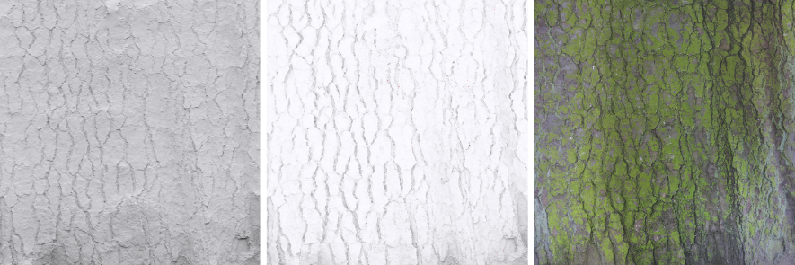{#fig:67}

~~~  {.c .numberLines id="lst:27"}
f90 = saturate(50.0 * dot(fresnel0, 0.33));

float3 F_Schlick(in float3 f0, in float f90, in float u) {
    return f0 + (f90 - f0) * pow(1.f - u, 5.f);
}
~~~
: スペキュラマイクロ遮蔽に対する @Schueler2009 の解法。

**備考**: この解法は、$f_0$の値を変更せずに反射の遮蔽情報を事前にベイクすることは本当はできないので、$f_0$と$f_90$の値の両方のFresnel反射率曲線が修正されていることを暗に示している。$f_0$を修正することはマテリアルを特徴付ける屈折率を修正することを意味する[^footnote48]。故に、アクセシビリティによりライティングのみに影響を与えると想定されていたものは現実にはマテリアルの特性に影響を与えており、時折グレージング角でFrenelが変化しないことさえある。我々は別個の専用のスペキュラマイクロ遮蔽テクスチャを使うことを調査した。これは、Gバッファに格納される追加のパラメータであることも意味する。この項はマテリアル特性でではなく我々のスペキュラ遮蔽に似た数式を用いるライティング計算に適用された。しかし、我々は知覚される結果がコストに見合わないことを発見した。

[^footnote48]: 脚注48:我々が用いる場合の$f_0$は空気とマテリアルからの屈折率を持つ空気-マテリアル間の界面から計算される。

**中及び大スケール遮蔽**: 中から大スケール遮蔽は間接ライティングでのみ適用される。我々はHBAOをサポートする。これは、中範囲のアンビエントオクルージョンをもたらすが、より重要なこととして、動的オブジェクト同士のシャドウコンタクト[^shadow_contact]を提供する。我々は、古典的なオフラインベイクか、ラジオシティシステムで提供される動的にベイクされた項の2つの選択肢を持つベイクされた中から大のアンビエントオクルージョンもサポートする[^footnote49]。ベイクされたアンビエントオクルージョンはGバッファに格納される必要がある。ゲームチームはこれらの選択肢を選ぶことができるが、我々は過剰に暗くなることを防ぎたかった。これを行うため、中から大のアンビエントオクルージョンの適用される項のすべてを最小限に抑える。これはコンタクトに対する動的なアンビエントオクルージョンを加えたベイク済みアンビエントオクルージョンをうまく扱う。マイクロ遮蔽は非常に異なるスケールにおいてであり、その影響を保存するのにより良い[^footnote50]。スペキュラ間接ライティングでは、以前の節で提供した式を通して結果のアンビエントオクルージョン項を変換する。

[^shadow_contact]: 面同士が接触する(ほどに近い)所で影付けを行うことで与えられる接地感のこと？

[^footnote49]: 脚注49:我々のラジオシティシステムは静的データに基づいたアンビエントオクルージョン項を提供するため、動的オブジェクトを伴わない単純化されたシーンであることを意味する。しかし、この項はライティングデータにすでに含まれているので、間接ディフューズで再び適用される必要はない。

[^footnote50]: 脚注50:Frostbiteでは、マイクロ遮蔽は他のテクスチャの中にベイクされるので、どの方法でもアクセス可能とはならない。

まとめると、様々な遮蔽の形式は以下になる。

|||
|-|-|
|直接ディフューズ|ディフューズマイクロ遮蔽|
|間接ディフューズ|ディフューズマイクロ遮蔽、min(ベイク済みAO, HBAO)|
|直接スペキュラ|スペキュラマイクロ遮蔽を通したFresnel反射率修正|
|間接スペキュラ|スペキュラマイクロ遮蔽を通したFresnel反射率修正、その後、computeSpecOcclusion(NdotV, min(ベイク済みAO, HBAO), ラフネス)|

### シャドウ(Shadows) {id="sec:4.10.4"}

シャドウはPBRに対する重要な見た目の手がかり(cue)である。その文献はこのトピックについて極めて広範囲に渡るため、ここでは議論しない。理想的には、すべてのライトがシャドウを持つべきであるが、パフォーマンス負荷的に難しいことがある(パフォーマンスコストはそれらをすべてのライトでしばしば手に入らなくする)。通常、ゲームチームはこの情報の欠落を隠すためにアーティストを頼る。ソフトシャドウは柔らかいルックを提供したり回り込むライティングをサポートしたりするためにエリアライトにおいて重要である。エリアライトで通常の"パンクチュアル"シャドウマップを用いると、回り込むライティングが取り除かれるだろう([@fig:63]参照)。エリアシャドウハンドリングの良い解法は @Kasyan2013 によって説明されるボクセル化テクニックである。限定された結果を伴うより安価なテクニックはシャドウマップ計算中にジオメトリのサイズを若干小さくすることで達成することができる[@Bredow2000]。

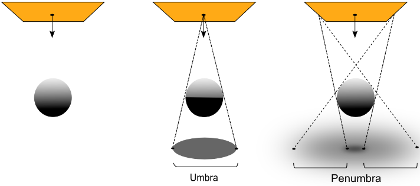{#fig:68}

Frostbiteでは、現時点ではポイントライトとスポットライトのシャドウマップをサポートしている。これらの種のシャドウマップはすべてのライトタイプを網羅するために使われる。エリアシャドウを偽装するため、射影の中心を前方と逆の方向に移動する。これは錐台がエリアライト形状全体をカバーする/に及ぶことができるようになる。そして、強いブラーと低いシャドウ解像度が柔らかいルックを得るために使われる([@fig:69]参照)。これらはクオリティを改善するためのさらなる研究から利益を得られるだろう。

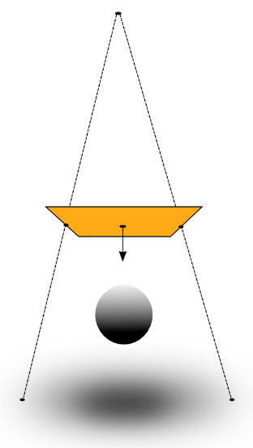{#fig:69}

**備考**: 達成されるべき真のビジョンを得るため、ライティングのリファレンスとしてすべてのライトでシャドウを用いることは重要である。

## ディファード/フォワードレンダリング(Deferred / Forward rendering) {id="sec:4.11"}

Frostbiteはフォワードとディファード両方のタイルレンダラを持つハイブリッドエンジンをサポートする[@Andersson2009]。その文献はこれらのトピックについて極めて広範囲に渡るため、ここでは議論しない。影付けされるライトを含めたすべてのライトタイプはTiledパスの使用をサポートする。このようなアーキテクチャの選択はパフォーマンスによって動機付けされる。ライトカリングはピクセル評価を無駄なることを避けるためにライト形状を尊重するタイトな境界ボリュームを用いる。我々はGバッファの読み込みで帯域幅を消費するのを避けたり計算精度を向上させたりするためにすべてのライトをひとつの大きなループの中で評価する。

# 画像(Image) {id="sec:5"}

## 物理ベースカメラ(A Physically Based Camera) {id="sec:5.1"}

以前の部のすべてはライトがシーンにおいて物理ベースな方法でどのように相互作用するかに焦点を当てていた。信頼できる結果を達成するためのもうひとつの重要な検討事項はシーン輝度から最終的なピクセル値までの変換チェーン全体を考えることである。

### カメラ設定(Camera settings) {id="sec:5.1.1"}

我々はFrostbiteにおけるレンダリングパイプラインのすべてに渡り測光単位を扱うので、カメラに到達するライトのエネルギーは輝度で表現される。入射光は通常暗いシーンでの数$\frac{cd}{m^2}$から太陽を見るときの数十億$\frac{cd}{m^2}$まで大きな値範囲をカバーする([@fig:71]参照)。これらの値はディスプレイに映せる最終的な画像を生成するために正規化されたピクセル値に再マップされる必要がある。ディジタルカメラでは、この処理がある時間だけディジタルセンサーを"*露出(exporsing)*"して後処理を適用することで行われる。この*露出*の目的は現在の光の範囲が白と黒の中間(ミドルグレー)を中心となるようにしたり、画像範囲の中間に興味のあるオブジェクトをセットアップしたりすることでセンサーのラティチュード[^latitude]を最大化することにある。入射光から最終ピクセル値への変換の完全なパイプラインは[@fig:70]で説明される。

[^latitude]: 訳注:写真の分野における「ダイナミックレンジ」の意味。

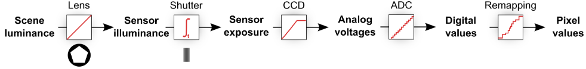{#fig:70}

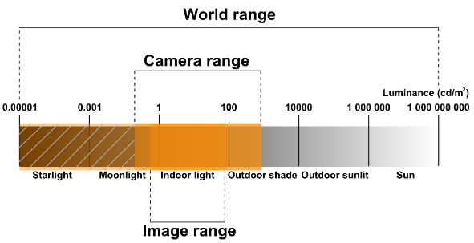{#fig:71}

以下の3つの主なパラメータは露出を設定するためにアーティストによって制御可能となっている。

- **相対的絞り(Relative aperture)** (F値$N$): 絞りの開く大きさを制御する。被写界深度に影響を与える。
- **シャッタースピード(Shutter time)** ($t$秒): 絞りの開く時間の長さを制御する。モーションブラーに影響を与える。
- **センサー感度/ゲイン(Sensor sensitivity/gain)** (ISO感度$S$): ディジタルセンサーでどれだけのフォトンが数え上げられる/量子化されるかを制御する。

与えられたこれらのパラメータの組み合わせは*EV値(Exposure Value)* ($EV$)にまとめることができる。$EV$はISO100に対して(per convention)[?]に定義され、$EV_{100}$と記される。故に、以下の関係が成り立つ。

$$
EV_{100} = \log_2 \left( \frac{N^2}{t} \right) - \log_2 \left( \frac{S}{100} \right)
$$ {#eq:67}

様々な設定の組み合わせで同じ$EV$を得ることができるので、[@fig:72]に示されるように、アーティストがモーションブラー、被写界深度、ノイズ又はざらつき(grain)[?]の間の様々なトレードオフを作ることを可能にする。

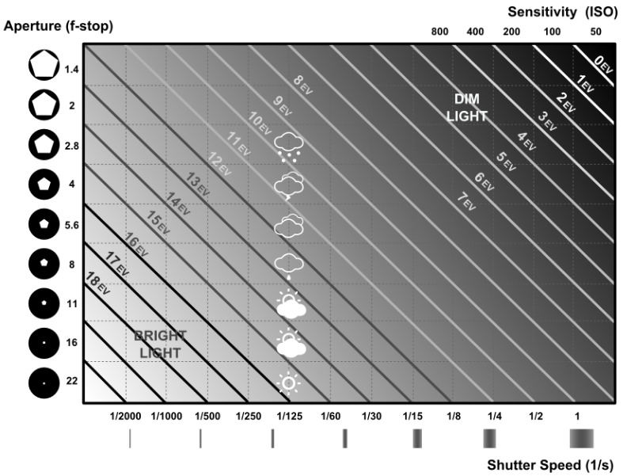{#fig:72}

$EV_{100}$は[@sec:4.3]で説明したようにライト強度を説明または測定するためにアーティストにより使われもする[^footnote51]。絞り、シャッタースピード、感度に加えて、アーティストは画像を露出過多(つまり、明るくする)または露出不足(つまり、暗くする)にするために露出補正(F値$EC$)を適用することができる。この$EC$はEV値への単なるオフセットである。

[^footnote51]: しかしながら、それは、デバイス依存であるので、正確な測定ではない。

$$
EV'_{100} = EV_{100} - EC
$$ {#eq:68}

負の符号はECがF値であるという事実に由来し、値が増加すると絞りサイズが増加することを意味している。これは、値が増加すると絞りサイズが減少する$EV$から見ると逆方向になる。手動の露出設定はアーティストが求める厳密なルックを得るために便利であるが、セットアップが退屈になる可能性がある。ディジタルカメラはそれらの操作を簡単にするために自動露出モードを提供する。与えられたシーンに対して正しいカメラ設定(すなわち、$EV$)を見つけるには、シーン輝度についての知識が必要になる。露出計に似たあるカメラは平均入射輝度を測定して、それをEV値に変換することができる。これは[@sec:4.3]、[@eq:11]でその詳細を述べたが、可読性のためにここに再掲する。ここで、$K$は反射光計のキャリブレーション定数である($12.5$に等しい)。

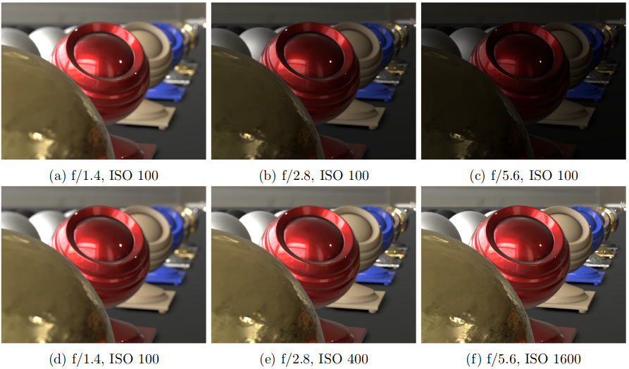{#fig:73}

$$
EV_{100} = \log_2 \left( \frac{L_{\text{avg}} S}{K} \right)
$$ {#eq:69}

TODO

## () {id="sec:5.2"}

## () {id="sec:5.3"}

# (Transition to PBR) {id="sec:6"}

\appendix

# (Listing for reference mode) {id="sec:A"}

# (Oren-Nayar and GGX's diffuse term derivation) {id="sec:B"}

# (Energy conservation) {id="sec:C"}

# (Optimization algorithm for converting Disney's parametrization) {id="sec:D"}

# (Rectangular area lighting) {id="sec:E"}

# (Local light probe evaluation) {id="sec:F"}

# 参考文献(References)
