# まえがき(Introduction) {id="sec:1"}

Frostbiteは'映画的ルック(cinematic look)'を追求してきたことから、物理ベースレンダリングへの移行も自然なことだった。移行作業は[@Drobot2013]、[@Karis2013]、[@Harduin2013]、[@Kojima2013]といったゲーム業界の最新技術を基に行い、既存技術の改良とオープン問題の削り出し(chip away)を試みた。

研究開発では、測定データかレンダリングデータのいずれか適切な方を正確性の"評価基準(ground-truth)"として用いた。しかし、真に物理的に正しい処理は負荷が大きく、リアルタイム性能という制約の中で今日のゲームエンジンがそれを達成できるとは考えにくい。そこで、まともな(decent)近似が可能な所では、品質目標(quality target)に近くなるならば、絶対的な正しさよりも *信憑性(bilievability)* を支持することとした。

PBRは業界用語として一般的になっているが、その意味はゲームエンジンごとに大きな差異がある。Frostbiteではマテリアルとライティングの情報を分離することをその原則の中核のひとつとした。これはシーン中のすべてのオブジェクトが一貫性を持ったビジュアルになることを保証するために重要となる。この考えのもとに、特別なハックをせずに同じライティングをすべてのオブジェクト、すべてのマテリアルレイヤに適用する。プロダクションの観点から見ると、アセットやライティング用のリグを異なる環境で再利用しやすくなり、アーティストの操るパラメータ数が減ることでオーサリングがより直観的になる。しかし、本書で後に述べるが、パフォーマンス上の理由によりコード上ではライティングとマテリアルは密に結合している。

PBRを採用するとなると、レンダラやツールを含めたグラフィクスパイプライン全体に手を入れなければならないことはすぐに理解できる。そのことを踏まえて、本書では普通の文献なら省かれる細かいところも含めて、大規模なプロダクションのエンジンに必要な様々なアップグレードのすべてを網羅した。まずはじめに、[@sec:2]ではground-truthとして利用するリファレンスがPBRの文脈においてどれだけ重要であるかをより詳しく説明する。次に、[@sec:3]ではマテリアルを提示して、光が物質とどのように相互作用するかを調査(review)する。[@sec:4]では光の定義や放出(emit)について説明する。[@sec:5]では輝度(luminance)を最終ピクセル値に変換する方法に触れながらカメラと出力画像に焦点を当てる。最後に、[@sec:6]ではPBRへ移行するさいのスケジュールの立て方やこの期間中に検討したことを見直すことで結論を述べる。

|||
|:-:|:-|
|$\boldsymbol v$|視線ベクトル|
|$\boldsymbol l$|入射光ベクトル|
|$\boldsymbol n$|法線
|$\boldsymbol h$|ハーフベクトル|
|$L$|ライティング関数|
|$f$|BRDF|
|$f_d$|BRDFのディフューズ要素|
|$f_r$|BRDFのスペキュラ要素|
|$\alpha$|マテリアルのラフネス|
|$\alpha_{lin}$|知覚的に線形なマテリアルのラフネス|
|$\cdot$|内積|
|$\langle \cdot \rangle$|クランプされた内積|
|$\lvert \cdot \rvert$|内積の絶対値|
|$\rho$|ディフューズ反射率|
|$\chi^+(a)$|Heaviside関数: $a>0$のとき1、$a<=0$のとき0|
: 数学的な表記法(mathematical notation) {#tbl:1}

# リファレンス(Reference) {id="sec:2"}

## モデルと仮説の検証(Validating models and hypothesis)

{#fig:1}

ビデオゲーム業界は長年に渡りフォトリアルな画像を得ようと試みを重ねてきたが、*フォトリアリズム(photorealism)* では画像を生成する方法やデータについて言及せずに感覚で(定性的に(qualitatively))判断していた。現実世界の振る舞いや特性をシミュレートしようとする *物理ベースレンダリング* ではそれと異なり、数値で(定量的に(quantitatively))判断する。そのため、きちんとしたモデルや正しい仮説を選び出すためにはground-truthとなる良いリファレンスが必要になる。妥当性の判断や正しい選択をする最善の方法は現実世界と比較観察を行うことである。現実世界を観察することで、[@fig:1]に見られるようなハイライト形状、濡れた表面の振る舞い、ライト強度の違いによる差異といった様々なビジュアル要素を迅速に把握することができる。現実世界をマテリアルのリファレンスとする場合には、異なるライティングの振る舞いをキャプチャするために複数の縮尺で撮影することが重要になるが、正確に測定するには膨大な時間がかかることがよくある。MERLなどのデータベースを利用すれば、モデルの性能評価を迅速に行うことができる。本アプローチでは、ライトの強度やフォールオフ、空の明るさ、カメラのエフェクトなどの実データの測定及び評価を試みたが、これらの工程は時間がかかる上、必ずしも簡単にセットアップできるわけではない。

## インエンジン近似の評価(Validating in-engine approximations)

{#fig:2}

MitsubaのようなモダンなPBRパストレーサーは最新のレンダリング技術を実装しており、近似の妥当性を評価する代替手段として十分なほどに現実感のある画像を生成することができる。Frostbiteでは近似の妥当性を迅速に評価できるようにMitsuba用の簡単なエクスポータを作った。このエクスポータはジオメトリ情報、(テクスチャを含まない)定数のマテリアル情報、すべてのライト強度を出力でき、マテリアルモデル、ライトインテグレーション、ライト強度を簡単に確認できる。さらにこのエクスポータはグローバルイルミネーション、アンビエントオクルージョン、反射といったより複雑な現象の正確性を検証することを可能にする。[@fig:2]はエクスポート後に自動的に起動するウィジェットを示す。このウィジェットでは完全に制御された露出の下で境目をスワイプしてピクセル値を比較することが可能になっている。もうひとつ重要なこととして、出力する強度を広い値範囲で保持するためにレンダラは線形なHDRフォーマットであるOpenEXRに最終画像を出力する。

## インエンジンリファレンスモードの評価(Validating in-engine reference mode)

<!-- 

{#fig:3a}
{#fig:3b}
{#fig:3c}

左:いくつかのタイプのエリアライトから成るインエンジンシーンのレンダリング。中:エリアライトをGPUによる重点サンプリングによってレンダリングした同じインエンジンシーン。右:評価用パストレーサーでレンダリングされたシーン。

 -->
{#fig:3}

前節で説明したエクスポータは便利だが、シーンをレンダリングするのに毎度数秒から数分かかってしまう。そこでイテレーションを早めるため、GPUでの(IBLとエリアライトの)ブルートフォースサンプリングによるライティングインテグレーションを行うゲーム内リファレンスモードを追加した([@fig:3])。このレンダリング時間は決して短いわけではないが、そのイテレーション間隔はエクスポータを使うよりも格段に短くなる。

#### 注 <!-- paragraph -->

正しいリファレンスを使うことが重要である。これは明らかなように思えるが、リファレンスが良くない場合、近似もまた良くならない。髪シェーディングモデルを近似するときはリファレンスとして現実世界に一番近いものを使おう。式を近似するときは誤差を計算できるように、Fresnelの式に対するOren-NayrやSchlickの近似式のような、すでにある近似式ではなくオリジナルの式を必ず使おう。唯一完全に信用できるリファレンスは現実世界のみである。

# マテリアル(Material) {id="sec:3"}

## マテリアルモデル(Material models) {id="sec:3.1"}

### 外観(Appearance)

{#fig:4}

表面の外観は入射光と表面のマテリアル特性との相互作用によって生み出され、[@fig:4]に見られるように、現実世界では一面一辺倒であるような単純なものから層を成したり不均質であったりするような複雑なものまで数多くの外観を観察することができる。これらの様々な外観は伝導性(conductivity)、平均自由行程(mean-free-path)、吸収(absorption)といった固有の物理的特性により分類できる。これらのマテリアル特性に基づき、全波長域の中からある範囲の外観を表現できるとする様々なマテリアルモデルが発表されている。マテリアルモデルの分野は広大であり、用いるトレードオフや求める正確さはモデルにより様々である。BSDFと呼ばれるマテリアルモデルは反射率を示すBRDFと透過率を示すBTDFに分けることができる。この文章では"標準的な"外観を表現できるとするマテリアルモデルにおける反射の部分に焦点をあてようと思う。ここで言う"標準的"とは、とりわけ日常生活の中で遭遇しやすいもののことを指す。故に、これから扱うものは平均自由行程の短い反射的で等方性を持つ誘電体または導体の表面に限定することとする。

### マテリアルモデル(Material models)

{#fig:5}

{#fig:6}

この標準的なマテリアルモデルの文脈では、[@fig:5]が示すように、表面の応答$f$は"ディフューズ"($f_d$)と呼ばれる低い角周波数の部分と"スペキュラ"($f_r$)と呼ばれる高い各周波数の部分の2つの項に分けられる。界面は空気と物質の2つの媒質で区切られる。平坦な界面からなる表面であれば、誘電体と導体の両方においてFresnelの法則によって簡単に表すことができる。[@fig:6]が示すような不規則な界面であれば、この種の表面との光の相互作用の特徴にうまく適合するマイクロファセットによるモデル[@Cook1982]により表すことができる。マイクロファセットモデルは以下の式により表される。より詳しい導出は[@Heitz2014]を参照のこと。

$$
f_{d/r}(\boldsymbol v) = \frac{1}{|\boldsymbol{n} \cdot \boldsymbol{v}| |\boldsymbol{n} \cdot \boldsymbol{l}|} \int_{\Omega} f_m(\boldsymbol{v}, \boldsymbol{l}, \boldsymbol{m}) G(\boldsymbol{v}, \boldsymbol{l}, \boldsymbol{m}) D(\boldsymbol{m}, \alpha) \langle \boldsymbol{v} \cdot \boldsymbol{m} \rangle \langle \boldsymbol{l} \cdot \boldsymbol{m} \rangle d\boldsymbol{m}
$$ {#eq:1}

$D$項はマイクロファセット分布(つまり、法線分布関数(NDF))をモデル化し、$G$項はマイクロファセットによる遮蔽(マスキング-シャドウイング)をモデル化する。この式はディフューズ項$f_d$とスペキュラ項$f_r$の両方に対して対応するマイクロファセットBRDF$f_m$を定めることで用いることができる。スペキュラ項の場合、$f_m$は完全鏡面(perfect mirror)であり、Fresnelの法則$F$によりモデル化される。したがって、以下のよく知られた式を導くことができる。

$$
f_r(\boldsymbol v) = \frac{F(\boldsymbol{v}, \boldsymbol{h}, f_0, f_{90}) G(\boldsymbol{v}, \boldsymbol{l}, \boldsymbol{h}) D(\boldsymbol{h}, \alpha)}{4 \langle \boldsymbol{n} \cdot \boldsymbol{v} \rangle \langle \boldsymbol{n} \cdot \boldsymbol{l} \rangle}
$$ {#eq:2}

$D$項は[@fig:6]が示すように、表面の外観において重要な役割を担っている。[@Walter2007; @Burley2012]はGGX分布のような"ロングテール"のNDFが現実世界の表面をキャプチャするときに良好な結果を示すことを指摘している。$G$項もまた高いラフネス値において重要な役割を担っている。@Heitz2014 はSmithの可視性関数が$G$項として正確かつ厳密であることを示している。それに加えて、以下に示すような、マスキングとシャドウイングの間にある相関をモデリングしたマスキング-シャドウイング関数の更に正確な形式があるにもかかわらず、Smithの可視性関数の近似バージョンが使われる傾向があることを指摘している。[@fig:7]はシンプルなSmithの関数と高さ相関(hight-correlated)のSmithの関数との差異を示している。

$$
G(\boldsymbol{v}, \boldsymbol{l}, \boldsymbol{h}, \alpha) = \frac{\chi^+(\boldsymbol{v} . \boldsymbol{h}) \chi^+(\boldsymbol{l} . \boldsymbol{h})}{1 + \Lambda(\boldsymbol{v}) + \Lambda(\boldsymbol{l})} \text{ with } \Lambda(\boldsymbol{m}) = \frac{-1 + \sqrt{1 + \alpha^2 \tan^2(\theta_m)}}{2} = \frac{-1 + \sqrt{1 + \frac{\alpha^2 (1 - \cos^2(\theta_m))}{\cos^2(\theta_m)}}}{2}
$$ {#eq:3}

{#fig:7}

ディフューズ項の場合、$f_m$はLambertモデルに従い、そのときの[@eq:1]を簡略化すると以下のようになる。

$$
f_d(\boldsymbol v) = \frac{\rho}{\pi} \frac{1}{|\boldsymbol{n} \cdot \boldsymbol{v}| |\boldsymbol{n} \cdot \boldsymbol{l}|} \int_{\Omega} G(\boldsymbol{v}, \boldsymbol{l}, \boldsymbol{m}) D(\boldsymbol{m}, \alpha) \langle \boldsymbol{v} \cdot \boldsymbol{m} \rangle \langle \boldsymbol{l} \cdot \boldsymbol{m} \rangle d\boldsymbol{m}
$$ {#eq:4}

これまではこのような単純なLambertモデルでも問題なかったが、[@fig:8]が示すように、スペキュラ項との一貫性を保つため、ディフューズ項の計算に表面のラフネスを取り入れる必要がある[@Burley2012](すなわち、スペキュラ項とディフューズ項で同じラフネスを用いるべきである)。[@eq:4]は解析的に解くことができないが、 @Oren1994 はガウス分布のNDFとV型空洞のG項を用いることでOren-Nayarモデルとして知られる[@eq:4]の経験的近似を発見した。モデルを正しくサポートするためには、[@Gotanda2014]で説明されているようにGGXのNDFにも[@eq:4]に対する同じような近似を作るべきである。[@sec:B]にその詳細を載せるが、さらなる研究が必要である。

{#fig:8}

@Burley2012 は現実世界の表面を観察した結果から以下の式で示されるディフューズモデルを発表した。このモデルは経験的だが、MERLデータベースのマテリアルの主な特徴を再現でき、加えて単純であるため、Frostbiteで用いることとした。このディフューズ項はマテリアルのラフネスを計算に取り入れており、グレージング角での自己反射をいくらか生み出すことができる。

$$
f_d = \frac{\rho}{\pi} (1 + F_{D90}(1 - \langle \boldsymbol{n} \cdot \boldsymbol{l} \rangle)^5) (1 + F_{D90}(1 - \langle \boldsymbol{n} \cdot \boldsymbol{v} \rangle)^5) \text{ where } F_{D90} = 0.5 + \cos(\theta_d)^2 \alpha
$$ {#eq:5}

### エネルギー保存則(Energy conservation)

エネルギー保存則は扱うエネルギー量が受け取ったエネルギー量より多くならないことを考慮する上で重要な概念である。加えて、グレージング角においてディフューズ項よりスペキュラ項のほうが光をより散乱させるという振る舞いを正しく扱うことが可能になる。Frostbiteでは、計算を簡単にするため、半球状の固定照明による与えられた方向に対する反射率の総計である方向性半球反射率(hemispherical-directional reflectance)がBRDF全体で1未満であることでエネルギーが保存されているとした。

$$
\rho_{hd}(\boldsymbol{v}) = \int_{\Omega} f(\boldsymbol{v}, \boldsymbol{l}) \langle \boldsymbol{n} \cdot \boldsymbol{l} \rangle d\boldsymbol{l} = \int_{\Omega} (f_r(\boldsymbol{v}, \boldsymbol{l}) + f_d(\boldsymbol{v}, \boldsymbol{l})) \langle \boldsymbol{n} \cdot \boldsymbol{l} \ge 1
$$ {#eq:6}

スペキュラモデルとディフューズモデルとの関連性が直接的ではないため、適切な導出を作ることは簡単ではない(スペキュラ項とディフューズ項がともにマイクロファセットモデルの基づく場合は[@sec:C]を参照)。Disneyのディフューズモデルはエネルギー保存則を満たしていないことに注意する必要がある(脚注4: @Burley2012 が説明するように、これはアーティストがあらゆるラフネス値を通して同じディフューズ色を得られるようにすることを目的とした仕様によるものである)。[@fig:9] (a)はDisneyのディフューズモデルの方向性半球反射率を表しているが、見るからに値は1を越えており、エネルギー保存則を満たしていないことが分かる。

{#fig:9}

そこで、我々は自己反射の特性を維持しつつエネルギーのゲインを補正するような修正を追加した。[@lst:1]は再正規化ファクタを導入したDisneyの評価関数を示している。[@fig:9] (c)ではスペキュラのマイクロファセットモデル$f_r$とDisneyのディフューズモデル$f_d$を合成した$f$の方向性半球反射率を表しており、完全に1にはなっていないが十分に近い値になっている。[@fig:10]ではオリジナルと再正規化バージョンとの比較を示している。

Listing: エネルギーの再正規化を含むDisneyのディフューズBRDFのコード。`linearRoughness`は知覚的に線形なラフネスである([@sec:3.2.1]を参照)。

~~~{.c .numberLines id="lst:1"}
float Fr_DisneyDiffuse(float NdotV, float NdotL, float LdotH, float linearRoughness) {
    float energyBias     = lerp(0, 0.5, linearRoughness);
    float energyFactor   = lerp (1.0, 1.0 / 1.51, linearRoughness);
    float fd90           = energyBias + 2.0 * LdotH*LdotH * linearRoughness;
    float3 f0            = float3(1.0f, 1.0f, 1.0f);
    float lightScatter   = F_Schlick(f0, fd90, NdotL).r;
    float viewScatter    = F_Schlick(f0, fd90, NdotV).r;

    return lightScatter * viewScatter * energyFactor;
}
~~~

{#fig:10}

### 形状の特徴(Shape characteristics)

スペキュラのマイクロファセットによるBRDFはしばしば無視(bypass)されるが最終的な外観に強い影響を及ぼすある特性を持つ。特に以下の2つの現象が重要である。

- **半角パラメータ化(Half-angle parameterization)**: このパラメータ化は通常の入射角では等方的になるがグレージング角では異方的になるというBRDF形状の非線形な変換を暗に示している。さらなる洞察は[@sec:4.9]を参照のこと。
- **オフスペキュラ(Off-specular)**: BRDFローブは時折反射した視線方向(反射方向(mirror direction))を中心とすると仮定されるが、[@fig:11]に見られるように、ラフネスが大きくなると$\langle \boldsymbol{n} \cdot \boldsymbol{l} \rangle$とマスキング-シャドウイング項$G$によってBRDFローブは法線方向に引っ張られる(gets shifted)ようになる。これは"*オフスペキュラピーク(Off-specular peak)*"と呼ばれ、表面の粗い外観を表すのに重要な役割を担っている。

{#fig:11}

ラフネス値が大きいとオフスペキュラピークによる差異が大きくなる可能性がある。この重要な特徴を計算に入れるため、この"支配的な向き(dominant direction)"のモデル化を試みた。これはエリアライト([@sec:4.7])と画像ベースライト([@sec:4.9])を評価するときに用いた。

### Frostbiteの標準モデル(*Frostbite* standard model)

まとめると、Frostbiteの"標準"マテリアルモデルは他のゲームエンジンで用いられるものと近い[@Karis2013; @Neubelt2013; @Burley2012]。これは以下から構成されている。

- **スペキュラ項** $f_r$: Smithの相関あり可視性関数とGGXのNDFによるスペキュラのマイクロファセットモデル([@eq:2])。
- **ディフューズ項** $f_d$: エネルギーの再正規化を施したDisneyのディフューズ項。

両パートでは、ライティングを統合するときに支配的向きに対して補正をかける(オフスペキュラピークを制御する)ことができるようになっている(詳しくは次節)。Frostbiteはクリアコートのような異なるタイプのマテリアルや表面下散乱を含むマテリアルもサポートしているが、この文書では標準的マテリアルモデルのみに焦点を当ててゆく。

Listing: BSDFの評価コード。

~~~ {.c .numberLines id="lst:2"}
float3 F_Schlick(in float3 f0, in float f90 , in float u) {
    return f0 + (f90 - f0) * pow(1.f - u, 5.f);
}

float V_SmithGGXCorrelated(float NdotL , float NdotV , float alphaG) {
    // 相関あり版G_SmithGGXのオリジナル式
    // lambda_v             = (-1 + sqrt(alphaG2 * (1 - NdotL2) / NdotL2 + 1)) * 0.5f;
    // lambda_l             = (-1 + sqrt(alphaG2 * (1 - NdotV2) / NdotV2 + 1)) * 0.5f;
    // G_SmithGGXCorrelated = 1 / (1 + lambda_v + lambda_l);
    // V_SmithGGXCorrelated = G_SmithGGXCorrelated / (4.0f * NdotL * NdotV);

    // 最適化バージョン
    float alphaG2 = alphaG * alphaG;
    // 注意:"NdotL *"と"NdotV *"の関係が他と逆なのは間違いではなく意図したもの
    float Lambda_GGXV = NdotL * sqrt((-NdotV * alphaG2 + NdotV) * NdotV + alphaG2);
    float Lambda_GGXL = NdotV * sqrt((-NdotL * alphaG2 + NdotL) * NdotL + alphaG2);
    return 0.5f / (Lambda_GGXV + Lambda_GGXL);
}

float D_GGX(float NdotH, float m) {
    // 1/PIはあとでかける
    float  m2 = m * m;
    float f = (NdotH * m2 - NdotH) * NdotH + 1;
    return  m2 / (f * f);
}

// 以下は上記の関数を呼び出す例
float  NdotV = abs(dot(N, V)) + 1e-5f; // avoid  artifact
float3 H     = normalize(V + L);
float  LdotH = saturate(dot(L, H));
float  NdotH = saturate(dot(N, H));
float  NdotL = saturate(dot(N, L));

// スペキュラBRDF
float3 F     = F_Schlick(f0, f90, LdotH);
float  Vis   = V_SmithGGXCorrelated(NdotV, NdotL, roughness);
float  D     = D_GGX(NdotH, roughness);
float  Fr    = D * F * Vis / PI;

// ディフューズBRDF
float  Fd    = Fr_DisneyDiffuse(NdotV, NdotL, LdotH, linearRoughness) / PI;
~~~

## マテリアルシステム(Material system) {id="sec:3.2"}

### マテリアル(Material) {id="sec:3.2.1"}

Frostbiteを利用するゲームジャンルはスポーツ、レーシング、FPS、オープンワールドに至るまで多岐に渡る。これらのゲームが求めるさまざまな要件を満足するため、エンジンはライティングやマテリアル対応に関する柔軟な制御方法を提供する必要がある。それに加えて、移行を簡潔に行うために前の非PBRなライティングモデルとの互換性を維持する必要があった。ライティングパスは制御可能であり、ディファード、フォワード、またはそのハイブリッドをサポートしている(詳しくは[@sec:4.11])。

Frostbiteでは、"マテリアル"は以下により定義される。

- **ライティングパス**: ディファード、フォワード、またはその両方。
- **入力パラメータ**の集まり: ディフューズ、滑らかさ(smoothness)、厚さ(thickness)、など。
- **マテリアルモデル**: 粗い表面、半透明、肌、髪、など(非PBRな粗い表面も含む)。いわゆるシェーダコード。
- ディファードパスの場合の**Gバッファのレイアウト**。バッファ数は可変。

ゲーム開発班は指定のライティングパスで利用可能なものの中からマテリアル一式を選ぶことができる。各マテリアルは*materialID*属性によりそのゲームで識別される。最も一般的なケースをカバーする*ベース*マテリアル("標準"マテリアルと呼んでいるもの)は常に存在し、他のマテリアルと共有するパラメータ(例えば、ラフネス)を定義する。ディファードシェーディングでは、*ベース*マテリアルは一般に @Burley2012 が示す"Disney"モデル一式になる。それと、"二色(two-color)"と"旧(old)"の2つのベースマテリアルもサポートする。

**Disneyのベースマテリアル**: 我々のDisneyマテリアルでは以下のパラメータを用いる。

Normal
: 標準的な法線。

BaseColor
: @Burley2012 のように、非金属オブジェクトにおけるディフューズのアルベドと金属オブジェクトにおける垂直入射($f_0$)を定義する。この属性の下位部はマイクロスペキュラオクルージョン(micro-specular occlusion)を定義する[?]。

Smoothness
: オブジェクトのラフネスを定義する。値が1のときに滑らかであるとするとアーティストが直観的に扱えるため、また、Frostbiteの非PBRマテリアルモデルがすでにこれを使っているため、ラフネスではなくsmoothnessを選択した。@Burley2012 と同様に、視覚的に線形なsmoothnessにリマップされる($1 - \alpha_{lin}$)。

MetalMask
: @Burley2012 のように、"金属らしさ"または表面の導電性(すなわち、誘電体か導体か)を定義する。この変数の二値的な性質をアーティストに示すためこのような名前にした。

Reflectance
: 非金属マテリアル(つまり、MetalMask < 1)のためのアーティスト・フレンドリーな範囲で垂直入射におけるFresnel反射率($f_0$)を定義する。この属性の下位部は非金属マテリアルにおけるマイクロスペキュラオクルージョン(micro-specular occlusion)を定義する[?]。

**smoothness**では、[@fig:12]に示すような様々なリマッピング関数をアーティストに試してもらいながら分析を行い、@Burley2012 と同じように、アーティストが最も満足するように見える"二乗"のリマッピングを選択した。**reflectance**では、以下のリマッピング関数を選択した。

$$
f_0 = 0.16 \times reflectance^2
$$

このリマッピングは、4%誘電体の反射率をRGBの128にマッピングしつつ、宝石の高いFrenel値を含むことができる範囲に$f_0$をマップすることを目標としている。宝石の$f_0$はルビーで約8%、ダイヤモンドで約17%になる。我々は近似として関数が16%を上限とするよう制限することにした。[@fig:13]は一般的な値での比較を示している。実践ではリアルタイムの制限により、1%や2%における変化はほとんど目立たない(脚注5:誘電体における$f_0$の小さな変化はほとんどのリアルタイムエンジンがサポートしていない屈折光の方向に関係している)ため、この式は4%以上で急激に変化する値によく合っている。

非金属オブジェクト(**Reflectance**)と金属オブジェクト(**BaseColor**)の両方における垂直入射でのFresnel反射率($f_0$)では、マイクロスペキュラを制御するために2%(水の反射率)以下である下位部が使われる(詳細は[@sec:4.10]を参照)。これは特定のエンコーディングのために非金属オブジェクトで使われるマイクロスペキュラオクルージョンの値が異なる範囲であることを暗に示している。

TODO: マイクロスペキュラオクルージョンとは？

![Smoothnessのリマッピング比較。$(1 - Smoothness)^2$の曲線は @Burley2012 のリマッピングに対応する。暗い青色の曲線はCrytekのRyseが採用したリマッピング$(1 - 0.7 \times Smoothness)^6$[@Schulz2014]に対応する。これのレンダリング結果は示していないが、その曲線は4乗のものと非常に近い。](assets/Figure12.png){#fig:12}

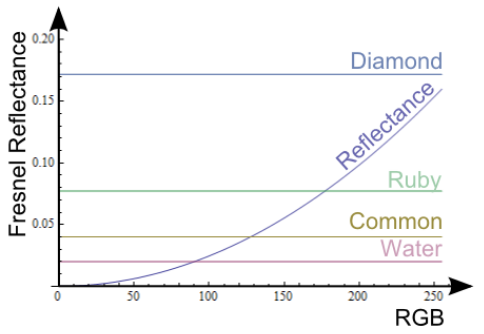{#fig:13}

Disneyマテリアルは[@sec:3.1]で示した"標準"マテリアルモデルを用いる。関連するGバッファのレイアウトは[@tbl:2]に示す。このレイアウトは以下の制約からなる。

- 全ての基本属性(`Normal`、`BaseColor`、`Smoothness`、`MetalMask`、`Reflectance`)はディファードデカールをサポートためにブレンド可能である必要がある。ブレンド不可能な属性はアルファチャンネルに格納する。また、ブレンドの質に影響を与える圧縮やエンコードは避けることとした。
- MSAAをサポートすると`BaseColor`属性の彩度サブサンプリングが使えなくなる。[@Mavridis2012]
- 通常使うパラメータは同じバッファに集める必要がある。
- `MaterilId`は全てのマテリアルで同じ場所に格納する必要がある。
- ベース/標準マテリアルでは4つのバッファのみを使うことがパフォーマンス要件である。(深度バッファは含まない)

|＼|R|G|B|A|
|:-:|:-:|:-:|:-:|:-:|
|GB0|`Normal`(10)|左に同じ|`Smoothness`|`MaterialId`(2)|
|GB1|`BaseColor`|左に同じ|左に同じ|`MaterialData`(5)/`Normal`(3)|
|GB2|------|`MetalMask`|`Reflectance`|`AO`|
|GB3|`Radiosity`/`Emissive`|左に同じ|左に同じ|左に同じ|
: DisneyのディファードのベースマテリアルのGバッファレイアウト。 {#tbl:2}

`MaterialData`は`MateriralId`により様々な値に解釈される。例えば、ディファードな肌マテリアルではディフュージョンプロファイル指数(diffusion profile index)が格納され、異方的なマテリアルでは異方性の強さが格納される。`AO`は常に存在する(マテリアルタイプの非依存である)アンビエントオクルージョン項である(詳細は[@sec:4.10]を参照)。`Radiosity`はGバッファを生成するときに評価された間接ディフューズライティングを格納するライトバッファである。`Normal`は適用後でも通常のブレンドが可能である非可逆なエンコーディング手法を用いて2つに分割する(このアルゴリズムは後のトークで説明するかもしれない)。

**二色のベースマテリアル**: Disneyのパラメータ化(単一のベース色、メタルマスク、スカラの反射率)は、例えば金属酸化物のような金属と誘電体の界面では複合マテリアルのスペキュラハイライトを満足に説明できない(fall short when expressing)ため、$f_0$とディフューズ色を持つ"二色"のディファードのベースマテリアルをサポートする。関連するGバッファのレイアウトは[@tbl:3]に示す。$f_0$項は`Reflectance`と同じような下位範囲でマイクロオクルージョンをサポートする。パラメータ化間の変換は状況に応じて必要とされる。Disneyのパラメータ化から"二色"のパラメータ化への変換はその定義により自明であり、ライティング計算でGバッファをアンパックするときにすでに行われている。逆の変換は非線形な最適化が必要になりさらに混沌としてくるため、アセットが必要とするときのみ行うこととする。この変換の詳細は[@sec:D]で提供する。

|＼|R|G|B|A|
|:-:|:-:|:-:|:-:|:-:|
|GB0|`Normal`(10)|左に同じ|`Smoothness`|`MaterialId`(2)|
|GB1|`DiffuseColor`|左に同じ|左に同じ|`MaterialData`(5)/`Normal`(3)|
|GB2|`f0 Color`|左に同じ|左に同じ|`AO`|
|GB3|`Radiosity`/`Emissive`|左に同じ|左に同じ|左に同じ|
: 二色のディファードのベースマテリアルのGバッファレイアウト。 {#tbl:3}

**旧ベースマテリアル**: これは昔の非PBRエンジンでのベースマテリアルである。詳しくは[@Coffin2011]を参照のこと。レガシーなコンテンツをサポートするため、また、移行を簡単にするため、基本的なアート規則に基づいた非PBRマテリアルとPBRマテリアルとの自動変換機能を追加した。この変換は入力パラメータを格納する前にシェーダ内で行われる。ただし、適切に作られたアセットと比べると質は低くなる。質を維持したまま変換する方法は未だ見つかっていない。

[@fig:14]は異なるマテリアルパラメータの変換を強調して、マテリアルモデルとライティング機能との依存関係を示している。パフォーマンスに関して言えば、エリアライト([@sec:4.7])とIBL([@sec:4.9])はマテリアルモデルに依存した事前インテグレーションに頼っている。これは**ライティングとマテリアルがエンジン内で結合している**ことを暗示している。PBRのアプローチにより主張したライティングとマテリアルの分割はアセット制作段階でのみ妥当である。つまり、アーティストはシェーダ内のあらゆるライティング情報にアクセスできない。しかし、傘の下(under the hood)ではこの分割は保たれず、新しいマテリアルを追加するとしばしば暗黙的に新しいライティングコードが追加される。

{#fig:14}

### レンダループ(Render loop)

前節ではマテリアルの定義を示した。この節ではマテリアルをどのようにレンダリングするかについて説明する。フォワードライティングパスを用いた表面では、マテリアルモデルのシェーダコードをセットアップし、パラメータリストを送り、表面をレンダリングする。ディファードシェーディングパスでは、より込み入ったことをやっている。効率的にマテリアル一式を管理できるようにするため、以下の注意事項(considerations)を取り決めた。

- マテリアルモデルは、細かな調整を動的分岐に頼るなどして、できる限り同じライティングコードを共有してみる。ライティングコードに違いが多すぎるならば、ステンシルバッファを用いて異なるライティングパスを用意しよう。
- マテリアルは、パラメータを格納するための細かな調整を動的分岐に頼るなどして、ベースマテリアルのレイアウトの一貫性を維持してみる。マテリアルに違いが多すぎるならば、ステンシルバッファを用いて異なるGバッファパスを用意しよう。
- "調整パス(fix-up pass)"を行うことで、異なるGバッファレイアウトを持つマテリアルによるライティングパスを共有してみる。

ジオメトリ・ヘビーなパスでは、Gバッファの生成コストを減らしながらライティングパスは同じものを使いたい。典型的なユースケースとしてはベジテーションが挙げられる。ベジテーションでは、ベースとなるGバッファレイアウトの上から2つのバッファのみを埋めて、[@lst:3]に示される"調整"パスにより失ったGバッファパラメータを後から付け足す、ということを行う。調整パスは同じバッファに読み書きできるハードウェア能力に依存した複数パスにより達成することが必要になるかもしれない。

Listing: Gバッファ調整サンプル。

~~~ {.c .numberLines id="lst:3"}
void　psMain(
    in float4 pos : SV_Position,
    in float2 texCoord: TEXCOORD0,
    out float4 outGBuffer2 : SV_Target0,
    out float4 outGBuffer3 : SV_Target1)
{
    float4 gbuffer0 = FETCH_TEXTURE(g_gbufferTexture0, texCoord.xy, 0);
    float4 gbuffer1 = FETCH_TEXTURE(g_gbufferTexture1, texCoord.xy, 0);
    float3 worldNormal = normalize(unpackNormal(gbuffer0.rg, gbuffer1.a));

    // グローバルディフューズプロブからラジオシティ用の値を読む。
    float indirectLight = calcShL2Lighting(worldNormal, ...);

    // グローバルな共通値でsmoothness、metalMask、reflectanceを調整する。
    // アンビエントオクルージョンを1にセットする。
    outGBuffer2 = float4(g_smoothness, 0, g_reflectance, 1);
    outGBuffer3 = packLightingRGBA(indirectLight);
}
~~~

レンダリングループの疑似コードは以下のようになる。

~~~ {.c }
// Gバッファ生成
ForEach 異なるステンシルビット do
    Render バッファ数nを持つディファードマテリアルについてGバッファパス
        必要ならば、シェーダ内で分岐する
    Render バッファ数(n + 1)を持つディファードマテリアルについてGバッファパス
        必要ならば、シェーダ内で分岐する

// 調整パス
ForEach ディファードシェーディングパスの共有を必要とするディファードマテリアル
    Render Gバッファの調整パス

// デカール
Render 共通パラメータに影響するディファードデカール

// ディファードシェーディング
ForEach 必要な個別のディファードシェーディングパス do
    Render ディファードシェーディング
        必要ならば、シェーダ内で分岐する

// フォワードなレンダリング及びライティング
ForEach フォワードマテリアルモデル do
    Render フォワードライティング
~~~

実践では、マテリアルパラメータとライティング関数が結びついているためにゲームチームが**すべて**をカスタマイズするのはむしろ困難である。`MaterialId`はマテリアルをカスタマイズする簡単な方法を提供する。ただし、ライティングコードの再利用と動的分岐を必須としなければならない制約がある。例としては、ライティングを2回サンプリングする必要があるクリアコートのモデルをゲームチームが追加したことがある。このシステムは非PBRエンジンからの移行とユーザの様々な要求にフィットすることを可能にした。

## PBRとデカール(PBR and decals) {id="sec:3.3"}

デカールはマテリアル特性を層にしたり、リッチな外観や変化を作れるようにするための動的システムとして見られる。この文脈の中で、デカールがPBRにおいて"正しい"ことはますます重要になる。ここでの"正しい"とは、デカールのマテリアルパラメータとライティング前の表面を何度でも重なりあっても適切に組み合わせることができる能力のことを指す。Frostbiteではこれを目的としてデカールをレンダリングするために主にディファードシェーディングを用いる(脚注7:ここでのディファードデカールはボリュームデカールとクラシックなデカールの両方を含む。)が、ハードウェアやパフォーマンスに制約がある中でこれを正しく行うのはほぼ不可能である。我々は様々な物理ベースマテリアルを考慮しつつ正しくデカールをブレンドする良い解答を導き出せないでいるが、完全性のために主要な落とし穴とFrostbiteでの選択をリスト化しておく。

- **正確性**: ブレンド処理の正確性は重要である。すなわち、ブレンド処理後の属性の復元(recovery)が正しくなければならない。例えば、$normal * 0.5 + 0.5$のような標準的なエンコーディングを施した`Normal`やxy要素のみの`Normal`において、正しく復元することができるのは置き換え(すなわち、線形補間)のみである。ディテールを付加する[@Barre-Brisebois2012]ような処理では誤った結果を生み出すだろう。プログラマブルブレンディングが活きる場面だが、対応するプラットホームがほとんどない。我々はこの場合では、いくつかの属性で圧縮することを回避し、単純で線形に補間するアルファブレンディングに頼ることを選択をした。
- **相互作用**: 正しくブレンドするため、デカールと対象の表面は同じマテリアルモデル(同じパラメータリスト)を使うべきである。プロダクションとパフォーマンスの両方の観点から見ると、`MaterialId`ごとに分けて作ったデカールをそれぞれ個別のパスで描画する必要があるため、これは管理しきれない。我々はデカールパラメータをゲームが選んだマテリアルの中で共通するパラメータ一式に制限することを選択した。これは基本的に`Normal`、`BaseColor`、`Smoothness`となる。`MetalMask`や`Reflectance`(または、`f0 color`)といった他のパラメータはDisney(または、二色)のベースマテリアルを選択した場合にのみ検討する(脚注8:フォワードでは発光デカールもサポートする)。しかし、これでは十分ではない。デフォルト以外の`MaterialId`に影響を与えるデカールはアーティファクトを発生させる。`MaterialData`と`MaterialId`はブレンド可能なデータではなく、置き換えのみ可能である。選択肢のひとつはアルファチャンネルに個別のブレンドファクタを用いて中立的な値に強制することである。もうひとつの選択肢は`MaterialID`が0以外のマテリアルに影響を与えるデカールを禁止することである。
- **間接ライティング**: デカールが与える影響はライティングを評価する前に処理する必要がある。しかしFrostbiteでは、間接ディフューズをGバッファ生成パスの間に評価するため、ディフューズアルベド以外のマテリアル特性にこれ以上の変更を加えることを妨げてしまう(脚注9:Frostbiteではラジオシティバッファはライティングパス後にアルベドとともに圧縮される)。解決法のひとつは例えばレベルを網羅するプロブボリュームテクスチャ[@Valient2014]を用いて、すべての間接ディフューズライティングをディファードパスで評価することである。もうひとつの解決法はUnrealEngine4が提案しているようなGバッファ生成前にバッファにデカール属性を格納するデカール用プリパスを使うことである。これはデカールを貼り付けるオブジェクトを2回レンダリングする必要がある。Frostbiteでは、このような解決法により暗黙的に生まれるオーバーヘッドを危惧しアーティファクトを許容することを選択した。
- **発光**: FrostbiteのGバッファストレージは制限されているため、[@sec:4.8]に示すように、エミッシブ情報はパフォーマンス上の理由により時折ラジオシティバッファに組み込まれる。ラジオシティバッファはのちにアルベドを組み合わせる。この場合、アルベドを変更するデカールは発光色を変更する。Frostbiteでは、発光とデカールを扱うことによるアーティファクトを許容した。
- **ハイライト形状の保存とスペキュラエイリアシング**: いずれかの法線パラメータを変更することはピクセルが占める領域の下にあるNDFを変化させることを暗に示している。これは(ToskvigやLEANマッピングのようなテクニックにより扱われる)形状の保存を偏らせることを意味する。このことは、[@sec:5.3]に示すように、デカール適用前に処理されていた。解決法はデカール適用後のポストプロセスとして法線フィルタリングパス(脚注10:法線フィルタリングパスはラフネスを変更することを暗に示している。)を行うことである[@Schulz2014]。
- **フォワードレンダリングされた表面**: ディファードデカールは透明オブジェクトやフォワードレンダリングされたオブジェクトとの互換性を持たない。この場合の基本的な解決法は表面のライティングを含むライティング結果をブレンドするフォワードデカールを頼ることである。フォワードレンダリングされたオブジェクトにおけるデカールのパラメータブレンディグをサポートすることは可能であるだろうが、アート側に大きな制約が必要になる(ブレンドモードの制限、テクスチャ配列でのテクスチャサイズの制限、など)。この問題はライティングの適用において類似点が存在する。ライティングですでに見つかっている解決策を適用すると、タイルベースのデカールに発展するかもしれない。

# ライティング(Lighting) {id="sec:4"}

## 一般(General) {id="sec:4.1"}

ライティングパイプラインはすでに界隈で議論されている基盤技術に敬意を払って、ハイダイナミックレンジをサポートし、線形空間で処理し、(MIPMAP、ブレンド、フィルタリング、などにおいて)入出力をガンマ的に正しく行うべきである。Frostbiteではあらゆるゲームエンジンと同じようにハードウェアがサポートするsRGB変換機能に頼ることを選択した。

信憑性の高いシーンはライティングの一貫性と正確性に基づいている。すなわち、すべてのオブジェクトは周囲の環境からライティングを受け取り、正しい強度の光を反射し、シャドウを持つべきである。ゲームエンジンはそれぞれが関連を持たない様々なライティングツールを提供する。アーティファクトがひとつのライティングツールの操作によって、正しい結果を得るために他のライティング要素を再調整したり、信頼性や空間参照を破壊したりしないというのは困難が伴う。Frostbitでは、すべてが**標準で正しい**状態にあり、アーティファクトにより好きなように調整することができる、とするメインのガイドライン用意した。これにより正しい結果を得るよりも正しい結果を逸脱することのほうがアーティストにとって難しくなるはずである。ただし、エンジンの制限の回避やアーティスト的な理由のためアーティストによる制御を忘れてはならない。

Frostbiteは、パンクチュアルライト、エリアライト、エミッシブ表面、IBLといった、いくつかのライトタイプをサポートする。"IBL"という言葉には、(空表現に用いる)遠方のライトプロブ、局所化したライトプロブ、スクリーンスペースリフレクション(SSR)が含まれる。一貫性はすべてのライティング要素が結合し、マテリアル特性と正しく相互作用するとき達成される。以下に例を示す。

- **一貫性のあるマテリアルライティング**: すべてのBSDFはすべてのライトタイプと正しく相互作用すべきである。これは直接光と同じく間接光も含まれる。
- **一貫性のある間接ディフューズライティング**: すべてのライトタイプはラジオシティシステムを考慮しなければならない。太陽や空のライティングは非常に重要な部分であるが、他のライトタイプについてもすべて同様に含まれるべきである。
- **一貫性のある間接スペキュラライティング**: SSR、ローカルライトプロブ、遠方のライトプロブはともに正しく組み合わされなければならない。
- **一貫性のあるライト単位**: すべてのライトは現実的な比率を達成するため同じ単位で表現されるべきである。例えば、HDRキャプチャしたライトプロブを扱うときは注意しないとすぐに解析的ライトとの比率がおかしくなる。
- **一貫性のあるデカール**: デカールは間接光を含むすべてのライトタイプの影響を正しく受けるようにすべきである。

次節ではFrostbiteがサポートするすべてのライトライプとエンジンでライティングの一貫性を保つ方法を説明する。我々はすべてのケースを解決していないため、その落とし穴についても詳しく述べる。デカール由来の問題については[@sec:3.3]を参照。

## 解析的ライトパラメータ(Analytical light parameters) {id="sec:4.2"}

アーティストの利便性のため、Frostbiteでは、パンクチュアルライトとエリアライトで同じインターフェースと設定を共有している。これらの設定の一部を[@fig:15]に示す。我々はライトの強度から色相を分けることを選択する。我々は *強度(intensity)* という言葉をライトが放射するエネルギー量を指すときに使うが、これは厳密な定義ではない。白の色相を差別化するため、人工的な光源は色温度(白熱灯やハロゲンランプ)か相関色温度(correlated color temperature; CCT)(ほぼその他)のいずれかを持ってラベル付けされる。色温度は比較可能な色相の光を放出する理想的な黒体放射の温度であり、CCTはそのライトの色に人間の色知覚で最も近いとする色温度を指す。色温度とCCTは通常ケルビン(K)で測定される。この文書では簡単化のために、色温度という言葉にはCCTも含む場合がある。front-facingパラメータのことも**color temperature**と呼ぶ。[@tbl:4]は様々なライトタイプの対応する温度と知覚する色を示す。

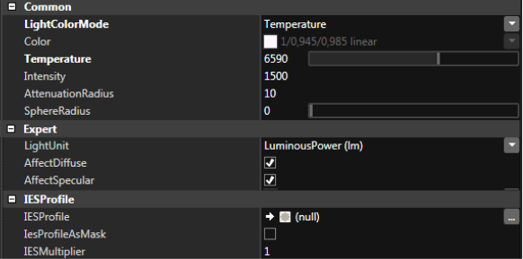{#fig:15}

スペクトルレンダラ(色の表現にRGBではなくスペクトル値を用いるレンダラ)であれば黒体で定義される放射スペクトルを直に用いることができるだろう(脚注13:スペクトルは色相と強度を同時に扱うことができる)。Frostbiteでは、色温度からは色相のみを参照し(脚注14:黒体放射の色温度は現実世界のライトの色全体を網羅しているわけではない)、ライト強度は独立的にアーティストに制御させることとした。色温度から色相を参照することは比較的複雑な処理であり、@Charity2001 が解説している。アーティストはRGBでも指定できる。

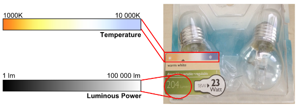{#fig:16}

|ケルビン|光源の種類|知覚する色|
|:-|:-|-|
|1700-1800|マッチの火|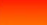|
|1850-1930|ロウソクの火||
|2000-3000|日の出や日の入りの太陽||
|2500-2900|家庭用タングステン電球|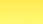|
|3000|500Wから1kW程度のタングステンランプ|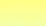|
|3200-3500|水銀灯(Quartz lights)|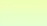|
|3200-7500|蛍光灯|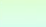|
|3275|2kWのタングステンランプ||
|3380|5kWや10kWのタングステンランプ||
|5000-5400|正午の晴天の太陽(Sun direct at noon)||
|5500-6500|日光(太陽と空)||
|5500-6500|雲や霞越しの太陽||
|6000-7500|曇り空(Sky overcast)||
|6500|RGBモニタ(白の点)||
|7000-8000|屋外の日陰||
|8000-10000|部分的な曇り空(Sky partly cloudy)||
: 色温度と知覚する色。2700°Kから3000°Kを暖色、3500°Kから4100°Kを中間色(neutral colors)、5000°K以上を寒色と呼ぶ。 {#tbl:4}

"ライト強度"は各ライトタイプごとに示される。色温度と強度の両方を用いることで、アーティストはリファレンス値をメーカーのウェブサイトから拾ってきて、Frostbiteに直接突っ込むことができるようになる([@fig:16]参照)。ライト設定には通常の減衰範囲が含まれ、ライトの物理サイズ上で制御する。ライトの物理サイズ(例えば、球の半径、ディスクの半径、チューブの長さ、など)はアーティストにそのライトが**エリアライト**なのか**パンクチュアルライト**なのかを定義できるようにする。[@fig:17]はFrostbiteでサポートするライトを示す。点とスポットはパンクチュアルライトのみで、その他はエリアライトと見なされる。パンクチュアルライトとエリアライトを分けているのはパフォーマンス的な理由であり、Frostbiteはライトタイプ間の円滑な移行をサポートする。

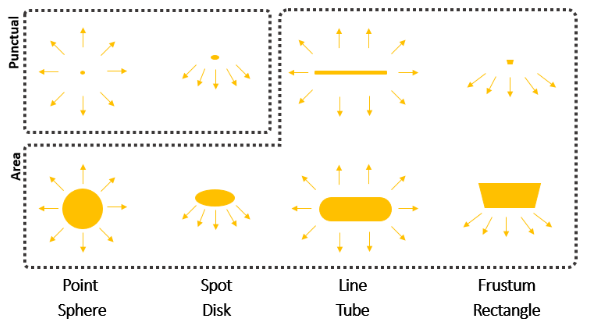{#fig:17}

## ライト単位(Light unit) {id="sec:4.3"}

一貫性のあるライティングを得るには、ライト強度の比率を尊重する、すなわち、共通の単位システムを持つ必要がある。ライト強度は[@fig:18]に示されるように広範囲に及ぶ可能性があり、丁重に扱う(conserve)ことが重要である。知覚されるシーンのリッチさはライティングの正しいバランスに起因する。[@fig:19]は屋内と屋外のライティングをミックスしたものを示す。パイプラインの最後で行う露出処理は広範囲の強度を正規化されたピクセル値に変換する([@sec:5.1]参照)。

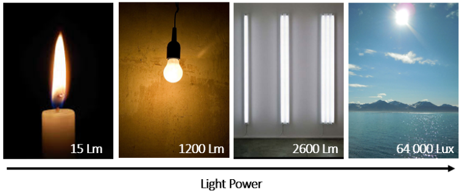{#fig:18}

{#fig:19}

通常はライティングアーティストが太陽のようなリファレンスを任意に定義することによってライト比率をセットアップする。このリファレンスはある強度(通常は5から10の小さな値)を放出するために設定され、他のすべての光源の値はこれをベースに行われる。しかし、大抵の場合でこれらの設定は現在のシーンの状態(地下、屋内、屋外、など)によりバイアスされるため、他のシーンではそのライトリグは使えなくなってしまう。正しいライティング比率を導入するため、Frostbiteではライトに物理単位を採用した。これは以下のことを可能にする。

- さまざまなライトタイプを一貫性を持って取り扱う。
- いくつかの場面でライトリグを再利用する。
- 物理ベースマテリアルからよりよい応答を得る。ハイコントラストなライティングはマテリアルのリッチさを明らかにするのに役立つ。
- 物理ベースカメラを使うことで、写真家の知識を活用する。[@sec:5.1]を参照。

ライト単位はライトの測定に関連しており、以下の2つに分けられる。

- **放射測定(Radiometric)**: "純粋な"物理量を取扱い、光放射測定(optical radiation measurements)やスペクトルレンダリングの文脈で使われる(脚注15:光放射はおおよそ紫外線、可視光、赤外線の放射を含む波長範囲を持つ光学の原則に従う放射である)。
- **測光(Photometric)**: 可視スペクトル内の放射の減少(radiation falling)のみを考慮する。

放射測定と測光により導かれる量は非常に近い関係にある。測光は本質的に人間の目の感度により重み付けされた放射測定である。これら2つの形式は界隈では広く網羅されていきた。最も一般的に使われる放射測定と測光の量は[@tbl:5]にリスト化されている。放射測定量にはエネルギーの添字$e$を用い、測光量にはビジュアルの添字$v$を用いる。

|量|放射測定の項|単位|測光の項|単位|
|:-------|:-----------------|:-------------------|:----------------|:-------------|
|エネルギー|放射エネルギー$Q_e$|$J$(ジュール)|光エネルギー$Q_v$|$lm \cdot s$(ルーメン・秒)|
|パワー|放射束$\Phi_e$または放射量|$\frac{J}{s}$または$W$(ワット)|光束$\Phi_v$または光量|$lm$(ルーメン)|
|量毎立体角|放射強度$I_e$|$\frac{W}{sr}$|光度$I_v$|$\frac{lm}{sr}$または$cd$(カンデラ)|
|量毎面積|放射発散度(radiant exitance)$M_e$または放射照度$E_e$|$\frac{W}{m^2}$|光束発散度$M_v$または照度$E_v$|$\frac{lm}{m^2}$または$lx$(ルクス)|
|量毎面積毎立体角|放射輝度$L_e$|$\frac{W}{m^2 \cdot sr}$|輝度$L_v$|$\frac{lm}{m^2 \cdot sr} = \frac{cd}{m^2}$または$Nit$(ニット)|
: 放射測定量と測光量 {#tbl:5}

人間の目の感度はCIEの測光曲線$V(\lambda)$により表される。これは目が特定の光の波長をどれだけ効率的に拾うかを表した釣鐘型の曲線に従う([@fig:20]参照)。人間の目の感度は緑として現れる555nmをピークとする。この波長で、感度の関数での値は1単位になり、100%の効率を意味している。測光量は以下の可視光(380nmから780nm)上の積分により放射測定量と関連している。

$$
X_v = K_m \int_{380}^{780} X_e(\lambda)V(\lambda)d\lambda
$$ {#eq:7}

定数$K_m$は *明所視における放射の最大スペクトル発光効率(maximum spectral luminous efficacy of radiation for photoscopic vision)* と呼ばれ、その値は光度測定におけるSI単位であるカンデラの定義に基づいている。その定義は「1カンデラは、与えられた方向で、周波数540THz(波長にすると555nm)の単色放射を放ち、この方向での放射強度が$\frac{1}{683} [\frac{W}{sr}]$となる、その光度である」であり、$K_m = 683$であることを意味する。電球の強度を扱うとき、通常は放射量で説明されるため、上の定義は簡単なフレーズに言い換えることができる。つまり「緑色の555nmの光の1ワットは683ルーメンになる」である。測光曲線からはライトの発光効率を推測することもできる。これは「光源から生み出された光がどれだけ見えているか」と解釈できる。発光効率を計算する式は以下のようになる。

$$
\eta = 683 \cdot \frac{\int_{380}^{780} X_e(\lambda)V(\lambda)d\lambda}{\int_{380}^{780} X_e(\lambda)d\lambda}
$$ {#eq:8}

ここで、$\eta$は$[\frac{lm}{W}]$(ルーメン毎ワット)を単位とする。この式は緑(555nm)のライトが683[lm/W]の効率を有することを意味している。これは100%の発光効率と等価である。発光効率はライトタイプごとに異なる可能性がある。つまり、2つの同じワット数を持つライトでも知覚される強度は異なる可能性がある。[@tbl:6]はいくつかの異なるライトの発光効率を示す。

|||
|--------|----------------|
|白熱灯|2%から5%の間|
|LEDライト|0.66%から8.8%の間|
|蛍光灯|9%から15%の間|
|太陽|15%から19%の間|
: いくつかのライトの発光効率(%)。 {#tbl:6}

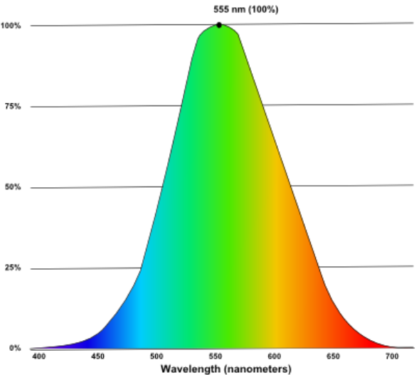{#fig:20}

ゲームのような、非スペクトルレンダリングの文脈では、いくつかの簡略化を用いて放射測定単位と測光単位の変換を容易にすることができる。放射量とライトの発光効率の関係から、ワットからルーメンへ変換することが可能になる。

$$
\Phi_v = \eta \cdot \Phi_e
$$ {#eq:9}

この情報が利用できないときは、ライトは$\eta = 683$で100%の効率になると仮定するのが一般的である。この式は他の量についてしばしば拡張される。

$$
X_v = 683 \cdot X_e
$${#eq:10}

スペクトルレンダラでは、ライトは放射測定単位で表される必要がある。スペクトル加重放射輝度(spectral weighted radiance)を用いるような続きの(successive)処理は放射測定の領域でのみ正しくなる。このスペクトル放射輝度をピクセル値に変換する後のステージは測光的な重み付け処理(自動露出やトーンマッピング)をしばしば必要とする。

**放射測定か測光か(Radiometry or Photometry?)** ほとんどのゲームエンジンのような非スペクトルレンダリングでは、発光効率の情報は放射測定単位と測光単位を行き来するために必要とされる。2つの値(ライト強度と発光効率)を提供することはアーティストに対して複雑さを増加させるため、$\eta = 683$とする仮定を用いることが好ましい。このような近似により、各量は線形に変換できるようになるため量の表現に関わらず処理が同一のものになる。しかし、現実世界で観察されるものと視覚的に一致させるためにエンジンでは現実世界のライト強度を使うことが望まれる。100%の発光効率を仮定すると、この世界は過度に明るいライティングを生み出すため、放射測定のリファレンス値を使うことを妨げる。幸いなことに、市販のライトは測光量でその特徴を提供している。また、[@sec:4.9.1]で述べたように、HDRIはしばしば測光単位(輝度)で提供される。

Frostbiteでは、すべてのライトで測光単位を使っている。これは、レンダリングパイプラインがレンダターゲットに輝度値を格納していることを示している。ライティングの強度は相対的な方法(様々なライトタイプの比率)と絶対的な方法(真のライト単位)で表現することもできる。Frostbiteではメーカーのウェブサイトが提供している値やリファレンス値と一致させることができるため、絶対的な方法で扱ったほうが簡単であることを発見した。

**備考**: あるデバイスでは放射する光を測定することができる。例えば、入射光量計(incident light meter)([@fig:21])では、表面に届く実際の輝度を測定することができる。輝度は露出計(spot meter)や輝度計(luminance meter)でも測定できる。これは本質的に入射光を一方向に制限する不透明なシールドを持つ入射光量計である。我々は光度を直接的に測定することはできないので、光源からの距離を把握した状態で輝度を計測し、逆二乗の法則$luminousIntensity = luminous \cdot distance^2$から等価な光度を計算する必要がある。

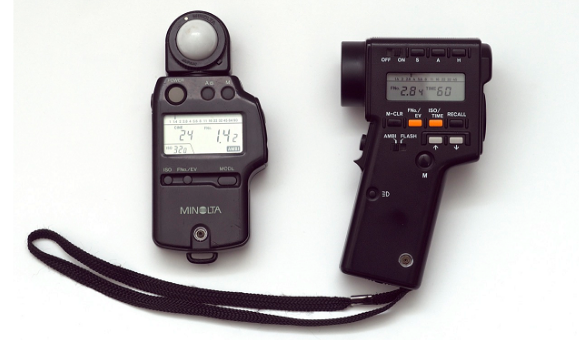{#fig:21}

**EV値(Exposure Value)**: EV値はライト強度を説明するために写真の知識とともにアーティストによりしばしば使われる。もともと、EV値は求められる画のためのカメラの設定(絞りの組み合わせ、シャッタースピード、感度)の集まりである。露出計の助けにより、写真家はカメラフィルムを最大限に使用するように適応したカメラ設定を自動的に決定することができる。詳細は[@sec:5.1]を参照。こんにちのEV値は写真家による主な使い方から外れて(abused from their primary usage)、ライトの単位と化している。これは**F値(f-stop)**と呼ばれ、底を2とした対数スケールで説明される。このスケールはほぼ知覚的に線形である。EV値はライトの単位として設計されていた訳ではないので、その定義は機器ごとのキャリブレーション定数$K$に依存している。

$$
EV = \log_2 \left( \frac{L_{\text{avg}} S}{K} \right)
$$ {#eq:11}

ここで、$L_{avg}$はシーンの平均輝度を、$S$はISOの算術表記(ISO arithmetic)を、$K$は反射光計のキャリブレーション定数を表す。ISO2720:1974では$K$が10.6から13.4の範囲を推奨する。一般用途としての$K$には2つの値がある。すなわち、**12.5**(キャノン、ニコン、セコニック)と**14**(ミノルタ、ケンコ、ペンタックス)である。レンダラでは$K = 12.5$がもっとも一般的に採用されているように見える(脚注19:12.5はおおよそとしてヘッドルーム(ひずみが生じないギリギリの上限)を提供するためのミドルグレーより0.5ストップだけ小さい値である)。[@tbl:7]はEV値と輝度の対応関係を示す。エリアライトやエミッシブライトとしてlog2のライト単位を用いることは高い値を取り扱う上で好ましいことである。アーティストがEV値を単位とすることに慣れているので、我々はオプションの単位として$K = 12.5$によるEV値を採用することに決めた。したがって、EV値から輝度への変換は以下のようになる。

$$
L = \frac{2^{EV} \cdot 12.5}{100} = 2^{EV - 3}
$$ {#eq:12}

[tbl:8]はFrostbiteがサポートすさまざまなライトタイプで使われるライト単位を示す。ライトタイプの各ライト単位が持つそれぞれのアドバンテージは次節で説明する。

|||||||||||||||||||||||
|-|-|-|-|-|-|-|-|-|-|-|-|-|-|-|-|-|-|-|-|-|-|
|$EV_{100}$|-4|-3|-2|-1|0|1|2|3|4|5|6|7|8|9|10|11|12|13|14|15|16|
|輝度|0.008|0.016|0.031|0.063|0.125|0.25|0.5|1|2|4|8|16|32|64|128|256|512|1024|2048|4096|8192|
: $\text{EV}_{100}$(ISO100のときのEV値)と$K = 12.5$のときの対応する輝度($\frac{cd}{m^2}$) {#tbl:7}

|タイプ|単位|
|-:|:-|
|エリア|光量($lm$)、輝度($\frac{cd}{m^2}$)、EV値|
|パンクチュアル|光量($lm$)|
|測光|光度($cd$)|
|エミッシブ表面|輝度($\frac{cd}{m^2}$)、EV値|
|太陽|照度($lx$)|
|空や画像ベース|輝度($\frac{cd}{m^2}$)|
: Frostbiteのさまざまなライトタイプに関連するライト単位。 {#tbl:8}

## パンクチュアルライト(Punctual lights) {id="sec:4.4"}

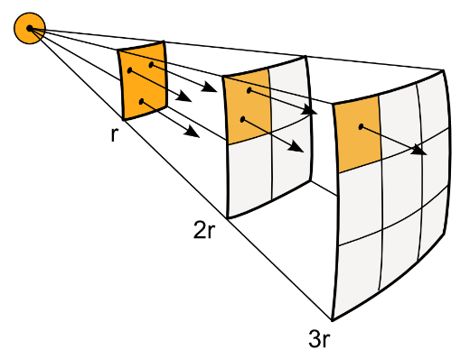{#fig:22}

Frostbiteはポイントライトとスポットライトの2つのパンクチュアルライトのみをサポートする。パンクチュアルライトを物理的に正しくするためには、いわゆる"*逆二乗則(inverse square law)*"に従わなければならない([@fig:22]参照)。逆二乗則はポイントライトでのみ有効で、以下には適用しない。

1. 狭い分布を持つフラッドライトやサーチライト。ライトビームは平行性が強いため(is highly collimated)。
2. エリアライトやフレネルレンズのような特定のライト。

**光量**: 逆二乗則を式にすると以下のようになる。

$$
E = \frac{I}{distance^2}
$$ {#eq:13}

ここで、$I$は光度を、$E$は照度を表す。この式は距離単位がライティング計算を通して均質である(単位が統一されている)ことを必要とする。この値は距離が0に近づくと無限大に近づくが、ライトは常に大きさを持つため現実世界では起こらない。しかし、リアルタイムグラフィクスでは、数値計算の問題を回避するために小さな補正値を加えることが一般的である。パンクチュアルライトは最小の大きさを持つと考え、オブジェクトを絶対にその中に入り込ま(penetrate)せないようにすることは経験から言えば良い方法(good rule of thumb)である。Frostbiteでは、1単位を1mとしてパンクチュアルライトは1cmの大きさを持つと定義する(表記を簡単にするため、この文書で再掲するときは"max"を省略する)。

$$
E = \frac{I}{\text{max}(distance^2, 0.01^2)}
$$ {#eq:14}

Frostbiteでは、アーティストは測光プロファイルにより光量か光度のいずれかを単位としてパンクチュアルのライト強度を制御することができる([@sec:4.5]参照)。光量は常にライティング計算において光度に変換される。光量はライトの立体角上で積分することで光度から計算できる。

- ポイントライト:
$$
\phi = \int_S I d\boldsymbol{l} = \int_0^{2\pi} \int_0^{\pi} I d\theta\phi = 4\pi I
$$ {#eq:15}

- スポットライト(開口角(opening angle)$0 < \theta_{\text{outer}} < \pi$を持つ):
$$
\phi = \int_S I d\boldsymbol{l} = \int_0^{2\pi} \int_0^{\theta_{{\text{outer}}}} I d\theta\phi = 2\pi(1 - \cos\frac{\theta_{\text{outer}}}{2}) I
$$ {#eq:16}

[@eq:16]はコーンの正確な立体角である。この式の帰結として、コーンの角度が小さくなるとライティングがそこに集束するためにより明るく見えるということを示している([@fig:23]参照)。このような関連性(coupling)があることで、アーティストがスポットライトを操作するのが難しくなったり、最適化を行うさいに問題が生じたりする。我々は集束光の関連性を取り除き、反射鏡(spot reflector)が光を吸収するかのように振る舞うシンプルなマスキングとすることを選択した。これらの検討と合わせてディスク型のエリアライトへの移行をスムーズに行うため、Frostbiteではスポットライトの光量を以下のように定義した。

$$
\phi = \pi I
$$ {#eq:17}

パンクチュアルライトにおける光量から光度への変換は[@tbl:9]にまとめられている。万全を期すために、錐台ライトの変換も付け加えている。錐台ライトと線ライトはFrostbiteではエリアライトとして扱われており、数式を使わない。これらはごくまれに使われる程度であり、ポイントライトやスポットライトの効率的なライティングパスを共有することができない。

**ライト計算**: これらの光源のライティング計算は以下により求められる。

- **ポイントライト**:
$$
L_{\text{out}} = f(\boldsymbol{v}, \boldsymbol{l}) E = f(\boldsymbol{v}, \boldsymbol{l}) L_{\text{in}} \langle \boldsymbol{n} \cdot \boldsymbol{l} \rangle = f(\boldsymbol{v}, \boldsymbol{l}) \frac{I}{distance^2} \langle \boldsymbol{n} \cdot \boldsymbol{l} \rangle = f(\boldsymbol{v}, \boldsymbol{l}) \frac{\phi}{4\pi \cdot distance^2} \langle \boldsymbol{n} \cdot \boldsymbol{l} \rangle
$$ {#eq:18}

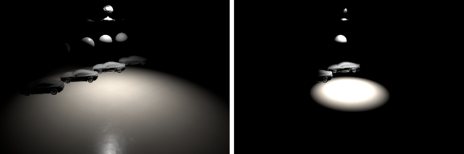{#fig:23}

|||
|------:|--------------------------------|
|ポイント|$\frac{\phi}{4\pi}$|
|スポット|$\frac{\phi}{2\pi(1 - \cos \frac{\theta_{\text{outer}}}{2})}$または$\frac{\phi}{\pi}$|
|錐台|$\frac{\phi}{4 \arcsin \left[\sin(\frac{\theta_a}{2}) \sin(\frac{\theta_b}{2})\right]}$|
: パンクチュアルライトと錐台ライトにおける光量(lm)から光度(cd)への変換。$\theta_{\text{outer}}$、$\theta_a$、$\theta_b$はそれぞれの開口角を表す。 {#tbl:9}

ライト方向に向いている表面の法線を考えると、その照度は逆二乗則に従って以下のようになる。

$$
E_{\perp} = \frac{\phi}{4\pi \cdot distance^2}
$$ {#eq:19}

- **スポットライト**:
$$
L_{\text{out}} = f(\boldsymbol{v}, \boldsymbol{l}) \frac{I}{distance^2} \langle \boldsymbol{n} \cdot \boldsymbol{l} \rangle = f(\boldsymbol{v}, \boldsymbol{l}) \frac{\phi}{\pi \cdot distance^2} \langle \boldsymbol{n} \cdot \boldsymbol{l} \rangle \cdot \text{getAngleAttenuation}()
$$ {#eq:20}

ライト方向に向いている表面の法線を考えると、その照度は逆二乗則(とFrostbiteの慣例)に従って以下のようになる。

$$
E_{\perp} = \frac{\phi}{\pi \cdot distance^2}
$$ {#eq:21}

**測定**: 両者の関係を評価するため、入射光計による一連の測定を行った。そのセットアップは[@fig:24]で説明されている。光量単位の扱いと電球を表すことができるという点光源についての仮定を評価した結果は[@tbl:10]に示す。ルーメンが2倍になると照度も2倍になることに注目して欲しい。Nearestは得られた中で一番高い値を取り出してきたものであり、電球の大きさに依存する。スポットライトの測定は、セットアップがより複雑になり、我々の定義に合わないため、行わなかった。Frostbiteでのポイントライトはすべての強度キャリブレーションのためのリファレンスライトである。これらは現実世界の測定と合致しており、故に信用に値する。

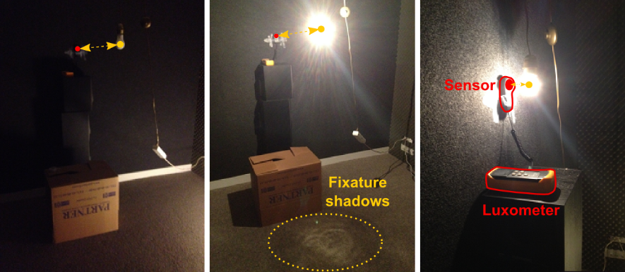{#fig:24}

|電球ブランド|ワット|ルーメン|1m|50cm|25cm|10cm|5.5cm|最も近い(Nearest)|
|-|-|-|-|-|-|-|-|-|
|Dial||625|57|213|940|5800|17000|60000|
|Frostbite||625|50|199|796|4973|16441|?|
|Philips|70から92|1200|122|440|1800|12000|33000|130000|
|Frostbiite||1200|95|382|1528|9549|31568|?|
: 入射光計による現実世界での電球の測定とインゲーム値の比較。 {#tbl:10}

**減衰(Attenuation)**: 逆二乗則が抱える問題のひとつは絶対にゼロに到達しないことである。パフォーマンス的な理由から、レンダラはライトカリングのアルゴリズムをサポートするために有限のライト範囲を実装しなければならない。ある限界点で、照度は滑らかにゼロに達するべきである。これを解決するアプローチのひとつはほとんどの関数に影響を与えないような方法[@Karis2013]でフォールオフに窓関数を用いることである。これのために、我々は距離基準(distance criteria)に基づくゼロへの基本的な線形補間を用いる。

$$
E = \text{lerp} \left( \frac{I}{distance^2}, 0, \frac{distance}{lightRadius} \right) = \frac{I}{distance^2} \left(1 -  \frac{distance}{lightRadius} \right)
$$ {#eq:22}

そして、関数を変化しないようにするため、距離基準を微調整すると以下のようになる。

$$
E_{\text{window2}} = \frac{I}{distance^2} \left(1 -  \frac{distance^{20}}{lightRadius^{20}} \right)
$$ {#eq:23}

このシンプルなアプローチはうまくいくが、不自然に見える強めのカットオフを生じる。次のアプローチはしきい値により関数をバイアスして0から1の初期範囲にリマップする[@Madams2011]。

$$
threshold = \frac{1}{lightRadius^2}
$$ {#eq:24}
$$
E_{\text{scaleBias}} = \frac{1}{1 - threshold} \left( \frac{I}{distance^2} - threshold \right)
$$ {#eq:25}

結果は良いが、このアプローチは0地点における勾配が0ではないことでビジュアルに不連続性が生まれてしまうために苦労する。より良いアプローチは窓関数を用いて$lightRadius$地点における勾配が0になるよう保証することである。[@fig:25]を参照のこと。

$$
E_{\text{window1}} = \frac{I}{distance^2} \text{saturate} \left( 1 - \frac{x^n}{lightRadius^n} \right)^2
$$ {#eq:26}

![照度: 左のグラフはDistance軸を横切るときの不連続性を強調した様々な窓関数を示す。Window1は[@Karis2013]で使われているもの。Window2は非連続性の問題を持つ。Window3はなだらか。中と右のグラフは個々のライト半径10と40のフォールオフに適用された窓関数を示す。](assets/Figure25.png){#fig:25}

$n$は遷移の滑らかさを調整することができる。我々はFrostbiteにおいて @Karis2013 によって示されたものと同じような$n = 4$とした場合のWindow1を採用した。このスムージング関数はすべてのパンクチュアルライトとエリアライトで採用されている。しかし、lerpの基準(criteria)は放射状である($\frac{x^2}{d^2}$)ので、チューブや矩形ライトのような球でない形ではうまくいかない。我々はパフォーマンス的な理由によりこのトレードオフを許容する。アーティストは正確さが必要とされる場面ではライト半径を拡大することができる。

[@lst:4]はこの節で述べた様々な主題の結果のコードを示す。

Listing: 減衰。

~~~ {.c .numberLines id="lst:4"}
float smoothDistanceAtt(float squaredDistance, float invSqrAttRadius) {
    float factor = squaredDistance * invSqrAttRadius;
    float smoothFactor = saturate(1.0f - factor * factor);
    return smoothFactor * smoothFactor;
}

float getDistanceAtt(float3 unnormalizedLightVector, float invSqrAttRadius) {
    float sqrDist = dot(unnormalizedLightVector, unnormalizedLightVector);
    float attenuation = 1.0 / max(sqrtDist, 0.01 * 0.01);
    attenuation *= smoothDistanceAtt(sqrDist, invSqrAttRadius);
    return attenuation;
}

float getAngleAtt(float3 normalizedLightVector, float3 lightDir, float lightAngleScale, float lightAngleOffset) {
    // CPUで以下を計算しておく。
    // float lightAngleScale = 1.0f / max(0.001f, (cosInner - cosOuter));
    // float lightAngleOffset = -cosOuter * angleScale;

    float cd = dot(lightDir, normalizedLightVector);
    float attenuation = saturate(cd * lightAngleScale + lightAngleOffset);

    // 遷移を滑らかにする。
    attenuation *= attenuation;

    return attenuation;
}

// パンクチュアルライトを処理する。
float3 unnormalizedLightVector = lightPos - worldPos;
float3 L = normalize(unnormalizedLightVector);
float att = 1;
att *= getDistanceAtt(unnormalizedLightVector, lightInvSqrAttRadius);
att *= getAngleAtt(L, lightForward, lightAngleScale, lightAngleOffset);

// lightColorは出射する輝度×ユーザのライト色である。
// つまり、ポイントライトと光量単位だと: lightColor = color * phi / (4 * PI)
float3 luminance o  BSDF(...) * saturate(dot(N, L)) * lightColor * att;
~~~

## 測光ライト(Photometric lights) {id="sec:4.5"}

測光ライトはそれらの強度分布を説明するために測光プロファイルを使う。これらの分布は測光ファイルにに格納されており、ファイルフォーマットとして*IES*と*EULUMDAT*2つが一般的に存在する。これらはシンプルなASCIIファイルである。

- **IES**: IESはIlluminating Engineering Societyの頭文字で、ウェブ上で測光データを配信するために作られた。北米では最も人気があり、ヨーロッパでも広く使われている。
- **EULUMDAT**: EULUMDATはヨーロッパの標準規格であり、ヨーロッパではデファクトスタンダードとなっているが、一般に認められた標準化団体が存在しない。

多くの照明メーカーは自身のウェブサイトで自由に利用可能な測光ファイルを提供している。例えば、[Lithonia Lighting](http://www.lithonia.com)はIESとEULUMDATのファイルの広大なライブラリを持っている。

{#fig:26}

両フォーマットは様々な角度に対する光度を格納する。これらは研究機関でライトセンサを使って測定され、光源の周りを球状に広がり、球の中心を指し示す。このキャプチャ手法により、すべてのランプは点光源として考えられる([fig:26]を参照)。物理的に正確な結果を得るため、IES/EULUMDATファイルは小さな球の上に適用されるにとどめるべきである。IES/EULUMDATファイルを小さい球でないジオメトリに適用すると、手法やフォーマット定義に固有の不正確さが生じる可能性がある。ライト分布を説明するために使われる球面座標系は"*フォトメトリック・ウェブ(the photometric web)*"と言われる。これらは3つの異なるタイプのフォトメトリック・ウェブがあり、タイプA、B、Cと呼ばれる。

- **タイプA**: 車のヘッドライトや信号灯用。
- **タイプB**: 調整可能な屋外エリアやスポーツの照明器具用。
- **タイプC**: 建築や道の明かり用。

実践では、タイプAとBはまれに用いられ、タイプCはコンピュータグラフィクスで最も一般的に用いられる。

**IES** フォーマットはその構造が理解しにくい形でカンデラとして光度値を格納する。これはこのフォーマットがサポートする絶対的光度と相対的強度の両方に適用される。絶対的光度はLED器具で必要になり、相対的光度はコンピュータグラフィクスや昔ながらのライト(蛍光灯、白熱灯、ハロゲン、など)において最も一般的なケースである。このフォーマットにはIES-LM-63-86からIES-LM-63-2002までの5つの異なる仕様がある。すべてのフォーマットをサポートするIESパーサを書くことは簡単な仕事ではなく、コンピュータグラフィクスで使われるいくつかのファイルは不完全でありフォーマットに反しているように見える。その仕様は自由にアクセスできるわけではなく、いくつか不明な範囲が存在する。具体的には、水平な回転の方向をに伴う測光タイプAとBに関するIESNAの文献にいくつかの混乱がある。IESに関するこんにちの最良の資料はHelios32というウェブサイト[@Ashdown1999]と彼の関連する文書であるように思われる。IESパーサを書くための良い資料はHelios32を管理している @Ashdown1998 によって書かれている。IESファイルを可視化するために、最も人気のあるビュアーはIESviewerである[@Legotin2001]。一方で**EULUMDAT**フォーマットはライトによって放出される総キロルーメンあたりのカンデラにより光度値を格納するという良く構造化されたフォーマットである。

$$
\text{総キロルーメンあたりのカンデラ}(\frac{cd}{klm}) = \frac{1000 \cdot \text{光度}(cd)}{\text{総光束}(lm)}
$$

この特質は重要であり、いくつかの明確化を行うのに必要である。IESファイルは相対的光度と絶対的光度の両方に対してカンデラ値を格納する。絶対的光度と相対的光度の両方に対してEULUMDATファイルからカンデラ値を取り出すには、以下の変換を施す必要がある。

$$
\text{光度}(cd) = \frac{\text{総キロルーメンあたりのカンデラ}(\frac{cd}{klm}) \cdot \text{総光束}(lm)}{1000}
$$

EULUMDATフォーマットはより複雑な器具(fixture)や色温度のような追加情報を格納することができる。EULUMDATフォーマットをメンテナンスする団体がおらず、その仕様は1990年からほとんど変わらないままである。公式なファイルフォーマットの出版物がなく、唯一の仕様のひとつはHelios32のウェブサイト[@Ashdown1999]より取得可能である。ビジュアライザや文書を含む良いツールセットがEulumdat Toolsのウェブサイト[@FOLD2003]にて取得可能である。

Frostbiteでは、開発にかけられる時間が少なかったため、その欠点に関わらずIESフォーマットのみをサポートすることにした。コンピュータグラフィクスで普及していると思われるのも理由のひとつである。IESファイルから生成した測光プロファイルは直接ポイントライトやスポットライトに適用することができる。IESプロファイルはライト強度を記述するのに使うこともでき、乗数(multiplier)で調整することができる。これは光度でライトを制御する唯一の方法である。もうひとつの選択肢はIESプロファイルをプロファイルの最大光度で正規化されたマスクとして使うことである。光度のポイントライトの数式で両方のケースを扱うため、我々は最大光度でプロファイルを正規化し、以下の式でポイントライトの評価を行う。

$$
L = f(\boldsymbol{v}, \boldsymbol{l}) \frac{I}{d^2} \langle \boldsymbol{n} \cdot \boldsymbol{l} \rangle \text{getIESProfileAttenuation}()
$$ {#eq:27}

$I$はプロファイルの最大光度かマスク用のユーザ定義ライト強度のいずれかを表す。$\text{getIESProfileAttenuation}$関数は正規化されたプロファイル値を返す。スポットライトでは、角度による減衰がこの式の外にかけられる。よりタイトな形はより進んだ最適化を可能にし、単純なプロファイルのために便利である([@fig:27]参照)。

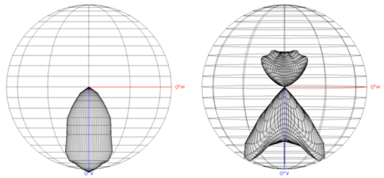{#fig:27}

新しいライトプロファイルを作るとき、球面測光関数は球面パラメータ化$(\theta, \cos(\phi))$により2Dテクスチャを埋めるため再構築されサンプルされる(脚注27:三次スプライン曲線を使って水平な角度を補間することを推奨する(水平な角度の360°の全範囲が指定されているか否かによって開けたり閉めたりする)[Ashdown2014]。)。我々はマスク的な使い方とそうでない使い方の両方を扱うために最大光度の逆数によりスケールされた正規化済みの値を格納する。シェーダでは、2Dテクスチャが評価され、減衰として適用される([lst:5])。

~~~ {.c .numberLines id="lst:5"}
float getIESProfileAttenuation(float3 L, ShadowLightInfo light) {
    // ライト空間へのサンプル方向
    float3 iesSampleDirection = mul(light.worldToLight, -L);

    // デカルト座標から球面座標へ
    // テクスチャはcos(phi)にエンコードされ、[-1, 1]から[0, 1]へスケールされる。
    float phiCoord = (iesSampleDirection.z * 0.5f) + 0.5f;
    float theta = atan2(iesSampleDirection.y, iesSampleDirection.x);
    float thetaCoord = theta * FB_INV_TWO_PI;
    float3 texCoord = float3(thetaCoord, phiCoord, light.lightIndex);
    float iesProfileScale = iesTexture.SampleLevel(sampler, texCoord, 0).r;

    return iesProfileScale;
}

att *= getAngleAtt(L, lightForward, lightAngleScale, lightAngleOffset);
att *= getIESProfileAttenuation(L, light);
// lightColorは選択に依存する。
// マスクでない: lightColor = color * MaxCandelas
// マスク(光量によるポイントライト用): lightColor = color * phi / (4 * PI);
float3 luminance = BSDF(...) * saturate(dot(N, L)) * lightColor * att;
~~~
: IESプロファイルのサンプル。

**なぜIESプロファイルを使うのか？** IESプロファイルはゲームよりも建築の設計でより役に立つ。しかし、マスクとしてライトプロファイルを使えるようになると、面白い使い方が生まれてくる。例えば、IESプロファイルはあるツールでアーティストが作成することができ、複雑なシャドウをシミュレートするのに使うことができる([@fig:28])。これはcookie[^cookie_textures]テクスチャに似ているが、異なるパラメータ化によるものである。

[^cookie_textures]: ここでの*cookie*は*cucoloris*とも呼ばれ、光源に意図した影を落とさせるための遮蔽用マスクを指す。([参考1](https://docs.unity3d.com/ja/current/Manual/Cookies.html)、[参考2](https://en.wikipedia.org/wiki/Cucoloris))

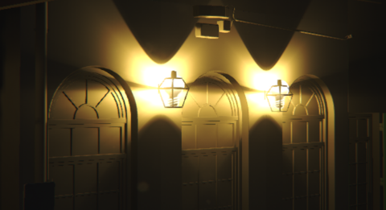{#fig:28}

## 太陽(Sun) {id="sec:4.6"}

太陽は、特に屋外環境では重要な光源であり、非常に高い値([@tbl:11]参照)を持つ一方で、非常に小さな立体角をカバーする。この構成では法線の向きと変化に過敏に反応する。マテリアルのディフューズ部分のためのパンクチュアルライトとしてこのような光源を検討することは許容されるべき近似であるが、スペキュラ部分にこれをすると鏡のような表面で問題を引き起こす。Frostbiteでは、この問題を部分的に緩和する(alleviate)ために、太陽を常に外側の半球に垂直なディスク型エリアライトとして扱う。

アーティストは太陽の方向に垂直な表面に対して太陽の照度(ルクス)を指定する。これは([@tbl:11]のような)光計を用いなければならない現実世界とは反対に直接的に値を確認できるために便利である。その計算は以下のように単純化される。

$$
L_{\text{out}} = f(\boldsymbol{v}, \boldsymbol{l}) E = f(\boldsymbol{v}, \boldsymbol{l}) E_{\perp} \langle \boldsymbol{n} \cdot \boldsymbol{l} \rangle
$$ {#eq:28}

ここで、$E_{\perp}$はアーティストにより与えられる照度値である。[@lst:6]は太陽を評価するための関数を示す。ディフューズ部分は太陽がパンクチュアルであるかのように照らされ、スペキュラ部分は太陽の形を計算に入れている。

|時間|9:00|10:00|11:00|12:00|13:00|14:30|17:00|18:30|
|-|-|-|-|-|-|-|-|-|
|空+太陽|85500|88000|101600|110000|113600|109300|77000|39800|
|空|25700|19700|20100|19300|19600|25500|29000|14000|
|太陽|59800|68300|81500|90700|94000|83800|48000|25800|
|空+太陽$\perp$|||||150400|145400|142500|99000|
|空$\perp$|||||27300|29000|36000|20000|
|太陽$\perp$|||||123100|116400|106500|79000|
: 光計で測定された太陽と空の照度値(ルクス)の例。$\perp$なしは水平方向での測定を、$\perp$ありは太陽方向での測定を表す。測定場所はストックホルムで、6月に行った。 {#tbl:11}

~~~ {.c .numberLines id="lst:6"}
float3 D = sunDirection;
float r = sin(sunAngularRadius);  // ディスク半径
float d = cos(sunAngularRadius);  // ディスクまでの距離

// ディスクへの最も近い点(半径が小さいため、良い近似となる)
float DdotR = dot(D, R);
float3 S = R - DdotR * D;
float3 L = DdotR < d ? normalize(d * D + normalize(S) * r) : R;

// ディフューズとスペキュラの評価。
float illuminance = sunIlluminanceInLux * saturate(dot(N, D))

// D: ディフューズ方向
// S: スペキュラ法苦
luminance = BSDF(V, D, L, data) * illuminance;
~~~
: ディスク型エリアライトとしての太陽の評価。

**備考**: 現時点では正しいエネルギー保存ファクタを見つけられていないため、このディスク型エリアライトはエネルギー保存則を満たしていない。空からのライティングは遠方のライトプロブとして扱う([@sec:4.9]参照)。

## エリアライト(Area lights) {id="sec:4.7"}

エリアライトは光源が物理的な形状を持つ現実世界のライティングと一致させるために物理ベースレンダリングにおいて重要である。この形状はアーティストが表面のマテリアル特性、特にラフネスを簡単に把握することができるようにする。以前にパンクチュアルライトを使っていた頃は、アーティストは無限小のスペキュラハイライトを表面のラフネスを調整することで隠す傾向があり、故にライティングとマテリアルが結合していた。パンクチュアルな発生源は光源の良い近似となり得るが、文脈(距離、関与媒質、など)に依存する。後に見ることになるだろうが、エリアライトはIBLと概念的に近いため相互作用を容易に行うことができる。より重要なことは、エリアライトはさらに柔らかいライティングを生み出し、スペキュラエイリアシングを低減する。

{#fig:29}

Frostbiteでは、球、ディスク、チューブ、矩形といった様々なエリアライト形状をサポートする。エリアライトによって照らされているある点の出射する輝度は以下で与えられる。

$$
L_{\text{out}} = \int_{\Omega^+} f(\boldsymbol{v}, \boldsymbol{l}) V(\boldsymbol{l}) L_{\text{in}} \langle \boldsymbol{n} \cdot \boldsymbol{l} \rangle d\boldsymbol{l} = \int_{\Omega_{\text{light}}} f(\boldsymbol{v}, \boldsymbol{l}) L_{\text{in}} \langle \boldsymbol{n} \cdot \boldsymbol{l} \rangle d\boldsymbol{l}
$$ {#eq:29}

関数$V$は陰影が付けられる点からエリアライトが到達可能であれば$1$、そうでなければ$0$となる。関数$V$はエリアライトの形状とそのシャドウの両方を勘定に入れることができる。この節ではエリアシャドウを考慮しない。これは[@sec:4.10.4]で述べる。故に、$V$はライト形状の可視性のみ表現し、$\Omega_{\text{light}}$はエリアライトに対する立体角を表す。この立体角上の積分は面積上の積分として書き直すことができる[@Pharr2016]([@fig:30]を参照)。

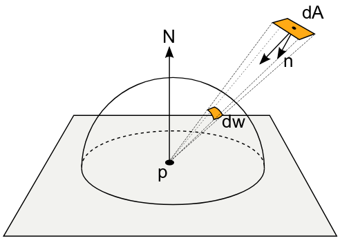{#fig:30}

$$
L_{\text{out}} = \int_A f(\boldsymbol{v}, \boldsymbol{l}) L_{\text{in}} \frac{\langle \boldsymbol{n} \cdot \boldsymbol{l} \rangle \langle n_a \cdot -l \rangle}{distance^2} dA
$$ {#eq:30}

この式は常に解析解を持つわけではないが、Monte Carloと重点サンプリングにより数値積分できる。我々は[@sec:2]で述べたようにすべてのエリアライトを重点サンプリングするインエンジンリファレンスを実装した。このコードは[@sec:A]で提供される。当然だが、この種の計算はプロダクション用としては高価すぎるので、我々はこれらの近似を開発した。インエンジンリファレンスモードは近似の正確性を確かめるための貴重なツールとなった。

ディフューズライティングとスペキュラライティングの積分はエリアライトのタイプについて別々に記述される。

$$
L_{\text{out}} = \int_{\Omega_{\text{light}}} f_d(\boldsymbol{v}, \boldsymbol{l}) L_{\text{in}} \langle \boldsymbol{n} \cdot \boldsymbol{l} \rangle d\boldsymbol{l} = \int_A f_d(\boldsymbol{v}, \boldsymbol{l}) L_{\text{in}} \frac{\langle \boldsymbol{n} \cdot \boldsymbol{l} \rangle \langle n_a \cdot -\boldsymbol{l} \rangle}{distance^2} dA
$$ {#eq:31}

$$
L_{\text{out}} = \int_{\Omega_{\text{light}}} f_r(\boldsymbol{v}, \boldsymbol{l}) L_{\text{in}} \langle \boldsymbol{n} \cdot \boldsymbol{l} \rangle d\boldsymbol{l} = \int_A f_r(\boldsymbol{v}, \boldsymbol{l}) L_{\text{in}} \frac{\langle \boldsymbol{n} \cdot \boldsymbol{l} \rangle \langle n_a \cdot -\boldsymbol{l} \rangle}{distance^2} dA
$$ {#eq:32}

**備考**: この文書で表されるエリアライトは執筆時点ではプロダクションで使われていない。これらはシネマティクスのような30FPSのゲームを対象とすることを目標としており、非最適化バージョンを提供するのみとなっている。

### エリアライトの単位(Area light unit) {id="sec:4.7.1"}

物理的なライト単位に伴い、エリアライトの大きさとその強度はお互いに繋がっている。アーティストは2つの強度単位から選択することができる。

- **光量**: ルーメン(lm)で表される光量は、ライトによってすべての方向に放たれる可視光の総量を記述する。この量はライトの大きさに対して独立である。ライトのサイズが大きくなってもシーンの照明レベルは変化しないが、その面積が大きくなると同じ光量でより広い範囲に広がるため、ライトが生み出すハイライトは暗くなる([@fig:31]の上段を参照)。
- **輝度**: ニット($\text{cd}/\text{m}^2$)またはEV値で表される輝度は可視光の表面光量を記述する。この単位が使われるとき、ライトにより放たれるエネルギー総量はそのサイズに依存する。シーンの照明レベルはその面積が増加するごとに上昇するが、そのようなライトが生み出すハイライトは強度を保存する([fig:31]の下段を参照)。

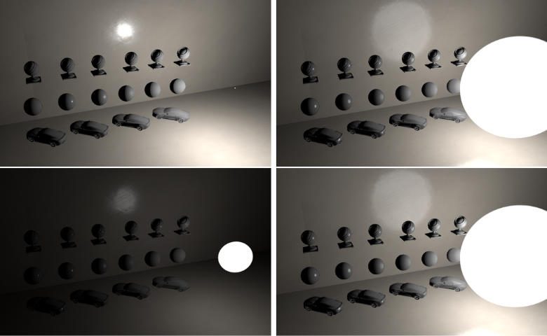{#fig:31}

実践では、アーティストはエリアライトのセッティングとして輝度をめったに使用しない。ディスプレイのような、表面全体に均等に光を放出する平坦なディフューズ表面においてほぼ適切である。

利便性のため、我々はライティング計算において強度を輝度に対象的に変換する。任意の方向に放たれる、ランバートエミッタ(脚注30:ランバートエミッタ(Lambertian emitter)はコサイン分布に従う放射輝度分布を持つ光源である)上の点における輝度はエミッタの面積$A$と射影した立体角で割ったその総光量$\phi$に等しい。

$$
L = \frac{\phi}{A \int_{\Omega^+} \langle \boldsymbol{l} \cdot \boldsymbol{n} \rangle d\boldsymbol{l}} = \frac{\phi}{A \pi}
$$ {#eq:33}

光量から輝度への変換式は[tbl:12]に示す。EV値から輝度への変換は[@sec:4.3]で詳しく述べている。

|||
|-:|:-|
|球|$\frac{\phi}{4 r^2 \pi^2}$|
|ディスク|$\frac{\phi}{r^2 \pi^2}$|
|チューブ|$\frac{\phi}{(2\pi rl + 4 \pi r^2) \pi}$|
|矩形|$\frac{\phi}{\pi wh}$|
: Frostbiteのライトのための光量(lm)から輝度(cd/m^2)への変換式。ここで、$r$は半径を、$l$はチューブの長さを、$w$と$h$は矩形の幅と高さを表す。 {#tbl:12}

では、パンクチュアルライトが輝度単位を用いない理由をより明らかにする。エリアライトでライティングを計算するとき、我々はライト面積上の積分を効率的に計算して輝度を扱う。ただし、パンクチュアルライトは面積を持たないので、光度に頼ることになる。しかし、Frostbiteでは、パンクチュアルライトとエリアライトは同じインターフェースを共有する。この共通のインターフェースをサポートするため、我々は、アーティストがその強度を制御するために輝度単位を指定した場合、パンクチュアルライトを1cmのエリアライトへ自動的に格上げする(promote)ことにした。輝度単位はほとんど使われないため、このハックはパフォーマンスを傷つけない。パンクチュアルライトとすべきラインライトや錐台ライトもその複雑さのためにエリアライトとして考え、それぞれチューブライトと矩形ライトとの差異は存在しない。

### ディフューズエリアライト(Diffuse area lights) {id="sec:4.7.2"}

#### 一般(General) {id="sec:4.7.2.1"}

当初、我々はDisneyのディフューズBRDFのケースを見つける前だと、ランバートディフューズBRDF$\frac{\rho}{\pi}$でエリアライトの積分を解決すると考えた。エリアライトが均一な定数の強度$L_{\text{in}}$を持つと仮定することも考えられた。つまり、[@eq:31]のディフューズライティング積分は以下のように書き換えられる。

$$
L_{\text{out}} = \frac{\rho}{\pi} \int_{\Omega_{\text{light}}} L_{\text{in}} \langle \boldsymbol{n} \cdot \boldsymbol{l} \rangle = \frac{\rho}{\pi} E(n)
$$ {#eq:34}

ここで、放射照度$E$は以下で定義される。

$$
E(n) = \int_{\Omega_{\text{light}}} L_{\text{in}} \langle \boldsymbol{n} \cdot \boldsymbol{l} \rangle d\boldsymbol{l} = \int_A L_{\text{in}} \frac{\boldsymbol{n} \cdot \boldsymbol{l} \rangle \boldsymbol{n_a} \cdot \boldsymbol{-l} \rangle}{distance^2} dA
$$ {#eq:35}

[@sec:4.4]の[@eq:13]に見られるように、放射照度計算における逆二乗則は、このエリアライトが受け取り手である表面から十分に遠く離れている場合を除き、エリアライトにおいて正しくない([@sec:4.7.3]参照)。故に、エリアライトの放射照度を計算するため、我々は[@eq:35]を解決する必要がある。

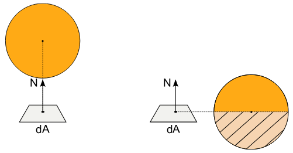{#fig:32}

エリアライトは大きな立体角にまたがったり、一部が陰影付けされる点の地平線の下に行くことさえあり得る。この場合、エリアライトのライティングはオブジェクトを回り込む(wrap around)ため、柔らかい見た目になる。この"地平線の場合"を正しく扱わないと、その回り込むライティング(wapped lighting)の強度は不正確になり、エリアライトで照らされているようには見えなくなる([@fig:32; @fig:33]参照)。[@eq:35]を解くための手法がいくつか存在する。あるものは陰影付けされる点から小さい立体角に対するエリアライトでのみ正しい。これは地平線と交差しない。もうひとつは地平線の場合を扱うが、強度が不正確になる。次節では、正しい強度を持った大きいエリアライトの場合を解決するかどうかの"*地平線を正確に扱う(correctly handling the horizon)*"手法を述べる。

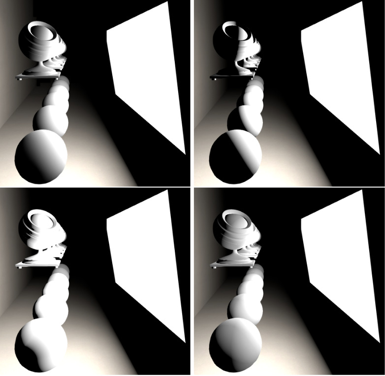{#fig:33}

**解析的積分**: 積分は複雑であるが、ある制約の下では、解析解が存在する。幸いにも、その他の構成やライトタイプの解は*光輸送(light transport)*と*伝熱(heat transfer)*の二分野で利用可能である。光輸送では、ラジオシティの体系で使われる、2つの差分領域$P_i$、$P_j$の間のよく知られた*フォームファクタ(form factor)*が以下のような形で定義される。

$$
\text{FormFactor} = \int_{x \in P_i} \int_{y \in P_j} \frac{\cos\theta \cos \theta'}{\pi r^2} V(x, y) dx dy
$$ {#eq:36}

この式は[@eq:35]の一般形式である。これは他の表面により陰影付けされる表面を扱う一方で、[@eq:35]は表面により陰影付けされる点を扱う。ラジオシティの体系では表面により陰影付けされる点に対する様々な解法が提供される。式中の$\frac{1}{\pi}$はLambertのBRDFに由来することに注意したい。これは、これを打ち消すための$\pi$によるフォームファクタに基づいた解析解をかける必要があろうことを意味するため、重要である。そのため、我々の場合では、放射照度の定義は$\frac{1}{\pi}$を含まない。

$$
E(n) = \int_{\Omega_{\text{light}}} = L_{\text{in}} \langle \boldsymbol{n} \cdot \boldsymbol{l} \rangle \pi \text{FormFactor}
$$ {#eq:37}

放射輸送(radiative transfer)では、*形態係数(view factor)* と呼ばれる等価な数式が存在する。$F_{a \to b}$で示される形態係数は表面Aを離れて表面Bに当たる放射の割合である。伝熱の分野は様々な表面形状から放射を受け取る点に対するいろいろな解析解を提供する[@Howell2015]。単純化のため、意味論的に異なっていたとしてもこれらは同じ式を共有するので、*フォームファクタ*と*形態係数*の両方を**フォームファクタ**と述べることにする。フォームファクタの式は正確な地平線ハンドリングを持つことも持たないこともできる。我々は球とディスクのエリアライトのためにフォームファクタの手法を採用することを選択した。万全を期すために、我々は[@sec:E]に矩形ライトのものも提供するが、これは採用しなかった。ほとんどのフォームファクタの式は複雑である。我々はここの式を再現せず、対応するコードリストのみを提供するのみとした。詳細は参考文献を参照のこと。

#### 球型エリアライト(Sphere area lights) {id="sec:4.7.2.2"}

- @Quilez2006 は地平線の場合を扱わない解を提供している。これは [@Martinez2014]て提供される"正面の球へのパッチ(Patch to a sphere frontal)"の構成と似ている。Quilezのバージョンは球型エリアライトの中心が表面の法線に平行でない場合の扱いができるようにするための追加の$\langle \boldsymbol{n} \cdot \boldsymbol{l} \rangle$を持つ。しかし、地平線の上だけでは十分ではなく、数式は地平線より上の対応する小さな立体角でのみ働く([@fig:36]参照)。
- [@Martinez2014]でもたらされる"傾いた球へのパッチ(Patch to a sphere tilted)"の構成は地平線の場合を正しく扱う。その他では @Snyder1996 による式がある。

"正面の球へのパッチ"と"傾いた球へのパッチ"は[@fig:34]に表される。Quilezの式と"傾いた球へのパッチ"は[lst:7]に報告され、結果は[@fig:35]に示される。

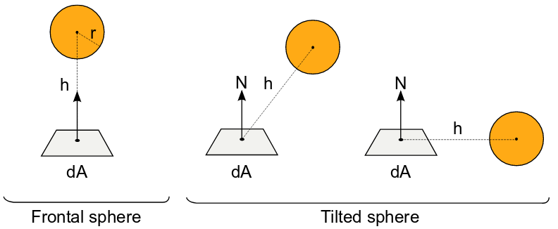{#fig:34}

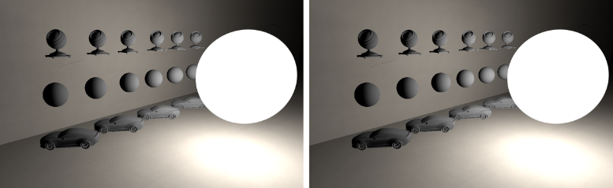{#fig:35}

~~~ {.c .numberLines id="lst:7"}
float3 Lunormalized = lightPos - worldPos;
float3 L = normalize(Lunormalized);
float sqrDist = dot(Lunormalized, Lunormalized);

#if WITHOUT_CORRECT_HORIZON  // 地平線より上での解析解

// "正面の球へのパッチ"の式(Quilezのバージョン)
float sqrLightRadius = light.radius * light.radius;
// オブジェクトをライトに入り込ませない(max)
// "FB_PI *"はフォームファクタの式に含まれる(1/FB_PI)を打ち消す
float illuminance = FB_PI * (sqrLightRadius / (max(sqrLightRadius, sqrDist))) * saturate(dot(worldNormal, L));

#else  // 地平線ありの解析解

// "傾いた球へのパッチ"の式
float Beta = acos(dot(worldNormal, L));
float H = sqrt(sqrDist);
float h = H / radius;
float x = sqrt(h * h - 1);
float y = -x * (1 / tan(Beta));

float illuminance = 0;
if (h * cos(Beta) > 1) {
    illuminance = cos(Beta) / (h * h);
} else {
    illuminance = (1 / (FB_PI * h * h)) * (cos(Beta) * acos(y) - x * sin(Beta) * sqrt(1 - y * y)) + (1 / FB_PI) * atan(sin(Beta) + sqrt(1 - y * y) / x);
}

illuminance *= FB_PI;

#endif
~~~
: 球型エリアライトの放射照度。

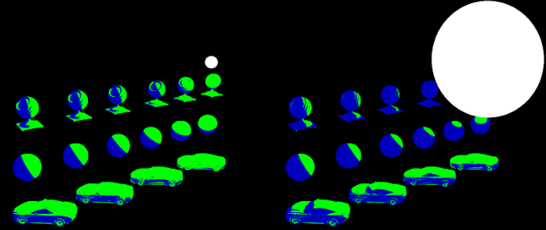{#fig:36}

**備考**: [@sec:4.7.1]は光量単位を使うと照明レベルをライト面積から独立させるということに言及している。(一般性を失わずに)地平線ハンドリングをしない式を使うことで、光量$\phi$を伴う球型エリアライトの照度は以下で求められる。

$$
E = L_{\text{in}} \pi \text{FormFactor} = \frac{\phi}{4 \pi^2 r^2} \pi \frac{r^2}{d^2} \langle \boldsymbol{n} \cdot \boldsymbol{l} \rangle = \frac{\phi}{4\pi d^2} \langle \boldsymbol{n} \cdot \boldsymbol{l} \rangle
$$ {#eq:38}

この式は($\langle \boldsymbol{n} \cdot \boldsymbol{l} \rangle = 1$としたときの)ポイントライトの照度([@eq:19])と一致し、球表面の面積と独立している。これは[@sec:4.4]の現実世界の測定結果とも一致する。

#### ディスク型エリアライト(Disk area lights)

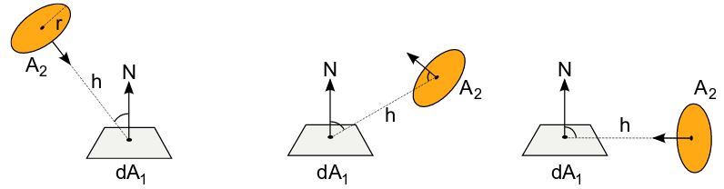{#fig:37}

- @Coombe2005 は向きを持ったディスクに対する正確な地平線ハンドリングを持たない解法を提案する。球のときと同じように、地平線の上だけでは十分ではなく、数式は地平線より上の小さな対応する立体角と制約方向(constraint orientation)でのみ働く。
- 放射輸送の一覧表(catalogue)の構成[@Howell2015]は地平線の場合を正しく扱うが、傾いた平面と方向を持たないディスクに限られる([@fig:37]参照)。ディスクの方向を計算に入れるため、我々は数式にライト平面の法線$\boldsymbol{n}_{\text{light}}$を持つ追加の$\langle \boldsymbol{n}_{\text{light}} \cdot -\boldsymbol{l} \rangle$をかける。この追加は制限された方向の中での地平線の上と小さな対応する立体角でリファレンスと一致させることができるが、その他の場合では小さな食い違い(discrepancy)がある。我々の目的では十分に良い結果を出している。

これら2つのケースの式は[@lst:8]に報告され、結果は[@fig:38]に示される。

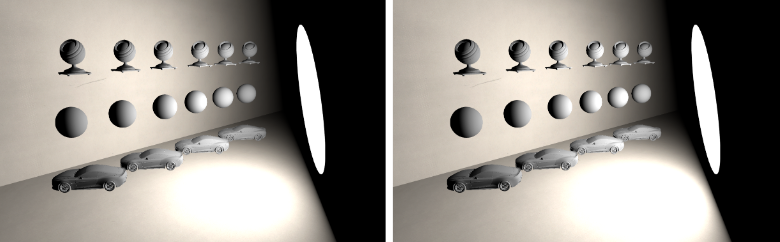{#fig:38}

~~~ {.c .numberLines id="lst:8"}
float cot(float x) { return cos(x) / sin(x); }
float acot(float x) { return atan(1 / x); }

#if WITHOUT_CORRECT_HORIZON  // 水平線より上の解析解

// フォームファクタの式は打ち消される必要がある(1 / FB_PI)を持つ。
// そのためilluminanceは"FB_PI *"を持つ。
float illuminance = FB_PI * saturate(dot(planeNormal, -L)) * saturate(dot(worldNormal, L)) / (sqrDist / (radius * radius) + 1);

#else  // 水平線ありの解析解

// ほぼ厳密解
float h = length(lightPos - worldPos);
float r = lightRadius;
float theta = acos(dot(worldNormal, L));
float H = h / r;
float H2 = H * H;
float X = pow((1 - H2 * cot(theta) * cot(theta)), 0.5);

float illuminance = 0;
if (theta < acot(1 / H)) {
    illuminance = (1 / (1 + H2)) * cos(theta);
} else {
    illuminance = -H * X * sin(theta) / (FB_PI * (1 + H2)) + (1 / FB_PI) * atan(X * sin(theta) / H) + cos(theta) * (FB_PI - acos(H * cot(theta))) / (FB_PI * (1 + H2));
}

// saturate(dot(planeNormal, -L))をかけたほうがground truthと良く一致する。式の第一の部分と良くマッチするが、第2の部分とは食い違いが起こる。まだ改良途中だが、十分良好な結果を示している。
illuminance *= FB_PI * saturate(dot(planeNormal, -L));
#endif
~~~
: ディスク型エリアライトの照度。

**備考**: 球ライトとポイントライトの比較と同じく、ディスクを一定の光量を持つFrostbiteのスポットライトの照度の式と比較する。地平線ハンドリングを持たない(一般性を失わずに)数式を使うことで、光量$\phi$を持つディスク型エリアライトの照度は以下で求められる。

$$
E = L \pi \text{FormFactor} = \frac{\phi}{\pi^2 radius^2} \pi \frac{radius^2}{distance^2 + radius^2} \langle \boldsymbol{n} \cdot \boldsymbol{l} \rangle = \frac{\phi}{\pi distance^2 + \pi radius^2} \langle \boldsymbol{n} \cdot \boldsymbol{l} \rangle
$$ {#eq:39}

Frostbiteでスポットライトの光量のために選ばれた変換は光量単位の特性を模倣することを目標としている。この式と[@eq:21]は($\langle \boldsymbol{n} \cdot \boldsymbol{l} \rangle = 1$のときに)近く、(半径が減少すると追加の項が消えるので、)一方から他方へ滑らかにフェードすることができる([@fig:39]参照)。つまり、照明レベルが光量を伴う面積とは無関係であるという言明(statement)は我々の光量の近似では完全に正しいわけではないが、それが十分に機能することを発見した。

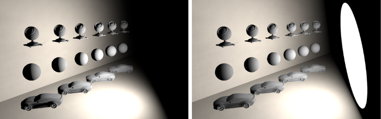{#fig:39}

ディスク型エリアライトはFrostbiteではスポットライトに似ており、角減衰(angular attenuation)をサポートする。この角減衰はスポットライトの遷移を滑らかにするために現実的なこと考えずに照度に対して単純に適用される。角減衰はエリアライトでシャドウを計算する方法と同じようにライトの位置を偽ることによってスポットライトのときと同じ式で得られる。[@lst:9]と[@sec:4.10.4]を参照。

~~~ {.c .numberLines id="lst:9"}
// CPUで
float3 virtualPoint = lightPos + lightForward * (discRadius / tan(halfOuterAngle));

// GPUで
// ライトの位置を外側の角度に基づいた量だけライトの反対方向にシフトした仮想的な位置で減衰する
illuminance *= getAngleAtt(normalize(virtualPos - worldPos), lightForward, lightAngleScale, lightAngleOffset);
~~~
: 角減衰を含むディスク型エリアライトの照度。

#### 球型とディスク型のエリアライトのマージ(Sphere and disk area light merging)

三角関数の恒等式(trigonometric identities)を使うと、正しい地平線ハンドリングを伴う球型とディスク型のエリアライトの数式が似ていることを示すことができる。これらは対応する角度によってのみ異なるため、評価コードを共有することができる。[@lst:10]にその詳細を示す。高価な逆三角関数はAMDのGCNアーキテクチャにおいて効率的に近似することができる[Drobot2014c]。

~~~ {.c .numberLines id="lst:10"}
// 正しいディスクというのは常に照らす表面の方を向いているものである。
// 球と正しいディスクの立体角は2 * PI * (1 - cos(対応する角度))である。
// 対応する角度sigmaは、球だとarcsin(r / d)であり、正しいディスクだとatan(r / d)である。
// sinSigmaSqr = sin(対応する角度)^2は、球だと(r^2 / d^2)であり、ディスクだと(r^2 / (r^2 + d^2))である。
// cosThetaはクランプされていない。
float illuminanceSphereOrDisk(float cosTheta, float sinSigmaSqr) {
    float sinTheta = sqrt(1.0f - cosTheta * cosTheta);

    float illuminance = 0.0f;
    // メモ: 以下のテストはオリジナルの式と等価である。
    // 曲線には以下の3つのフェーズが存在する。
    //     cosTheta > sqrt(sinSigmaSqr)のとき、
    //     cosTheta > -sqrt(sinSigmaSqr)のとき、
    //     0のとき。
    // 上２つはcosTheta * cosTheta > sinSigmaSqrとすることで１つにでき、
    // 代わりにsaturate(cosTheta)を用いる。
    if (cosTheta * cosTheta > sinSigmaSqr) {
        illuminance = FB_PI * sinSigmaSqr * saturate(cosTheta);
    } else {
        float x = sqrt(1.0f / sinSigmaSqr - 1.0f);  // ディスクではx = d / rに単純化する
        float y = -x * (cosTheta / sinTheta);
        float sinThetaSqrtY = sinTheta * sqrt(1.0f - y * y);
        illuminance = (cosTheta * acos(y) - x * sinThetaSqrtY) * sinSigmaSqr + atan(sinThetaSqrtY / x);
    }
    return max(illuminance, 0.0f);
}

// 球の評価
float cosTheta = clamp(dot(worldNormal, L), -0.999, 0.999);  // エッジケースを避けるためにクランプする
// オブジェクトが表面を貫通するのを防ぐ必要がある
// なので、0で割るのを避けなければならず、0.9999fとする
float sqrLightRadius = lightRadius * lightRadius;
float sinSigmaSqr = min(sqrLightRadius / sqrDist, 0.9999f);
float illuminance = illuminanceSphereOrDisk(cosTheta, sinSigmaSqr);

// ディスクの評価
float cosTheta = dot(worldNormal, L);
float sqrLightRadius = lightRadius * lightRadius;
// ライトを表面に貫通させない
float sinSigmaSqr = sqrLightRadius / (sqrLightRadius + max(sqrLightRadius, sqrDist));
// ground truthとのさらなる一致のために、saturate(dot(planeNormal, -L))をかける
float illuminance = illuminanceSphereOrDisk(cosTheta, sinSigmaSqr) * saturate(dot(planeNormal, -L));
~~~
: 球型とディスク型のエリアライトの照度。

#### 矩形型エリアライト(Rectangular area lights)

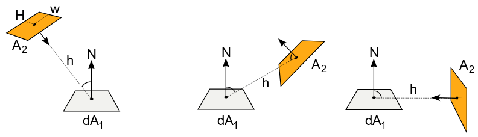{#fig:40}

我々は矩形ライトに対する正しい地平線ハンドリングを持つ手頃な(affordable)フォームファクタの解を見つけられなかった。[@fig:40]は様々な構成を強調している。そこで、代替となる解を探した。万全を期すため、我々は地平線ハンドリングを持たない矩形ライトのフォームファクタを[@sec:E]で提供する。

**最も代表的な点(Most representative point)**: @Drobot2014b は*ライトの立体角で重み付けされた単一の代表的なディフューズポイントライト*で照度の積分を近似することを提案している。

$$
E(n) = \int_{\Omega_{\text{light}}} L_{\text{in}} \langle \boldsymbol{n} \cdot \boldsymbol{l} \rangle d \boldsymbol{l} \approx \Omega_{\text{light}} L_{\text{in}} \langle \boldsymbol{n} \cdot \boldsymbol{l} \rangle
$$ {#eq:40}

この近似は小さな立体角において妥当である。これは$\boldsymbol{l}$を上手に選ぶことで改善し、より大きな立体角に拡張することができる。$\boldsymbol{l}$は陰影付けされる点から*最も代表的な点(MRP)*と呼ばれるエリアライトの点へ向かう方向を指す。MRPはディフューズライティングの積分を計算したときに最も大きな値となる点である。この手法は、ライトの位置がMRPに移動するため、地平線の場合を正しく扱う。これは地平線を計算に入れることで立体角を正しく計算すること、立体角の中にMRPが存在することを暗に示している。残念ながら、これはコストのかかる処理である。立体角は以下の積分により計算できる。

$$
\Omega_{\text{light}} = \int_{\Omega^+} V(\boldsymbol{l}) d\boldsymbol{l} = \int_{\Omega_{\text{light}}} d\boldsymbol{l}
$$ {#eq:41}

この数式は$L$と$\langle \boldsymbol{l} \cdot \boldsymbol{n} \rangle$のない照度の積分と似ている用に見える。フォームファクタと同じような流れで数値的か解析的かのいずれかで解くことができる。向きを持つ矩形の立体角の解析的な数式は[@Urena2013]で提供されるが、地平線ハンドリングを持たない。

TODO

### () {id="sec:4.7.3"}

## (Emissive surfaces) {id="sec:4.8"}

## (Image based lights) {id="sec:4.9"}

### () {id="sec:4.9.1"}

## (Shadow and occlusion) {id="sec:4.10"}

### () {id="sec:4.10.1"}

### () {id="sec:4.10.2"}

### () {id="sec:4.10.3"}

### () {id="sec:4.10.4"}

## (Deferred / Forward rendering) {id="sec:4.11"}

# (Image) {id="sec:5"}

## () {id="sec:5.1"}

## () {id="sec:5.2"}

## () {id="sec:5.3"}

# (Transition to PBR) {id="sec:6"}

\appendix

# (Listing for reference mode) {id="sec:A"}

# (Oren-Nayar and GGX's diffuse term derivation) {id="sec:B"}

# (Energy conservation) {id="sec:C"}

# (Optimization algorithm for converting Disney's parametrization) {id="sec:D"}

# (Rectangular area lighting) {id="sec:E"}

# (Local light probe evaluation) {id="sec:F"}

# 参考文献(References)
