# まえがき(Introduction) {#sec:1}

Frostbiteは'映画的ルック(cinematic look)'を追求してきたことから、物理ベースレンダリングへの移行も自然なことだった。移行作業は[@Drobot2013]、[@Karis2013]、[@Harduin2013]、[@Kojima2013]といったゲーム業界の最新技術を基に行い、既存技術の改良とオープン問題の削り出し(chip away)を試みた。

研究開発では、測定データかレンダリングデータのいずれか適切な方を正確性の"評価基準(ground-truth)"として用いた。しかし、真に物理的に正しい処理は負荷が大きく、リアルタイム性能という制約の中で今日のゲームエンジンがそれを達成できるとは考えにくい。そこで、まともな(decent)近似が可能な所では、品質目標(quality target)に近くなるならば、絶対的な正しさよりも *信憑性(bilievability)* を支持することとした。

PBRは業界用語として一般的になっているが、その意味はゲームエンジンごとに大きな差異がある。Frostbiteではマテリアルとライティングの情報を分離することをその原則の中核のひとつとした。これはシーン中のすべてのオブジェクトが一貫性を持ったビジュアルになることを保証するために重要となる。この考えのもとに、特別なハックをせずに同じライティングをすべてのオブジェクト、すべてのマテリアルレイヤに適用する。プロダクションの観点から見ると、アセットやライティング用のリグを異なる環境で再利用しやすくなり、アーティストの操るパラメータ数が減ることでオーサリングがより直観的になる。しかし、本書で後に述べるが、パフォーマンス上の理由によりコード上ではライティングとマテリアルは密に結合している。

PBRを採用するとなると、レンダラやツールを含めたグラフィクスパイプライン全体に手を入れなければならないことはすぐに理解できる。そのことを踏まえて、本書では普通の文献なら省かれる細かいところも含めて、大規模なプロダクションのエンジンに必要な様々なアップグレードのすべてを網羅した。まずはじめに、[@sec:2]ではground-truthとして利用するリファレンスがPBRの文脈においてどれだけ重要であるかをより詳しく説明する。次に、[@sec:3]ではマテリアルを提示して、光が物質とどのように相互作用するかを調査(review)する。[@sec:4]では光の定義や放出(emit)について説明する。[@sec:5]では輝度(luminance)を最終ピクセル値に変換する方法に触れながらカメラと出力画像に焦点を当てる。最後に、[@sec:6]ではPBRへ移行するさいのスケジュールの立て方やこの期間中に検討したことを見直すことで結論を述べる。

|||
|:-:|:-|
|$\boldsymbol v$|視線ベクトル|
|$\boldsymbol l$|入射光ベクトル|
|$\boldsymbol n$|法線
|$\boldsymbol h$|ハーフベクトル|
|$L$|ライティング関数|
|$f$|BRDF|
|$f_d$|BRDFのディフューズ要素|
|$f_r$|BRDFのスペキュラ要素|
|$\alpha$|マテリアルのラフネス|
|$\alpha_{lin}$|知覚的に線形なマテリアルのラフネス|
|$\cdot$|内積|
|$\langle \cdot \rangle$|クランプされた内積|
|$\lvert \cdot \rvert$|内積の絶対値|
|$\rho$|ディフューズ反射率|
|$\chi^+(a)$|Heaviside関数: $a>0$のとき1、$a<=0$のとき0|
: 数学的な表記法(mathematical notation) {#tbl:1}

# リファレンス(Reference) {#sec:2}

## モデルと仮説の検証(Validating models and hypothesis)

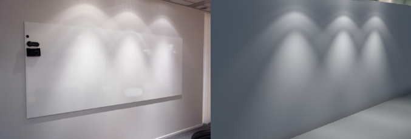{#fig:1}

ビデオゲーム業界は長年に渡りフォトリアルな画像を得ようと試みを重ねてきたが、*フォトリアリズム(photorealism)* では画像を生成する方法やデータについて言及せずに感覚で(定性的に(qualitatively))判断していた。現実世界の振る舞いや性質をシミュレートしようとする *物理ベースレンダリング* ではそれと異なり、数値で(定量的に(quantitatively))判断する。そのため、きちんとしたモデルや正しい仮説を選び出すためにはground-truthとなる良いリファレンスが必要になる。妥当性の判断や正しい選択をする最善の方法は現実世界と比較観察を行うことである。現実世界を観察することで、[@fig:1]に見られるようなハイライト形状、濡れた表面の振る舞い、ライト強度の違いによる差異といった様々なビジュアル要素を迅速に把握することができる。現実世界をマテリアルのリファレンスとする場合には、異なるライティングの振る舞いをキャプチャするために複数の縮尺で撮影することが重要になるが、正確に測定するには膨大な時間がかかることがよくある。MERLなどのデータベースを利用すれば、モデルの性能評価を迅速に行うことができる。本アプローチでは、ライトの強度やフォールオフ、空の明るさ、カメラのエフェクトなどの実データの測定及び評価を試みたが、これらの工程は時間がかかる上、必ずしも簡単にセットアップできるわけではない。

## インエンジン近似の評価(Validating in-engine approximations)

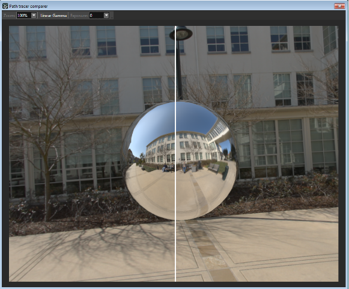{#fig:2}

MitsubaのようなモダンなPBRパストレーサーは最新のレンダリング技術を実装しており、近似の妥当性を評価する代替手段として十分なほどに現実感のある画像を生成することができる。Frostbiteでは近似の妥当性を迅速に評価できるようにMitsuba用の簡単なエクスポータを作った。このエクスポータはジオメトリ情報、(テクスチャを含まない)定数のマテリアル情報、すべてのライト強度を出力でき、マテリアルモデル、ライトインテグレーション、ライト強度を簡単に確認できる。さらにこのエクスポータはグローバルイルミネーション、アンビエントオクルージョン、反射といったより複雑な現象の正確性を検証することを可能にする。[@fig:2]はエクスポート後に自動的に起動するウィジェットを示す。このウィジェットでは完全に制御された露出の下で境目をスワイプしてピクセル値を比較することが可能になっている。もうひとつ重要なこととして、出力する強度を広い値範囲で保持するためにレンダラは線形なHDRフォーマットであるOpenEXRに最終画像を出力する。

## インエンジンリファレンスモードの評価(Validating in-engine reference mode)

<!-- <div id="fig:3" class="subfigures">
{#fig:3a}
{#fig:3b}
{#fig:3c}

左:いくつかのタイプのエリアライトから成るインエンジンシーンのレンダリング。中:エリアライトをGPUによる重点サンプリングによってレンダリングした同じインエンジンシーン。右:評価用パストレーサーでレンダリングされたシーン。
</div> -->
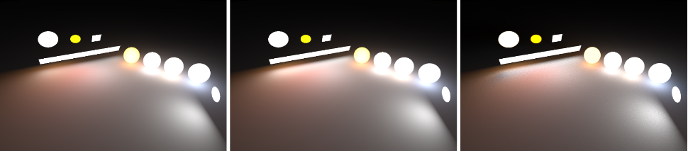{#fig:3}

前節で説明したエクスポータは便利だが、シーンをレンダリングするのに毎度数秒から数分かかってしまう。そこでイテレーションを早めるため、GPUでの(IBLとエリアライトの)ブルートフォースサンプリングによるライティングインテグレーションを行うゲーム内リファレンスモードを追加した([@fig:3])。このレンダリング時間は決して短いわけではないが、そのイテレーション間隔はエクスポータを使うよりも格段に短くなる。

#### 注 <!-- paragraph -->

正しいリファレンスを使うことが重要である。これは明らかなように思えるが、リファレンスが良くない場合、近似もまた良くならない。髪シェーディングモデルを近似するときはリファレンスとして現実世界に一番近いものを使おう。式を近似するときは誤差を計算できるように、Fresnelの式に対するOren-NayrやSchlickの近似式のような、すでにある近似式ではなくオリジナルの式を必ず使おう。唯一完全に信用できるリファレンスは現実世界のみである。

# マテリアル(Material) {#sec:3}

## マテリアルモデル(Material models)

### 外観(Appearance)

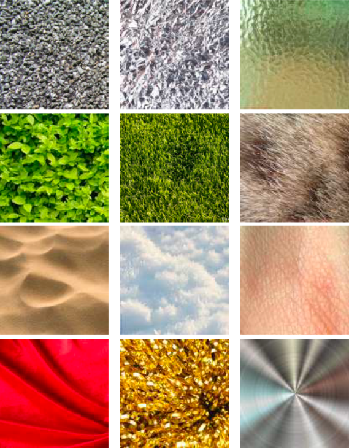{#fig:4}

表面の外観は入射光と表面の性質との相互作用によって生み出され、[@fig:4]に見られるように、現実世界では一面一辺倒であるような単純なものから層を成したり不均質であったりするような複雑なものまで数多くの外観を観察することができる。これらの様々な外観は伝導性(conductivity)、平均自由行程(mean-free-path)、吸収(absorption)といった固有の物理的性質により分類できる。これらのマテリアルの性質に基づき、全波長域の中からある範囲の外観を表現できるとする様々なマテリアルモデルが発表されている。マテリアルモデルの分野は広大であり、用いるトレードオフや求める正確さはモデルにより様々である。BSDFと呼ばれるマテリアルモデルは反射率を示すBRDFと透過率を示すBTDFに分けることができる。この文章では"標準的な"外観を表現できるとするマテリアルモデルにおける反射の部分に焦点をあてようと思う。ここで言う"標準的"とは、とりわけ日常生活の中で遭遇しやすいもののことを指す。故に、これから扱うものは平均自由行程の短い反射的で等方性を持つ誘電体または導体の表面に限定することとする。

### マテリアルモデル(Material models)

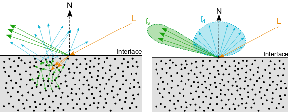{#fig:5}

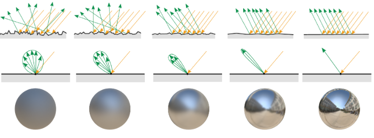{#fig:6}

この標準的なマテリアルモデルの文脈では、[@fig:5]が示すように、表面の応答$f$は"ディフューズ"($f_d$)と呼ばれる低い角周波数の部分と"スペキュラ"($f_r$)と呼ばれる高い各周波数の部分の2つの項に分けられる。界面は空気と物質の2つの媒質で区切られる。平坦な界面からなる表面であれば、誘電体と導体の両方においてFresnelの法則によって簡単に表すことができる。[@fig:6]が示すような不規則な界面であれば、この種の表面との光の相互作用の特徴にうまく適合するマイクロファセットによるモデル[@Cook1982]により表すことができる。マイクロファセットモデルは以下の式により表される。より詳しい導出は[@Heitz2014]を参照のこと。

$$
f_{d/r}(\boldsymbol v) = \frac{1}{|\boldsymbol{n} \cdot \boldsymbol{v}| |\boldsymbol{n} \cdot \boldsymbol{l}|} \int_{\Omega} f_m(\boldsymbol{v}, \boldsymbol{l}, \boldsymbol{m}) G(\boldsymbol{v}, \boldsymbol{l}, \boldsymbol{m}) D(\boldsymbol{m}, \alpha) \langle \boldsymbol{v} \cdot \boldsymbol{m} \rangle \langle \boldsymbol{l} \cdot \boldsymbol{m} \rangle d\boldsymbol{m}
$$ {#eq:1}

$D$項はマイクロファセット分布(つまり、法線分布関数(NDF))をモデル化し、$G$項はマイクロファセットによる遮蔽(マスキング-シャドウイング)をモデル化する。この式はディフューズ項$f_d$とスペキュラ項$f_r$の両方に対して対応するマイクロファセットBRDF$f_m$を定めることで用いることができる。スペキュラ項の場合、$f_m$は完全鏡面(perfect mirror)であり、Fresnelの法則$F$によりモデル化される。したがって、以下のよく知られた式を導くことができる。

$$
f_r(\boldsymbol v) = \frac{F(\boldsymbol{v}, \boldsymbol{h}, f_0, f_{90}) G(\boldsymbol{v}, \boldsymbol{l}, \boldsymbol{h}) D(\boldsymbol{h}, \alpha)}{4 \langle \boldsymbol{n} \cdot \boldsymbol{v} \rangle \langle \boldsymbol{n} \cdot \boldsymbol{l} \rangle}
$$ {#eq:2}

$D$項は[@fig:6]が示すように、表面の外観において重要な役割を担っている。[@Walter2007; @Burley2012]はGGX分布のような"ロングテール"のNDFが現実世界の表面をキャプチャするときに良好な結果を示すことを指摘している。$G$項もまた高いラフネス値において重要な役割を担っている。@Heitz2014 はSmithの可視性関数が$G$項として正確かつ厳密であることを示している。それに加えて、以下に示すような、マスキングとシャドウイングの間にある相関をモデリングしたマスキング-シャドウイング関数の更に正確な形式があるにもかかわらず、Smithの可視性関数の近似バージョンが使われる傾向があることを指摘している。[@fig:7]はシンプルなSmithの関数と高さ相関(hight-correlated)のSmithの関数との差異を示している。

$$
G(\boldsymbol{v}, \boldsymbol{l}, \boldsymbol{h}, \alpha) = \frac{\chi^+(\boldsymbol{v} . \boldsymbol{h}) \chi^+(\boldsymbol{l} . \boldsymbol{h})}{1 + \Lambda(\boldsymbol{v}) + \Lambda(\boldsymbol{l})} \text{ with } \Lambda(\boldsymbol{m}) = \frac{-1 + \sqrt{1 + \alpha^2 \tan^2(\theta_m)}}{2} = \frac{-1 + \sqrt{1 + \frac{\alpha^2 (1 - \cos^2(\theta_m))}{\cos^2(\theta_m)}}}{2}
$$ {#eq:3}

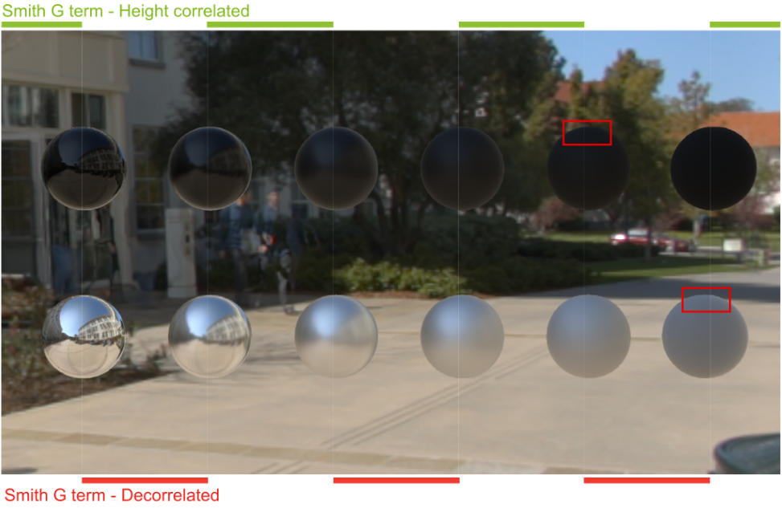{#fig:7}

ディフューズ項の場合、$f_m$はLambertモデルに従い、そのときの[@eq:1]を簡略化すると以下のようになる。

$$
f_d(\boldsymbol v) = \frac{\rho}{\pi} \frac{1}{|\boldsymbol{n} \cdot \boldsymbol{v}| |\boldsymbol{n} \cdot \boldsymbol{l}|} \int_{\Omega} G(\boldsymbol{v}, \boldsymbol{l}, \boldsymbol{m}) D(\boldsymbol{m}, \alpha) \langle \boldsymbol{v} \cdot \boldsymbol{m} \rangle \langle \boldsymbol{l} \cdot \boldsymbol{m} \rangle d\boldsymbol{m}
$$ {#eq:4}

これまではこのような単純なLambertモデルでも問題なかったが、[@fig:8]が示すように、スペキュラ項との一貫性を保つため、ディフューズ項の計算に表面のラフネスを取り入れる必要がある[@Burley2012](すなわち、スペキュラ項とディフューズ項で同じラフネスを用いるべきである)。[@eq:4]は解析的に解くことができないが、 @Oren1994 はガウス分布のNDFとV型空洞のG項を用いることでOren-Nayarモデルとして知られる[@eq:4]の経験的近似を発見した。モデルを正しくサポートするためには、[@Gotanda2014]で説明されているようにGGXのNDFにも[@eq:4]に対する同じような近似を作るべきである。[@sec:B]にその詳細を載せるが、さらなる研究が必要である。

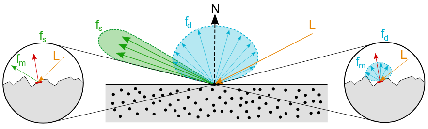{#fig:8}

@Burley2012 は現実世界の表面を観察した結果から以下の式で示されるディフューズモデルを発表した。このモデルは経験的だが、MERLデータベースのマテリアルの主な特徴を再現でき、加えて単純であるため、Frostbiteで用いることとした。このディフューズ項はマテリアルのラフネスを計算に取り入れており、グレージング角での自己反射をいくらか生み出すことができる。

$$
f_d = \frac{\rho}{\pi} (1 + F_{D90}(1 - \langle \boldsymbol{n} \cdot \boldsymbol{l} \rangle)^5) (1 + F_{D90}(1 - \langle \boldsymbol{n} \cdot \boldsymbol{v} \rangle)^5) \text{ where } F_{D90} = 0.5 + \cos(\theta_d)^2 \alpha
$$ {#eq:5}

### エネルギー保存則(Energy conservation)

エネルギー保存則は扱うエネルギー量が受け取ったエネルギー量より多くならないことを考慮する上で重要な概念である。加えて、グレージング角においてディフューズ項よりスペキュラ項のほうが光をより散乱させるという振る舞いを正しく扱うことが可能になる。Frostbiteでは、計算を簡単にするため、半球状の固定照明による与えられた方向に対する反射率の総計である方向性半球反射率(hemispherical-directional reflectance)がBRDF全体で1未満であることでエネルギーが保存されているとした。

$$
\rho_{hd}(\boldsymbol{v}) = \int_{\Omega} f(\boldsymbol{v}, \boldsymbol{l}) \langle \boldsymbol{n} \cdot \boldsymbol{l} \rangle d\boldsymbol{l} = \int_{\Omega} (f_r(\boldsymbol{v}, \boldsymbol{l}) + f_d(\boldsymbol{v}, \boldsymbol{l})) \langle \boldsymbol{n} \cdot \boldsymbol{l} \ge 1
$$ {#eq:6}

スペキュラモデルとディフューズモデルとの関連性が直接的ではないため、適切な導出を作ることは簡単ではない(スペキュラ項とディフューズ項がともにマイクロファセットモデルの基づく場合は[@sec:C]を参照)。ディズニーのディフューズモデルはエネルギー保存則を満たしていないことに注意する必要がある(脚注4: @Burley2012 が説明するように、これはアーティストがあらゆるラフネス値を通して同じディフューズ色を得られるようにすることを目的とした仕様によるものである)。[@fig:9] (a)はディズニーのディフューズモデルの方向性半球反射率を表しているが、見るからに値は1を越えており、エネルギー保存則を満たしていないことが分かる。

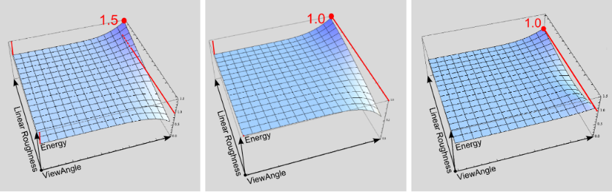{#fig:9}

そこで、我々は自己反射の特性を維持しつつエネルギーのゲインを補正するような修正を追加した。[@lst:1]は再正規化ファクタを導入したディズニーの評価関数を示している。[@fig:9] (c)ではスペキュラのマイクロファセットモデル$f_r$とディズニーのディフューズモデル$f_d$を合成した$f$の方向性半球反射率を表しており、完全に1にはなっていないが十分に近い値になっている。[@fig:10]ではオリジナルと再正規化バージョンとの比較を示している。

Listing: エネルギーの再正規化を含むディズニーのディフューズBRDFのコード。`linearRoughness`は知覚的に線形なラフネスである([@sec:3.2.1]を参照)。
```{#lst:1 .c}
float Fr_DisneyDiffuse(float NdotV, float NdotL, float LdotH, float linearRoughness) {
    float energyBias     = lerp(0, 0.5, linearRoughness);
    float energyFactor   = lerp (1.0, 1.0 / 1.51, linearRoughness);
    float fd90           = energyBias + 2.0 * LdotH*LdotH * linearRoughness;
    float3 f0            = float3(1.0f, 1.0f, 1.0f);
    float lightScatter   = F_Schlick(f0, fd90, NdotL).r;
    float viewScatter    = F_Schlick(f0, fd90, NdotV).r;

    return lightScatter * viewScatter * energyFactor;
}
```
<!--dummy block-->
```c
```

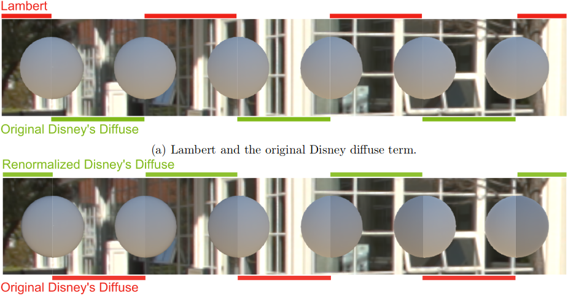{#fig:10}

### 形状の特性(Shape characteristics)

スペキュラのマイクロファセットによるBRDFはしばしば無視(bypass)されるが最終的な外観に強い影響を及ぼすある性質を持つ。特に以下の2つの現象が重要である。

- **半角パラメータ化(Half-angle parameterization)**: このパラメータ化は通常の入射角では等方的になるがグレージング角では異方的になるというBRDF形状の非線形な変換を暗に示している。さらなる洞察は[@sec:4.9]を参照のこと。
- **オフスペキュラ(Off-specular)**: BRDFローブは時折反射した視線方向(反射方向(mirror direction))を中心とすると仮定されるが、[@fig:11]に見られるように、ラフネスが大きくなると$\langle \boldsymbol{n} \cdot \boldsymbol{l} \rangle$とマスキング-シャドウイング項$G$によってBRDFローブは法線方向に引っ張られる(gets shifted)ようになる。これは"*オフスペキュラピーク(Off-specular peak)*"と呼ばれ、表面の粗い外観を表すのに重要な役割を担っている。

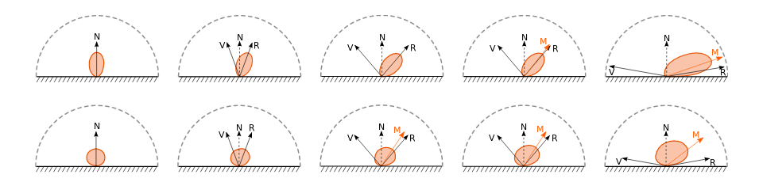{#fig:11}

TODO

## {#sec:3.2}

### {#sec:3.2.1}


# {#sec:4}

## {#sec:4.1}

## {#sec:4.2}

## {#sec:4.3}

## {#sec:4.4}

## {#sec:4.5}

## {#sec:4.6}

## {#sec:4.7}

## {#sec:4.8}

## {#sec:4.9}

# {#sec:5}

# {#sec:6}

\appendix

# {#sec:A}

# {#sec:B}

# {#sec:C}

# {#sec:D}

# {#sec:E}

# {#sec:F}

# 参考文献(References)
