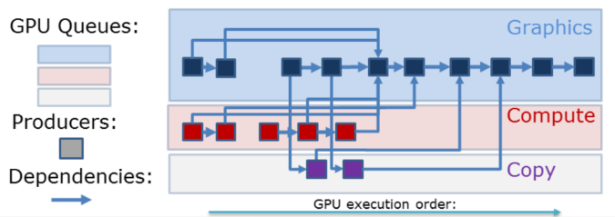
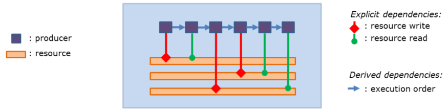
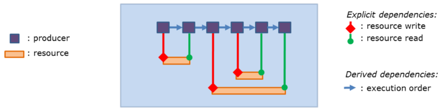
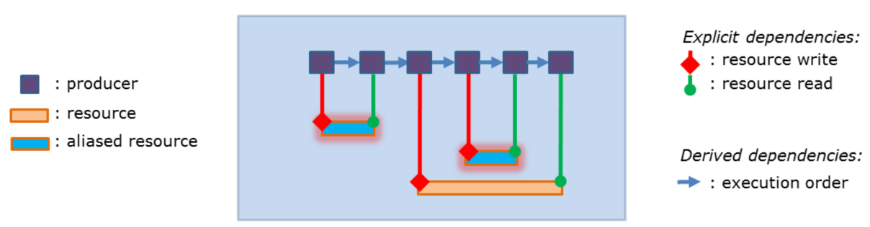
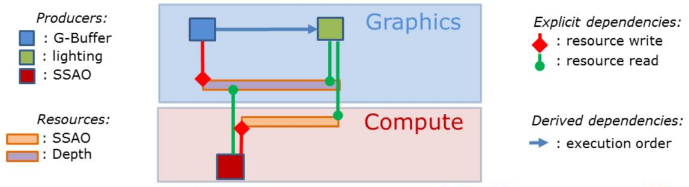
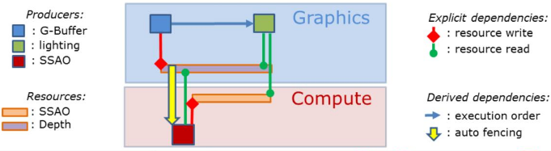
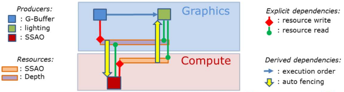
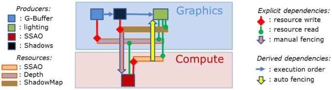
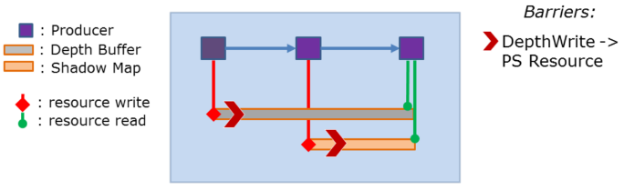
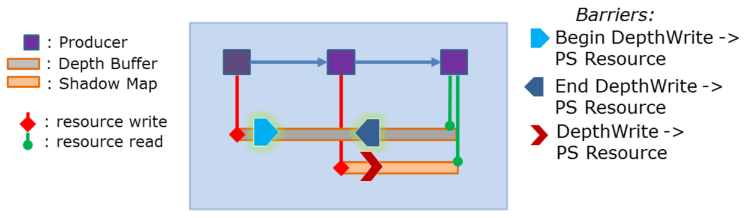

# Talk goals

- 多くのトークがすでに直接のAPIの使い方のアドバイスに注力していた。[1] - [8]
- このアドバイスのいくつかを実装するためのより高レベルな戦略に焦点を当てる。

# Background : Anvil Next

- Anvil(内製エンジン)は直近の10年で8つのAssassin's Creedをリリースした。Anvil NextはAssassin's Creed Unityのために開発されたメジャーアップグレードであった。
<!--  -->
- ACUでは、我々が"Anvil Next"と呼んだ、重大なアップグレードを行った。このバージョンでリリースされた一番最近のACでその例が確認できる。

<!-- p.4 -->

- CPU処理の削減とGPUパフォーマンスの改善のため、描画バッチ処理と'GPUサブミッション'を行う。[@Haar2015]
- GFXコンピュートを積極的に利用する。(非同期コンピュートや`MultiDrawIndirect`も)
<!--  -->
- 我々はACUに対してドローコールのバッチ処理と(描画/インスタンス/トライアングルクラスタ/トライアングルのカリングのためにGPUを利用する)'GPUサブミッション'に関する多くの仕事をこなした。この話題の詳細はそれを題材にしたGDC2015のUlrichのプレゼンテーション[@Haar2015]から得られる。
- 我々は、(GPUカリングのために非同期コンピュートや`MultiDrawIndirect`といった)とある機能はPCで利用できないため、レンダリングパイプラインにおいてコンソール固有の最適化も行った。DX12ではこれらの機能がPCでも利用可能になる。

# Background : moving to DX12

- パフォーマンスのボトルネックを測りつつAPIへの理解を深めるため、'ナイーブなポート'から始めた。
- 予想通り、結果は、特にGPUで(時間がDX11の倍かかるくらい)、ひどいパフォーマンスだった。
<!--  -->
- DX12APIの詳細は昔のレンダラインターフェイスに隠蔽する形で、とても基本的なポートから始めた。
- 予想通り、極めてひどいパフォーマンスであった(GPU時間はDX11の最大200%となった)。主にハードウェア抽象化レイヤにおいてリソース状態の視野が非常に低レベルで狭いため、一般的なAPIの使い方のアドバイスを実装することが単純に難しすぎる。

<!-- p.6 -->

- 主なGPUパフォーマンスの問題:
    - バリアの乱用。
    - メモリのオーバーコミット(過剰要求)。
- 主なCPUパフォーマンスの問題:
    - PSOコンパイルによるレンダリングスレッドのヒッチング。
    - デスクリプタのコピー量。
<!--  -->
- バリアの乱用:
    - コミット間のバッチ処理時でさえ、大量の個別のバリア呼び出しを行っていた。
    - (大量の不必要な中間の遷移を引き起こす)初期状態の強制化をあらゆるところにばら撒くことをせずに、マルチスレッド化されたコマンドリストレコーディングでバリアを管理するのは極めて難しい。
- メモリ関係:
    - (エイリアシングやタイルリソース/MIPのストリーミングが足りていないため、)大幅にオーバーコミットしていた。
    - コマンドリストの管理と再利用による問題もあった。
- PSOとデスクリプタの管理:
    - PSOのコンパイルにより、レンダリングスレッドでヒッチングを起こす。
    - すべてのユースケースを扱うために共通のroot signatureを使っていたため、デスクリプタの大量コピーが起こっていた。

<!-- p.7 -->

- 以下に基づいてレンダラの再設計を計画し始めた。
    - 初期ポートからの知見。
    - Ubisoftの他のチーム。
    - DX12に関する様々なトークからのアドバイス。

# API guidance recap:

- リソースバリアを最小化してバッチ処理する。[@Oldcorn2015]
- 並列コマンドリストレコーディングの完全な恩恵を得る。[@Thomas2016; @Oldcorn2015]
- いくつかのGPUキューを使うようにする。[@Hart2015]
<!--  -->
- リソースバリアの最小化とバッチ処理は非常に重要である。
    - さもないと、処理のシリアライズや不必要なキャッシュのフラッシュによってGPUパフォーマンスを損なうことになる。
    - DX11ドライバは何年もかけて水面下でこれを最適化してきた。DX12はここで未だに多少の救済を提供している: 単一の呼び出しでバリアをバッチする場合、その呼び出しにおけるすべての遷移に対する最小のバリアアクションの集合を生み出そうとする。
- DX12は、良好なCPUパフォーマンスを得るために不可欠である、完全に機能する低オーバーヘッドな並列コマンドリストレコーディングも提供する。
    - 小さなコマンドリストが大量にあったり、`ExecuteCommandLists`を呼び出しすぎたりすると、CPUパフォーマンスを損なう恐れがある、といった気に留めておくべき注意事項が存在する。
- コピーエンジンや非同期コンピュートキューを使わなければならないDX11ドライバとのすり合わせをしたいと望むなら、そのアクセス権も得られる。
    - また、コンソール開発者として機能セットに関して言えば、PCの機能はかなり近くなっている。これはエンジン設計の視点から見れば素晴らしいことである。

# API guidance recap(2):

- 実行時処理を最小化するために事前コンパイルしたレンダステートを使う。[@Hart2015]
- 効率的にメモリを管理する。[@Hodes2016]
<!--  -->
- 実行時処理を最小化するために効率的に事前コンパイルしたレンダステートを使うこともCPUパフォーマンスに対して極めて重要である。
    - APIは事前コンパイルされたステートブロブに重点を置いているため、高価な処理を一度だけ行い、それをキャッシュして、バインド時にオーバーヘッドを最小にすることが可能になる。
- メモリ管理は大きなトピックであり、私が導入するシステムに関係するいくつかの面のみを述べる。
    - APIはユーザがメモリの割り当てや管理を制御できるようになっている。(このため、例えば、メモリのエイリアシングが実装できる。)

# Systems

- Producer System
- Shader Input Group
- Pipeline State管理

# Producer System

# Producer System : Motivation

- レンダリングパイプラインはますます複雑化している。
- リソースのメモリとステートの管理は今やAPIユーザの責任である。
- ユーザに広範囲の低レベル知識を持たせずに新たに開示されたGPU機能を開拓する。
<!--  -->
- ACUの開発の終了時、成長し続けるレンダリングパイプラインの複雑さとしてレンダリングパスアーキテクチャの限界を強く感じ始めた。
- 同時に、近い将来やって来る新しいグラフィクスAPIは、最大限の利点を得るためにアーキテクチャやクロスプラットフォームのレベルで対処されるべきである、すべてのプラットフォームにおける異なる制御レベルを本当に可能にするだろうと感じた。
- この新しい制御レベルはリソースのメモリやステートの管理はいまやユーザの考慮事項であることを意味する。我々は、エンジンユーザに大きな負担を負わせることを避けると同時に、APIを効率的に操ることを望んでいる。

# Complex Rendering Pipelines

- プロデューサーはGPUリソースのライター/リーダーである。
- リソースの依存性はGPUでの実行順を決定する。
<!--  -->
- レンダリングパイプラインのタイアグラムの例。
    - プロデューサー(ダイアグラム中の四角)が確認できる。これらは本質的にはGPUリソースのライターとリーダーである。
    - そして、GPUの実行順を定義するこれらの間の依存性を持つ。
    - いくつかのGPUキューも持つ。これは、リソースの寿命管理や同期などの観点から一層複雑にする。
- このグラフの静的な構成を見ただけでもすでにかなり複雑だが、さまざまな有効化した機能セットをサポートするために別の順列のレイヤーを追加しなければならない(例えば、ローエンドマシンでのパフォーマンススケーリング用)。
- パイプラインをいくつかのユースケースに対して再構成することは、手動/明示的なスケジューリングを幾分実用的でなくしてしまう多くの連鎖反応(knock-on effect)がある。
- パフォーマンスを犠牲にせずに、低レベルAPIを効率的に操るために十分な高レベル分法をキャプチャすることを可能にする、いくつかの自動化レベルを必要とした。

# Producer System : Design Goals

- 以下を操るためにリソースの依存性を使う。
    - リソースメモリ寿命。
    - キュー間同期。
    - リソースステート遷移。
    - コマンドリストの実行順やバッチ処理。
<!--  -->
- このシステムの鍵となる設計の側面のひとつはリソース依存性を明示的にすることであった。

# Resource Dependency Tracking

- 明示的なリソース依存性が各プロデューサーごとに指定される。
<!--  -->
- この例では、一連のプロデューサーと、GPUで実行するときのリソースとそれらの関係を指定する方法を確認できる。

<!-- p.16 -->

- 明示的な依存性はGPUリソースの寿命を自動的に設定することを可能にする。
<!--  -->
- これらの依存性に基づいて、各GPUリソースの寿命を自動的に導くことができる。

# Resource Memory Aliasing

- フレームの至るところでメモリを再利用するために導かれたリソース寿命を使う。
- Placed Resourcesはユーザによるメモリ割り当て制御を可能にする。
- フレームのGPUリソースのメモリフットプリントを削減する。
<!--  -->
- Placed Resourcesと導かれたリソース寿命を使うと、フレームの至るところでメモリを再利用することができ、GPUメモリのフットプリントを削減できる。

<!-- p.19 -->

- メモリの再利用を導くためにリソース寿命を使う。
<!--  -->
- メモリエイリアシングはリソース寿命と次のキュー間同期ポイントに基づいて自動的に導かれる。ダイアグラムでは、使用期間がGPU実行の寿命においてオーバーラップしないために同じメモリを共有する2つのGPUリソースの例が確認できる。

# Resource Access Synchronization

- 明示的なリソース依存性。
    - 必要なキュー間同期を自動的に決定するために使う。
- 明示的な同期をサポートする。
    - フェンスのリソース依存性を経由して指定する。
    - ユーザーが実行窓を定義できるようにする。
<!--  -->
- プロデューサーシステムを自動化することのひとつ側面は、リソースアクセスの同期である。
- すべてのプロデューサーは、グラフィクス/非同期コンピュート/コピーの内、そのコマンドリストを実行したいGPUキューを指定する。(デバッグやその他の構成の目的のために実行時に変化することができる。)
- 各プロデューサーごとに明示的に指定されたリソース依存性に基づいて、GPUでのコマンドリストの正しい実行順を保証するために必要なキュー間同期(フェンス)を導くことができる。
- フェンスリソースを経由した明示的な同期を依然としてサポートしており、ユーザーは実行窓による制御権を持つ。(例えば、異なるキューで実行しているGPUワークロードをより良く一致させる。)

<!-- p.21 -->

- コンピュートで生み出され、GFXキューで消費されるSSAOバッファ。
<!--  -->
- 単純な必要なキュー間同期の例。
    - コンピュートキューで動作するSSAOプロデューサー(赤)はGバッファの深度に依存し、Gバッファの深度はグラフィクスキューでGバッファプロデューサー(青)により生成されることが確認できる。

- コンピュートキューでのSSAOはGバッファのレンダリングが終了するのを待たなければならない。
<!--  -->
- 初めに必要な同期は、Gバッファパスがシーンの深度を書き終わる前に開始できないSSAOプロデューサーの前である。

- グラフィクスキューでのディファードライティングはSSAOが終了するのを待たなければならない。
<!--  -->
- 逆に、コンピュートキューのSSAOプロデューサーとSSAOマスクの初めてのコンシューマーとの間をフェンスする必要もある。今回の場合はグラフィクスキューのディファードライティングプロデューサー(ダイアグラム中の緑)である。
- この例は極めて単純であり、現実のフレームスケジュールでは、例えば、Gバッファの後にシーン深度へ書き込むような、もっと多くのプロデューサーがあるかもしれない。If one of these producers where to move,、同期がユーザーによって手動で行われた場合、捕捉とデバッグが時折し辛いタイミング依存のグリッチが発生する可能性がある。

- ユーザーは(フェンスリソース経由で)ワークロードをより良く一致させるために手動同期を追加することができる。
<!--  -->
- 異なるキューでGPUワークロードをより良く一致させるため、ユーザーは非同期コンピュートのワークロードが実行される窓を明示的に定義したいと考えるかもしれない。
    - 例えば、頂点ヘビーなシャドウマッププロデューサー(ダイアグラム中の黒)。
    - 手動同期はフェンスリソースに依存することで単純に行われる。(フェンスは他のものと同様にプロデューサーのリソースである。)
    - 明示的なフェンシングはリソースであるので、代替の構成で簡単にコピーできる。(例えばロード時/遅延で更新するあるレベルでの静的シャドウマップでは、システムはシャドウプロデューサーが毎フレームスケジュールされないときに自動同期を自動的に追加する。)
- 残りのフェンシングが動的に導かれたため、ユーザーのフェンシングを計算に入れ、グラフィクスワークロードの実行順による余分な同期の一切を排除することができる。(ダイアグラム中では、GバッファのプロデューサーとSSAOの間の自動同期が存在しないことにより確認できる。)
- この目的のための手動フェンシングの代替のひとつは、頂点ヘビー/帯域幅ヘビー/ALUヘビーであることを示すために高レベルでプロデューサーをタグ付けして、自動的にそれらに合うようにプロデューサーをスケジュールさせることである。

# Resource Transitions

- APIはバリアを経由した明示的な遷移を必要とする。
    - 伸長、キャッシュのフラッシュ、アイドル待機、などを管理する。
- 最適に近いパフォーマンスを得やすい。
    - 多すぎ、汎用的すぎるステート、不必要な中間ステート。
<!--  -->
- リソース遷移はシステムを自動的に管理するもうひとつの側面である。
- APIで、これらはバリアを経由して指定される。これは、リソースの伸長、キャッシュのフラッシュ、アイドル待機、などのような処理を管理する。
- 以前に言及したように、とても狭いリソースの視点を持てば、最適に近いGPUパフォーマンスを得ることは容易い。これは、多すぎる個別のバリア呼び出し、汎用的な又は不必要な中間ステート、などを引き起こす可能性がある。

<!-- p.26 -->

- プロデューサーのリソース依存性の使用して、
    - プロデューサー境界で遷移をバッチ処理する。
    - マージしたステートの最小セットを決定する。
    - バリアを自動分割する。
<!--  -->
- リソース依存性を使う。
    - 実際にドライバで処理される仕事を最小化するためにプロデューサー境界でバリアをバッチ処理する。
    - リソース依存性グラフを知っていると、遷移するための最良ステートセットを前もって知ることができるので、不必要な中間ステート変更を避ける。
    - リソースを生み出し終わる時と最初に使うために実際に必要となる時の知識を持つことはバリアを分割し、ドライバ内部処理を潜在的に隠蔽することが可能になる。

- プロデューサー境界のバリア。
<!--  -->
- この例では、いくつかのプロデューサー(紫)と、深度の伸長を起動できる、2つの"深度書き込み"から"ピクセルシェーダリソース"へのバリア(赤矢印)を確認できる。
- 以前に言及したように、プロデューサーの終わりにバリアを発行する。そして、グラフで次に必要なステートが何かを知っているので、早期に次に必要なステートは遷移させることができる。

- バリアを自動分割する。
<!--  -->
- 即時のバリアの代わりに、リソースにアクセスしないことを保証する窓を定義する分割バリアを使うことができ、ドライバにヒントを出すことで、窓での潜在的に高価な内部処理を'隠す'ことができる。

- バリアをグループ化する
<!--  -->
- 以前に言及したように、遷移のリストを持ち、内部ドライバの副次的効果を最小限に削減するために単一の呼び出しでそれらをバッチ処理する。

# Producer System : Implementation

- リソース識別子。
- 2段階: リソースを集める。コマンドバッファを記録する。
- スケジューリング。

# Resource Identifiers

TODO

# References
