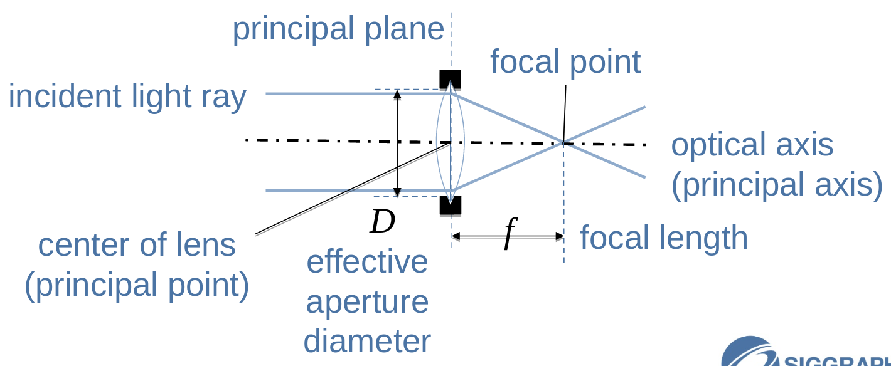
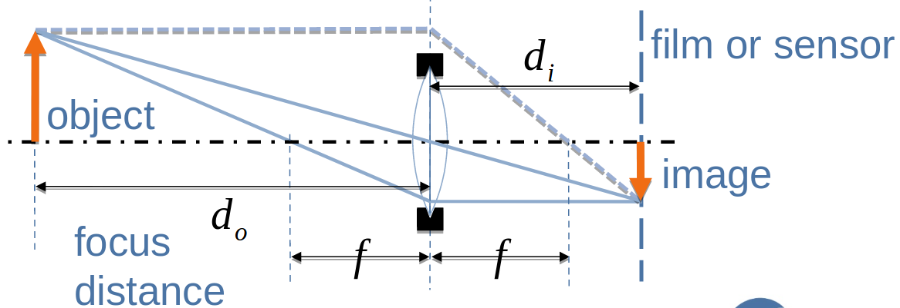
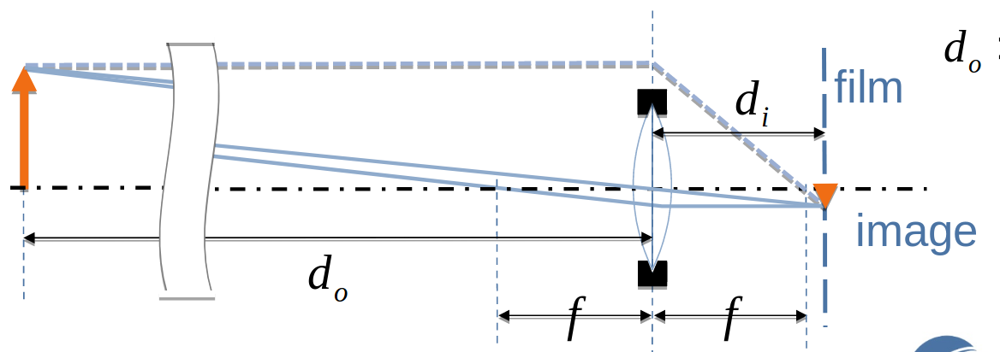
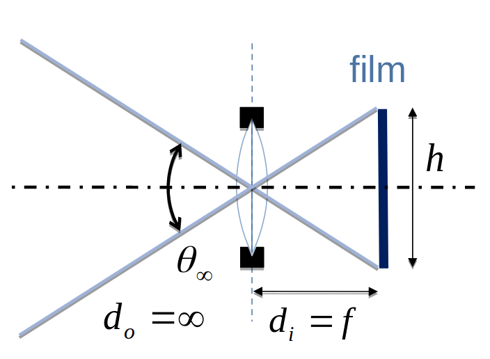
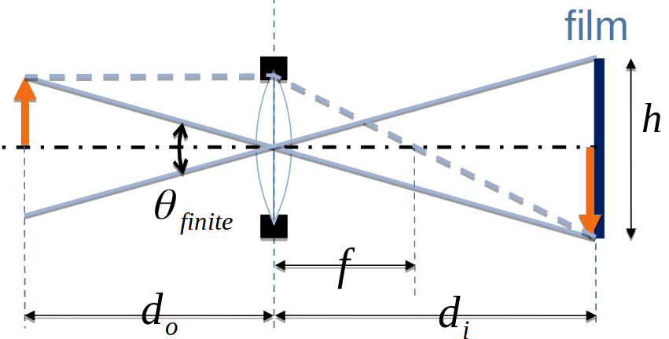
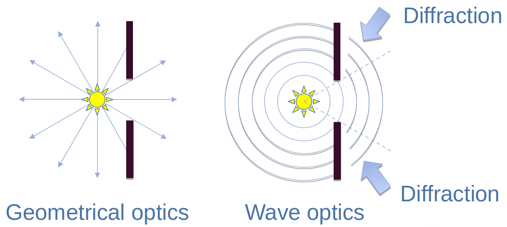

# はじめに[Introduction]

# 光の物理[Physics on Lights]

- 光学[optics]
    - 幾何光学[geometrical optics] --- 単純で実践的なモデル
    - 波動光学[wave optics]^[物理光学[physical optics]とも] --- より物理的に正しく複雑
- 電磁気学[electromagnetism] --- 古典的な物理モデル
- 量子光学[quantum optics] --- 近代的な物理モデル

# 光学とコンピュータグラフィックス理論[Optics and Computer Graphics Theories]

- コンピュータグラフィックス理論は光学に基づいている。
    - 理論と技術の大多数は幾何光学に基づく。
    - 1%だけ波動光学を勘定に入れている。
<!--  -->
フォトンマッピングは量子光学から'フォトン'の概念を借用して、幾何光学の枠組みで用いている。

# トピック[Topics]

- このコース
    - ほとんどのトピックは幾何光学に関連している。
    - いくつかは波動光学関連のものである。
- このトークは以下をカバーする。
    - 残りのコースのための基本的な幾何光学の知識。
    - この後のトークのための波関連のトピックの簡単な紹介。

# 基本的な幾何光学[Basic Geometrical Optics]

# CGの幾何光学モデル[Geometrical Optics Models for CG]

- ピンホールカメラモデル
    - ｜＋絞り[aperture]
    - ｜＋近似された屈折
    - ｖ
- 薄レンズ[thin lens]の近似
    - ｜＋厚さ[thickness]
    - ｖ
- 厚レンズ[thick lens]の近似
    - ｜＋正確な屈折
    - ｜＋複数の波長
    - ｜など
    - ｖ
- 完全なレンズシステム

# 幾何光学モデルと効果[Geometrical Optics Models and Effects]

- ピンホール
    - 透視投影[perspective projection]
    - モーションブラー
    - 自然の口径食[natural vignetting][^natural_vignetting]
- 薄レンズ/厚レンズ
    - ボケ(デフォーカス[defocus])
    - フォーカス呼吸[focus breathing]
    - 自然の口径食[natural vignetting]
- 完全にシミュレートされたレンズ
    - 複雑なボケ
    - 色収差[chromatic aberration]
    - 光学の口径食[optical vignetting][^optical_vignetting]
    - レンズゴースト

[^natural_vignetting]: "natural vignetting"は口径食のうち、光がその入射角の「コサイン4乗則」に従うために周辺光量が低下することを指す。[@Wikipedia:Vignetting]

[^optical_vignetting]: "optical vignetting"は口径食のうち、レンズの構成要素によって光が物理的に遮られることで周辺光量が低下することを指す。[@Wikipedia:Vignetting]

<!-- p.12 -->

- 本日のトピック
    - ピンホール
        - 自然の口径食[natural vignetting]
    - 薄レンズ/厚レンズ
        - ボケ(デフォーカス)
        - フォーカス呼吸[focus breathing]
        - 自然の口径食[natural vignetting]
    - 完全にシミュレートされたレンズ
        - 複雑なボケ
        - 色収差[chromatic aberration]
        - 光学の口径食[optical vignetting]
        - レンズゴースト

# 幾何光学モデルと実装[Geometrical Optics Models and Implementations]

- ピンホール
    - レイトレーシング
    - グラフィックスハードウェア(固定パイプライン)
    - <--- プログラマブルシェーダ技術 ---
- 薄レンズ/厚レンズ
    - <--- 分散レイトレーシング[distribution ray tracing] ---
    - 累積バッファ[accumulation buffer]
    - ポストプロセッシング
    - --- プログラマブルシェーダ技術 --->
- 完全なレンズシステム
    - --- 分散レイトレーシング[distribution ray tracing] --->
    - 波面トレーシング[wavefront tracing]

<!-- p.14 -->

- 本日のトピック(幾何光学)
- ピンホール
    - <--- プログラマブルシェーダ技術 ---
- 薄レンズ/厚レンズ
    - ポストプロセッシング
    - --- プログラマブルシェーダ技術 --->
- 完全なレンズシステム
    - 波面トレーシング[wavefront tracing]

# 薄いレンズ --- リアルタイム特殊効果を理解するための基礎[Thin Lens --- Fundamentals to Understand Real-Time Special Effects]

- リアルタイム技術は薄レンズの理論に基づいている。
    - 多くの光学効果は薄レンズによって説明される。
    - いくつかの効果は完全なレンズシステムモデルから導かれる。
        - 各々はリアルタイム技術によって模倣すことができる(薄レンズの理論を拡張して)。

# 薄レンズモデル[Thin Lens Model]

- 入射光線[incident light ray]
- レンズの中心(主点)[center of lens(principal point)]
- 主平面[principal plane]
- 有効口径[effective aperture diameter]$D$
- 焦点[focal point]
- 焦点距離[focal length]$f$
- 光軸(主軸)[optical axis(principal axis)]

# 薄レンズ近似 --- ルール1[Thin Lens Approximation - Rule 1]

- 主軸に平行な入射光線は常に焦点を通る。

# 薄レンズ近似 --- ルール2[Thin Lens Approximation - Rule 2]

- 焦点を通過する入射光線はレンズを抜けた後に主軸と平行になる。

# 薄レンズ近似 --- ルール3[Thin Lens Approximation - Rule 3]

- レンズの中心を通る入射光線は直進する(屈折しない)。

# ある平面上の光線の収束[Ray Converge on a Certain Plane]

- 距離$d_o$の物体からの光線は距離$d_i$の平面上に収束して、像を形成する。

- 物体[object]
- フォーカス距離[focus distance]$d_o$
- フィルムまたはセンサー[film or sensor]
- 像[image]

# 薄レンズの式[Thin Lens Equation]

$$
\frac{1}{f} = \frac{1}{d_o} + \frac{1}{d_i}
$$

$$
M = \frac{d_i}{d_o}
$$

# 薄レンズと近くの物体[Thin Lens and Closer Objects]

- 物体を近づけると、収束する平面(フィルム)をレンズからもっと遠くに置く必要がある。

$$
d_o, d_i \approx 2f
$$

# 薄レンズと遠くの物体[Thin Lens and Far Objects]

- 物体が離れている場合、フィルムは焦点距離により近くする必要がある。

$$
d_o \gg d_i \approx f
$$

# フィルムサイズと無限遠のFoV[Film Size and FOV for Infinite Focus]

$$
\theta_\infty = 2 \tan^{-1} \left( \frac{h}{2f} \right)
$$

- $\theta_\infty$は無限遠でのFoVを表す。

# フィルムサイズと近接のFoV[Film Size and FOV for Closer Focus]

$$
\theta_{finite} = 2 \tan^{-1} \left( \frac{h}{2d_i} \right) < \theta_\infty
$$

- $\theta_{finite}$は近接でのFoVを表す。

# F値はレンズの明るさを表す[F-number Represents Lens Brightness]

$$
F \equiv \frac{f}{D}
$$

- $D$: レンズの有効口径。

**F値が小さいほど像が明るくなることを意味する。**

# 実効F値[Effective F-number]

$$
F_e = \frac{d_i}{D} = (1 + M)F = \left( 1 + \frac{d_i}{d_o} \right) F
$$

# 波動光学の概要[Wave Optics Overview]

# はじめに[Introduction]

- 幾何光学 --- 仮想的に正しく、単純
    - レイは直進する。
- 波動光学 --- より物理的に正しく、複雑
    - 波は同心円状[concentrically]に伝播する。

# 波関連の現象と効果[Wave-Releated Phenomena and Effects]

- 回折[diffraction]
    - グレア
    - エアリーディスク[airy disc]
- 干渉[Interference]
    - 表面コーティング[surface coating]
    - 薄いフィルム色効果[thin film color effects]
- 偏光[polarization]
    - 複雑な反射
    - 霞の除去[image dehazing]
このコースでの波動光学のトピックは回折に焦点を当てる。
<!--  -->
- 波動光学が必須。拡張したレイではシミュレートできない。
    - 回折。
- 拡張したレイの理論でシミュレートできる。[@Cook1981; @Gondek1994; @Wolff1999; @Schechner2001]

# 回折 --- グレアの主な原因のひとつ[Diffraction - A Major Cause of Glare]

# 回折の詳細[Diffraction Details]

- このコースの後。

波動光学ベースのグレア生成テクニック。

# 結論[Conclusions]

- ほとんどのコンピュータグラフィックス理論は幾何光学に基づいている。
    - リアルタイムテクニックは薄レンズ近似を基本的に使う。
    - 薄レンズを越えた効果は模倣が可能(このコースの後の方で、例えば、収差とか)。
- 人気の波動光学効果は回折に基づいている。

# 参考文献[References]
