# 略語(Acronyms)

- ここで示される最適化やアルゴリズムはAMDのGCNハードウェアに特化している。
    - コンソールやハイエンドのAMD PCで有効。

|||
|-:|:-|
|VGT|Vertex Grouper / Tessellator|
|PA|Primitive Assembly|
|CP|Command Processor|
|IA|Input Assembly|
|SE|Shader Engine|
|CU|Compute Unit|
|LDS|Local Data Share|
|HTILE|Hi-Z Depth Compression|
|GCN|Graphics Core Next|
|SGPR|Scalar General-Purpose Register|
|VGPR|Vector General-Purpose Register|
|ALU|Arithmetic Logic Unit|
|SPI|Shader Processor Interpolator|

# Peak Triangle Rate

- Shader Engineは1クロックに三角形を1つ発行(issue)できる。
    - XB1とPS4は2つのSEを持つ。
    - より新しいAMD GPUは4つのSEを持つ。
- Compute Unitは1クロックにFMAを64回実行できる。
    - XB1は12個のCUを持つ。
    - PS4は18個のCUを持つ。
    - より新しいAMD GPUは64個のCUを持つ。
- FMAは1クロックに浮動小数点演算を2回行う。
    - 掛け算と足し算を1回ずつ。
- それぞれをかけ合わせると、サイクルあたりの実行可能なALU処理数が計算できる。
    - XB1では、12CU * 64ALU * 2FLOPs = 1536 [ALU ops / cycle]
    - PS4では、18CU * 64ALU * 2FLOPs = 2304 [ALU ops / cycle]
    - より新しいAMD GPUでは、64CU * 64ALU * 2FLOPs = 8192 [ALU ops / cycle]
- 動作するWaveにより4倍になるが各ALUは4クロックかかるので、双方が打ち消されてこの形になる。
- サイクルあたりの実行可能なALU処理数をSE数で割れば、トライアングルあたりの実行可能なALU処理数が得られる。
    - XB1では、1536 [ALU ops / cycle] / 2 SE = 768 [ALU ops / triangle]
    - PS4では、2304 [ALU ops / cycle] / 2 SE = 1017 [ALU ops / triangle]
    - より新しいAMD GPUでは、8192 [ALU ops / cycle] / 4 SE = 2048 [ALU ops / triangle]
- トライアングルあたりの実行可能なALU処理数をサイクルあたりのALU処理数で割れば、トライアングルをカリングしなければならない命令数の上限を得られる。
    - XB1では、768 [ALU ops / triangle] / 2 [ALU ops / cycle] = 384 [cycle / triangle]
    - PS4では、1017 [ALU ops / triangle] / 2 [ALU ops / cycle] = 508 [cycle / triangle]
    - より新しいAMD GPUでは、2048 [ALU ops / triangle] / 2 [ALU ops / cycle] = 1024 [cycle / triangle]

# Motivation --- Death By 1000 Draws

- DirectX 12は**数百万の描画を約束する**。
    - オーバーヘッドが少なくなることで、CPUパフォーマンスの大幅な改善が期待できる。
    - そのパワーの管理は開発者に委ねられる。
    - コンソールハードウェアは対象が固定である。
- GPUは未だ**小さな描画に喉を詰まらせる(chokes on tiny draws)**。
    - ベースパスの後半にGPUがかろうじて使われているのをよく見る。
    - そこには小さくて細かいオブジェクトや遠くのオブジェクトが大量に存在する --- そのほとんどはHi-Zカリングされる。
    - **空の頂点Wavefront(empty vertex wavefront)**を走らせる必要があることが効率を失わせている。
- **描画が増えるということは必ずしも良いことではない**。

トライアングルがピクセルに対して小さすぎると結果として何も描かれないことになるため、後段のピクセルシェーダに仕事がなく頂点シェーダだけが空回りしている状態になってしまう。

# Motivation --- Primitive Rate

- コンソール上でのサイクルあたりのプリミティブが2に近くなると仮定するのは楽観的すぎる。
    - パイプラインにはラスタライザ以外にもボトルネックが起こり得る。
    - XB1上で実際に測定したところ、通常のレンダリングによるクロックあたりのトライアングル数は**0.9**となった。
        - プリミティブレートはこだわる(bound)[誤訳?]ところではないので、この値は実際には極めて健全である。
- 何か役に立つことをするなら、パイプラインの他の所にこだわるほうが良い。
- 最大レートを得るには、VGTとPAの間の良いバランスとlucky schedulingが必要になる。
    - 例えば、waveはPAを交互に使い(alternate between PAs)、そのPAは独立して働く(operate)ため、異なる2つのwave内の同じ頂点は2回シェーディングされなければならないことがある。
- VGTとPAの間のFIFOの深さにより、頂点がFIFOに入った瞬間から数えて**4096サイクル未満で頂点シェーダのpositionを計算する必要がある**。
    - このため、かかるサイクル数はpositionを計算するより僅かに多くなる。
    - 頂点シェーダに時間がかかると、比例してプリミティブレートが下がる。
- いくつかのゲームはシャドウパスにおいてピークパフォーマンス(95%以上の範囲)に極めて近いところにまで達する。
    - 通常は巨大なトライアングルがあることで他より遅くなる領域がいくつか存在する。
    - 粗い(coarse)ラスタライザはクロックあたりのsuper-tileを1つだけ処理する。
    - 32x32より大きな境界矩形を持つトライアングルを粗いラスタライザ上で処理するには複数サイクルが必要になる。
        - プリミティブレートが下がる。

- サイクルあたりのプリミティブがほぼ2になるベンチマークは以下のような特徴を持つ。
    - 頂点シェーダは何も読み出さない。
    - 頂点シェーダは`SV_Position`のみを書き出す。
    - 頂点シェーダは常に0をpositionとして出力する --- すべてのプリミティブは自ずと明らかにカリングされる。
    - インデックスバッファはすべて0である。
        - つまり、すべての頂点はキャッシュヒットである。
        - キャッシュヒットの頂点はピーク計算に含まれない。
        - これが始めの2[頂点/クロック]をヒットさせずに2[プリミティブ/クロック]を達成することができる唯一の方法である。
    - すべてのインスタンスは64の倍数分の頂点を持つ --- 頂点シェーダのwaveが埋まらない可能性を少なくする。
    - ピクセルシェーダをバインドしない --- パラメータキャッシュを使わない。
- 頂点シェーダ後にストールを起こさせないようにする必要がある。
    - ParamSize <= 4 * PosSize
    - ピクセルの排出が生み出されるよりも速い。
    - シザリングを起こさない。
- PAは頂点シェーダが生成できるより早く仕事を受け取ることができる。
    - テッセレーションがピーク頂点プリミティブスループットを達成するのをしばしば見る。
        - 一度にひとつのSEで。

# Motivation --- Opportunity

- CPUで粗くカリングして、GPUで洗練する(refine)。
    - GPUサブミッションの前にCPU上で粗いカリングを行うことがよくある。
- **CPUとGPUの間のレイテンシが最適化を妨げる**。
    - タイトなlock steppingになり得る。
    - コンソールではCPUリソースは限られており、CPUコアをうまく使えているとは言えない。
- GPGPUサブミッション！
    - 深度を意識したカリング(depth-aware culling)。
        - タイトにしたシャドウ境界 / Sample Distribution Shadow Map。[@Lauritzen2010]
        - 寄与を持たないシャドウキャスタをカリングする。[@Haar2015]
        - カラーパスから非表示オブジェクトをカリングする。
    - VRのlate-latchカリング。
        - CPUは保守的な錐台をサブミットして、GPUが洗練する。
    - **トライアングルカリングとクラスタカリング**。
        - このプレゼンテーションでカバーする。

- グラフィクスパイプラインへ直接的に対応する。
    - ハルシェーダの負荷を下げる。
    - テッセレーションパイプライン全体の負荷を下げる。[@Niesner2012; @Brainerd2014]
    - プロシージャルな頂点アニメーション(風や布など)を使う。
    - **複数のパスやフレームの間で結果を再利用する**。
- グラフィクスパイプラインへ間接的に対応する。
    - 境界ボリュームの生成。
    - 事前スキニング。
    - ブレンドシェイプ。
    - GPUからGPUの仕事を生成する。[@Haar2015; @Andersson2015]
    - シーンや可視性の決定。
- 言いたいこと(the mantra)は**描画を普通のデータとして扱う**ことである。
    - 事前に構築できる。
    - キャッシュしたり再利用したりできる。
    - GPUで生成できる。

# Culling Overview

- シーン(scene)はメッシュの集合から成り、特定の視点(カメラやライト)から映し出される。
- バッチ(batch)はそのシーンにおけるメッシュの構成可能なサブセットである。
    - バッチに含まれるメッシュはシェーダとストライドを共有する。(XB1は例外)
    - GPU駆動レンダリングを行うために、少なくともPCでは、現時点では必要になる。
    - DirectX 12のPSOとおおよそ1対1に対応すると考えて良い。
- メッシュセクション(mesh section)はindexedドローコールを表す。
    - 自身の頂点バッファ、インデックスバッファ、プリミティブ数、などを持つ。
- ワークアイテム(work item)はバッチにおけるコンピュートシェーダのwavefrontひとつで処理されるトライアングルのサブセットを表す。
    - トライアングル数はハードウェアやアルゴリズムの特徴に基づいた値を選択する。
        - AMDのGCNではwavefrontあたり64個のスレッドがあり、各カリングスレッドは1つのトライアングルを処理するので、各ワークアイテムは256個のトライアングルを処理する。

- 粗いビューカリングを行い、生き残ったクラスタに対してトライアングルカリングを行う。
- ゼロサイズのドローコールはコンパクションにより取り除かれる。
- 生き残ったドローコールはメッシュセクションごとに描画引数(DrawArgs)がまとめられ、バッチごとに`MultiDrawIndirect`により描画する。
    - XB1はindirect引数でPSOを切り替えることができる拡張があり、リソースやステートの違いに関わらず、シーン全体を一度のドローコールで描画することもできる。

# Mapping Mesh ID to MultiDraw ID

- indirect描画ではそれらが由来するメッシュセクションやインスタンスを知ることができない。
    - 基本的にはインデックスの開始位置と描画引数ブロックの数が分かればよい。
    - 定数やその他のリソースを通常の頂点シェーダやピクセルシェーダで読み込む場合は、カリングパスで起きたことに認識しようとして物事が複雑化する。
    - ステート変更を回避するために変換や色などを含むインスタンシングバッファを持とうとすると、1対1のドローコールではなくなってしまう。
    - 本質的には、対応するオリジナルの描画インデックスを追跡する32ビットワードを引数バッファに追加する必要がある。
- DirectX 12では**CommandSignature**によるトリックを使う。
    - indirect引数バッファのフォーマットをパースできるようになる。
    - 各描画引数ブロックと一緒にメッシュセクションIDを格納できる。
    - **PC**のドライバはコンピュートシェーダパッチングを使う。
        - invocationごとにレジスタに読み出される。
    - **XB1**はコマンドプロセッサ**マイクロコードをサポート**する。
        - 間に何かを挟んだりパッチしたりせずにindirect描画を扱うことができる。
- OpenGLはまさにこれ用の`gl_DrawID`がある。
    - SPIは`StartInstanceLocation`を予約済みSGPRに読み出し、`SV_InstanceID`に加える。
- 代替案として、`InstanceDataStepRate`を1にしてインスタンシングバッファをバインドすることで、インスタンスIDを描画IDにマップする方法がある。
    - ドライバの成熟具合によってはルート定数によるアプローチよりも早くなるかもしれない。

- 先にメッシュセクションIDを定義して、次に`DrawIndexed`のindirect引数を定義している。
- すると、シェーダは引数ブロックの0番目のワードをSGPRレジスタに読み出す。
- PCでは、複雑なコマンドを持つCommandSignatureを使おうとすると、`ExecuteIndirect`をコンピュートシェーダで処理しようとする。
- しかし、MultiDrawIndirectやgl_DrawIdのような、ワードを1つ追加するだけなら高速なパス上で処理される。

# De-Interleaved Vertex Buffers

- インターリーブしていない頂点バッファは**GCNアーキテクチャにおいて最適**である。
- インターリーブしていないほうがコンピュート処理で扱いやすい。

- コンピュート処理ではステート変更を最小限にするのに役立つ。
    - 必要なデータだけを分けることができるので、精度の違い以外ではストライドがほぼ変化しない。
- ストライドが定まることで、各描画の頂点やインデックスの開始場所を計算で定めることができる。
    - コンソールやDirectX 12のリソースならば、すべてのジオメトリデータを一箇所に集めることもできる。
- GCNアーキテクチャにおける通常のGPUレンダリングをより最適に行う事ができる。
    - **キャッシュラインを素早く立ち退かせる(evict)ことができる**。
- CPUでもより最適な計算を行うことができる。
    - SoAのほうがデータ構造としてSIMD計算に適している。
- 他のアーキテクチャも含めて最も最適であるためには、データが変更可能かどうかで分けた複数のインターリーブしたストリームを持つのが一般的である。
    - 例えば、位置(とUV)、スキニングデータ、その他共通データをまとめたもの、で分ける。
- パスごとに異なるインデックスバッファを使う事ができる。
    - depth-onlyパスなどで頂点の再利用性を高めることができる。
        - 例えば、法線のみが異なる同じ位置の頂点は法線を用いないパスにおいてまったくの無駄になる。

# Cluster Culling

- 球面座標で**空間的にコヒーレント**なバケットを用いたトライアングルクラスタを生成する。
    - 256個のトライアングルを1つとするクラスタに分けるようにオフライン処理する。
    - 貪欲法による空間とキャッシュ的にコヒーレントなバケットを用いる(bucketing)アルゴリズムを使う。
- 各トライアングルクラスタはキャッシュコヒーレントになるように最適化する。
- 各クラスタの最適な境界円錐を生成する。[@Barequet2005]
    - 単位球上に法線を射影する。
    - **もっと小さく囲む円(minimum enclosing circle)**を計算する。
    - 直径(diameter)が円錐の角度になる。
    - 中心点はデカルト座標系に射影すると円錐の法線になる。
- 円錐は`R8G8B8A8_SNORM`に格納される。
    - 8ビットでも精度は十分。
- `dot(cone.normal, -view) < -sin(cone.angle)`ならカリングする。
    - 最適化として、`-sin`化した円錐の角度を格納する。
- 丸め誤差に対する余裕を持たせたいなら、円錐の角度を少しだけ大きくする。

- コンソールではクラスタサイズを**64**にすると便利ではある。
    - 固有の最適化が使えるようになる。
    - 描画が多すぎるとCPがボトルネックになるため**最適にならない**。
    - LDSにバインドされない。(we were never bound by LDS atomics.)
- プロファイリングに基づくと、**256がスイートスポットであるように思える**。
    - 頂点がより再利用される。
    - アトミック処理がより少なくなる。
- 256より大きいとどうなる？
    - 2つのVGTは256個のトライアングルごとに交互に切り替わる。
    - **頂点の再利用はその切り替えを生き残れない**。

- トライアングルのクラスタを粗くリジェクトする。[@Haar2015]
- 以下に対してカリングする。
    - 視線(境界円錐)
    - 錐台(境界球)
    - Hi-Zデプス(スクリーンスペース境界箱)
        - 視点の歪みに気を付ける。[@Mara2013]
        - **射影下では球は楕円体になる**。

- 詳しい話は[@Haar2015]を参照。

# Draw Compaction

- GPUのキャプチャ。
    - グレーの描画は空のDrawIndirectを表す。
    - CPのコストは処理中の描画に隠蔽される。
    - 133us付近から空描画の束に当たり効率が低下している。
    - 151us付近から10us程度のアイドル時間がある。
- 下がった効率はすぐにはもとに戻らない。
    - CUがwaveで埋まるまで時間がかかる。
- ゼロサイズ描画をコンパクト化することはとても重要である。
    - GPUカリングで節約しても依然として辛い。
    - プリミティブが0個でもindirect引数をフェッチするのはタダではない。
        - 最大300nsのメモリレイテンシが存在する。
        - CPはこれをいくらか隠蔽することができるが、隠蔽できなかった分が積み重なってゆく。
    - ステート変更もタダじゃない。
        - CPはコマンドバッファパケットを消費している。

- CPUは最悪のケースの描画数を発行する。
    - ゼロサイズ描画は生き残ったプリミティブが0でもGPUにindirect引数を処理させる。
    - GPUは描画数とステート変化に渡る制御が必要である。
- DirectX 12の`ExecuteIndirect`APIはオプションでカウントバッファとオフセットを持つ。
    - CPが展開(unroll)する描画の上限をクランプするのに使う。
- 一部のIHVは現時点でこの値をコンピュートシェーダでパッチするか、他の準最適パスを実行する。
    - この機能は新しく、IHVにこの分野でドライバを改善するよう働きかけるには広く使われる必要があるだろう。

~~~c
groupshared uint localValidDraws;
[numthreads(256, 1, 1)]
void main(uint3 globalId : SV_DispatchThreadID, uint3 threadId : SV_GroupThreadID) {
    if (threadId.x == 0) localValidDraws = 0;

    GroupMemoryBarrierWithGroupSync();

    MultiDrawIndirectArgs drawArgs;
    const uint drawArgId = globalId.x;
    if (drawArgId < batchData[g_batchIndex].drawCount)
        loadIndirectDrawArgs(drawArgId, drawArgs);

    uint localSlot;
    if (drawArgs.indexCount > 0)
        InterlockedAdd(localValidDraws, 1, localSlot);

    GroupMemoryBarrierWithGroupSync();

    uint globalSlot;
    if (threadId.x == 0)
        InterlockedAdd(batchData[batchIndex].drawCountCompacted, localValidDraws, globalSlot);

    GroupMemoryBarrierWithGroupSync();

    if (drawArgId < drawArgCount && thisLaneActive)
        storeIndirectDrawArgs(globalSlot + localSlot, drawArgs);
}
~~~

- 描画コンパクションのクロスプラットフォーム的なアプローチとして、上記のような並列リダクションがある。
- GCNの固有機能とスレッドグループサイズを64にすれば、もっと良くできる。

- コンパクションの最適化に伴い、各スレッドが連続した範囲に書き込む必要がある。
    - インデックスとしてスレッドIDが使えない。
- 並列リダクションのようなグローバル同期を回避したい。
- 並列型prefix sumが使える。

- `__XB_Ballot64`
    - 64ビットのマスクを生成する。
    - 各ビットが各wavefrontスレッドの述語(predicate)が評価される。
    - アクティブでないスレッドのビットは0になる。
- `V_MBCNT_LO_U32_B32`[@AMD2012]
    - 0から31ビットまでの立っているビットの数を計算するGCN固有命令。
- `V_MBCNT_HI_U32_B32`[@AMD2012]
    - 32から63ビットまでの立っているビットの数を計算するGCN固有命令。
- `__XB_MBCNT64`
    - 自身のスレッドのインデックスより下位の中で立っているビットの数を計算する。
    - ballotと組み合わせて、各スレッドで自身より番号の小さいアクティブなスレッドの数を計算できる。

~~~c
[numthreads(64, 1, 1)]
void main(uint3 globalId : SV_DispatchThreadID, uint3 threadId : SV_GroupThreadID) {
    const uint laneId = threadId.x;

    const uint drawArgId = globalId.x;
    const uint drawArgCount = batchData[g_batchIndex].drawCount;

    MultiDrawIndirectArgs drawArgs;
    if (drawArgId < batchData[g_batchIndex].drawCount)
        loadIndirectDrawArgs(drawArgId, drawArgs);

    const bool thisLaneActive = drawArgs.indexCount > 0;
    uint2 clusterValidBallot = __XB_Ballot64(clusterValidBallot);

    uint outputArgCount = __XB_S_BCNT1_U64(clusterValidBallot);

    uint localSlot = __XB_MBCNT64(clusterValidBallot);

    uint globalSlot;
    if (laneId == 0)
        InterlockedAdd(batchData[batchIndex].drawCountCompacted,    outputArgCount, globalSlot);

    globalSlot = __XB_ReadLane(globalSlot, 0);

    if (drawArgId < drawArgCount && thisLaneActive)
        storeIndirectDrawArgs(globalSlot + localSlot, drawArgs);
}
~~~

- GCNに最適化されたコンパクションは**バリアを使わない**。
- 複数のwavefrontはアトミック演算1つだけで同期する。
- すべてのスレッドへglobalSlotを複製するために**Laneを読む**。

# Triangle Culling

- ひとつのwavefrontの**各スレッドはトライアングルを1つ**処理する。
- コンパクションインデックスを決定するため、カリングマスクをballotして数える。
- ひとつのwavefrontを横断する頂点の再利用を維持する。
- すべてのwavefrontを横断する頂点の再利用を維持する。 --- **ds_ordered_count**[@AMD2012; @Evans2015]
    - 半透明やプロシージャルなレンダリングのような全体の順序が重要になる場合にds_ordered_countを使う。
    - メッシュ全体での頂点の再利用にds_ordered_countを使うとコストに見合わない。
    - 3906個程度のワークアイテムで+0.1ms。
    - ds_ordered_countを使うと、絶妙に調整されたwavefrontの制限を越えて最適化できる。

- 各ワークアイテムを通してスレッドごとにトライアングルひとつに対して処理されるカリングシェーダの処理の概略。
    - インデックスと頂点のデータをアンパックする。
    - さまざまなカリングフィルタを通す。
        - 重要な最適化として、コンソールではコンパイラに分岐の統一性(uniformity)のヒントを与えるため、ballotとの比較で分岐することができる。
    - 数え上げ/コンパクション/予約を行う。
    - インデックスを16ビットで書き込む。
        - コンピュートシェーダは16ビット値を書き出せないので、ゼロクリアした出力バッファにInterlockedOrで書き込む。

- ballotがない場合、
    - コンパイラはほとんどのif文で2つのテストを生成する。
        1. 1つ以上のスレッドがif文に入る場合。
            - 実行マスクを設定して、if文を実行する。
        2. どのスレッドもif文に入らない場合。
            - 直接ジャンプする。
- ballot(または、高レベルなballotであるanyやallなど)がある、または、スカラ値で分岐する(`__XB_MakeUniform`)場合、
    - コンパイラは2番目のケースしか生成しない。
    - divergence[^divergent_braching]を扱うための余分な制御フローロジックをスキップする。
- **統一的な分岐の強制**と**divergenceの回避**のためにballotを使う。
    - すべてのスレッドにカリングテストの完全なシーケンスを実行させても害はない。
    - いずれかのスレッドを実行する必要があれば、SIMDが64の幅を持つため、結局の所すべてのスレッドを実行する。
- Hi-Zカリングのように、メモリフェッチやLDS処理が絡む場合にはdivergent branchingを使うべき。

[^divergent_braching]: Divergent branchingとは、「スレッドごとに分岐先が異なる(例えば、スレッドIDが奇数/偶数で分岐する)場合、あらかじめすべてのスレッドが分岐先の処理を実行して、条件に合ったスレッドのみがその結果を採用する」という仕組みのこと。([参考](http://www.toffee.jp/streaming/gpgpu/advanced_gpgpu/2015/advanced_gpgpu03.pdf))

# Orientation Culling

# Triangle Orientation and Zero Area (2DH)

~~~c
float det = determinant(float3x3(vertex[0].xyw, vertex[1].xyw, vertex[2].xyw));
bool cull = det <= 0.0f;
~~~

- 平均して、メッシュの50%は背面によりカリングされると思われる。なので、できるだけ安価なテストが必要である。最も安価な方法のひとつは[@Olano1997]で述べられる、同時座標系による3x3行列の行列式[@Blinn1978]を用いるものがある。このテクニックはクリッピングやプロジェクションを回避する。これには視野の分割に起因する1/4の割合の逆数計算命令が含まれる。
- GCN特有の最適化として、背面カリングがすでにwavefront内のすべてのトライアングルを取り除いた場合、その後のすべてのテストをスキップすることができる。行列式テストの向きは前面か背面のどちらのトライアングルをカリングするかに基づく。
- この独特なテストは、ゼロエリアが小さなプリミティブテストでなく縮退トライアングルテストであるため、MSAAやEQAAの条件下で働く(これは、いずれにしても、いかなるまともなメッシュパイプラインはオフラインによる除去であるべきである)。

# Patch Orientation Culling

- テッセレートされたパッチをカリングするとき、2DHの行列式テストは視野に入ってきた背面に対してうまく働かない。これらの面は変位(displacement)前にカリングされ、その輪郭の一部を失う。
- テッセレートされたパッチには、代わりに最大変位量により決定される内積バイアスを加えたビュー空間による背面カリングを行う。

# Small Primitive Culling

# Rasterizer Efficiency

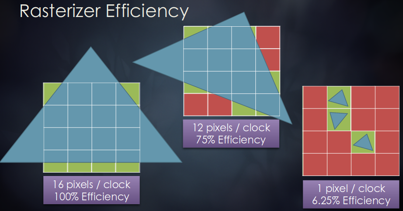

- 各GCNラスタライザはクロックあたり1トライアングルの読み出しとクロックあたり最大16ピクセルの生成を行うことができる。これのため、小さいトライアングルはラスタライズするには極めて非効率である。
- 左図はピーク効率を表し、4つの四角形と16ピクセルを生成する。中図は4つの四角形を生成するが、12ピクセルのみが有効である。ヘルパーレーンのためピクセルシェーダでは16スレッドを消費する。ヘルパーレーンはパックと準備に時間がかかるため、実際にピクセルレートが低下する。中図の効率は、GPUが2x2のピクセルをシェーディングするので、部分的に埋められた四角形のために失われる。
- 右図はプリミティブセットアップ制限に当たるようになる。

~~~c
float3 main() : SV_Target0 {
    bool inside = false;
    float2 barycentric = fbGetBarycentricLinearCenter(); // __XB_GetBarycentricCoords_Linear_Center

    if (barycentric.x >= 0 && barycentric.y >= 0 && barycentric.x + barycentric.y <= 1)
        inside = true;

    uint2 insideBallot = fbBallot(inside); // __XB_Ballot64
    uint insideCount = countbits(insideBallot.x) + countbits(insideBallot.y);
    float insidePercent = insideCount * (1.0f / 64.0f);
    return float3(1 - insidePercent, insidePercent, 0);
}
~~~

- カリングに直接は関係ないが、この役に立つピクセルシェーダは、クロックあたりに運ばれるピクセル数に影響を与えるため、密すぎるメッシュを見分ける。これは補助ピクセルの数を計測することで行われる。言い換えるなら、wavefrontのスレッド数で割った遮蔽されたピクセルの数である。
- MSAAは範囲外の重心(barycentric)座標を持つ有効なピクセルスレッドを持つため、線形な中心から線形な重心(centroid)への切り替えはこの場合ではより正確になる。
- 小さなトライアングルがコンテンツにどれだけ広まっていたか、小さなプリミティブフィルタが効果的かどうか、について大まかに知るためにこれを使った。ボーナスとして、このツールは現在アーティストがメッシュにどれだけ密集してLOD設定が与えられているかを知るために使い、適宜間引くことができる。

# Small Primitive Culling (NDC)

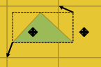

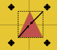

- `any(round(min) == round(max))`

- 元々は非常に包括的な固定点ハードウェア精度の小さなプリミティブフィルタから始めたが、後にMSAAではないターゲットのために近似へと変更した。
- MSAAターゲットはそのテストをサンプル数に基づいて拡大することによりバイアスする必要がある。プログラマブルなサンプル点を用いているなら、自分でなんとかしなさい。MSAAでは、ピクセルの中心と最も外側のサブピクセルサンプルとの間の(サブピクセル中の)最大距離を本質的に定める必要があり、そのテストに影響を与えるためにこれを使う。
- 一般的なアイデアはトライアングルのスクリーン空間での境界箱を求めて、最近傍のピクセルの角に最大値と最小値を合わせる(snap)ことである。最大値と最小値が同じ水平または垂直な辺に合わされば、そのトライアングルはピクセル中心を囲っていないことになり、ピクセルカバレッジに寄与しない。

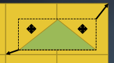

- このテストは保守的であり、カリングされるべきトライアングルがテストに合格する場合がある。このテストがどれだけ安価であるかを考慮すると、この場合を不合格にするのは割に合わない。

# Frustum Culling (NDC)

- クラスタやトライアングルのGPU錐台カリングはオブジェクトが錐台の面と交差しているときのみ効果的となることから、大抵のエンジンではCPUによりオブジェクト全体の錐台カリングを行っている。先のカリングフィルタの、射影後の頂点とALU資源の貯金を持ち合わせている。そこで、我々は4サイクルで4面の伝統的な錐台カリングを行う。これは、特に多くの部分から成る複合オブジェクトに対してへり(fringe)のケースでいくつかの利点が生まれる。
- NearとFar面のかリングは通常ほとんどのタイトルでALUコストに見合わない。背面カリングと同様に、ビューの外側から内側へテッセレートするパッチの不正確なカリングを抑制するため、テッセレートされたパッチが耐性値のある形式を必要とすることに言及するのは重要である。

# Depth Tile Culling (NDC)

- もうひとつ利用可能なトライアングルカリングのアプローチは手動の深度テストを行うことである。しかし、クラスタ及びトライアングルカリングにおいて直接的に深度を読み出すことは可用性やその時々での遮蔽物の質により極めてシーン依存である。一般的なテクニックは、深度バッファを作り、LDSに最適化された並列リダクション[@Harris2007]を行い、各タイルでの保守的な最大最小深度値を格納することである。
- 私の最初のテストでは、あとでトライアングルやクラスタのスクリーン空間での境界箱とテストする16x16の深度タイルグリッドを生み出す完全なZプリパスを実行した。もし境界箱が単一のタイルの中に完全に含まれているなら、高速な深度テストを行い、リジェクトする。このアプローチは高速だが、わずかなトライアングルしか取り除かない。タイルの境界をまたぐような遮蔽されたトライアングルはリジェクトされない。複数のタイルをまたぐ大きなトライアングルをカリングするようにフィルタを修正することは極めて高価であり、コストに見合わない。

~~~
float4 zQuad = g_linearZ.Gather(g_pointClamp, (DTid.xy * 2 + 1) * g_rcpDim);

float minZ = min(zQuad.x, min3(zQuad.y, zQuad.z, zQuad.w));
float maxZ = max(zQuad.x, max3(zQuad.y, zQuad.z, zQuad.w));

// LDSをバイパスした、データを共有するためのlane swizzling
minZ = min(minZ, __XB_LaneSwizzle(minZ, 0x2F | (0x01 << 10)));
minZ = min(minZ, __XB_LaneSwizzle(minZ, 0x1F | (0x02 << 10)));
minZ = min(minZ, __XB_LaneSwizzle(minZ, 0x2F | (0x08 << 10)));
minZ = min(minZ, __XB_LaneSwizzle(minZ, 0x1F | (0x10 << 10)));

maxZ = max(maxZ, __XB_LaneSwizzle(maxZ, 0x2F | (0x01 << 10)));
maxZ = max(maxZ, __XB_LaneSwizzle(maxZ, 0x1F | (0x02 << 10)));
maxZ = max(maxZ, __XB_LaneSwizzle(maxZ, 0x2F | (0x08 << 10)));
maxZ = max(maxZ, __XB_LaneSwizzle(maxZ, 0x1F | (0x10 << 10)));

// 四象限をマージするために0, 4, 32, 36のスレッドを組み合わせる。
minZ = min(minZ, __XB_LaneSwizzle(minZ, 0x1F | (0x04 << 10)));
maxZ = max(maxZ, __XB_LaneSwizzle(maxZ, 0x1F | (0x04 << 10)));
minZ = min(minZ, __XB_LaneSwizzle(minZ, 32);
maxZ = min(maxZ, __XB_LaneSwizzle(maxZ, 32);

if (GI == 0)
    g_minMaxZ[Gid.xy] = float(minZ, maxZ);
~~~

- LDSストレージを迂回しつつデータを共有するためにGCNのlane swizzlingを使った並列深度リダクションのバリアント。圧縮済みの16ビットのESRAM深度バッファにより、この計算は1080pのXB1上で約41usで動作し、完全に帯域に縛られている。ライトタイルカリングを含むレンダリングの他の部分にこのリダクションの結果を用いる。

# Depth Pyramid Culling (NDC)

`int mipMapLevel = min(ceil(log2(max(longestEdge, 1.f))), levels - 1);`

- 深度カリングのもうひとつのアプローチは階層的なZピラミッド[@Rakos2010; @Darnell2010]である。これは、深度バッファの解像度から始まり、すべて単一のピクセルへと到達する。ピラミッドの第1レベルは、深度タイルの手法と同様に、深度が定まった(laydown)あとにデータが追加される。その後、ダウンサンプリングパスを通して残りのMIPレベルにデータを追加する。
- MIPレベルNにおける各テクセルはMIPレベルN-1における対応するすべてのテクセルの最大と最小の深度を含む。境界ボリュームの最長辺の深度をHi-Zピラミッドに格納されている深度と比較することでカリングを行う事ができるピラミッドは単一のレベルへ落ちるため、オーバーラップした四角形を扱うために複数のフェッチを用いる代わりに、非常に簡単にフェッチする単一のMIPレベルを得ることができる。
- HTILEによる高速化を除けば、これが深度ベースカリングとして最終的に用いたアプローチである。

# AMD GCN HTILE

- GCNは通常のGPU深度処理を高速化するHTILEと呼ばれるメタデータを持つ。ピクセルの8x8グループごとに対応する32ビットのメタデータブロックを持つ。このメタデータは通常のGPU深度処理を高速化するが、シェーダ内で手動でデコードして、単一のテストによる64ピクセルの早期リジェクションや、ほかの似たような目的のために使うことができる。
- HTILEは通常は不正確であり、その境界は保守的でなければならない。加えて、すべての深度値は境界を再計算するために読み込まれなければならないため、"resummarize"するまで境界は成長しか行うことができない。
- コンソールでは、HTILEはシェーダ内テスト用に深度バッファを伸長したり、後の深度が有効なレンダパスでHi-Zを無効にすることをせずに保守的な深度テストをもたらすために用いられる。我々はHTILEサーフェスをR32_UINTテクスチャとしてバインドし、手動でタイル情報をデコードし、深度テクスチャを生み出す伸長コンピュートシェーダを持つ。
- HTILEを使う上でいくつかの了解(gocha)が存在するが、手動のHTILEデコーディング及びエンコーディングはさまざまなシナリオにおいて大きなパフォーマンス的成功である。現時点で、HTILEはコンソールの開発者によってのみ直接的にアクセス可能である。

~~~
// 深度境界を計算する
float minZ = depth;
float maxZ = depth;

// wave幅リダクションにより深度タイル境界を計算する
minZ = waveWideMin(minZ);
maxZ = waveWideMax(maxZ);

// HiZとZMaskを半分の解像度のHTileに書き込む
if (GI == 0) {
    uint htileOffset = getHTileAddress(Gid.xy, g_outTiledDimensions);
    uint htileValue = encodeCompressedDepth(minZ, maxZ);
    g_htileHalf.Store(htileOffset, htileValue);
}
~~~

- 初めにダウンサンプリングされたHi-ZピラミッドのMIPレベルを計算するとき、すでに入力の深度値を読み出していたという事実を活用する(leverage)。つまり、フルまたはハーフ解像度の深度値の線形化を行うこともでき、ハーフ解像度のHTILEを書き出すこともできる。そうすれば、パーティクルのような他のパスは、ハーフ解像度の深度バッファをresummarizeする必要なしに、そのMIPレベルに対するHi-Zカリングを使うことができる。
- 各HTILEメタデータブロックを64ピクセルから構築する必要があるため、単純にすでに4を1に減らした最大最小値を使うことは出来ない。HTILEで正しい最大最小値を生むために8x8タイルですべてのピクセルを並列に減らすことが必要になる。
- LDSでの並列リダクション、またはより良い方法として、lane swizzlingにより行うことができる。

~~~
uint waveWideMin(float value) {
    value = min(value, __XB_LaneSwizzle(value, 0x1F | (0x01 << 10)));
    value = min(value, __XB_LaneSwizzle(value, 0x1F | (0x02 << 10)));
    value = min(value, __XB_LaneSwizzle(value, 0x1F | (0x08 << 10)));
    value = min(value, __XB_LaneSwizzle(value, 0x1F | (0x10 << 10)));
    value = min(value, __XB_LaneSwizzle(value, 0x1F | (0x04 << 10)));
    value = min(value, __XB_ReadLane(value, 32));
    return value;
}

uint waveWideMin(float value) {
    value = max(value, __XB_LaneSwizzle(value, 0x1F | (0x01 << 10)));
    value = max(value, __XB_LaneSwizzle(value, 0x1F | (0x02 << 10)));
    value = max(value, __XB_LaneSwizzle(value, 0x1F | (0x08 << 10)));
    value = max(value, __XB_LaneSwizzle(value, 0x1F | (0x10 << 10)));
    value = max(value, __XB_LaneSwizzle(value, 0x1F | (0x04 << 10)));
    value = max(value, __XB_ReadLane(value, 32));
    return value;
}
~~~

- 各HTILEエントリは8x8ピクセルブロックを表すので、lane swizzlingを使った、ひとつのタイルでの64深度値に渡るwave幅のminとmaxの処理を使う事ができる。
- DS_SWIZZLE_B32命令は、DSメモリバンクを読み書きせずに、オフセットマスクに基づいて入力のスレッドデータをswizzleして返す。
- lane swizzleは、64ではなく、32レーンでのみ動作する。つまり、初めの32レーンと終わりの32レーンをマージすることで最後に組み合わせる必要がある。これは他のレーンから減らした値を捕まえることができるため、read lane命令で行われる。

~~~
uint encodeCompressedDepth(float minDepth, float maxDepth) {
    // 最大最小深度をUNORM14に変換する
    uint htileValue = __XB_PackF32ToUNORM16(minDepth - 0.5 / 65535.0, maxDepth + 3.5 / 65535.0);

    // minDepthを2ビットだけシフトアップして、下位4ビットを設定する。
    htileValue = __XB_BFI(__XB_BFM(14, 18), htileValue, htileValue << 2);
    return htile |= 0xF;
}
~~~

- resummarize中に深度の読み戻しコストを払うのではなく、ダウンサンプリング処理中にHTILEを手動でエンコードすることができる。
- HTILEは各8x8ピクセルタイルごとにNearとFarの深度をエンコードする。Nearは自明な受け入れ(trivial accept)に用いられ、Farは自明な拒否(trivial reject)に用いられる。これらの面の間にあるいずれかのものは高解像度テストを行う必要がある。
- ステンシルが有効であれば、14ビットのnear値とfar面への6ビットの差分を持つ。
- ステンシルが優子でなければ、最大最小深度は2つの14ビット値にエンコードされる。下位4ビットはzMaskであり、クリアするところを0にセットする。
- 我々のHi-Zピラミッドはステンシルを必要としないので、このエンコーディングルーチンはHi-Stencilなし用である。

# Software Z

- カリングに深度を使うことで可用性がひとつ問題となる。多くのエンジンは部分的なZプリパスのみ持つか、いずれも持たない。これはどれだけ速く非同期コンピュート処理を実行できるかということに制約をかけている。カリングのために深度テストを行う前にZバッファが定まるのを待つ必要がある。
- FrostbiteはBattlefield3の頃から、次のGPUフレームをCPUで生成する、遮蔽物用ソフトウェアラスタライザを持っていた。この結果はレイテンシなしに関係するいかなるレンダリングパスに先立ってHi-Zピラミッドを読み込むために使うことができる。
- Hi-Zピラミッドを読み込むことに加えて、完全なプリパスを持つかのようにHTILEバッファを保守的に前もって構築する(prime)ためにソフトウェアラスタライザを使うこともできる。
- ソフトウェアラスタライザや完全なZプリパスがないときは、前の深度バッファを再射影してテストするようなトリックを使うことができる。

# Batching

- シーンに対するすべてのカリングフィルタを効率的に実行し、結果をレンダリングするために、バッチ処理は慎重に設計されなければならない。シーン中のトライアングル数はゲームチーム間や視点が異なるだけでも大まかに変化する可能性があり、メモリ使用量は予測可能であることが望ましい。
- 128k個のトライアングルが入るN個のバッファによる固定のメモリバジェット(予算;budget)で始めた。ここでNはカリングとレンダリングとでまともなオーバーラップを得るため十分に大きな値であり、少なくとも4であるべき。ディスパッチ、待機、描画、ルーブを行うことはCP詰まり(CP to stutter)を引き起こすようなひどいことになるかもしれない。効率的にこれを説明するためにレンダリングより前にいくつかのディスパッチを行いたい。
- 16ビット符号なし整数とすると、384k個のインデックスは786kBになる。
- 4つのバッファでおよそ3MBあり、最大0.5Mトライアングルをin flightにできる。この方法によるバッファのサイズ調整と慎重なスケジューリングにより、頂点wavefrontが実行するとき、データはL2キャッシュに常駐する(stay resident)。

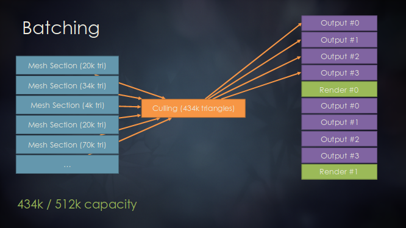

- この例では、4つのバッファがあり、総計512kの生存したトライアングルを格納できる。我々はカリング前に出力の要件を計算しなければならない。今回の場合、すべてのトライアングルが生存するとする。カリングされる50%の背面に対する大まかなヒューリスティックを行うことを考えたが、あるプロジェクションは問題を引き起こす可能性があった。
- カリングが512k制限に収まる434kのトライアングルを処理する。Render #0が起こると、次のパスは出力バッファを再利用できる。これはより複雑なケースにつながる。

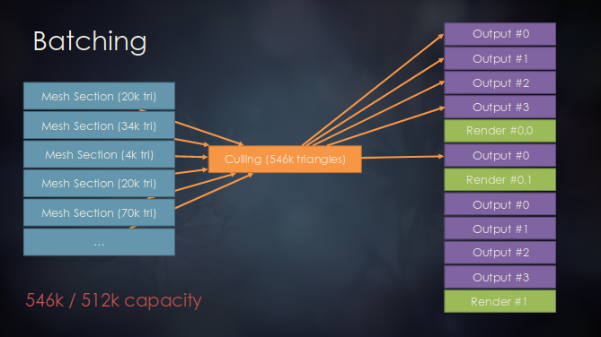

- この例では、カリングは許容量を越えたトライアングルを処理している。バッファを使い果たしたと決定したとき、ディスパッチ中にレンダリングのflushを行うことができる。これで残りのトライアングルをレンダリングするために出力バッファを解放する。
- 最適な頂点の再利用や半透明オブジェクトのために順序を維持している限り、何も考えずにメッシュを切り取ることが明らかにできるため、トライアングルリストを使うのは良いことである。

- カリングとレンダリングのwavefrontsをグラフィクスパイプラインでオーバーラップすることは素晴らしいことだが、初期ディスパッチのための大きなスタートアップコストが存在する。そのときは、オーバーラップできるグラフィクス処理はない。何かできることがあれば…

- そこで非同期コンピュートですよ！水のシミュレーション、物理、布、仮想テクスチャ、などのような他のGPU処理と一緒にそのフレーム内でディスパッチ処理を起動することができる。これはいくつかのグラフィクスパイプライン処理を少し遅くする可能性があるが、全体としてのフレーム時間は早くなる。"なにを"カリングと一緒にスケジューリングするかにのみ気を付けよう。
- ディスパッチとレンダリングが正しくパイプライン化していることを保証するために高価でないラベル待機処理を使う。PCでは、DirectX12が効率的な中間コマンドバッファフェンスを発行できないため、より大きなサイズで少ないバッチを目標とする。
- 一般的に、深度プリパスやシャドウのような低強度のレンダリング処理と同時に起こるように非同期コンピュートをスケジューリングしたい。ディスパッチを囲うためフェンスを使ってGPUで始まるのが前後しないようにする、また、非同期コンピュートのコマンドバッファをflushするのを確認して自動キックオフを待つためにGPUがストールしないようにする。
- そのあと、CUあたりのスレードグループの総数を制限する、または、コンピュートかグラフィクスのいずれかからいくつかのCUを無効化ためにコンピュートシェーダ制限APIを使うことができる。
- 前のフレームのポストプロセスの最終ステージの処理中に非同期コンピュートをキックオフすることもできる。

# Performance

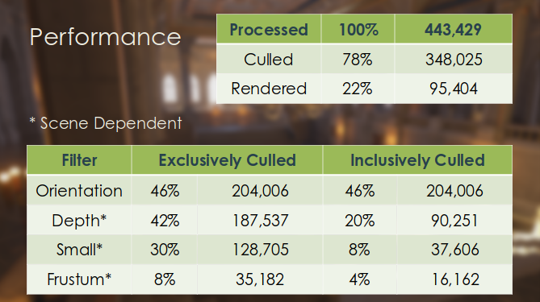

- Orientation Culling以外は、シーン依存性が高い。密なメッシュが多数あれば、Small Primitive Filterは非常に効果的であるだろうし、CPUによるアグレッシブなビューカリングや粗いクラスタカリングパスを行えば、Frustum Cullingはあまり役に立たなくなる。しかし、射影済み頂点があれば、Frustum Cullingは4面で4サイクルなので、それほど邪魔にはならない。
- Depth FilterはOrientation Cullingに次いで効率的だが、これは完全に深度バッファの質に依存する。
- テストシーンでは22%のトライアングルだけがレンダリングされる。

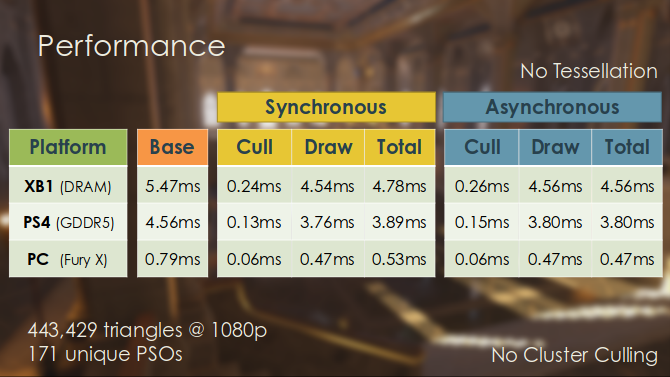

- DRAMなのでXB1のかリングが一番遅い。レンダリングコストは15%から30%ほど節約されていて、非同期だとさらにもう少し節約される。非同期だとカリングと描画の時間がすこし増えているが、全体のコストとしては下がっている。これはコンピュートとグラフィクスのリソース競合によるものと思われる。
- シャドウやデプスパスではこれ以上の改善が見られるだろう。

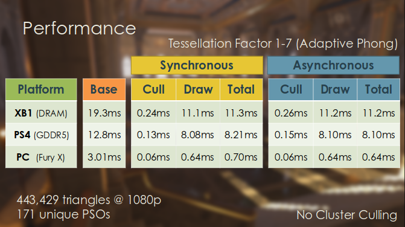

- テッセレーションを行った場合、さまざまなハードウェアボトルネックにより初期レンダリングコストが大幅に増加するのが確認できる。
- テッセレーション前に行われるため、カリングコストは据え置きである。ただし、最終的な描画時間は大幅な改善を見せている。
- このシーンでは、同期カリングではレンダリング時間が40から80%の節約になり、非同期ではもう少し節約になる。

# Future Work

- **複数パス**間の**結果を再利用する**。
    - 一度にすべてのシャドウカスケード。
    - デプス、Gバッファ、エミッシブ、フォワード、リフレクション。
    - キューブマップ --- 一度読み込んで、各面をカリングする。
- **XB1**は**ExecuteIndirect**によるPSO切り替えをサポートする。
    - **単一のサブミットされるバッチ！**
    - さらなるボトルネック削減。
- もっとCPUレンダリングロジックをGPUへ移動する。
- 非同期スケジューリングを改善する。
<!--  -->
- パフォーマンス改善、特にシャドウマップの場合を除けば、コンピュートでの伝統的なトライアングル処理は最も効果的ではないかもしれないと言えるが、このシステムは、フィルタされていないオリジナルのインデックスバッファの代わりに、もとのトライアングルからフィルタされたインデックスバッファを用いて他のパスを連鎖させるためのプラットフォームとして機能する。
- 加えて、カリングによる結果を同じ視点からの後続のパスに再提出することができるため、カリングのスキップや結果の再利用によりパフォーマンスの増幅が得られる。
- XB1はExecuteIndirectでマルチドローパケットごとのPSOの切り替えをサポートしている。これはPSOの差異に関わらず単一のバッチを提出することができ、さらなるボトルネックの削減が可能であることを意味する。この機能の重要性は筆舌に尽くしがたいが、我々は今後間違いなくそれを使ってゆくだろう。

# Future Work

- **インスタンシング**の最適化。
    - 各インスタンスが頂点データを(再び)読み込む。
- **同期**ディスパッチ。
    - 100%近いL2キャッシュヒット。
    - **ALUがレンダリングを束縛する** --- 24VGPR
    - **トライアングルあたり****1.5バイト**の帯域幅を使用。
- **非同期**ディスパッチ。
    - L2キャッシュの低レジデンシー --- カリングとレンダリングの間の他のレンダリング処理。
    - **VMEMがレンダリングを束縛する**。
    - **トライアングルあたり**20バイトの帯域幅を使用。
<!--  -->
- インスタンス化された各描画はそれぞれがカリングされたインデックスバッファ範囲を必要とするため、インスタンス化された描画は複数の描画に展開される。インスタンシングは主にCPUに利するため、各インスタンスが同じ頂点データを読み込むことで不必要なメモリプレッシャーを生み出す以外は、展開されてもDX12下では問題にならない。しかし、このシステムは同期的に動作するときインスタンス化されたデータに対して信じられないほどのL2キャッシュヒットを得ている。
- インスタンス化されていないデータでは、トライアングルあたり約20バイトの帯域幅の使用を計測した。インスタンシングでは、バッチのチャンクサイズやL2キャッシュのほぼ完璧なレジデンシーにより、トライアングルあたり1.5バイトの帯域幅の使用を計測している。これは素晴らしいことである。すなわち、同期の場合はすべきことはないが、非同期の場合は改善すべきことがたくさんある。
<!--  -->
- **帯域**とスループットの**最大化**。
    - LDSチャンクにデータをロードして、**帯域幅を増幅する**。
    - チャンクごとのインデックスバッファにデータを分割する。
    - すべてのインスタンスを評価する。
- wavefront限界とCUマスキングのさらなるチューニング。

# Hardware Tessellation

- もうひとつのメッシュ計算処理の興味深いユースケースはハードウェアテッセレーションのGPUボトルネックを最適化することである。ハードウェアテッセレーションが極めて有益なケースは数多く存在する。コンテンツ生成の最適化、プロシージャルアルゴリズム、CPUによるLoDをGPUへオフロードする方法を探しているなら特に。
- オーバーヘッドを許容する余裕のないタイトルがあったりするので、万人に推奨するものではないが、Dragon Age: InquisitionやStar Wars: Battlefrontのような、ハードウェアテッセレーションが用いてさらなるパフォーマンス改善を成し遂げたいくつかの戦略を簡単に説明しよう。

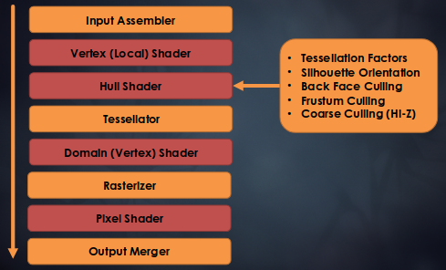

- テッセレーションを使うとき、SEあたりのピークレートで頂点waveを生み出すことが目標になる。そうでなければ、"ピクセルwaveが十分に速く排出していない"、つまり、テッセレーションそれ自体が足手まといになっていないという理由を求める。
- 伝統的なハードウェアテッセレーションパイプラインでは、ハルシェーダは適応型スクリーン空間テッセレーションファクタ計算という困難な仕事をパッチレベルのカリングテクニックとともに行っていた。計算されるファクタは0から設定した最大テッセレーションファクタの間の範囲を取る。
- ハルシェーダがそんなにひどいのかとコンピュートに処理を移動したほうが良いかについての主な理由を2つ説明する。ハルシェーダはwaveあたり64のうち非常に少ないアクティブスレッドを持つ傾向がある。ひとつ目の問題はGPUがLDSに多くの制御点データをはめ込むだけであることに起因する。
- もうひとつの問題はシェーダコンパイラが、3つの頂点のトライアングルパッチでは、3つアクティブスレッドの内2つをオフにして、残りのスレッドでコードを実行する、というパッチ定数関数を実装することに起因する。
- これら2つの問題により、複雑なシェーダになる傾向にあるものでは、並列性が非常に低くなる。
- 一般に、小さなテッセレーションファクタでは、できるだけあとで大量のデータを読み込んで、展開後にそれが起こる、つまり、ドメインシェーダで起こるようにすることを推奨する。

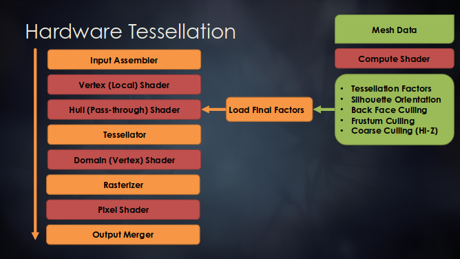

- 初めの最適化はハルシェーダがやっていることを、コストの大きい計算をフレーム内の早い段階でコンピュートのディスパッチに移すことにより、オフロードすることである。この結果は後にハルシェーダがSV_PrimitiveIdで参照するファクタバッファに格納される。
- この最適化はハルシェーダを最低限の時間だけアクティブのままにする。しかし、依然として展開のボトルネックとその他の非効率さに悩まされている。ファクタが0だとハードウェアはパッチをカリングして、その他は1である場合も含めてテッセレートされた描画を行う。
- GCNでテッセレーションを試し始めたとき、いくらかのオーバーヘッドを予測していたが、通常の描画のレンダリングコストとファクタが1のときのテッセレートされた描画の間の不一致(disparity)を見つけたときは衝撃を受けた。テッセレーションファクタが小さいと理にかなってうまく行くが、テッセレーションファクタが大きいと非常にお粗末になる。
- さらに掘り進めると、テッセレーションファクタがより大きいとき、頂点シェーダステージで頂点の再利用が無効化され、代わりにドメインシェーダで有効化サれていることが判明した。これは約3倍頂点が多いのと同じことである。
- 加えて、ファクタが1の描画は先程述べたのと同様の並列性の制約に苦しめられる。

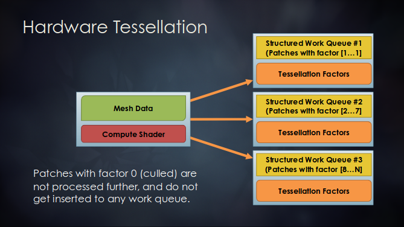

- 改善された最適化では、コンピュートテッセレーションファクタに基づいて3つの構造化ワークキューのひとつにパッチをバケット化した、コンピュートディスパッチを持つ。ファクタが0のかリングされたパッチは処理されず、どのワークキューにも挿入されない。

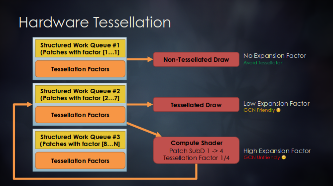

- ファクタが1のパッチはテッセレーションなしでレンダリングされるキューに置かれる。
- ファクタが2から7のパッチはテッセレーションありでレンダリングされるキューに置かれる。
- 高いファクタを持つパッチはテッセレーションではなくcoarse refinement[@AMD2013]を施すキューに置かれる。
- ここの一般的な目標は小さなパッチを生み出すことである。さすれば、より多くのCUでより多くのメッシュを並列化がすることが可能になる。ドメインステージに向かうすべての頂点は、テッセレーションパッチ定数がLDSに格納されているため、同じCUで処理される必要がある。これにより、パッチが大きくなると、並列性が低下する。
- 取り扱う上で必要になるのは、変化するパッチレベル間のTジャンクションを計算に入れることである。PN-AENのよなアルゴリズムを使うと、辺の隣接関係の情報を含んだトライアングルパッチが得られる。これはこの問題を解決するのに役立つ。

# Summary

- 小さく非効率な描画が問題になる。
- コンピュートとグラフィクスはなかよし。
- 利用可能なGPUリソースをすべて使う。
- 非同期コンピュートは極めて強力。
- 大量のクールなGCN命令が使える。
- AMD GPUOpen GeometryFXをチェック。

# Instancing Optimizations

- 最適な前から後への順にするには**インスタンシングバッファ**の高速な**バイトニックソート**が使える。
- `DS_SWIZZLE_B32`を活用する。
    - 入力スレッドデータをオフセットマスクに基づいてswizzleする。
    - 32の保守的スレッド内のデータ共有。
- 32ビットだけなので、32個の要素を効率的にソートできる。
- **クラスタソート**ができるかも。
    - (1つのスレッド内で)クラスタが持つ各インスタンスをソートする。
    - 32個のクラスタをソートする。

# References
