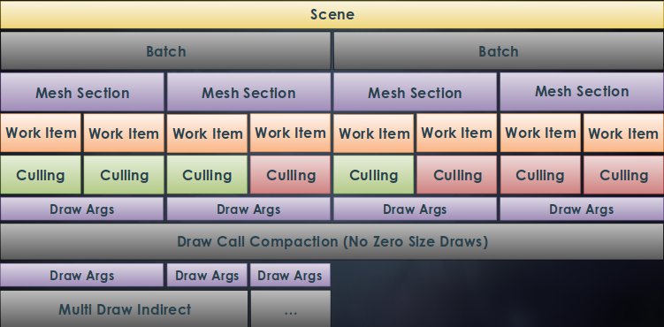
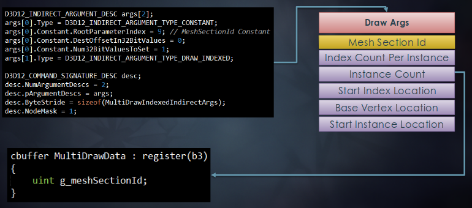
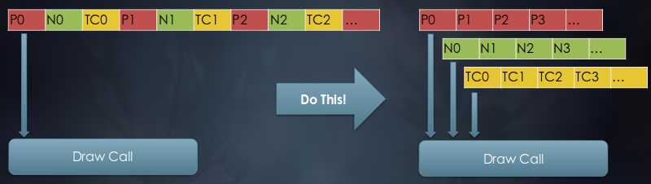
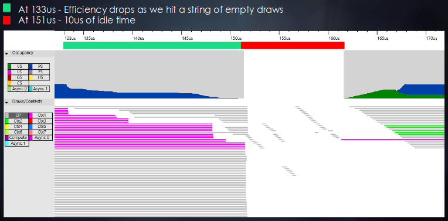
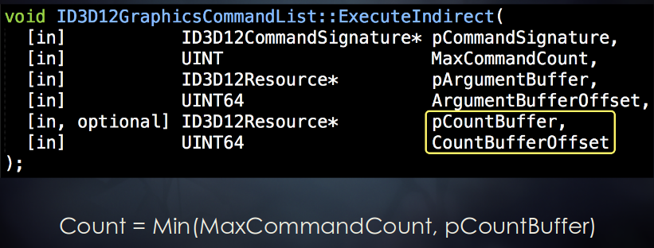
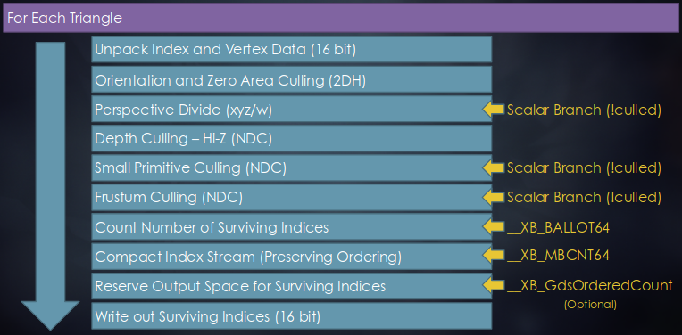

# 略語(Acronyms)

- ここで示される最適化やアルゴリズムはAMDのGCNハードウェアに特化している。
    - コンソールやハイエンドのAMD PCで有効。

|||
|-:|:-|
|VGT|Vertex Grouper / Tessellator|
|PA|Primitive Assembly|
|CP|Command Processor|
|IA|Input Assembly|
|SE|Shader Engine|
|CU|Compute Unit|
|LDS|Local Data Share|
|HTILE|Hi-Z Depth Compression|
|GCN|Graphics Core Next|
|SGPR|Scalar General-Purpose Register|
|VGPR|Vector General-Purpose Register|
|ALU|Arithmetic Logic Unit|
|SPI|Shader Processor Interpolator|

# Peak Triangle Rate

- Shader Engineは1クロックに三角形を1つ発行(issue)できる。
    - XB1とPS4は2つのSEを持つ。
    - より新しいAMD GPUは4つのSEを持つ。
- Compute Unitは1クロックにFMAを64回実行できる。
    - XB1は12個のCUを持つ。
    - PS4は18個のCUを持つ。
    - より新しいAMD GPUは64個のCUを持つ。
- FMAは1クロックに浮動小数点演算を2回行う。
    - 掛け算と足し算を1回ずつ。
- それぞれをかけ合わせると、サイクルあたりの実行可能なALU処理数が計算できる。
    - XB1では、12CU * 64ALU * 2FLOPs = 1536 [ALU ops / cycle]
    - PS4では、18CU * 64ALU * 2FLOPs = 2304 [ALU ops / cycle]
    - より新しいAMD GPUでは、64CU * 64ALU * 2FLOPs = 8192 [ALU ops / cycle]
- 動作するWaveにより4倍になるが各ALUは4クロックかかるので、双方が打ち消されてこの形になる。
- サイクルあたりの実行可能なALU処理数をSE数で割れば、トライアングルあたりの実行可能なALU処理数が得られる。
    - XB1では、1536 [ALU ops / cycle] / 2 SE = 768 [ALU ops / triangle]
    - PS4では、2304 [ALU ops / cycle] / 2 SE = 1017 [ALU ops / triangle]
    - より新しいAMD GPUでは、8192 [ALU ops / cycle] / 4 SE = 2048 [ALU ops / triangle]
- トライアングルあたりの実行可能なALU処理数をサイクルあたりのALU処理数で割れば、トライアングルをカリングしなければならない命令数の上限を得られる。
    - XB1では、768 [ALU ops / triangle] / 2 [ALU ops / cycle] = 384 [cycle / triangle]
    - PS4では、1017 [ALU ops / triangle] / 2 [ALU ops / cycle] = 508 [cycle / triangle]
    - より新しいAMD GPUでは、2048 [ALU ops / triangle] / 2 [ALU ops / cycle] = 1024 [cycle / triangle]

# Motivation --- Death By 1000 Draws

- DirectX 12は**数百万の描画を約束する**。
    - オーバーヘッドが少なくなることで、CPUパフォーマンスの大幅な改善が期待できる。
    - そのパワーの管理は開発者に委ねられる。
    - コンソールハードウェアは対象が固定である。
- GPUは未だ**小さな描画に喉を詰まらせる(chokes on tiny draws)**。
    - ベースパスの後半にGPUがかろうじて使われているのをよく見る。
    - そこには小さくて細かいオブジェクトや遠くのオブジェクトが大量に存在する --- そのほとんどはHi-Zカリングされる。
    - **空の頂点Wavefront(empty vertex wavefront)**を走らせる必要があることが効率を失わせている。
- **描画が増えるということは必ずしも良いことではない**。

トライアングルがピクセルに対して小さすぎると結果として何も描かれないことになるため、後段のピクセルシェーダに仕事がなく頂点シェーダだけが空回りしている状態になってしまう。

# Motivation --- Primitive Rate

- コンソール上でのサイクルあたりのプリミティブが2に近くなると仮定するのは楽観的すぎる。
    - パイプラインにはラスタライザ以外にもボトルネックが起こり得る。
    - XB1上で実際に測定したところ、通常のレンダリングによるクロックあたりのトライアングル数は**0.9**となった。
        - プリミティブレートはこだわる(bound)[誤訳?]ところではないので、この値は実際には極めて健全である。
- 何か役に立つことをするなら、パイプラインの他の所にこだわるほうが良い。
- 最大レートを得るには、VGTとPAの間の良いバランスとlucky schedulingが必要になる。
    - 例えば、waveはPAを交互に使い(alternate between PAs)、そのPAは独立して働く(operate)ため、異なる2つのwave内の同じ頂点は2回シェーディングされなければならないことがある。
- VGTとPAの間のFIFOの深さにより、頂点がFIFOに入った瞬間から数えて**4096サイクル未満で頂点シェーダのpositionを計算する必要がある**。
    - このため、かかるサイクル数はpositionを計算するより僅かに多くなる。
    - 頂点シェーダに時間がかかると、比例してプリミティブレートが下がる。
- いくつかのゲームはシャドウパスにおいてピークパフォーマンス(95%以上の範囲)に極めて近いところにまで達する。
    - 通常は巨大なトライアングルがあることで他より遅くなる領域がいくつか存在する。
    - 粗い(coarse)ラスタライザはクロックあたりのsuper-tileを1つだけ処理する。
    - 32x32より大きな境界矩形を持つトライアングルを粗いラスタライザ上で処理するには複数サイクルが必要になる。
        - プリミティブレートが下がる。

- サイクルあたりのプリミティブがほぼ2になるベンチマークは以下のような特徴を持つ。
    - 頂点シェーダは何も読み出さない。
    - 頂点シェーダは`SV_Position`のみを書き出す。
    - 頂点シェーダは常に0をpositionとして出力する --- すべてのプリミティブは自ずと明らかにカリングされる。
    - インデックスバッファはすべて0である。
        - つまり、すべての頂点はキャッシュヒットである。
        - キャッシュヒットの頂点はピーク計算に含まれない。
        - これが始めの2[頂点/クロック]をヒットさせずに2[プリミティブ/クロック]を達成することができる唯一の方法である。
    - すべてのインスタンスは64の倍数分の頂点を持つ --- 頂点シェーダのwaveが埋まらない可能性を少なくする。
    - ピクセルシェーダをバインドしない --- パラメータキャッシュを使わない。
- 頂点シェーダ後にストールを起こさせないようにする必要がある。
    - ParamSize <= 4 * PosSize
    - ピクセルの排出が生み出されるよりも速い。
    - シザリングを起こさない。
- PAは頂点シェーダが生成できるより早く仕事を受け取ることができる。
    - テッセレーションがピーク頂点プリミティブスループットを達成するのをしばしば見る。
        - 一度にひとつのSEで。

# Motivation --- Opportunity

- CPUで粗くカリングして、GPUで洗練する(refine)。
    - GPUサブミッションの前にCPU上で粗いカリングを行うことがよくある。
- **CPUとGPUの間のレイテンシが最適化を妨げる**。
    - タイトなlock steppingになり得る。
    - コンソールではCPUリソースは限られており、CPUコアをうまく使えているとは言えない。
- GPGPUサブミッション！
    - 深度を意識したカリング(depth-aware culling)。
        - タイトにしたシャドウ境界 / Sample Distribution Shadow Map。[21]
        - 寄与を持たないシャドウキャスタをカリングする。[4]
        - カラーパスから非表示オブジェクトをカリングする。
    - VRのlate-latchカリング。
        - CPUは保守的な錐台をサブミットして、GPUが洗練する。
    - **トライアングルカリングとクラスタカリング**。
        - このプレゼンテーションでカバーする。

- グラフィクスパイプラインへ直接的に対応する。
    - ハルシェーダの負荷を下げる。
    - テッセレーションパイプライン全体の負荷を下げる。[16][17]
    - プロシージャルな頂点アニメーション(風や布など)を使う。
    - **複数のパスやフレームの間で結果を再利用する**。
- グラフィクスパイプラインへ間接的に対応する。
    - 境界ボリュームの生成。
    - 事前スキニング。
    - ブレンドシェイプ。
    - GPUからGPUの仕事を生成する。[4][13]
    - シーンや可視性の決定。
- 言いたいこと(the mantra)は**描画を普通のデータとして扱う**ことである。
    - 事前に構築できる。
    - キャッシュしたり再利用したりできる。
    - GPUで生成できる。

# Culling Overview

- シーン(scene)はメッシュの集合から成り、特定の視点(カメラやライト)から映し出される。
- バッチ(batch)はそのシーンにおけるメッシュの構成可能なサブセットである。
    - バッチに含まれるメッシュはシェーダとストライドを共有する。(XB1は例外)
    - GPU駆動レンダリングを行うために、少なくともPCでは、現時点では必要になる。
    - DirectX 12のPSOとおおよそ1対1に対応すると考えて良い。
- メッシュセクション(mesh section)はindexedドローコールを表す。
    - 自身の頂点バッファ、インデックスバッファ、プリミティブ数、などを持つ。
- ワークアイテム(work item)はバッチにおけるコンピュートシェーダのwavefrontひとつで処理されるトライアングルのサブセットを表す。
    - トライアングル数はハードウェアやアルゴリズムの特徴に基づいた値を選択する。
        - AMDのGCNではwavefrontあたり64個のスレッドがあり、各カリングスレッドは1つのトライアングルを処理するので、各ワークアイテムは256個のトライアングルを処理する。

- 粗いビューカリングを行い、生き残ったクラスタに対してトライアングルカリングを行う。
- ゼロサイズのドローコールはコンパクションにより取り除かれる。
- 生き残ったドローコールはメッシュセクションごとに描画引数(DrawArgs)がまとめられ、バッチごとに`MultiDrawIndirect`により描画する。
    - XB1はindirect引数でPSOを切り替えることができる拡張があり、リソースやステートの違いに関わらず、シーン全体を一度のドローコールで描画することもできる。

# Mapping Mesh ID to MultiDraw ID

- indirect描画ではそれらが由来するメッシュセクションやインスタンスを知ることができない。
    - 基本的にはインデックスの開始位置と描画引数ブロックの数が分かればよい。
    - 定数やその他のリソースを通常の頂点シェーダやピクセルシェーダで読み込む場合は、カリングパスで起きたことに認識しようとして物事が複雑化する。
    - ステート変更を回避するために変換や色などを含むインスタンシングバッファを持とうとすると、1対1のドローコールではなくなってしまう。
    - 本質的には、対応するオリジナルの描画インデックスを追跡する32ビットワードを引数バッファに追加する必要がある。
- DirectX 12では**CommandSignature**によるトリックを使う。
    - indirect引数バッファのフォーマットをパースできるようになる。
    - 各描画引数ブロックと一緒にメッシュセクションIDを格納できる。
    - **PC**のドライバはコンピュートシェーダパッチングを使う。
        - invocationごとにレジスタに読み出される。
    - **XB1**はコマンドプロセッサ**マイクロコードをサポート**する。
        - 間に何かを挟んだりパッチしたりせずにindirect描画を扱うことができる。
- OpenGLはまさにこれ用の`gl_DrawID`がある。
    - SPIは`StartInstanceLocation`を予約済みSGPRに読み出し、`SV_InstanceID`に加える。
- 代替案として、`InstanceDataStepRate`を1にしてインスタンシングバッファをバインドすることで、インスタンスIDを描画IDにマップする方法がある。
    - ドライバの成熟具合によってはルート定数によるアプローチよりも早くなるかもしれない。

- 先にメッシュセクションIDを定義して、次に`DrawIndexed`のindirect引数を定義している。
- すると、シェーダは引数ブロックの0番目のワードをSGPRレジスタに読み出す。
- PCでは、複雑なコマンドを持つCommandSignatureを使おうとすると、`ExecuteIndirect`をコンピュートシェーダで処理しようとする。
- しかし、MultiDrawIndirectやgl_DrawIdのような、ワードを1つ追加するだけなら高速なパス上で処理される。

# De-Interleaved Vertex Buffers

- インターリーブしていない頂点バッファは**GCNアーキテクチャにおいて最適**である。
- インターリーブしていないほうがコンピュート処理で扱いやすい。

- コンピュート処理ではステート変更を最小限にするのに役立つ。
    - 必要なデータだけを分けることができるので、精度の違い以外ではストライドがほぼ変化しない。
- ストライドが定まることで、各描画の頂点やインデックスの開始場所を計算で定めることができる。
    - コンソールやDirectX 12のリソースならば、すべてのジオメトリデータを一箇所に集めることもできる。
- GCNアーキテクチャにおける通常のGPUレンダリングをより最適に行う事ができる。
    - **キャッシュラインを素早く立ち退かせる(evict)ことができる**。
- CPUでもより最適な計算を行うことができる。
    - SoAのほうがデータ構造としてSIMD計算に適している。
- 他のアーキテクチャも含めて最も最適であるためには、データが変更可能かどうかで分けた複数のインターリーブしたストリームを持つのが一般的である。
    - 例えば、位置(とUV)、スキニングデータ、その他共通データをまとめたもの、で分ける。
- パスごとに異なるインデックスバッファを使う事ができる。
    - depth-onlyパスなどで頂点の再利用性を高めることができる。
        - 例えば、法線のみが異なる同じ位置の頂点は法線を用いないパスにおいてまったくの無駄になる。

# Cluster Culling

- 球面座標で**空間的にコヒーレント**なバケットを用いたトライアングルクラスタを生成する。
    - 256個のトライアングルを1つとするクラスタに分けるようにオフライン処理する。
    - 貪欲法による空間とキャッシュ的にコヒーレントなバケットを用いる(bucketing)アルゴリズムを使う。
- 各トライアングルクラスタはキャッシュコヒーレントになるように最適化する。
- 各クラスタの最適な境界円錐を生成する。[19]
    - 単位球上に法線を射影する。
    - **もっと小さく囲む円(minimum enclosing circle)**を計算する。
    - 直径(diameter)が円錐の角度になる。
    - 中心点はデカルト座標系に射影すると円錐の法線になる。
- 円錐は`R8G8B8A8_SNORM`に格納される。
    - 8ビットでも精度は十分。
- `dot(cone.normal, -view) < -sin(cone.angle)`ならカリングする。
    - 最適化として、`-sin`化した円錐の角度を格納する。
- 丸め誤差に対する余裕を持たせたいなら、円錐の角度を少しだけ大きくする。

- コンソールではクラスタサイズを**64**にすると便利ではある。
    - 固有の最適化が使えるようになる。
    - 描画が多すぎるとCPがボトルネックになるため**最適にならない**。
    - LDSにバインドされない。(we were never bound by LDS atomics.)
- プロファイリングに基づくと、**256がスイートスポットであるように思える**。
    - 頂点がより再利用される。
    - アトミック処理がより少なくなる。
- 256より大きいとどうなる？
    - 2つのVGTは256個のトライアングルごとに交互に切り替わる。
    - **頂点の再利用はその切り替えを生き残れない**。

- トライアングルのクラスタを粗くリジェクトする。[4]
- 以下に対してカリングする。
    - 視線(境界円錐)
    - 錐台(境界球)
    - Hi-Zデプス(スクリーンスペース境界箱)
        - 視点の歪みに気を付ける。[22]
        - **射影下では球は楕円体になる**。

- 詳しい話は[4]を参照。

# Draw Compaction

- GPUのキャプチャ。
    - グレーの描画は空のDrawIndirectを表す。
    - CPのコストは処理中の描画に隠蔽される。
    - 133us付近から空描画の束に当たり効率が低下している。
    - 151us付近から10us程度のアイドル時間がある。
- 下がった効率はすぐにはもとに戻らない。
    - CUがwaveで埋まるまで時間がかかる。
- ゼロサイズ描画をコンパクト化することはとても重要である。
    - GPUカリングで節約しても依然として辛い。
    - プリミティブが0個でもindirect引数をフェッチするのはタダではない。
        - 最大300nsのメモリレイテンシが存在する。
        - CPはこれをいくらか隠蔽することができるが、隠蔽できなかった分が積み重なってゆく。
    - ステート変更もタダじゃない。
        - CPはコマンドバッファパケットを消費している。

- CPUは最悪のケースの描画数を発行する。
    - ゼロサイズ描画は生き残ったプリミティブが0でもGPUにindirect引数を処理させる。
    - GPUは描画数とステート変化に渡る制御が必要である。
- DirectX 12の`ExecuteIndirect`APIはオプションでカウントバッファとオフセットを持つ。
    - CPが展開(unroll)する描画の上限をクランプするのに使う。
- 一部のIHVは現時点でこの値をコンピュートシェーダでパッチするか、他の準最適パスを実行する。
    - この機能は新しく、IHVにこの分野でドライバを改善するよう働きかけるには広く使われる必要があるだろう。

~~~c
groupshared uint localValidDraws;
[numthreads(256, 1, 1)]
void main(uint3 globalId : SV_DispatchThreadID, uint3 threadId : SV_GroupThreadID) {
    if (threadId.x == 0) localValidDraws = 0;

    GroupMemoryBarrierWithGroupSync();

    MultiDrawIndirectArgs drawArgs;
    const uint drawArgId = globalId.x;
    if (drawArgId < batchData[g_batchIndex].drawCount)
        loadIndirectDrawArgs(drawArgId, drawArgs);

    uint localSlot;
    if (drawArgs.indexCount > 0)
        InterlockedAdd(localValidDraws, 1, localSlot);

    GroupMemoryBarrierWithGroupSync();

    uint globalSlot;
    if (threadId.x == 0)
        InterlockedAdd(batchData[batchIndex].drawCountCompacted, localValidDraws, globalSlot);

    GroupMemoryBarrierWithGroupSync();

    if (drawArgId < drawArgCount && thisLaneActive)
        storeIndirectDrawArgs(globalSlot + localSlot, drawArgs);
}
~~~

- 描画コンパクションのクロスプラットフォーム的なアプローチとして、上記のような並列リダクションがある。
- GCNの固有機能とスレッドグループサイズを64にすれば、もっと良くできる。

- コンパクションの最適化に伴い、各スレッドが連続した範囲に書き込む必要がある。
    - インデックスとしてスレッドIDが使えない。
- 並列リダクションのようなグローバル同期を回避したい。
- 並列型prefix sumが使える。

- `__XB_Ballot64`
    - 64ビットのマスクを生成する。
    - 各ビットが各wavefrontスレッドの述語(predicate)が評価される。
    - アクティブでないスレッドのビットは0になる。
- `V_MBCNT_LO_U32_B32`[5]
    - 0から31ビットまでの立っているビットの数を計算するGCN固有命令。
- `V_MBCNT_HI_U32_B32`[5]
    - 32から63ビットまでの立っているビットの数を計算するGCN固有命令。
- `__XB_MBCNT64`
    - 自身のスレッドのインデックスより下位の中で立っているビットの数を計算する。
    - ballotと組み合わせて、各スレッドで自身より番号の小さいアクティブなスレッドの数を計算できる。

~~~c
[numthreads(64, 1, 1)]
void main(uint3 globalId : SV_DispatchThreadID, uint3 threadId : SV_GroupThreadID) {
    const uint laneId = threadId.x;

    const uint drawArgId = globalId.x;
    const uint drawArgCount = batchData[g_batchIndex].drawCount;

    MultiDrawIndirectArgs drawArgs;
    if (drawArgId < batchData[g_batchIndex].drawCount)
        loadIndirectDrawArgs(drawArgId, drawArgs);

    const bool thisLaneActive = drawArgs.indexCount > 0;
    uint2 clusterValidBallot = __XB_Ballot64(clusterValidBallot);

    uint outputArgCount = __XB_S_BCNT1_U64(clusterValidBallot);

    uint localSlot = __XB_MBCNT64(clusterValidBallot);

    uint globalSlot;
    if (laneId == 0)
        InterlockedAdd(batchData[batchIndex].drawCountCompacted,    outputArgCount, globalSlot);

    globalSlot = __XB_ReadLane(globalSlot, 0);

    if (drawArgId < drawArgCount && thisLaneActive)
        storeIndirectDrawArgs(globalSlot + localSlot, drawArgs);
}
~~~

- GCNに最適化されたコンパクションは**バリアを使わない**。
- 複数のwavefrontはアトミック演算1つだけで同期する。
- すべてのスレッドへglobalSlotを複製するために**Laneを読む**。

# Triangle Culling

- ひとつのwavefrontの**各スレッドはトライアングルを1つ**処理する。
- コンパクションインデックスを決定するため、カリングマスクをballotして数える。
- ひとつのwavefrontを横断する頂点の再利用を維持する。
- すべてのwavefrontを横断する頂点の再利用を維持する。 --- **ds_ordered_count**[5][15]
    - 半透明やプロシージャルなレンダリングのような全体の順序が重要になる場合にds_ordered_countを使う。
    - メッシュ全体での頂点の再利用にds_ordered_countを使うとコストに見合わない。
    - 3906個程度のワークアイテムで+0.1ms。
    - ds_ordered_countを使うと、絶妙に調整されたwavefrontの制限を越えて最適化できる。

- 各ワークアイテムを通してスレッドごとにトライアングルひとつに対して処理されるカリングシェーダの処理の概略。
    - インデックスと頂点のデータをアンパックする。
    - さまざまなカリングフィルタを通す。
        - 重要な最適化として、コンソールではコンパイラに分岐の統一性(uniformity)のヒントを与えるため、ballotとの比較で分岐することができる。
    - 数え上げ/コンパクション/予約を行う。
    - インデックスを16ビットで書き込む。
        - コンピュートシェーダは16ビット値を書き出せないので、ゼロクリアした出力バッファにInterlockedOrで書き込む。

- ballotがない場合、
    - コンパイラはほとんどのif文で2つのテストを生成する。
        1. 1つ以上のスレッドがif文に入る場合。
            - 実行マスクを設定して、if文を実行する。
        2. どのスレッドもif文に入らない場合。
            - 直接ジャンプする。
- ballot(または、高レベルなballotであるanyやallなど)がある、または、スカラ値で分岐する(`__XB_MakeUniform`)場合、
    - コンパイラは2番目のケースしか生成しない。
    - divergence[^divergent_braching]を扱うための余分な制御フローロジックをスキップする。
- **統一的な分岐の強制**と**divergenceの回避**のためにballotを使う。
    - すべてのスレッドにカリングテストの完全なシーケンスを実行させても害はない。
    - いずれかのスレッドを実行する必要があれば、SIMDが64の幅を持つため、結局の所すべてのスレッドを実行する。
- Hi-Zカリングのように、メモリフェッチやLDS処理が絡む場合にはdivergent branchingを使うべき。

[^divergent_braching]: Divergent branchingとは、「スレッドごとに分岐先が異なる(例えば、スレッドIDが奇数/偶数で分岐する)場合、あらかじめすべてのスレッドが分岐先の処理を実行して、条件に合ったスレッドのみがその結果を採用する」という仕組みのこと。([参考](http://www.toffee.jp/streaming/gpgpu/advanced_gpgpu/2015/advanced_gpgpu03.pdf))

# Orientation Culling

TODO

# References
