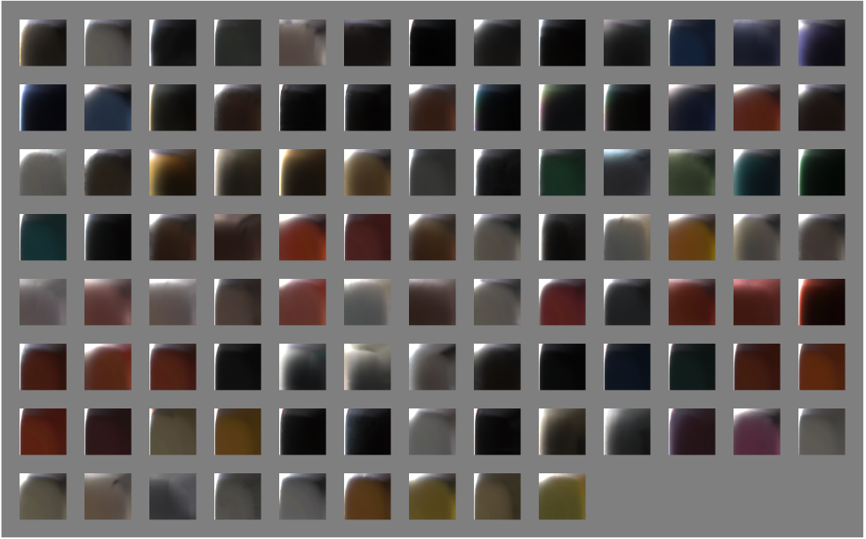

# Physically Based Shading at Disney

## まえがき(Introduction)

Tangled(邦題:塔の上のラプンツェル)における物理ベース髪シェーディングを含めた成功に続き、より広い範囲のマテリアルに対応した物理ベースシェーディングモデルを検討し始めた。物理ベース髪シェーディングでは、アーティストのための制御機能を整備しつつ、素晴らしいビジュアルのリッチさを達成することができた。しかし、髪のライティングとシーンとの統合は、伝統的なアドホックなシェーディングモデルと大きさのない(punctual)ライトを用いていたため、困難を伴った。その後の作品で我々は、マテリアルと環境(environments)に対するライトの応答にさらなる一貫性を持たせつつ、すべてのマテリアルにおいてリッチさを向上させたり、簡単化した制御機能を用いることで、アーティストの生産性を向上させたりしたかった。

調査を初めた段階では、どのモデルを使うべきかという以前に、どれほど物理ベースであればよいのかということさえ明確ではなかった。エネルギー保存則を完全に満たしたものであるべきなのだろうか。屈折率のような物理的パラメータを採用するべきなのだろうか。

ディフューズでは、Lambertが標準として受け入れられているように見える。一方のスペキュラは、界隈(the literature)で最も注目を集めているように見える。@Ashikhmin2000 のようなモデルは物理的にもっともらしくありつつも直観的で実践的であることを目的としている。一方で、@He1991 のようなものはより包括的な物理モデルを提供している。データフィッティングの改善を目的としたものもあるが、そのいくつかは手動の操作がふさわしいようにできている。我々はいくつかのモデルを実装してみて、アーティストに選んだり組み合わせたりしてもらったが、逃れようとしていたパラメータ爆発の所に結局のところ戻ってきてしまった。

多種多様な測定マテリアル(measured materials)を扱う研究として、5つの人気のモデルを比較した @Ngan2005 のものがある。いくつかのモデルは全体的にその他のモデルよりもうまくできているが、興味深いことに、そこにはモデルの性能との強い相関があった。つまり、いくつかのマテリアルはそのすべてのモデルによってうまく表現されるが、その他のマテリアルではまったくだめだった。追加のスペキュラローブを追加すると、ごく少数のケースでのみ、これの助けとなった。これは、難しいマテリアルでは何が表現できないのか、という質問を投げかけている(begs the question)。

この質問の答えとして、BRDFモデルをより直観的に評価するため、我々は、測定マテリアルと解析的BRDFを一緒に表示と比較を行うことができる、新しいBRDFビュアーを開発した。測定マテリアルのデータを見る新しく直観的な方法を発見し、知られたモデルにはうまく表現されていなかった、測定モデルの興味深い特徴を見つけた。

このコースノートでは、測定データにフィットするモデルとそのモデルに足りないものについて収集した(gleaned)洞察に加えて、測定マテリアルを研究することで得られた結果を共有したい。そして、すべての現行のプロダクションで使われている我々の新しいモデルを提供したい(will present)。また、プロダクションでこの新しいモデルを採用した経験を説明し、どのようにして単純さ(simplicity)と頑強さ(robustness)を維持しつつアーティストの制御機能を正しいレベルで追加することができたかを論じたい。

## マイクロファセットモデル(The microfacet model)

マイクロファセットモデルは、表面の反射が光のベクトル$\boldsymbol l$と視線のベクトル$\boldsymbol v$との間で起こる得るなら、$\boldsymbol l$と$\boldsymbol v$の中間に平行な(alined halfway)法線を持つ表面またはマイクロファセットの一部が存在することを仮定する(postulate)。ときおりマイクロサーフェスの法線として参照される、この"ハーフベクトル(half vector)"は$\boldsymbol{h} = \frac{\boldsymbol{l} + \boldsymbol{v}}{|\boldsymbol{l} + \boldsymbol{v}|}$として定義される。等方的な材質のためのマイクロファセットモデルの一般的な形式は以下で表される。

$$
f(\boldsymbol{l}, \boldsymbol{v}) = \text{diffuse} + \frac{D(\theta_h) F(\theta_d) G(\theta_l, \theta_v)}{4 \cos\theta_l \cos\theta_v}
$$

diffuse項は形式不明の関数である。しばしば想定されるLambertでは定数値で表現される。スペキュラ項において、$D$はマイクロファセットの分布関数であり、スペキュラのピーク形状の要因となる。$F$はフレネル反射係数である。$G$は幾何減衰(geometric attenuation)、もしくは、シャドウイングのファクタである。

$\theta_l$と$\theta_v$は法線に対する$\boldsymbol l$と$\boldsymbol v$の入射角である。$\theta_h$は法線とハーフベクトルとのなす角である。 $\theta_d$は$\boldsymbol l$とハーフベクトル(もしくは、対称的に考えて、$\boldsymbol v$と$\boldsymbol h$)との"差"の角度である。

ほとんどの物理的にもっともらしいモデルは、マイクロファセットの形式で具体的に記述されていなくても、それらが分布関数、フレネルファクタ、そして、幾何学的シャドウイングファクタと見なせる追加のファクタを持つという点で言えば、マイクロファセットモデルであると解釈することができる。マイクロファセットモデルとその他のモデルとの間で唯一異なるのは、マイクロファセットの導出に由来する明示的ファクタ$\frac{1}{4 \cos\theta_l \cos\theta_v}$が含まれているかどうかである。このファクタが含まれていないモデルでは、暗黙の(implied)シャドウイングファクタを、$D$と$F$を因数分解したあとに、モデルに$4 \cos\theta_l \cos\theta_v$をかけることで定めることができる。

## 測定BRDFの可視化(Visualizing measured BRDFs)

### The "MERL 100"

TODO

## MERLマテリアル[^MERL]の観察結果
### Diffseの観察結果
Diffuse反射は，表面下へ屈折(refract)して，散乱(scatter)，吸収(absorb)，再放出(re-emit)される光を表現する．光が吸収されると，その結果として物体表面に色が付く．つまり，非金属な材質に色が付く場合，それはdiffuse反射に起因する可能性がある．

Lambert diffuseモデルは，屈折光が十分に散乱し，directionality[^directionality]が完全に失われると仮定する．したがって，diffuse反射率は視点に依存しない．しかし，純粋なLambertian response[^Lambertian_response]を示す材質はそう多くはない．

![][fig-grazing_retro-reflection]

上図はMERLにより計測された材質のBRDFデータを粗さにより2つに分け，$\theta_h$に対する再帰性反射(retro-reflection)の強さをグラフにしたものである．
図から読み取れる傾向として，grazing angle[^grazing_angle]において，なだらかな面では再帰性反射が弱くなり，逆に，粗い面では強くなる．このなだらかな面ではエッジが暗くなるという現象はFresnelの式により予測することができる．すなわち，grazing angleにおいて反射する光の量が増え，屈折する光の量が減るためである．しかし，大抵は，diffuseモデルはFresnel屈折における粗さの影響を考慮せず，表面がなだらかであると仮定するか，Fresnel効果を無視することが多い．

Oren-Nayarモデルはdiffuseの具合を平坦にする粗い面における再帰性反射の増加を予測する．しかし，この再帰性反射のピークは計測データと比較するとそれほど強くない．

Hanrahan-Kruegerモデルもdiffuse具合の平坦化を予測するが，Oren-Nayarモデルと比べて，完全になだらかな面を仮定する．しかし，この再帰性反射のピークは十分ではない．

### Specular Dの観察結果
![][fig-specularD]

$D(\theta_h)$は再帰性反射の応答からその特徴を確認することができる．MERLの材質の大多数は伝統的なspecularモデルよりも長いtail[^tail]を含んだspecular lobe[^specular_lobe]を持つ．

GGXは他の分布関数より長いtailを持つが，上図のクロムのデータと比べるとtailは短い．他に，Löw et al.やBagher et al.は，ピークとは別にtailを調節することができるパラメータを追加したモデルを提案している．また，Nganははじめのピークに追加の広めのピークを足し合わせる方法を提案している．

### Specular Fの観察結果
![][fig-specularF]

$F(\theta_d)$は$\theta_d$が大きくなるとspecular反射が強くなる現象を表現する．これは，なだらかな面ではgrazingな入射光を100%近く反射し，粗い面では100%にはならないが，よりspecularっぽい反射になる．

上図を見ると，計測値はgrazing angle付近でFresnel効果による予測より傾斜がきついのが分かる．これは，Torrance-Sparrow microfacetモデル[^Torrance-Sparrow]が高入射角で見られるoff-specular peak[^off-specular_peak]を説明する動機付けになった．

Microfacetモデルは，係数$\frac{1}{4 \cos\theta_l \cos\theta_v}$はgrazing angleで無限大に近づくが，microfacetのshadowing-masking[^shadowing-masking]効果によりgrazingな反射が減少するため，shadowing-maskingを表現する$G$項は$\frac{1}{4 \cos\theta_l \cos\theta_v}$との組み合わせにより事実上(effectively)Fresnel効果を増幅する．[^Amplified_Fresnel]

### Specular G(とalbedo[^albedo])の観察結果
diffuseからspecularを分離するがごとく，$D$や$F$の正確な推定が必要になるので，測定データから$G$項を分離するのは難しい．しかし，$G$の効果はdirectional albedo[^directional_albedo]上に間接的に見ることができる．

![][fig-albedo]

上図では，ほとんどの材質のDirectional albedoは70°までは比較的平らになっていて，grazing angleでは面の粗さにより異なる．なだらかな面では75°までわずかに上昇し，90°まで減少する．粗い面では全体にわたって増加する．注目すべき点として，極小数の材質が0.3を超える程度で全体的に極めて低い値になっている．

![][fig-specularG]

上図は$G$項のモデルに応じたalbedo応答を表す．"No G"は$G$と$\frac{1}{4 \cos\theta_l \cos\theta_v}$を完全に除去したモデルで，grazing angleで大きく減少するのが分かる．

前提を単純化することにより，Smithの方法で分布関数$D$からshadowing関数を導出することができる．WalterやSchlickはこの方法を用いている．図にあるように，WalterのSmithモデルには，測定データでは見られない，なだらかな面におけるgrazing angle下での著しい増加が確認できる．粗い面になれば，よりもっともらしく(plausible)なる．Smithの$G$はわずかな関数のみからなる解析的な形式を持ち，積分表による積分か他のある種の近似がよく用いられる．

Kurt et al.はfree parameter付きのdata-fittingモデルを提案している．図では$\alpha = 0.25$のときを表している．懸念事項として，Kurtのモデルはgrazing angle近くで発散する．特に粗い分布関数で顕著に現れる．別の選択肢としては，Smith$G$のWalterによる派生型か，より単純なSchlickのものを使い，free parameterとして$G$のroughnessを切り離す(decouple)方法がある．

## Disneyの"原則に基づいた"BRDF
### 原則
新しい物理ベースの反射モデルを開発するさいに，アーティストからart-directable[^art-directable]で必ずしも物理的に正確でないシェーディングモデルが必要だと警告されたため，厳密に物理的なものよりも"原則に基づいた"モデルを開発することを方針とした．モデルを実装するときに準拠した原則は以下の通り．

1. 物理的なパラメータよりも直感的なパラメータを使うべし．
1. 出来る限りパラメータを少なくすべし．
1. パラメータはそのもっともらしい範囲を0から1にすべし．
1. 道理にかなうときには，パラメータがそのもっともらしい範囲を超えることを許可するべし．
1. パラメータの組み合わせのすべてが可能な限り堅牢(robust)でもっともらしくあるべし．

各種パラメータの取捨選択を議論した結果，下記の1カラーと10スカラーに決まった．

### パラメータ
![][fig-brdf_parameters]

- baseColor
  : 表面色．通常はテクスチャマップにより与えられる．
- subsurface
  : 表面下(subsurface)を近似してdiffuse形状(shape)を制御する．
- metallic
  : 金属っぽさ．0に近づくにつれて誘電体(dielectric)っぽく，1に近づくにつれて金属っぽくなる．金属モデルはdiffuse要素を持たず，ベースの色でspecularに色が付く．
- specular
  : 入射する(incident)specularの量．このパラメータは屈折率を陽に表す(?)．[^This_is_in_lieu_of_an_explicit_index-of-refraction]
- specularTint
  : 入射するspecularをベースの色に近づけるためにアーティストによる制御用に許容されたもの．grazingなspecularは無色のまま．
- roughness
  : 表面の粗さ．diffuseとspecularの両方を制御する．
- anisotropic
  : 異方性の程度．specularハイライトのアスペクト比を制御する．
- sheen  :
追加のgrazingの要素．主に布用．
- sheenTint
  : sheenをベースの色に近づける量．
- clearcoat
  : もうひとつの特殊用途のspecular lobe．
- clearcoatGloss
  : clearcoatの光沢を制御する．0に近づくにつれてサテンっぽく，1に近づくにつれてグロスっぽくなる．

### Diffuseモデルの詳細
いくつかのモデルは以下のようなFresnel項を含んでいる．

$$
(1 - F(\theta_l))(1 - F(\theta_d))
$$[^Fresnel_factor]

ここで，$F(\theta)$はFresnel反射の項を表す．

Lambert diffuseモデルはエッジが暗くなりすぎるため，物理的なもっともらしさのためにFresnel項を追加するだけではより暗くなってしまう．

そこで，なだらかな面では影が付き，粗い面ではハイライトが付くような再帰性反射モデルを開発した．このモデルによる効果は，粗い面ではgrazing angleでの屈折が増加する原因であるmicrofacet(?)に入って出るためだと言えるかもしれないが，いずれにしろ，このモデルはアーティストが好み，以前に使っていたad-hocなモデルの機能に類似している．

このモデルは，Fresnel項の屈折率を無視し，入射するdiffuseの損失がないことを仮定する．これは，入射するdiffuse色を直接特定することが可能になる．ベースとなるdiffuseモデルの式を以下に示す．

$$
f_d = \frac{baseColor}{\pi}(1 + (F_{D90} - 1)(1 - \cos\theta_l)^5)(1 + (F_{D90} - 1)(1 - \cos\theta_v)^5)\\
where\\
F_{D90} = 0.5 + 2 \cos\theta_d^2 roughness
$$

この式では，入射するdiffuseの反射率がなだらかな面では0.5倍になり，粗い面では2.5倍になるようなFresnelを生成する．これは，MERLのデータとほどよく一致させ，アーティスト的にも満足するものになったように思われる．

![][fig-detail_diffuse]

subsurfaceパラメータはベースとなるdiffuse形状とHanrahan-Kruegerのsubsurface BRDFに触発されたものとをブレンドする．これは遠方の物体や，scatteringにおけるパスの平均の長さが短い物体にsubsurfaceな見た目を与えるには有用であるが，影または表面ににじむことがないように，完全なsubsurface transportの代替にはならない．[^full_subsurface_transport]

### Specular Dの詳細
よく使われるモデルの中でGGXが最も長いtailを持つが，多くのマテリアルに対してtailの長さが十分ではない．このモデルは実験データとの一致性がBlinnにより支持されたTrowbridge-Reitzの分布と等価である．ここでは，**Generalized-Trowbridge-Reitz**; **GTR**として一般化した式を導入する．

$$
D_{GTR} = c / (\alpha^2 \cos^2\theta_h + \sin^2\theta_h)^\gamma
$$

ここで，$\gamma = 1$のとき，Berryの式と一致し，$\gamma = 2$のとき，Trowbridge-Reitzの式と一致する．$c$はスケーリング用定数を表す．$\alpha$はroughnessパラメータを表し，0で完全になだらかな分布を，1で完全に粗い分布を生成する．

![][fig-GTR]

また，$\gamma = \frac{3}{2}$のときのGTRは$\theta = 2 \theta_h$としたときのHenyey-Greenstein phase関数と等価である．

plausibleなmicrofacet分布は正規化されていなければならず，効率的なレンダリングを行うにはimportance samplingに対応しなければならない．分布が半球上で積分可能であるには，この両方を満たさなければならない．幸いにも，この関数は単純なclosed-form integral[^closed-form_integral]である．効率的な異方性の形式と同じように正規化とimportance sampling関数はAppendix Bにしたがって導出される．

DisneyのBRDFでは，GTRを用いた2つのspecular lobeを持つ．1つ目(primary lobe)は$\gamma = 2$で2つ目(secondary lobe)は$\gamma = 1$になる．Primary lobeはベースとなる材質を表し，異方・金属的になり，secondary lobeはベースの材質にまたがるクリアコート層を表し，常に等方・非金属的になる．

roughnessについては，$\alpha = {\rm roughness}^2$とすることでより線形な変化として認識されることを発見した．これがないと，光沢のあるマテリアルに合わせるときに，とても小さくて非直感的な値になってしまっていた．

明示的な屈折率(IOR)を用いる代わりとして，specularパラメータは入射するspecularの量を決定する．このパラメータの正規化範囲は入射specularにおける$[0.0, 0.08]$へ線形にマップされる．この範囲は屈折率での$[1.0, 1.8]$の範囲に対応し，この範囲にはほとんどの基本マテリアルが含まれている．特に，範囲の中央はIORの$1.5$に対応し，とても典型的な値なので，Disneyのモデルではこの値をデフォルトとしている．*specular*パラメータはより高いIOR値になるように1を超えて指定することができるが，これは注意深く利用すべし．現実世界の入射の反射率が直感に反してとても低くなると考えると，アーティストにもっともらしいマテリアルを作ってもらうときに，このマッピングは大いに役に立った．

clearcoat層では，ポリウレタンの代表値であるIOR$1.5$の固定値を利用し，代わりに，アーティストが*clearcoat*パラメータを使用している層の全体強度(strength)をスケールできるようにする．正規化したパラメータの範囲は$[0, 0.25]$のoverall scale[^overall_scale]に対応する．この層は，ビジュアルに大きな影響があるにも関わらず，相対的に小さなエネルギー量を示す．そこで，ベース層からいずれのエネルギーも差し引かないことにした．また，0に設定すると，clearcoat層は事実上無効化され，無駄が生じない(incurs no cost)．

### Specular Fの詳細
Disneyの目的では，SchlickのFresnel近似は十分で，完全なFresnel式よりおおむね簡単であり，加えて，近似ににより引き起こされるエラーはその他の要因によるエラーよりはるかに小さい．

$$
F_{\rm Schlick} = F_0 + (1 - F_0)(1 - \cos\theta_d)^5
$$

ここで，定数$F_0$は直角入射におけるspecular反射率を表し，誘電体では無色になり，金属では有色になる．実際の値は屈折率に依存する．Specular反射はmicrofacetで行われることに注意されたし．すなわち，$F$は，入射方向と法線のなす角ではなく，光源方向とhalf-vectorのなす角である$\theta_d$に依存している．

Fresnel関数は入射specular反射とgrazing angleでのunity[^unity]間の(非線形)補間とみることができる．すべての光が反射されるように，応答がgrazing incidenceで無色になることに注意されたし．

### Specular Gの詳細
Smithのshadowing要素がprimary specularで利用可能なことを考えて，GGXのためにWalterのより導出された$G$を使い，光沢のある表面における極端なゲインを減らすため元のroughness$[0, 1]$を$[0.5, 1]$にリマップする．最終版では$\alpha_g = (0.5 + {\rm roughness} / 2)^2$とした．

このマッピングは，specularが小さなroughness値でいささか強すぎるというアーティストのフィードバックとともに，計測データとの比較に基いている．これはroughnessで変化し，少なくとも一部は物理ベースで，もっともらしく見える$G$関数をもたらす．Clearcoat specularでは，Smithの$G$を使わず，単に固定のsoughness値$0.25$をとしたGGXの$G$を使う．

## 参考文献
[Physically-Based Shading at Disney (notes), SIGGRAPH 2012](http://blog.selfshadow.com/publications/s2012-shading-course/burley/s2012_pbs_disney_brdf_notes_v3.pdf)

[Simon's Tech Blog: Microfacet BRDF](http://simonstechblog.blogspot.jp/2011/12/microfacet-brdf.html)

[CS6630: Realistic Image Synthesis Spring 2012 -- Cornell University Department of Computer Science](http://www.cs.cornell.edu/Courses/cs6630/2012sp/slides/05ufacet.pdf)

[再帰性反射 -- Tari Lari Run](http://bygzam.seesaa.net/article/134477830.html)

[表面が粗い物体のディフューズライティングで起こる現象 : Retro-Reflection(再帰性反射) -- hanecci's Blog](http://d.hatena.ne.jp/hanecci/20130519/p1)

[Torrance Sparrow モデルに対する解釈](http://www21.ocn.ne.jp/~glass-cg/cg/ts_explanation.pdf)

[Ken Torrance’s accomplishments -- Real-Time Rendering](http://www.realtimerendering.com/blog/ken-torrances-accomplishments/)

[Deriving the Smith shadowing function for the GTR BRDF -- CHAOSGROUP](http://docs.chaosgroup.com/display/RESEARCH/Deriving+the+Smith+shadowing+function+for+the+GTR+BRDF)

[Understanding the Masking-Shadowing Function in Microfacet-Based BRDFs (1) -- graphics.hatenablog.com](http://graphics.hatenablog.com/entry/2014/02/12/060548)

[ゲームグラフィックス特論 第9回 高度な陰影付け](http://www.slideshare.net/tokoik/ss-13348390)

[閉形式(closed-form)とは -- minus9d's diary](http://minus9d.hatenablog.com/entry/20130624/1372084229)

<!-- 参考画像 -->
[fig-microfacet]: microfacet.png

[fig-grazing_retro-reflection]: grazing_retro-reflection.png

[fig-specularD]: specularD.png

[fig-specularF]: specularF.png

[fig-albedo]: albedo.png

[fig-specularG]: specularG.png

[fig-brdf_parameters]: brdf_parameters.png

[fig-detail_diffuse]: detail_diffuse.png

[fig-GTR]: GTR.png

<!-- 脚注 -->
[^microfacet]: micro- + facet(小さな面)

[^NDF]: Disneyの資料中では *Microfacet Distribution Function* だが，このテキストではその他の資料に合わせて *Normal Distribution Function; NDF* とする．

[^MERL]: [http://www.merl.com/brdf/](http://www.merl.com/brdf/)

[^directionality]: 有向性．ここではdiffuseのことなので，方向に関する要素に対して拡散の程度に何らかの相関があるということ．

[^Lambertian_response]: Lambert反射の性質．responseは反射や屈折をなどの光に対する応答(反応)のこと．

[^grazing_angle]: 面スレスレの角度，法線とのなす角が90°に近い

[^tail]: 単調減少するグラフの後半部分．long tailは後半部分の減少量が少なく，より漸近的であること．

[^specular_lobe]: retro-reflectionのspecular強度を半球にプロファイルしたもの．

[^Torrance-Sparrow]: Microfacetのshadowing-masking効果を導入することでoff-specular peakを理論的に説明するモデル．

[^off-specular_peak]: 粗い面でspecularのピークが鏡面反射方向からずれて観測される現象．

[^shadowing-masking]: shadowingはmicrofacetが入射光を遮る現象のこと．maskingはmicrofacetが反射光を遮る現象のこと．

[^Amplified_Fresnel]: 式的には，$G$項は$\frac{1}{4{\rm cos}\theta_l {\rm cos}\theta_v}$が$+\infty$に発散するよりも早く$+0$に収束するため，grazing angleにおいて$\frac{G}{4{\rm cos}\theta_l {\rm cos}\theta_v} < 1$となるためだと考えられる．

[^albedo]: 入射光に対する反射率の比．アルベド．

[^directional_albedo]: ある一方向に対するアルベド．

[^art-directable]: アーティストが思い通りの調整ができる．

[^This_is_in_lieu_of_an_explicit_index-of-refraction]: パラメータ*specular*で屈折率を表現できる，という意味か．原文だと，"This is in lieu of an explicit index-of-refraction."

[^Fresnel_factor]: 屈折に対するFresnelの法則，および，Helmholtzの相反性(reciprocity)により，表面下に入るときと出るときの2回分を説明する必要がある．

[^full_subsurface_transport]: あくまでシェーディングの話なのでGI的なことはできない，ということか．

[^closed-form_integral]: 閉形式の積分．閉形式は有限個の良く知られた(well-known)関数によって解析的に表される式のこと．ようは積分が上手に解けるということか．

[^overall_scale]: 要調査

[^unity]: 要調査
