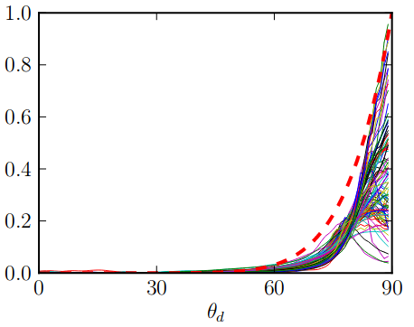
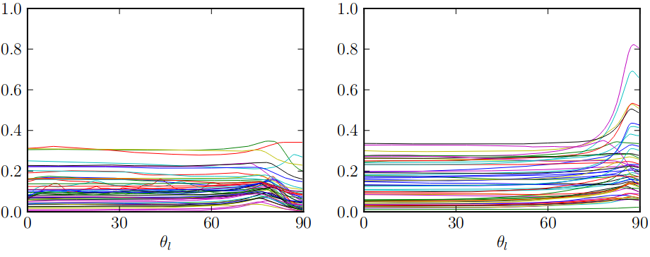
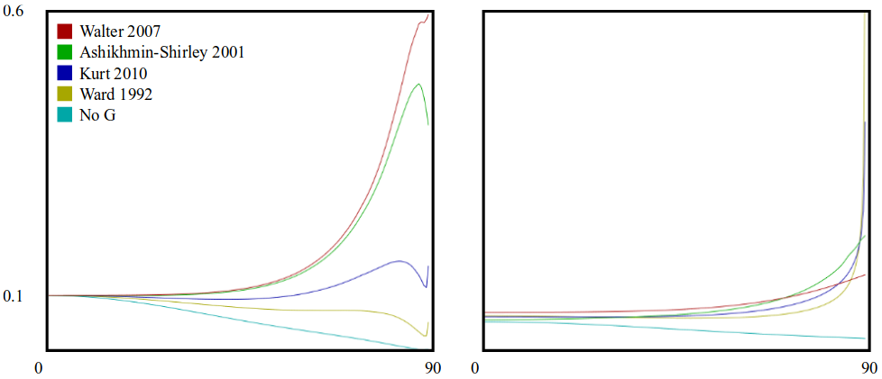
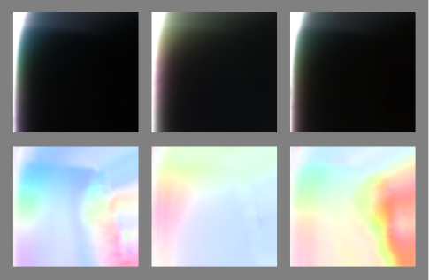
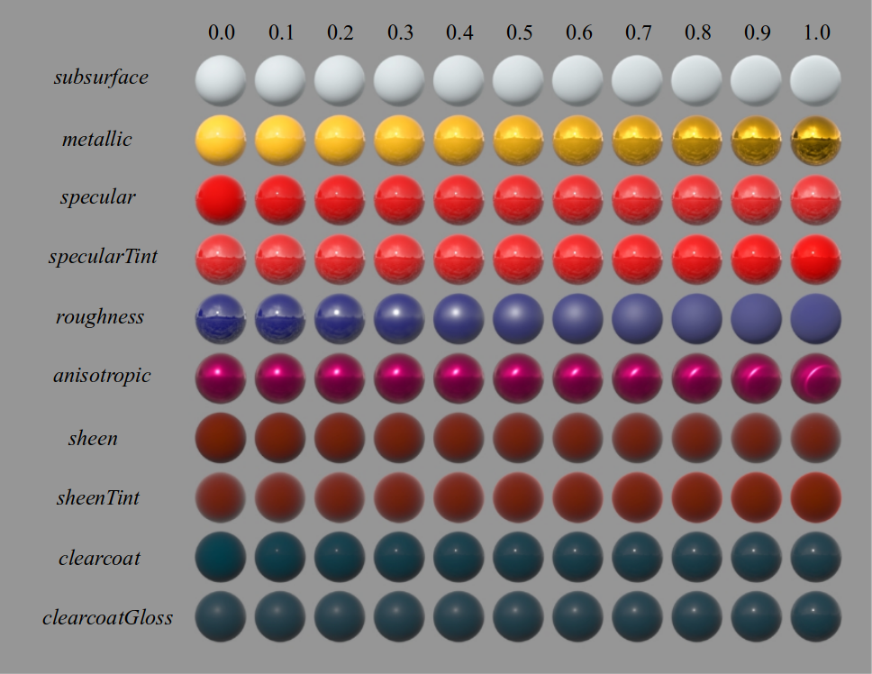
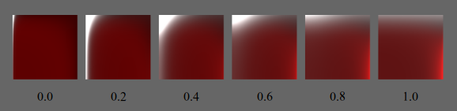
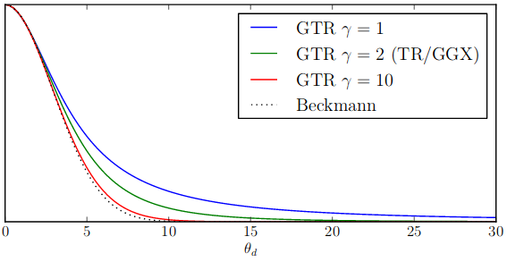
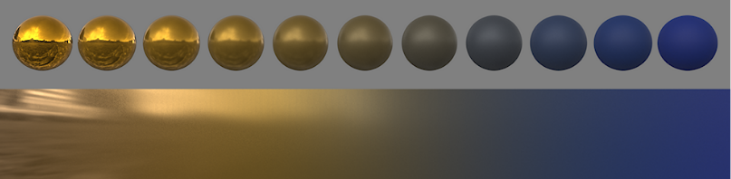
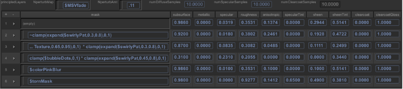
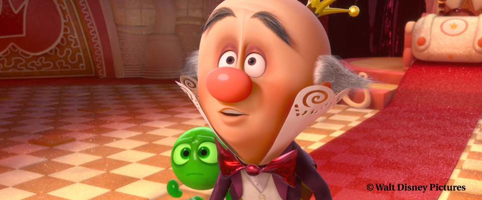

# Physically Based Shading at Disney

## まえがき(Introduction)

Tangled(邦題:塔の上のラプンツェル)における物理ベース髪シェーディングを含めた成功に続き、より広い範囲のマテリアルに対応した物理ベースシェーディングモデルを検討し始めた。物理ベース髪シェーディングでは、アーティストのための制御機能を整備しつつ、素晴らしいビジュアルのリッチさを達成することができた。しかし、髪のライティングとシーンとの統合は、伝統的なアドホックなシェーディングモデルと大きさのない(punctual)ライトを用いていたため、困難を伴った。その後の作品で我々は、マテリアルと環境(environments)に対するライトの応答にさらなる一貫性を持たせつつ、すべてのマテリアルにおいてリッチさを向上させたり、簡単化した制御機能を用いることで、アーティストの生産性を向上させたりしたかった。

調査を初めた段階では、どのモデルを使うべきかという以前に、どれほど物理ベースであればよいのかということさえ明確ではなかった。エネルギー保存則を完全に満たしたものであるべきなのだろうか。屈折率のような物理的パラメータを採用するべきなのだろうか。

ディフューズでは、Lambertが標準として受け入れられているように見える。一方のスペキュラは、界隈(the literature)で最も注目を集めているように見える。Ashikhmin-Shirley [-@Ashikhmin2000] のようなモデルは物理的にもっともらしくありつつも直観的で実践的であることを目的としている。一方で、@He1991 のようなものはより包括的な物理モデルを提供している。データフィッティングの改善を目的としたものもあるが、そのいくつかは手動の操作がふさわしいようにできている。我々はいくつかのモデルを実装してみて、アーティストに選んだり組み合わせたりしてもらったが、逃れようとしていたパラメータ爆発の所に結局のところ戻ってきてしまった。

多種多様な測定マテリアル(measured materials)を扱う研究として、5つの人気のモデルを比較した @Ngan2005 のものがある。いくつかのモデルは全体的にその他のモデルよりもうまくできているが、興味深いことに、そこにはモデルの性能との強い相関があった。つまり、いくつかのマテリアルはそのすべてのモデルによってうまく表現されるが、その他のマテリアルではまったくだめだった。追加のスペキュラローブを加えると、ごく少数のケースでのみ、これの助けとなった。これは、難しいマテリアルでは何が表現できないのか、という質問を投げかけている(begs the question)。

この質問の答えとして、BRDFモデルをより直観的に評価するため、我々は、測定マテリアルと解析的BRDFを一緒に表示と比較を行うことができる、新しいBRDFビュアーを開発した。測定マテリアルのデータを見る新しく直観的な方法を発見し、知られたモデルにはうまく表現されていなかった、測定モデルの興味深い特徴を見つけた。

このコースノートでは、測定データにフィットするモデルとそのモデルに足りないものについて収集した(glean)洞察に加えて、測定マテリアルを研究することで得られた結果を共有したい。そして、すべての現行のプロダクションで使われている我々の新しいモデルを提供したい(present)。また、プロダクションでこの新しいモデルを採用した経験を説明し、どのようにして単純さ(simplicity)と頑強さ(robustness)を維持しつつアーティストの制御機能を正しいレベルで追加することができたかを論じたい。

## マイクロファセットモデル(The microfacet model)

マイクロファセットモデルは、表面の反射が光のベクトル$\boldsymbol l$と視線のベクトル$\boldsymbol v$との間で起こる得るなら、$\boldsymbol l$と$\boldsymbol v$の中間に平行な(alined halfway)法線を持つ表面またはマイクロファセットの一部が存在することを仮定する(postulate)。ときおりマイクロサーフェスの法線として参照される、この"ハーフベクトル(half vector)"は$\boldsymbol{h} = \frac{\boldsymbol{l} + \boldsymbol{v}}{|\boldsymbol{l} + \boldsymbol{v}|}$として定義される。等方的な材質のためのマイクロファセットモデルの一般的な形式は以下で表される。

$$
f(\boldsymbol{l}, \boldsymbol{v}) = \text{diffuse} + \frac{D(\theta_h) F(\theta_d) G(\theta_l, \theta_v)}{4 \cos\theta_l \cos\theta_v}
$$

ディフューズ項は形式不明の関数である。しばしば想定されるLambertでは定数値で表現される。スペキュラ項において、$D$はマイクロファセットの分布関数であり、スペキュラのピーク形状の要因となる。$F$はFresnel反射係数である。$G$は幾何減衰(geometric attenuation)、もしくは、シャドウイングのファクタである。

$\theta_l$と$\theta_v$は法線に対する$\boldsymbol l$と$\boldsymbol v$の入射角である。$\theta_h$は法線とハーフベクトルとのなす角である。 $\theta_d$は$\boldsymbol l$とハーフベクトル(もしくは、対称的に考えて、$\boldsymbol v$と$\boldsymbol h$)との"差"の角度である。

ほとんどの物理的にもっともらしいモデルは、マイクロファセットの形式で具体的に記述されていなくても、それらが分布関数、Fresnelファクタ、そして、幾何学的シャドウイングファクタと見なせる追加のファクタを持つという点で言えば、マイクロファセットモデルであると解釈することができる。マイクロファセットモデルとその他のモデルとの間で唯一異なるのは、マイクロファセットの導出に由来する明示的ファクタ$\frac{1}{4 \cos\theta_l \cos\theta_v}$が含まれているかどうかである。このファクタが含まれていないモデルでは、暗黙の(implied)シャドウイングファクタを、$D$と$F$を因数分解したあとで、モデルへ$4 \cos\theta_l \cos\theta_v$をかけることにより定めることができる。

## 測定BRDFの可視化(Visualizing measured BRDFs)

### The "MERL 100"

{#fig:1}

等方的なBRDFマテリアルのサンプル100種が @Matusik2003 によりキャプチャされた。そこには、塗料、木材、金属、織物、岩石、ゴム、プラスチック、その他の合成材質を含む広範囲のマテリアルが網羅されている。このデータセットは[Mitsubishi Electric Research Laboratories](http://www.merl.com/brdf/)から無料で手に入れることができ、一般的には新しいBRDFモデルの評価に使われる。これらのBRDFのスライスを[@fig:1]に示す。

MERL100の各BRDFは、$\theta_h$軸、$\theta_d$軸、$\phi_d$軸にそってそれぞれが$90$、$90$、$180$の三次元へ密にサンプルされる。これらは、スペキュラのピーク近くにデータサンプルが集中するように歪ませてある(warped)$\theta_h$軸を除いて、$1$度刻みになっている。これは、データが扱いやすいという点では良いことだが、特に水平近くでデータがどれだけ正確なのかについて明確でない。このため、一部の研究者はフィッティングを行うときに水平近くのデータを破棄しているが、このデータはマテリアルの外観(appearance)における重大な(profound)効果を持つ可能性を考えるためにはいまだ有効である。

### BRDFエクスプローラー(BRDF Explorer)

{#fig:2}

MERLの測定マテリアルを調べて(examine)、解析的モデルと比較するため、我々は[@fig:2]で示される、新しいツールであるBRDFエクスプローラーを開発した。ソースコードは[GitHub](https://github.com/wdas/brdf)から手に入れることができる。BRDFエクスプローラーは以下の機能を有する。

- GLSLで描かれた解析的BRDFの読み込み。
- @Ngan2005 がキャプチャした異方的マテリアルのサンプルを含む測定BRDFの読み込み。
- 複数データのプロット。(3D半球表示、極座標、様々なデカルト座標系)
- 計算済みアルベドのプロット。(半球での方向における反射率)
- 露出制御付き画像スライス表示。
- 重点サンプリングされたIBLによって照らされたオブジェクトの表示。
- 照らされた球の表示。
- パラメトリックモデルのためのUIによる動的制御。

このツールは、新しいモデルの開発と同様に、測定マテリアルと既存の解析的モデルとの比較において非常に貴重(invaluable)であった。驚くことに、モデルのパラメータとBRDF空間に対するより深い理解をもたらすことから、アーティストのためのインタラクティブなBRDFエディタとしても非常に有用であることが判明した。

### 画像スライス(Image slice)

{#fig:3}

測定データを可視化する最も単純で最も直観的な方法のひとつは、単に画像の束として見ることであり、我々は、これがデータに関する直観を得るための非常に強力なツールであることを発見した。結論として、MERL100のマテリアルの興味深い特徴はすべて$\phi_d = 90$のスライスに見ることができる。この空間の概略図は、2つのマテリアルのサンプルと合わせて、[@fig:3]で示される。その他のスライスは、[@fig:4]で示される通り、$phi_d = 90$のスライスに対して大まかに(roughly)歪んでいるだけである。この観察結果は、$f(\theta_h, \theta_d)$の形式に簡単化した等方的なBRDFモデルの基礎として、@Romeiro2008 や @Pacanowski2012 のような近年の研究で利用されていた。

{#fig:4}

画像スライスでは、左端がスペキュラのピークを表し、上端がFresnelのピークを表す。下端では光のベクトルと視線のベクトルが完全に一致する(coincident)。すなわち、下端は再帰反射(retroreflection)を表す。特に右下はグレージング(grazing)再帰反射を表す。ディフューズ反射率はBRDF空間全体で表されるが、一般的には画像の中央をディフューズ応答として特定する(isolate)。

[@fig:3]の概略図には$\theta_l$または$\theta_v$の等値線(isoline)も含まれている。多くのディフューズ効果はこの等高線(contour)に従う傾向にある。これらの等値線は$\phi_d$をゼロに近づけると直線になり、$\phi_d$のスライスを比較することで、マテリアル応答のどの部分がディフューズ反射に由来しているかと、どの部分がスペキュラ反射に由来しているかについての洞察を得られる。もうひとつのヒントはもちろん色についてである。つまり、ディフューズ反射率はその表面に起因し、(表面が金属のように)色付けされているわけではない(is not tinted)。

## MERLマテリアルの観察結果(Observations from MERL materials)

### ディフューズの観察結果(Diffuse observations)

{#fig:5}

ディフューズ反射率は、表面に対して屈折(refract)したり、散乱(scatter)したり、一部が吸収(absorb)したり、再放出(re-emit)したりする光を表す。一部の光が吸収されると、ディフューズ応答は表面の色で色付けされる。すると、色付けが行われた非金属マテリアルの部分はディフューズであるとみなすことができる。

{#fig:6}

{#fig:7}

Lambertディフューズモデルは、屈折光が、指向性(directionality)が完全に失われてしまうくらい十分に散乱していると仮定する。したがって、ディフューズ反射率は定数になる。しかし、Lambert的な応答を表すマテリアルは非常に少ないことを[@fig:1]と[@fig:5]における様々な画像スライスに見ることができる。

[@fig:6]に示されるように、多くのマテリアルにはグレージング自己反射での落ち込みが見られ、その他大勢にはピークが見られる。これは、画像スライスにおける見かけ上の(apparent)色付けに起因するディフューズ現象であるように見える。これはラフネスと強く相関している。つまり、より高いスペキュラピークをもつ滑らかな表面は輪郭が暗くなる(have a shadowed edge)傾向があり、粗い表面は逆に明るくなる(a peak instead of a shadow)傾向がある。この相関は自己反射の応答曲線や[@fig:7]のレンダリングされた球に見ることができる。

滑らかな表面において輪郭が暗くなる現象(grazing shadow)はFresnelの式により予測される。つまり、グレージング角では、表面で反射するエネルギーが多くなり、屈折してディフューズ的に再放出するエネルギーは少なくなる。しかし、ディフューズモデルは、Fresnelの屈折における表面のラフネスによる効果を考慮せずに、表面が滑らかであると仮定するか、Fresnel効果を無視するかのいずれかであることが多い。

Oren-Nayarモデル [-@Oren1994] は、ディフューズ形状を平坦化するような、粗いディフューズ表面における再帰反射の増加を予測する。

{#fig:8}

しかし、この再帰反射のピークは測定データほど強くはなく、粗い測定マテリアルは一般的にディフューズの平坦化を示さない。表面下散乱の理論から導き出されたHanrahan-Kruegerモデル [-@Hanrahan1993] はディフューズ形状の平坦化を予測するが、その輪郭においてあまり強いピークを持たない。Oren-Nayarとは対照的に、このモデルは完全に滑らかな表面を仮定する。Oren-NayarモデルとHanrahan-Kruegerモデルは[@fig:8]でその比較が示される。

再帰反射のピークの他にも、[@fig:5]の画像スライスにはさらなる(additional)ディフューズの変化(variation)が見られる。強度(intensity)と色の両方の変化は$\theta_l / \theta_v$の等値線に沿って見られる。これは、場合によっては、層状の(layered)表面下散乱によるものである可能性がある。しかし層状の表面下散乱モデルであっても一般的にその表面は滑らかであると考え、強い再帰反射のピークを生み出さない。

### スペキュラにおけるDの観察結果(Specular D observations)

マイクロファセット分布関数$D(\theta_h)$は、[@fig:6]が示すように測定マテリアルにおける再帰反射の応答から観察することができる。そのマテリアルは、表面のラフネスの指標(indication)とすることができる、ピークの高さに基づいて2つのグループに分けられる。最も高いピークは *鋼(steel)* で400以上あった。ピークが平坦になっていれば、曲線の残りの部分はディフューズ反射率由来である可能性が高い。MERLマテリアルの大多数は伝統的なスペキュラモデルより長いテールを有するスペキュラローブを持つ。例として、*クロム(chrome)* のサンプルを[@fig:9]に示す。このマテリアルのスペキュラ応答は、滑らかで高度に研磨された(highly polished)表面においては典型的であり、2、3度の幅(a couple of degrees wide)しかないスペキュラピークと何倍も広いスペキュラテールを持つ。奇妙なことに(curiously)、伝統的なBeckmann、Blinn Phong、Gaussianといった分布はこの幅においてはほぼ同じ(nearly identical)であり、そのピークとテールにおいてはいずれもうまく表現できていない。

{#fig:9}

より広いテールが求められていたことは @Walter2007 がGGXを導入した動機になった。GGXは他の分布より長いテールを持つが、いまだクロムのサンプルの輝く(glowy)ハイライトを捉えるまでには至っていない。測定マテリアルをフィットさせるようにテールの応答をモデリングすることの重要性は @Loew2012 や @Bagher2012 といった最近のモデルの基礎ともなった。これらのモデルは両方とも、ピークとは別にテールを制御する追加のパラメータが加えられている。テールをモデリングするもうひとつの選択肢は、@Ngan2005 が提案したような、1つ目に加える形でより広い2つ目のスペキュラピークを使うことである。

GGXは他の分布関数より長いtailを持つが，上図のクロムのデータと比べるとtailは短い．他に，Löw et al.やBagher et al.は，ピークとは別にtailを調節することができるパラメータを追加したモデルを提案している．また，Nganははじめのピークに追加の広めのピークを足し合わせる方法を提案している．

### スペキュラにおけるFの観察結果(Specular F observations)

{#fig:10}

Fresnel反射ファクタ$F(\theta_d)$は、光ベクトルと視線ベクトルが別々に動くようなスペキュラ反射での増加を表し、すべての滑らかな表面はグレージング入射角(incidence)においてスペキュラ反射が100%に近づくであろうことを予測する。粗い表面では、スペキュラ反射は100%にならずとも、その反射率は依然としてスペキュラ的になるだろう。

MERLマテリアルのFresnel応答曲線は[@fig:10]に示される。応答の全体形状を比較するため、曲線はオフセットとスケールがされている。すべてのマテリアルは$\theta_d = 90$近くで反射率の増加が見られる。これは[@fig:1]における画像スライスの上端にも見ることができる。

特筆すべきことは、グレージング角付近では多くの曲線の傾斜がFrenel効果による予測よりも大きいことである。この観察結果は実際に、高い入射角で見られる"ズレたスペキュラピーク(off-specular peak)"を説明するTorrance-Sparrow [-@Torrance1967] のマイクロファセットモデルの動機となった。マイクロファセットモデルにおける$\frac{1}{4 \cos\theta_l \cos\theta_v}$はグレージング角において無限大に近づく。グレージング反射率はマイクロサーフェスのシャドウイング効果により減少するので、(モデルでも現実世界でも)問題にならない。$G$は光ベクトルのシャドウイングと、それと対照的な、視線ベクトルのマスキングを表し、グレージング反射率を制御下に(in check)置き続ける。しかし、$G$がシャドウイングを表していたとしても、$G$と$\frac{1}{4 \cos\theta_l \cos\theta_v}$の組み合わせは実際の所(effectively)Fresnel効果を増幅している。

### スペキュラにおけるG(とアルベド(albedo))の観察結果(Specular G (and albedo) observations)

{#fig:11}

測定データから$G$を分離することは、ディフューズからスペキュラを分離するのと同じように$D$と$F$を正確に推定する必要があるために難しい。しかし、$G$の効果は方向アルベド(directional albedo)での効果として間接的に見ることができる。アルベドは総入射エネルギーに対する総反射エネルギーの割合である。広義では(in broad terms)、表面の色を表し、すべての波長が1以下でなければならない。アルベドは、太陽のような単一の方向から来る光についても考えられる。その場合は、アルベドは入射角に依存する方向関数(directional function)となり、すべての角度と波長において1以下でなければならない。

ほとんどのマテリアルの方向アルベドは[@fig:11]に見られるようにはじめの70度では比較的平坦であり、グレージング角でのアルベドは表面のラフネスと強く相関している。滑らかなマテリアルでは、75度までわずかに増加し、続いて90度にかけて落ち込みを示している。粗い表面では、あるものでは著しく、グレージング入射角に至るまでずっと増加している。とりわけ、アルベドの値は全体的にかなり低く、0.3以上であるマテリアルはほぼ無い。

{#fig:12}

多くの粗いマテリアルで見られるグレージング自己反射は、アルベドでの色彩の色付け(chromatic tint)に証明されるように、この増加(gain)にも大いに(significantly)貢献する。

非常に滑らかな表面と非常に粗い表面の両方について、モデル化された$G$の選択に対応したアルベド応答を[@fig:12]に示す。"No G"モデルで示されるように、$G$と$\frac{1}{\cos\theta_l \cos\theta_v}$を省略すると、グレージング角では応答が暗くなりすぎてしまう。ここで重要な点は、$G$関数の選択がアルベドに重大な(profound)影響を及ぼすと同様に(in turn)、表面の外観に重大な影響を及ぼすということである。

一部のスペキュラモデルは、よりもっともらしいアルベド応答曲線を生成することを特段の目標として開発されてきた。これらの一部では、エネルギー均衡(balance)を維持するため、アルベドを完全な平坦にすることを目的(intent)としている。[@fig:11]におけるMERLデータのアルベドプロットに基づけば、マテリアルの殆どがいくらかのグレージング増加(some sort of grazing gain)を示しているが、これは不合理な目標(unreasonable target)ではない。つまり、いくらかのグレージング増加はスペキュラでない効果に起因している可能性が高い。

前提の単純化をいくつか用いることで、 @Smith1967 マイクロファセットの分布$D$からシャドウイング関数を導くことができる。これは @Walter2007 や @Schlick1994 で用いられるアプローチである。[@fig:12]に見られるように、WalterによるSmithモデルのグレージング反射率は滑らかな表面において大いに増加する。これは測定データには見られない効果である。粗くなれば、その応答はよりもっともらしくなる。Smithの$G$は少数の関数のみ解析形式(analytic form)を持ち、表形式の積分か他の近似がよく使われる。

@Kurt2010 による近年の経験的モデルは異なるアプローチを取っており、自由パラメータ(free parameter)を持つデータフィッティングモデルを提案する。[@fig:12]は$\alpha = 0.25$としたKurtモデルを示しており、$\alpha$の他の値ではアルベド応答の広い範囲を生み出すことができる。Kurtのアルベドはグレージング角近くで発散することが気になる所ではあり、粗い分布ではそれが顕著に現れる。その他の選択肢として、WalterによるSmithの$G$の導出のひとつかSchlickによるより単純なものを用いて、自由パラメータとして$G$のラフネスを切り離す(decouple)ことが挙げられる。

### 生地(Fabric)

MERLデータベースにおける布サンプルの多くはグレージング角でスペキュラの色付けを示し、同程度の(comparable)ラフネスのマテリアルが持つものより強いFresnelピークを持つ。これらの例は[@fig:13]に示す。

{#fig:13}

色付けされたグレージング応答には、布が、物体の輪郭(silhouettes)近くでマテリアルの色を拾う透過性の繊維を持つという事実を示している可能性がある。これは、マイクロファセットモデルの予測を越えた、布におけるグレージング角での追加の増加も表している可能性がある。

多くの生地が非常に複雑なマテリアル応答を持つこともあるのに対し、MERLの生地は比較的モデル化しやすそうに見える。

### 玉虫色(Iridescence)

{#fig:14}

[@fig:14]で示した3つの色変化塗料(color changing paints)は、$\phi_d$に対する依存を最小限にした、$(\theta_h, \theta_d)$空間に渡る色のcoherent patchesを表す。これは、スペキュラピークから以外の反射率が非常に小さいことを考えると、完全にスペキュラの現象であると思われる。これは、おそらく小さなテクスチャマップになるであろう$\theta_h$と$\theta_d$の関数として、スペキュラの色相を変調することで簡単にモデル化できる可能性がある。

### データ異常(Data anomalies)

[@fig:15]にはMERLデータの異常(anomalies)がいくつか示されている。

{#fig:15}

- 一部の光沢の強い(very shiny)マテリアル、特に金属が、レンズフレア(lens flare)やおそらくは異方的な表面の傷(scratches)を思わせる(suggestive)非対称な(asymmetric)ハイライトを表している。
- 75度以上のデータが外挿されている(be extrapolated)ように見える。
- 生地のグレージング応答が奇妙な不連続値を持っている。おそらくは、キャプチャするさいに球状に引き伸ばされ、端付近にしわが寄った(wrinkle)ことによると思われる。
- 一部の木材が木目(wood grain)によるものと思われる$\theta_d$に沿ったスペキュラ変調パターンを表している。
- 表面下散乱効果が焼き込まれている。

これらはそのデータやキャプチャプロセスを批判(criticism)しているのではなく、過剰なフィッティングやデータ補正をしないように警告しているだけである。このことは、潜在的に、一部のマテリアルがフィットできない理由についての以前提起した疑問に対する部分的な回答にもなっている。

## ディズニーの"原則的"BRDF(Disney "principled" BRDF)

### 原則(Principles)

新しい物理ベース反射モデルを開発する中で、我々はアーティストたちから、アート指向(art directive)で時には物理的に正しくないこともできる(not necessarily physically correct)ようなシェーディングモデルが欲しいと注文を受けた(be cautioned)。これのため、厳密に物理的なそれではなく、"原則的(principled)"モデルを開発することを方針(philosophy)としてきた。
モデルを実装するときに従うと決めた原則を以下に示す。

1. パラメータは物理的なものよりも直観的なものを使う。
1. パラメータは可能な限り少なくする。
1. パラメータはそのもっともらしい範囲を0から1にする。
1. パラメータは道理にかなうならばそのもっともらしい範囲を逸脱できるようにする。
1. パラメータの組み合わせは可能な限りすべてが堅牢(robust)でもっともらしくなるようにする。

我々は各パラメータの追加するを徹底的に(thoroughly)議論した(debated)。最終的には、以下の節で説明する、1個の色と10個のスカラパラメータを持つことに決まった(ended up with)。

### パラメータ(Parameters)

- *baseColor*: 表面の色。通常はテクスチャマップにより与えられる。
- *subsurface*: 表面下の近似を用いてディフューズ形状を制御する。
- *metallic*: 金属らしさ(metallic-ness)(0で誘電体(dielectric)、1で金属)。これは2つの異なるモデルの線形なブレンドである。金属モデルはディフューズ要素を持たず、ベース色と同じ色で色付けされた入射スペキュラ(incident specular)を持つ。
- *specular*: 入射スペキュラの量。これは屈折率を明示する代わりになる。
- *specularTint*: 入射スペキュラの色をベース色に近づけるアーティスト制御のための譲歩(concession)。グレージングスペキュラは無色のまま。
- *roughness*: 表面の粗さ。ディフューズとスペキュラの両方を制御する。
- *anisotropic*: 異方性の程度。スペキュラハイライトのアスペクト比を制御する。(0で等方的、1で最大限に異方的。)
- *sheen*: 追加のグレージング要素。主に布用。
- *sheenTint*: sheenの色をベース色に近づける量。
- *clearcoat*: 第二の特殊用途(special-purpose)のスペキュラローブ。
- *clearcoatGloss*: clearcoatの光沢(glossiness)を制御する(0で"サテン(satin)"っぽい見た目に、1で"つや(gloss)"っぽい見た目になる)。

各パラメータの影響のレンダリング例を[@fig:16]に示す。

{#fig:16}

### ディフューズモデルの詳細(Diffuse model details)

一部のモデルは以下のようなディフューズFresnelファクタを導入している。

$$
(1 - F(\theta_l))(1 - F(\theta_d))
$$

ここで、$F(\theta)$は反射のFresnelファクタである。

[注:屈折のFresnelの法則とHelmholtzの相反性(reciprocity)の保存により、表面に入るときと出るときの2回分の屈折を計算に入れる必要がある。]

測定データの観察結果や過去のスタジオの経験を踏まえると、Lambertディフューズモデルは時折その輪郭が暗くなりすぎてしまう。しかも、より物理的にもっともらしくしようとFresnelファクタを追加するだけでは更に暗くなってしまう。

観察結果に基づき、我々は、滑らかな表面におけるディフューズFresnelシャドウと粗い表面における追加のハイライトの間を移行する、ディフューズ自己反射のための新しい(novel)経験的モデルを開発した。この効果は、粗い表面において、光がマイクロな表面形状(micro-surface features)の両側から出たり入ったりすることで、グレージング角での屈折が増加することである、と説明できるかもしれない。いずれにしても(in any event)、アーティストは好感を持っており、よりもっともらしく、物理にその根幹を持つことを除いてアドホックなモデルが持っていた特徴と似ている。我々のモデルでは、ディフューズFresnelファクタにおける屈折率を無視し、入射するディフューズの損失が発生しないことを仮定する。これにより入射するディフューズ色を直接指定することができる。我々はSchlickのFresnel近似を使い、ゼロではないラフネスから決定される特定の値になるようにグレージングの自己反射応答を修正する。我々のベースとなるディフューズモデルをいかに示す。

$$
f_d = \frac{\text{baseColor}}{\pi}(1 + (F_{D90} - 1)(1 - \cos\theta_l)^5)(1 + (F_{D90} - 1)(1 - \cos\theta_v)^5)
$$

ここで、$F_{D90} = 0.5 + 2 \text{ roughness } \cos^2 \theta_d$である。

これは、滑らかな表面ではグレージング角において0.5倍に入射するディフューズ反射率を減らすようなディフューズFresnelシャドウを生み出し、粗い表面では最大2.5倍に増やす。これは、MERLデータに対して程よい合致(reasonable match)を提供しているように見えるし、アーティスト的にも満足するものであることが分かった。[@fig:17]には様々なラフネス値における我々のモデルのBRDF画像スライスを示す。

{#fig:17}

表面下(subsurface)パラメータは、ベースとなるディフューズ形状とHanrahan-Kruegerの表面下BRDF [-@Hanrahan1993] に触発されたものをブレンドする。これは、離れたオブジェクトや平均散乱経路長(average scattering path length)が小さいオブジェクトに表面下の見た目を与えるのに便利である。しかし、影に入ったり表面を通ったりして光がにじみ出ないため、完全な表面下輸送(transport)の代用にはならない。

### スペキュラにおけるDの詳細(Specular D details)

よく使われるモデルのうち、GGXは最も長いテールを持つ。このモデルは、実験データとのマッチ性能により Blinn [-@Blinn1977] が支持した(favored) Trowbridge-Reitz [-@Trowbridge1975] の分布と実際には等価である。しかし、この分布はそれでもなお多くのマテリアルに対して十分に長いテールを持つわけではない。

TrowbridgeとReitzは、一部の他分布を含めた彼らの分布関数と磨りガラスの測定結果とを比較した。その他の分布のひとつである Berry (1923) は非常に近い形式を持つ。比べると、指数が1から2になっており、結果としてさらに長いテールをもたらす。これは変化する指数を持つより一般的な分布を示唆しており(suggest)、以下のように表される。これをGeneralized-Trowbridge-Reitz、または、GTRと呼ぶ(dub)ことにする。

$$
D_{Berry} = c / (\alpha^2 \cos^2 \theta_h + \sin^2 \theta_h) \\
D_{TR} = c / (\alpha^2 \cos^2 \theta_h + \sin^2 \theta_h)^2 \\
D_{GTR} = c / (\alpha^2 \cos^2 \theta_h + \sin^2 \theta_h)^{\gamma}
$$

ここで、$c$はスケーリング定数を、$\alpha$は0から1までの値を取るラフネスパラメータを表す。$\alpha = 0$では完全に滑らかな分布(つまり、$\theta_h = 0$におけるデルタ関数)を生み、$\alpha = 1$では完全に粗い分布もしくは一様分布を生む。

{#fig:18}

序文(preliminary)のフィッティング結果は、$\gamma$の典型的な値が1から2の間にあることを示唆している。興味深いことに、$\gamma = \frac{3}{2}$のときのGTRは$\theta = 2 \theta_h$としたときのHenyey-Greensteinの位相関数と等価である。$\theta_h$を2倍するということは、分布を半球から全球に拡張すると見ることができる。

もっともらしいマイクロファセット分布は正規化されていなければならず、効率的なレンダリングのために重点サンプリングに対応していなければならない。その両方は半球上で積分可能な分布を必要とする。幸いにも、この関数は単純な閉形式の積分を持つ。正規化と関数の重点サンプリング、および効率的な異方的形式は付録Bで導出する。

我々のBRDFでは、2つのGTRモデルを用いたスペキュラローブを持つかどうかを選択する。第一のローブは$\gamma = 2$を使い、第二のローブは$\gamma = 1$を使う。第一ローブはベースとなるマテリアルを表し、異方性を持ったり、金属的であったりしてもよい。第二ローブはベースとなるマテリアルの上にあるクリアコート層を表し、つねに等方性を持ち、非金属である。

ラフネスでは、$\alpha = \text{roughness}^2$にマッピングすることで、ラフネスがより知覚的に(perceptually)線形に変化することを発見した。このリマッピングがないと、輝くマテリアルにマッチするときに非常に小さな非直観的な値が必要とされた。粗いマテリアルと滑らかなマテリアルの間を補間すると、常に粗い結果が生み出される。補間の結果は[@fig:16]と[@fig:19]で示される。

明示的な屈折率の代わりに、*specular* パラメータは入射するスペキュラの量を決定する。このパラメータの正規化された範囲は入射スペキュラの範囲$[0.0, 0.08]$に線形にリマップされている。これは$[1.0, 1.8]$の範囲における屈折率に対応し、ほとんどの基本的なマテリアルを網羅する(encompass)。パラメータ範囲の中央は非常に典型的な値である屈折率の1.5に対応しており、これをデフォルトとしている。*specular* パラメータはより高い屈折率に至るために1を超えてもよいが、注意して行われるべきである。このパラメータマッピングは、現実世界の入射の反射率があまりにも直感に反して低いため、アーティストにもっともらしいマテリアルを作ってもらうさいに大いに役立った。

クリアコート層では、ポリウレタンを表現する屈折率1.5を固定して用い、その代わりとして、アーティストが *clearcoat* パラメータを使って層の全体的な強さをスケールできるようにする。正規化されたパラメータ範囲は$[0, 0.25]$の全体スケールに対応する。この層は、ビジュアル的なインパクトが大きいにもかかわらず、比較的少ないエネルギー量を示すので、ベース層からはエネルギーを差し引かない。ゼロに設定すると、クリアコート層は事実上無効化され、そのコストは発生しない。

### スペキュラにおけるFの詳細(Specular F details)

我々の目的において、SchlickのFresnel近似 [-@Schlick1994] は満足する出来であり(sufficient)、実質的に完全なFresnel式よりも単純である。しかも、近似によって発生する誤差は他のファクタに起因する誤差よりも極めて小さい。

$$
F_{Schlick} = F_0 + (1 - F_0)(1 - \cos\theta_d)^5
$$

ここで、定数$F_0$は垂直入射(normal incidence)におけるスペキュラ反射率を表し、誘電体では無色(achromatic)になり、金属では有色(chromatic)になる(つまり、色付けされる)。実際の値は屈折率に依存する。スペキュラ反射はマイクロファセットに起因する。すなわち、$F$は、表面の法線のなす角ではなく、光のベクトルとマイクロノーマル(つまり、ハーフベクトル)のなす角$\theta_d$に依存する。

Fresnel関数は、入射スペキュラ反射率とグレージング角での一体化(unity)との(非線形な)補間として見ることができる。その応答はグレージング入射ではすべての光が反射するために無色になることに注意する。

### スペキュラにおけるGの詳細(Specular G details)

我々のモデルでは、複合的な(hybrid)アプローチを取った。Smithのシャドウイングファクタが第一のスペキュラで利用できると考えて、WalterによるGGXのGを用いる。ただし、光沢のある表面における極端な増加を抑えるためにラフネスをリマップしている。具体的には、オリジナルのラフネスを$[0, 1]$から$[0.5, 1]$に線形にスケールする。注:これを先に説明したようにラフネスを二乗する前に行う。そして、最終値は$\alpha_g = (0.5 + \text{roughness} / 2)^2$となる。

このリマッピングは、ラフネス値が小さいときにスペキュラが若干"強すぎる(too hot)"というアーティストによるフィードバックと同様に、測定データとの比較に基づいていた。これは、ラフネスにより変化し、少なくとも部分的に物理ベースであり、もっともらしく見えるG関数を与える。クリアコートのスペキュラでは、SmithのGの導出を使わず、ラフネスを$0.25$の固定値としたGGXのGをそのまま使うと、もっともらしくあり、アーティスト的にも満足すると分かった。

### レイヤリングとパラメータブレンディング(Layering vs parameter blending)

新しいモデルに決めた(settle)後は、どうやって我々のシェーダに統合するかを決める必要がある。第一の疑問はどのパラメータが空間的に変化する必要があるかであり、その答えは以下である。アーティストが単純に2つの異なるマテリアルを1つの表面に置いたり、2つを間をマスクしたりしたい場合、すべてのパラメータ間で補間する必要があるだろう。また、そのマスクはフィルタリングされるだろうし、ぼやけたマスクのエッジではマテリアル応答はもっともらしいままでなければならない。

すべてのパラメータが正規化され、少なくとも視覚的には線形である我々のデザイン原則の利点のひとつは、一般的にマテリアルが非常に直観的な方法で補間することである。この例は[@fig:19]に示されている。

{#fig:19}

{#fig:20}

ロバストに補間できることを実感して(realize)からは、マスクを通してすべての空間的な変化を達成できないかと考えるようになった(wondered)。そのアイデアはアーティストがマテリアルプリセットのリストから選択し、テクスチャマスクを使ってこれらを単純にブレンドすることである。これは、驚くほど(phenomenally)うまくいき、ワークフローを大いに単純化し、マテリアルの一貫性を改善し、シェーダ評価を著しく効率的にすることが分かった(turned out)。我々のシェーダUIを[@fig:20]に示す。

## Wrech-It Ralphでのプロダクション経験(Production experience on Wreck-It Ralph)

我々はWrech-It Ralph(邦題:シュガー・ラッシュ)で"原則的レイヤ"シェーダを開発し、髪を除く事実上(virtually)すべてのマテリアルで用いた。(髪については、Tangledで開発したモデルを引き続き使った。)さまざまなマテリアル(a variety of materials)は[@fig:21]に見ることができる。この図での床やカーペット、その他粒状のマテリアルに見られるキラキラしたエフェクト(sparkle effect)を生み出すためにスペキュラ要素に個別の法線を使ったこともあった。

新しいマテリアルモデルと合わせて、我々は、もっともらしいマテリアルを見栄えよくするために重要である、新しいサンプルするエリアライトと画像ベースのライトも導入した。もっともらしい光沢のあるマテリアルを作っても、点光源で照らすと、そのハイライトは小さな点になってしまうし、だからといって、エリアライトの応答に見せかける(fake)ためにラフネスを増やすような、マテリアルのプロパティを調整することをライティングアーティスト(lighter)に許すと、物理ベースシェーディングパラダイムを破壊してしまう。ライティングアーティストはエリアライトやIBLを本当に好み、さらには、一貫性のあるマテリアル応答を高く評価している(appreciate)。以前のアドホックなシェーディングモデルではサンプルするライトの積分を処理する各反射率モジュールが高価過ぎていたため、サンプルするライトへの切り替えにおいて、新しいマテリアルモデルはその動機付けとなり、それを可能にしたこと(a motivator and an enabler)も注目に値する(it's also worth noting that ...)。

Wrech-It Ralphにおける成功に基づいて、次の映画は、変更無しで新しいシェーディングモデルを使おうとしている、もしくは、すでにもう使っている。

{#fig:21}

### ルック開発(Look development)

すべてが単一のBRDFを持っていることの利点のひとつは、インタラクティブなマテリアルエディタの開発の単純化である。我々の"Material Designer"は、法線、オブジェクトID、マテリアルレイヤマスクを格納するジオメトリバッファ(もしくは"Gバッファ")を書き出す。これらのチャネルを用いて、すべてのBRDFパラメータをインタラクティブにイジれるようにしつつ、画像ベースのリライティングを素早く行う。アーティストはリアルタイムでIBLを交換したり、完全な状態(full context)でプロダクションモデルにおけるすべてのパラメータとレイヤの完全な効果を確認したりすることができる。

統合モデルのもうひとつの利点は、Materil Designerから保存された一連のプリセットからなるとてもシンプルなマテリアルライブラリを備えていることである。マテリアルはライブラリから取り出し、追加のレイヤとしてシェーダに加え、マスクによってブレンドすることができる。レイヤはPhotoshopのレイヤスタックのように素早く組み上げることができる。

マテリアルを完全に判別する(judge)ためには、すべての角度から光を当てることが重要である。新しいマテリアルモデルに切り替える一環として、様々なIBLを用いているすべての要素(elements)とすべてのターンテーブルが要素と照明の両方の回転が含まれていることを校正する(proof)ことを始めた。[誤訳?]

我々のシェーダシステムの最終結果は、新しいアーティストのトレーニング時間がより短くなったり、高品質な結果の一貫性がより高まったり、ルック開発(look development)において生産性を大いに改善した。ルック開発アーティストの大多数は、マテリアルをライティングし直す必要がなくなることで早い段階で映像をあげる(roll off of the show early)ことができるようになった。これは前例のないこと(unprecedented)であった。

### ライティング(Lighting)

TODO

## 参考文献
