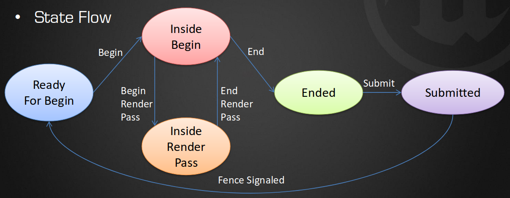
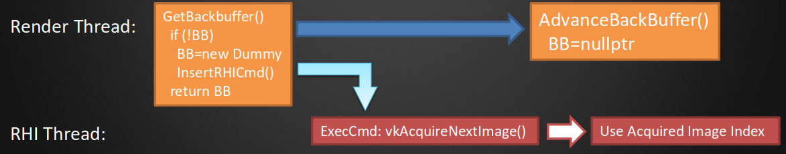

# UE4のRHIアーキテクチャを駆け足で(UE4 RHI Architecture in a hurry)

- RHI = Render Hardware Interface
    - aka 各グラフィクスAPIとをやり取りするためのクロスプラットフォームな方法。
- オリジナルのアーキテクチャ。
    - ゲームスレッドはレンダリングコマンドをキューに入れる。
    - レンダリングスレッドはVulkanのコマンドバッファを生成する。
- 改良したアーキテクチャ。
    - ゲームスレッドはレンダリングコマンドをキューに入れる。
    - レンダリングスレッドはRHIのコマンドリストを生成する。
    - RHIスレッドはVulkanのコマンドバッファに翻訳する。
- 最終的に、N個のレンダスレッドとM個のRHIスレッドでマルチスレッド化する。
- なぜRHIコマンドリストやRHIスレッドを使ったり、直接Vulkanコマンドを生成しないの？
    - 新しいRHIを導入しやすくする。
    - フロントエンドとバックエンドを分けて、マルチスレッド化しやすくする。
    - (命令とデータの両方の)キャッシュの局所化によりCPUで5-10%の改善を得られた。

# Vulkan

- なんで？
    - クロスプラットフォームなハイパフォーマンスAPI。
    - 予測可能性。
        - 例: 同じドローコールならば別々に実行されてもドライバは異なる時間をかかることはない。
    - メモリアロケーションやエイリアシング全体を制御する。
    - GPUパフォーマンス全体を制御する。
        - フラッシュ、キャッシュ、など。
    - D3D12やMetalと非常に似ている。

# Protoster

- Epic、Samsung、Qualcomm、Confettiのコラボレーション。
- Samsung S7とモバイルのVulkan APIを披露するテックデモ。
    - 業界のVulkan採用を後押しするよ！

# Vulkan RHI 0.1

- デスクリプタセットのためのひとつの大きなプール。
    - 32k個のエントリ。
    - しばらくすると使い果たす。いくつか同期に関する問題がある。
- バッファやテクスチャへの更新のすべてはその場でマップとアンマップを行う。
    - host visibleなメモリで線形なテクスチャを扱えないドライバではこの方法は使えない。
- すべてのアンマップのあとすぐに、コマンドバッファをサブミットして待機する。
    - GPUの処理中はCPUがストールする。
- PSOの生成中はヤベーくらいのヒッチングが発生する。
    - 詳しくは後述。
- RHIスレッドなし。
    - レンダリングスレッドが直接Vulkanコマンドを生成する。
- CPUでかろうじて20FPSに届く程度。

# Vulkan RHI 0.2

- 最適化の時間だ！
    - 階層的なカウンタを用いてCPUをプロファイルして、各ボトルネックに対処する。
        - 例: デスクリプタセットの書き込みが更新時に毎回生成されていたので、キャッシュする。
        - 例: デスクリプタセットを頂点シェーダ用とピクセルシェーダ用に分ける。
        - 例: 大量の動的オブジェクト割り当てを除去する。
    - すすいで(rinse)繰り返せ！
- 2、3週間ほど最適化を行うと、CPUとGPUの両方で30FPSに届いた。
- しかし、バリデーションの問題が多数ある…
- 出荷しよう！

# Vulkan RHI 1.0

- デモは公開された。(Demo out of the door!)
- きちんとしたタイトル(full titles)でも使えるようにするために必要なことを把握する。
    - とりあえずリストに書き出してみるか…(Just come up with a list...)

# Vulkan RHI 1.0 タスクリスト(Vulkan RHI 1.0 Task List)

- 後処理。
    - TODOとハックをすべて取り除く。
- 堅牢性と耐障害性(fault tolerant)を高める。
- RHIスレッドの分割をサポートする。
    - そして、並列なRHIスレッドをサポートする。
- バリデーションレイヤの警告にすべて合格させる。
    - いくつかの性能的な警告は許容*してもよい*。
        - 例: ピクセルシェーダが無効化されたアタッチメントに出力する。
- D3D12やMetalと機能的に同等にする。
- Kiteを動作させる！
- Paragonを動作させる！
    - D3D11と同等かそれ以上で。

# その先へ(And Beyond!)

- 完全にエディタで動作するようにする…

# 今現在のVulkan RHI(Today's Vulkan RHI)

- 今現在の状態:
    - コマンドを翻訳する別々のRHIスレッドを持つ。
    - モバイルレンダラで動く。
    - まともな(decent)性能。
        - デスクリプタセットレイアウトの最適化が足りない。
    - ほとんどのバリデーションに合格。
        - 大抵はイメージレイアウトの間違い。
    - シェーダモデル4またはディファードを得るところから初めて今では動作する。[?]

## Vulkan RHI: Command Buffers

- RHIスレッド/コンテキストごとにコマンドバッファマネージャを持つ。
- コマンドバッファマネージャは永続的なコマンドバッファのリストを持つ。
    - アクティブなコマンドバッファとアップロード用コマンドバッファも持つ。
        - アップロード用はレンダパスの真ん中ではデータをコピーできないので必要になる。
- 各コマンドバッファは、
    - フェンスとカウンタを持つ。
        - フェンスが何回シグナルを受けたかを追跡する。(定期的に問い合わせて、シグナルを受け取っていない状態にリセットする)
    - その状態を知る。(開始準備完了、レンダパス内/外、終了、サブミット後)

## Vulkan RHI: Resources

- バッファ、イメージ、フェンス、セマフォ。
- リソースの割り当てはそのプールからひとつを取得することを意味する。
    - 再利用したものの可能性もある。
    - まったく新しいものの可能性もある。
- リソースの解放はアプリケーションによって使われなくなったことを意味する。
- リソースの破壊は`vkDestroy*`の呼び出しを意味する。

# Vulkan RHI: Resource Managers

- マネージャの一般的なパターン。
    - UsedList、PendingFreeList、FreeListを持つ。
    - リソースの割り当て。
        - FreeListに合致するものがあればそれを、なければ新しく作って、UsedListに入れる。
    - リソースの解放。
        - UsedListからPendingFreeListに移動して、フェンスカウントを格納する。
    - 定期的に(フレームごとに一回とか、コマンドバッファのサブミットごと)
        - FreeListを走査して、Nフレーム使っていないものを破壊する。
        - PendingFreeListを走査して、コマンドバッファのフェンスカウンタが解放済みフェンスカウンタ以上になれば、FreeListへ移動する。

# Vulkan RHI: Other Managers/Utils

- バッファの副割り当て。
    - サブ範囲を管理しているので、常に`VkBuffer`を生成する必要はない。
- フェンスマネージャ。
- 一時フレームアロケータ(TempFrameAllocator)。
    - テープ(tape)/線形バッファの副割り当てと毎フレームにリセットする(フェンスがシグナルを受け取った後に)。
- 遅延破棄キュー(Deferred Deletion Queue)。
    - 高レベルがテクスチャやバッファの参照カウントポインタを解放すると、このキューに追加される。
    - フェンスをチェックして、適切なリソースマネージャに指示する。

# Vulkan RHI: BackBuffer/Swapchain

- `RHI::GetBackBuffer`
    - `vkAcquireNextImageKHR`の呼び出しのための理想的な場所になるかもしれない。
    - ただし、`RHI::BeginViewport`の内でも外でも、潜在的に複数回でも、レンダスレッドでもRHIスレッドでも呼び出される。
    - RHIスレッドはレンダリングスレッドと同期する必要があるかもしれない。
    - ひとつの解決法として、バックバッファを2つ持つようにする。
        - ひとつはレンダリングスレッド用。
        - ひとつはRHIスレッド用。
    - キューやプレゼンテーションを同期させるのは難しい。

- 代わりに、ダミーのバックバッファテクスチャを使う。
    - レンダリングスレッドはダミーテクスチャを持っていなければ新しいものを生成する。
        - RHIスレッドが`vkAcquireNextImageKHR`を呼ぶようにコマンドを挿入する。
    - 現在のレンダラは必要になればダミーのバックバッファを`nullptr`にセットすることができる。

# Vulkan RHI: Rendering (State)

- 高レベルのレンダラ:
    - `SetBoundShaderState[VS|PS]`
        - そのスレッドのBSSステートをリセットし、すべてのステートフラグをdirtyにする。
    - `SetDepthStencilState`
        - DepthStencilステートフラグをdirtyにする。
    - `SetRasterizerState`
        - Rasterizerステートフラグをdirtyにする。
    - `Draw`
        - `PrepareDraw`
            - すべてのステートフラグを持つPSOをキャッシュから探すか、必要なら生成する。
                - dirtyでなければ、PSOは変更せずに現在のPSOを用いる。
            - ステートフラグをdirtyでなくする。
        - `vkCmdDraw*`

# Vulkan RHI: Rendering (Resources)

- 高レベルのレンダラ:
    - `SetBoundShaderState[VS|PS]`
        - デスクリプタセットの書き込みリストをdirtyにする。
    - `SetTexture`
        - 書き込みリストを更新してdirtyにする。
    - `Draw`
        - `PrepareDraw`
            - 書き込みをリストがdirtyなら、プールから新しいデスクリプタセットを取り出し更新してバインドする。
                - dirtyでなければ、何もしない。
            - 書き込みリストをdirtyでなくする。
        - `vkCmdDraw*`

# Vulkan RHI: Render Passes

- UE4はレンダパスの概念を持たない。

- 遷移を追跡するいい方法が(まだ)ない。
    - レンダラはマルチスレッドで動作させることができる。
    - レンダラは以前のステートの知識があろうがなかろうがコンピュート処理に切り替えることができる。
- リソース、レイアウト遷移、バリアにも紐付いている。
    - RHIでリソース遷移を公開し始めたが、この情報だけでは十分でない。
- いまだ研究が活発な領域。
    - 高レベルで公開する必要があるかも。

# Vulkan RHI: Shaders

- シェーダはHLSL(USFファイル)で描かれている。
- HLSLからGLSLへの変換にはhlslccを使う。
    - そして、エンジンにリンクされたVulkanSDKのglslangライブラリを使ってSPIR-Vへ変換される。
- hlslccが直接SPIR-Vを扱うバックエンドがあってもいいかも。
    - すると、拡張や機能に依存することになりそう。

# Vulkan RHI: PSOs

- UE4は保守的にシェーダをコンパイルする。
    - 頂点シェーダとピクセルシェーダのランタイムマッチング。
        - 実行時にどんな組み合わせにもすることができる。
            - 例: Blueprintで動的にポイントライトを追加する。
        - N個の頂点シェーダとM個のピクセルシェーダがあったとしよう。
            - すべての組み合わせを事前コンパイルするのは不可能。
    - 実行時に生成する必要があり、ヒッチングを発生させる。

# Vulkan RHI: Shader Pipelines

- `ShaderPipeline`のサポートをすでに追加した。
    - コンパイル時に頂点ステージとピクセルステージの組み合わせを宣言する。
        - ただし、すべてのパスではサポートしていない(現在は深度と速度のみ)。
    - 頂点シェーダとピクセルシェーダの間の未使用の入出力値(interpolators)を取り除くために使われる。
        - いくつかのアーキテクチャで利益を得られる。
    - 元々の計画はPSOにこれを移行する(migrate)することだった。
        - しかし、依然として特定のステートの残りすべてを使いやすくする必要がある。

# Vulkan RHI: Protostar

- デモがヒッチングしないようにする何かを必要とした。
    - はじめに通しで見たときは(run-through experience)大量のPSOを生成していたためあまり良くなかった。
    - まだ多くのパスが変換されていなかったので、ShaderPipelineは使えなかった。
    - 解決策: パイプラインキャッシュ。

# Vulkan RHI: PSO Cache

- キャッシュ:
    - すべての新しい一意のPSOをレンダリングステートとシェーダマイクロコードのCRCによるハッシュ値によりランタイムキャッシュに追加する。
    - コンソールからの保存コマンドをトリガーにして、ディスクにシリアライズする。
    - 読み込み時にファイルがあれば、PSOを事前に生成する。
    - BoundShaderState内のローカルキャッシュとグローバルキャッシュの2つのレベルがある。
        - PSOキーがローカルBSS内にあれば、ローカルBSSのコピーを返す。
        - PSOキーがグローバルBSS内にあれば、ローカルBSSにコピーしてから返す。
        - それ以外であれば、新しいPSOを生成して、グローバルとローカル両方のキャッシュに追加する。
    - 最終的なデモでは仮想的にヒッチングフリーである。

- 問題:
    - 常にシェーダコードが変化する。
    - マテリアルが調整されるたびに同期ズレ。
    - すべてのケースを捕まえられない…ポケモンゲットだぜ！
    - フルサイズのゲーム全体を見ることのできる品質管理部門を置くリソースがないスタジオがある。
    - キャッシュがクソデカく(YUGE=トランプ大統領をネタにしたHUGEの訛り)になる可能性がある。
- まじで、より良い解決策が必要…

# Vulkan RHI: PSO Plans

- プランA: 本当のPSOサポートをプロトタイピングし始める。
    - いまだ研究中のAPIだし、コードベースへの影響が大きい。
- プランB: いくつかのコモン/デフォルトステートを持つ'一般的な'PSOを特定する研究を行う。
    - コンパイルを早くするため、派生パイプライン(`VK_PIPELINE_CREATE_DERIVATIVE_BIT`)を使う。
    - 読み込み時に必要になるであろう*いくつかの*PSOを知る。
        - すべてでなくていい。

- プランC: レンダスレッドで、PSOを生成しているときにほかのスレッドで最適化なしバージョン(`VK_PIPELINE_CREATE_DISABLE_OPTIMIZATION_BIT`)をコンパイルし始めることができるようにする。
    - うまく行けば、コンパイルは早くなる。
    - レンダスレッドとRHIスレッドの間のレイテンシが十分になれば、ヒッチングを感じなくさせる程度にはなるかもしれない。
        - その間に他のスレッドが最適化ありバージョンをコンパイルして、完了次第入れ替える。
- 各プランはそれぞれ独立している(orthogonal)ので、最終的な解決策はおそらくすべてを混ぜ合わせたものになる。

# Vulkan RHI: Tools

- ツールが良くなければうまく行かない(You're only as good as your tools)。
- Vulkanのバリデーションレイヤーを使う。
    - 昨日のKhronosのVulkan Tools Loader and ValidationのセッションのBoFを要チェック。(BOLO = Be On (the) Look Out)

- RenderDocを使う。
    - UE4で問題の追跡や診断を行うのに欠かせないもの。
        - Vulkanだけじゃない。(D3D11やOpenGLも)
    - デバッグマーカーやオブジェクト名を使う。

# Vulkan RHI: Closing...

- しかし待て、まだまだあるよ。
    - 調査のプラン:
        - Render Subpasses
        - Push Constants
        - Descriptor Set Layoutsのやり直し。
- ドライバは大幅に改善されているが、BSODに陥ることもままある。
    - 再現手順(repro steps)とともにIHVにバグ報告する。
    - メジャーな会社のグラボはすくなくとも1枚ずつは手に入れる。
        - ドライバの問題なのかコードのバグなのかを判別する助けになる。

# References
