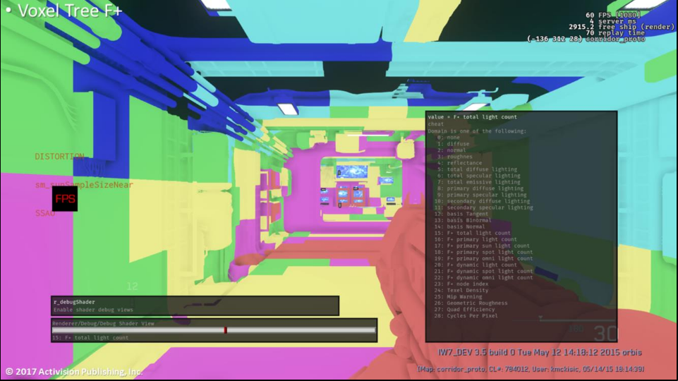
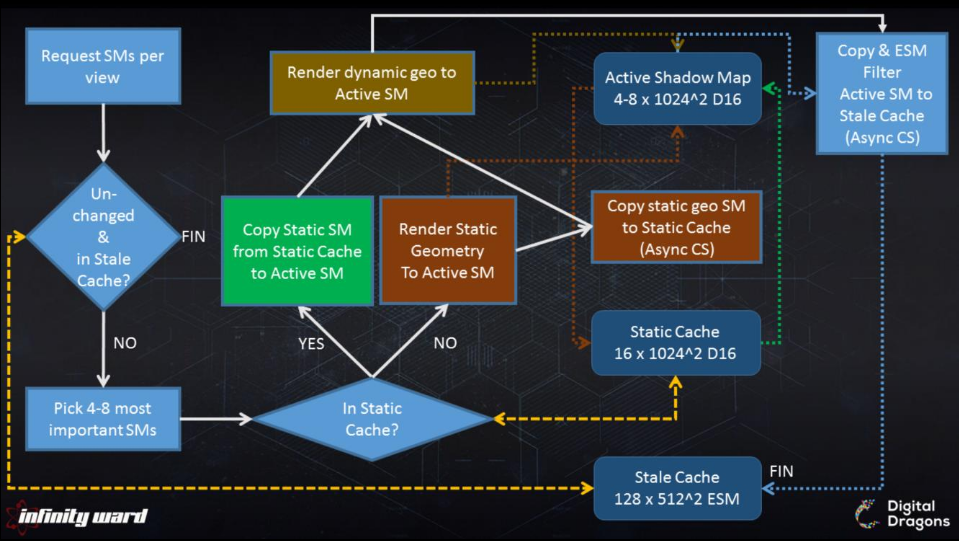

# Forward+ Data Structures

# Voxel Tree

- ワールドスペース八分木。
- 遮蔽を含めて事前計算する。
    - ライトは影付けされ、影響のある範囲だけが含まれる。
- 事前計算/キャッシュされた錐台外の3Dルックアップが簡単にできる。
    - 動的反射プロブのライト、動的ライトマップされたパーティクル、四面体GIライトグリッドで使われる。
- 高価な走査。
    - 階層の走査の必要性、複数のキャッシュミス、間接読み出し。
    - 非同期コンピュートが良い候補となる。
- 重大な事前計算時間。
- リーフのペイロード。
    - ライト。
    - ライトグリッドキャッシングのためのルート。
    - 可視性。

- 色は各ピクセルにヒットするライトの量を表す。
- 各ボクセルは事前にカリングされたライトを格納する。

# Frustum Space

- タイルベースビットマスク。
    - 8x8のピクセルサイズ。
    - 不透明ジオメトリで使われる。
- クラスタベースビットマスク。
    - ボリューム換算で4x4x4のカーネルと一致するサイズ。
        - 160/4 * 90/4 * 128/4 = 40x25x32 @ 1080p
    - 不透明ジオメトリとボリューメトリックスで使われる。
<!--  -->
- アイテムはビット列でインデックス付けされる。
    - ライト。
    - 反射プロブ。
    - 密度ボリューム。
    - デカール[0]。

# Mesh Rendering

#　Smodels / Xmodels

- 静的モデルと動的モデル。
- 標準のゲームエンジンメッシュと似ている。
- 小道具(props)、キャラクター、車両、武器、などで使われる。

# BSP

- 放射状ブラシベースのジオメトリ[^radiant_brush]。
- 大雑把に示された(blocking out)レベル。
- 地形(terrain)。
- 環境の静的な構造部分。
- 個々のマテリアルを持つ複数のブラシは最適化されたサブメッシュとサブシェーダに一緒にマージされる。
- 高いパフォーマンスで世界のユニークなディティール付けを可能にする。
- テッセレーションとディスプレースメントマッピングをサポートする。
<!--  -->
- ベースBSPは物理やAIのレイキャストにふさわしい。
- 単純なジオメトリで、イテレーションが簡単。

# Tessellation & Displacement

- ベースBSPは適応型テッセレーションとディスプレースメントマッピングを適用できる。
- 適応型テッセレーションはディスプレースメントデルタ、カメラへの距離、カメラへのパッチ角度に基づく。
- 生成されたサブパッチはGPUで錐台、オクルージョン、背面のかリングを通る。
<!--  -->
- テッセレーションとディスプレースメントは適度な適応的パフォーマンスヒットで大きなビジュアル的インパクトを作る。

[^radiant_brush]: 訳注:ブラシの形状が放射状(円対称)という意味？

# Shadow Map Cache

# ESM Shadow Map Cache : Motivation

- テッセレーションしたジオメトリはシャドウマップレンダリングでは高価になる。
- 大多数のライトは動かない(stationary)。
- 多くのライト。
    - 視錐台の中に256個以下。
- 多くのシャドウ。
    - 視錐台の中に128個以下。

# ESM Shadow Map Cache

- PCFはF+では高価すぎる(VGPRプレッシャー)。
- **静的で高品質な影付けされたライト**と**キャッシング**を重要視。
- 指数シャドウマップ
    - 512x512の16ビットUNORM。
    - 1024x1024のシャドウマップからダウンサンプリングした。
    - 3x3のガウスフィルタをかける。
        - フィルタリングに対するアーティスト的な制御。
    - 一度だけ事前にフィルタリングして、キャッシュする。

# Caching algorithm

- ビューごとにシャドウマップを要求する。
    - カリングテストを通過したビューで見えているすべてのシャドウマップを得る。
- 更新の必要が**ない**シャドウマップのStale(古くなった)キャッシュをチェックする。
    - ライトがStaleキャッシュにある(resident)か？
        - 最後のフレームでライトが移動したか？
        - 最後のフレームでライト錐台内で何かが移動したか？
        - 更新が強制されたか？
- 4から8つの最も重要なシャドウマップを選び出す。
    - 優先順位でソートする。
        - アーティスト駆動の優先順位(プレイヤーのフラッシュライトなど)。
        - 距離、射影サイズ、強度。
- 選んだライトごとに、
- シャドウマップのStaleキャッシュをチェックする --- Staticキャッシュは実際には静的ジオメトリのみを含むD16のシャドウマップを持つ。
    - ライトがStaticキャッシュにキャッシュされている場合、
        - Staticキャッシュから静的シャドウマップをActiveキャッシュにコピーする。
    - ライトがStaticキャッシュにキャッシュされてい**ない**場合、
        - 静的ジオメトリをActiveキャッシュにレンダリングする。
        - 静的ジオメトリのシャドウマップをStaticキャッシュにコピーする。
- 動的ジオメトリをActiveシャドウマップにレンダリングする --- Activeキャッシュは4から8つのD16シャドウマップである。
- 技術的には、必要なのは1つだけだが、実際のシャドウマップのレンダリングでは、シャドウキャッシュシステムから複数の非同期コンピュートジョブがオーバーラップする(つまり、コピーして、ESMフィルタリングして、ダウンサンプリングして、クリアする)。そして、シャドウマップ0のCSジョブはシャドウマップ1のレンダリングとオーバーラップさせる。
- ActiveシャドウマップをStaleキャッシュにコピーしてESM処理する。

# ESM Shadow Map Cache : Performance

- キャッシュのコピーやESMジョブは非同期コンピュートを使う。
- '次'のシャドウマップ生成処理とオーバーラップする。
- 平均のリアルコスト:レンダリングを除いたシャドウマップあたり0.1ms以下。
- Forward+ではサンプリングコストが下がる。
    - ALUは完全に償却される。
    - レジスタ(VGPR)インパクトがない。

# Deferred Sun Shadows

- 以下では高品質なシャドウが必要である。
    - シネマティックのキャラクター。
    - ビューモデル。
- 複数の高解像度のオブジェクトスペースのシャドウマップが必要である。
    - 標準のシャドウマップキャッシュではプレッシャーが強すぎる。
        - 多くのアクティブスロットが必要である。
<!--  -->
- スクリーンスペースシャドウ。
    - 光源の方向にデプスバッファレイトレースを行う。
- 太陽のみのディファードパス。
    - ビューモデルに最適化される(深度境界/ステンシルテスト)。
    - シーン全体で実行すると、うまく働く。

# SS Shadows

- F+に統合される。
    - ピクセルごとの一番強い光源を格納する。
        - キーライトとしてアーティストにより設定されたり、最大値として実行時計算から導いたりする。
    - キーライト方向に単一のトレースを行う。

# Particle Lighting

# Particle Lighting with lightmaps

TODO

# References
