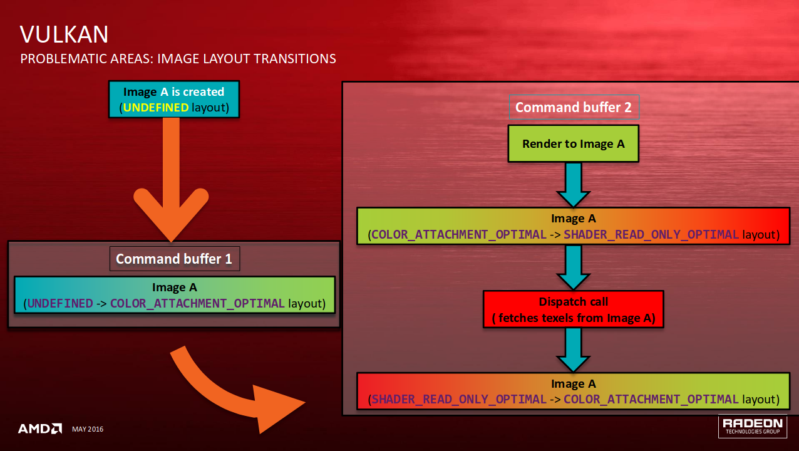
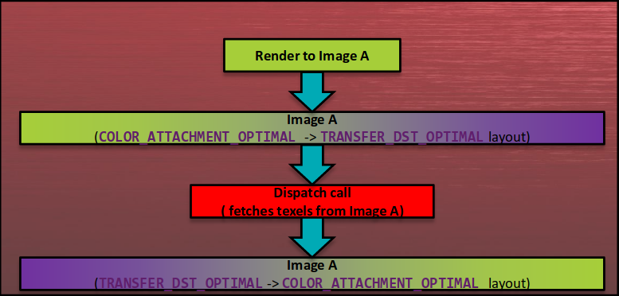
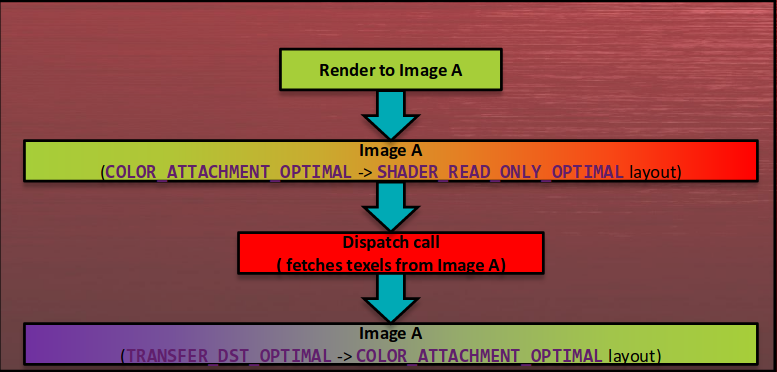
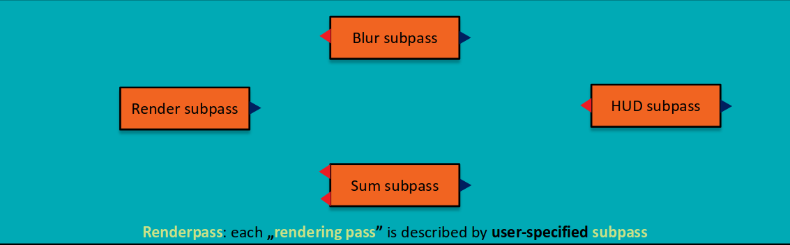
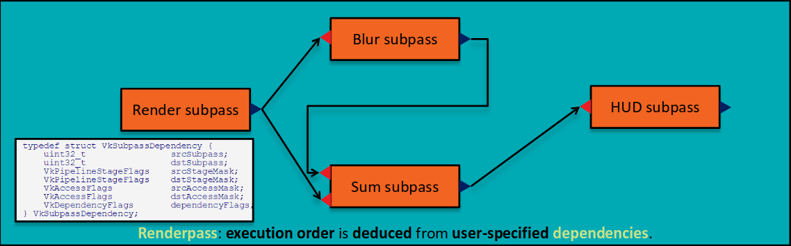
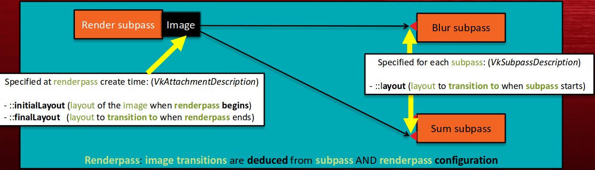

# Vulkan --- The Beginnings

- OpenGLやDX10以前では、データをアップロードして、ステートを切り替えて、描画コマンドを発行する。
    - ドライバは巨大なステートマシンである。
        - レンダリング処理はシングルスレッドでおこなわなければならない。
    - コマンドのサブミッションは時間のかかる処理である。
        - ドライバはフレームの終わりやコマンドバッファが満杯でないとサブミットしない。
    - 毎フレームごとに異なるコマンドをサブミットする可能性がある。
        - ドライバはあらかじめにコマンドバッファをベイクしたりできない。
<!--  -->
- OpenGLやDX10時代のワークアラウンド。
    - ストリーミングデータのアップロードに複数のレンダリングスレッドを使う。
    - できるだけGPUにデータを生成する。
    - ステートの構成によってドローコールをバッチする。
    - 一部のハードウェアでは並列計算のためにコンピュートシェーダを使う。
    - GPUバブルを減らすためにできるだけ多くのフレームを前もってレンダリングする。
<!--  -->
- これらのワークアラウンドは**最大の問題**を解決するもの**ではない**。
    - GPUは**高度に非同期化**されている。
    - 数多くの種類のタスクを**並列に**処理するよう設計されている。
        - 計算。
        - DMA転送。
        - ラスタライゼーション。
        - その他(例えば、画像データ変換の高速化)。
- APIの立場からだと、
    - GPUへは**ひとつ**のレンダリングスレッドからのみ**処理チャンク(work chunk)**を実行するよう要求できる。
    - アプリケーションは**信用されていない** --- **API呼び出しの検証**に**CPU時間**が使われる。
<!--  -->
- 実際の懸念事項。
    - 段々と**CPUに縛られたアプリケーション**が市場に現れてきている。
        - ドライバスレッドがCPU時間を消費している。
        - アプリケーションの複雑さが増加している。
    - **クロスプラットフォームな方法**でこれらに対処するのは**簡単ではない**。
    - Tilers(モバイルのTiled Rendering)はOpenGL ESでフルパワーを活用できていない。
    - **ベンダ固有**の解決法のみが存在する(例えば、Pixel Local Storage)。
- 以下のユースケースには言及しない。
    - マルチGPUのサポート。
    - VR。

# Vulkan --- Do I Need It?

- Vulkanは先程述べた問題のすべてに対処する。
    - **コマンドキューファミリー(command queue families)**の集まりとして**GPU**を開示する。
    - **コマンドバッファ**を**複数のスレッド**から**キューにサブミットする**ことができる。
    - **アプリケーション**は以下の**責任を持つ**。
        - 正しい**コマンドキュー**に**処理チャンク**をサブミットすること。
        - GPU**ジョブの実行**の**同期を取る**こと。
    - **メモリヒープ**の集まりとして利用可能な**GPUメモリ**を開示する。
    - アプリケーションは**フラッシュ(flush)**、**無効化(invalidation)**、**管理**に対する責任を持つ。
- **アプリケーション**は**動いている**GPUの能力に**合わせる**必要がある。
- 作法を間違える(misbehave)と、**GPUがハングする**。
<!--  -->
- **Vulkanを必要なケース**。
    - **CPUに縛られたアプリケーション**:
        - 情報の大多数がコンピュートやレンダリングで要求される --- **ロード時に事前にベイクする**。
        - たった**2つのコマンド**でフレームがレンダリングできる！
        - **ドライバ側の検証なし** = 本当に重要なことにより多くの**CPU時間**を割ける。
    - **GPUに縛られたアプリケーション**:
        - 以下により**GPU使用率**が改善する。
            - 関連する**キューファミリー**にコンピュート及びグラフィクスジョブをサブミットする。
            - **トランスファーキュー(transfer queues)**でVRAM-VRAM間やRAM-VRAM間のコピー処理を行う。
        - **突然のパフォーマンス低下**や**スパイク**がなくなる。
            - 予測可能な時間で、アプリケーションが指定した情報に従い、すべての**GPU側のキャッシュ**は**フラッシュ**される。
            - ドライバは**当てずっぽう(guess work)**を**しなくて良くなる**。
<!--  -->
- Vulkanを必要とする**かもしれない**ケース。
    - 既存のGL4.xやDX11以下のアプリケーション:
        - Vulkanに移行すれば、パフォーマンス的な利益がもたらされる**かもしれない**し、され**ないかもしれない**。
        - かかるCPUパワーが減る可能性は高い。
- Vulkanを必要と**しない**ケース。
    - **迅速な開発期間**を要求するプロトタイプアプリケーション:
        - 検証レイヤは**まだ**仕様のすべてを網羅して**いない**。
        - 多くの**間違ったユースケース**は依然として発見されて**いない**。
        - **急勾配な**学習曲線。
    - **CPUにもGPUにも縛られていない****単純なアプリケーション**:
        - **学ぶことを目的**とする場合を除いて、Vulkanから利益を得る可能性は低い。

# Vulkan --- Problematic Areas: Introduction

- **我々(AMD)のドライバ**は世に出て**数カ月**[^few_months]経った程度。
- **トップレベル観察**:
    - Vulkan is **demanding** to use, both **app-side** and **time-wise**.
    - アプリケーションがAというGPUで作業する場合、BというGPUを予約して**はならない**。
    - **基本的な落とし穴**:
        - バリア。
        - 正しいデータのアップロード。
        - イメージ遷移。
        - レンダパス。
    - ISVは一般的には**検証レイヤ**を使うことに**消極的(reluctant)**である。
        - **使ってください**。多くの時間を取っておける。

[^few_months]: [@Witczak2016]がまとめられたのは2016年3月頃。

# Vulkan --- Problematic Areas: Command Queues

- **CPU側**:
    - Vulkanに**レンダリングスレッドはない**。
    - 複数のスレッドからGPU側の**コマンドキュー**へ**処理チャンク**をサブミットできる。
- **GPU側**:
    - **コマンドキュー**は実行できる**コマンド**のタイプでグループ化される。
- **問題点**:
    - **コマンドキュー**の数は**ハードウェア依存**！
    - **キューファミリー**の数は**ハードウェア依存**！
<!--  -->
- **これの何が問題か？**
    - 効率的に**GPUタスクを配ること**は今やVulkan**アプリケーションの責任**である。
    - 解決法はデバイスの能力に応じて**アップスケール**や**ダウンスケール**できなければならない。
    - **オープンソースな解決法**はまだない。
    - Vulkan 1.0ではひとつの**コンピュート+グラフィクスのキューファミリー**のみ保証されている。
    - 単純なアプリケーションはユニバーサルキューの存在**ひとつ(solely)**に頼る可能性が高いだろう。
    - ただし、パフォーマンス最優先で書かれたVulkanアプリケーションではない。
-  **解決法**:
    - さまざまなVulkan実装であなたのレンダリングエンジンをテストする。

# Vulkan --- Problematic Areas: Command Buffers

- Vulkanでは、**コマンドバッファは**
    - **GPU側**で実行される**コマンド**を保持している。
    - アプリケーションによって**別途**明示しない限り、**再利用可能**である。
- **問題点**:
    - アプリケーションはしばしばフレームごとに**コマンドバッファ**を**記録し直す**。
- **これの何が問題か？**
    - 多くの**CPU時間**を無駄にする。
    - 多くの場合では**必要ない**。
- **解決法**:
    - **レンダリングロジック**に影響を与える**すべてのパラメータ**を**イメージ**、**ストレージバッファ**、**ユニフォームバッファ**に移動する。
    - 必要であれば、各**スワップチェーンイメージ**ごとに一度だけすべての**コマンドバッファ**を**事前にベイクする**。
    - コマンドバッファの再利用性を改善するなら、**インダイレクトディスパッチやインダイレクト描画のコマンド**を使う。

# Vulkan --- Problematic Areas: Memory Management

- **メモリ管理**もまたVulkanアプリケーションの責任である:
    - **物理デバイス(physical device)**は1以上の**メモリヒープ**を報告する。
    - 各**メモリヒープ**は:
        - **プラットフォーム固有のサイズ**を持つ。
        - **device-local**である**かもしれない**が、必ずしも**必要ではない**。
    - **メモリヒープ** --- アプリケーションが**直接**アクセス可能では**ない**。
    - 代わりに、ドライバはハードウェア固有の"**メモリタイプ**"**の配列**を開示している。
    - GPUメモリを割り当てるとき、Vulkanアプリケーションは**メモリタイプのインデックス**を指定する。
<!--  -->
- **辛い所は？**
    - Vulkanとアプリケーションとの契約は**とても薄い**。
    - 以下が**保証されている**。
        - 少なくとも**1つのメモリタイプ**は**host-visible**かつ**host-coherent**である。
        - 少なくとも**1つのメモリタイプ**は**device-local**である。
    - **バッファメモリ**と**イメージメモリ**の割り当てはドライバ固有の**メモリタイプ**由来でなければならない。
    - そのタイプは以下に依存して変化する**かもしれない**。
        - オブジェクトの特性。
        - オブジェクトのタイプ。
<!--  -->
- **最も辛い所は？**
    - ISVは`maxMemoryAllocationCount`の制限を**無視する**傾向にある。
    - **同時に生存できる割り当ての限界**の**最大最小数**は**4096**である。
        - **複雑なアプリケーション**なら達するのは**非常に容易い**。
        - **デスクトップのVulkan実装**で報告される**普通**の値である。
- **解決法**:
    - 利用可能なGPUメモリを**アプリケーション側**で**事前に割り当て**て**管理**する。
    - 小さなメモリ割り当てを**避けて**、**大きなもの**から**副割り当て**を行う。

# Vulkan --- Problematic Areas: Descriptor Pools

- 大多数の**シェーダ**は**外部データ**にアクセスする。
- Vulkanでは:
    - **デスクリプタ**を経由して開示される。
    - **デスクリプタ**は直接生成できない。
    - 代わりに、**アプリケーション**によってインスタンス化された**デスクリプタプール**から取り出される。
<!--  -->
- **問題点**:
    - `maxSets`がISVが期待しているようには働かない。
- **時折見られる誤解**:
    - *"`maxSets * {poolSizeCount * pPoolSizes}`個のデスクリプタを割り当てできる。"*
    - *"できないの？アンタんとこのドライバはクソ。Xのドライバではできてるのに。"*
- **正確な理解**:
    - 最大`maxSets`のデスクリプタセットに最大**N**の**事前割り当てされたデスクリプタ**を配布する。

# Vulkan --- Problematic Areas: Sparse Descriptor Bindings

- **デスクリプタ**は後の使用のために**デスクリプタセット**にグループ化される。
    - デスクリプタタイプとバインディングの関係は**デスクリプタセットレイアウト**で定義される。
    - **GPUが消費する**実際の**バッファ**や**イメージ**は**コマンドバッファ**にバインドされる。
- デスクリプタセットレイアウトは`vkCreateDescriptorSetLayout`で生成される。
<!--  -->
- **問題点**:
    - **デスクリプタセットレイアウト**が以下の**デスクリプタセット**をどのようにして探すすべきか。
        - バインディング0: ストレージバッファ。
        - バインディング2: ストレージイメージ。
    - **バインディング1**に対して`VkDescriptorSetLayoutBinding`のアイテムを含める必要があるか否か？
<!--  -->
- **解決法**:
    - このアプリケーションは**非効率**であり、ダミーバインディングは**パフォーマンス**に**悪影響**を及ぼす。
    - ただし、本当にそのバインディングが必要であるならやってもいい。
    - 使わないバインディングの`descriptorCount`を0に設定していることを確かめる。

# Vulkan --- Problematic Areas: Images

- Vulkanでは、
    - **テクスチャステート**は**イメージオブジェクト**に格納される。
    - **テクスチャデータ**は**メモリオブジェクト**に格納され、**イメージオブジェクト**にバインドされる。
- **イメージオブジェクト**はイメージデータの指定の**特性**により生成される:
    - 以下のようなビットや数値:
        - **タイプ**(1D、2D、3D)。
        - **ベースのMIPMAPサイズ**。
        - **MIPMAP数**。
    - **タイリングタイプ**。
    - **使い方フラグ**。
    - その他。

# Vulkan --- Problematic Areas: Image Usage Flags

- **生成時**に**前もってのイメージの使い方**の宣言を要求する。
    - 使い方は1つ以上の**ビットの組み合わせ**である。
- ドライバは**ある**イメージの使い方に対するフォーマットのサポートを提供し**なくても良い**。
- そのときは、使い方設定は以下に**制限する**:
    - サポートされる**メモリタイプ**。
    - 最大**イメージ解像度**、**サンプル数**、など。
<!--  -->
- **共通の問題点**:
    - アプリケーションは不正確なイメージの使い方を指定する。
- **例**:
    - `VK_IMAGE_USAGE_TRANSFER_DST_BIT`を伴ってイメージを生成することを検討する。
    - イメージは**カラーアタッチメント**として使用して**はならない**。
    - アプリケーションが気にしない。
- **結果**:
    - 未定義動作(undefined behavior)
- **解決法**:
    - 検証が有効化されていれば、この種の問題は簡単に検出できる。

# Vulkan --- Problematic Areas: Image Tiling

- **タイリング**設定はGPUによって使われる**イメージデータレイアウト**を決定する:
    - **Linear**: イメージは**行優先(row-major)**の配置で、各行は**潜在的にパッディングされる**。
    - **Optimal**: **プラットフォーム固有**のデータ配置で、**速度**に最適化される。
- **線形にタイル化された(linearly-tiled)イメージ**の**特性**:
    - **最適にタイル化された(optimally-tiled)イメージ**に提供される**機能のサブセット**をサポートする。
    - **パフォーマンス的には劣る**。
- なぜ**線形イメージ**に悩まされるのか？
    - **GPUでレンダリングされた**イメージデータを**読み戻す(read back)**のに必要である場合に極めて重要(crucial)。
<!--  -->
- **共通の問題点**:
    - ISVはデータを**最適にタイル化されたイメージ**に**直接**コピーする。
- **典型的なシナリオ**:
    - **イメージA**は`VK_IMAGE_TILING_OPTIMAL`のタイリング設定で生成される。
    - アプリケーションは**イメージA**に対して`vkGetImageSubresourceLayout`を呼ぶ。
    - アプリケーションは"報告された"特徴を用いてデータをアップロードすることを試みる。
<!--  -->
- **解決法**:
    - **最適にタイル化されたイメージ**にデータを**コピー**するために**ステージングバッファ**を使う:
        1. **バッファオブジェクト**を**生成**して、**メモリ領域(region)**を**バインド**する。
        2. データで**埋める**。
        3. イメージを`GENERAL`か`TRANSFER_DST_OPTIMAL`のレイアウトに**遷移**する。
        4. `vkCmdCopyBufferToImage`の呼び出しにより**コピー処理**をスケージューリングする。
        5. **コマンドバッファ**を**サブミット**して、実行が完了するまで待つ。
        6. **一時的バッファオブジェクト**を**解放**する。
    - 覚えておくこと: **バッファ**から**イメージ**への**コピー処理**は**マルチサンプリングイメージ**では働か**ない**。
    - そこにデータをアップロードするためには、実際の**ディスパッチ**や**描画**の呼び出しを使う必要があるだろう。

# Vulkan --- Problematic Areas: Image Layout Transitions

- GPUは**実行中に(on the fly)**データを**圧縮・伸長**したり**再配置**したりする**かもしれない**。
    - 帯域幅のプレッシャーが小さくなるので、パフォーマンスがよくなる。
    - DX11以下やOpenGL: 透明でヒューリスティック駆動な処理。
    - Vulkan: **イメージレイアウトの遷移**時に起こる。
    - **例**: DCC(Delta Color Compression)
- **ハードウェアレベルの最適化**:
    - **ハードウェアのアーキテクチャ**と**ハードウェアの世代**は**異なる**。
    - 一般に**ベンダ固有**である。
<!--  -->
- Vulkanでは:
    - イメージは**使用**前に**正しいレイアウト**へ**移動され****なければならない**。
    - これは以下によって要求することができる。
        - **コマンドバッファ**に**イメージバリア**を注入する。
        - 正しい**レンダパス**と**サブパス**の構成。
    - 間違うと、視覚的な破損(visual corruption)が起こる**かもしれない**。

- **一般的な問題**:
    1. **イメージ**を**不正なレイアウト**に**遷移**する。
        - 例:シェーダで読みたいのに、前のバリアが`TRANSFER_DST_OPTIMAL`である。

- **一般的な問題**:
    2. **イメージバリア**で定義される**前のレイアウト**が不正確である。
        - 例:前のバリアを`SHADER_READ_ONLY_OPTIMAL`にしたのに、後ろのバリアを`TRANSFER_DST_OPTIMAL`のままになっている。

- **一般的な問題**:
    3. "AMDさんよ、俺のアプリケーションはY社のドライバでは動くんだが、お前のドライバはクソだ！"
        - いくつかのベンダは**イメージバリア**を無視しているけど、我々(AMD)はそれを**していない**。
        - さて、誰のドライバが**間違っている**のでしょうか？:)
- **解決法**:
    - 検証レイヤは絶えず改善している --- 使おう！
    - 色んなVulkan実装でソフトウェアをテストしよう。

# Vulkan --- Problematic Areas: Image Layout Transitions & Renderpasses

- **一般的な問題**:
    4. ISVは**レンダパス**がとうやって**イメージのサブリソース**を遷移するかを誤解している。
        - レンダパスはVulkanにおける**新しく(novel)****複雑な**概念である。
        - ドライバに"**時間旅行(travel in time)**"させ、先んじて知らせておくために導入される。
            - どの**カラー**または**深度ステンシル**の**アタッチメント**が**ラスタライズ**され、**アクセス**されるか(**いつ**？**どうやって**？)。
            - どの**イメージのサブリソース範囲**は**同期**される必要があるか(**いつ**？**どうやって**？)
            - どの**レイアウト****へ****イメージのサブリソース**は**遷移**されるべきか、そしてそれは**いつ**か。
        - 特に手動で記述するとき、That's a lot of info to get wrong.

# Vulkan --- Problematic Areas: GPU-Side Synchronization

- 超一般的(uber-general)なVulkanの**GPU側コマンド実行のルール**:
    1. **コマンドキュー**は**それぞれ**が**独立**に実行する。
    2. **キューA**にサブミットしたとき、コマンドバッファは**特定の順序**で実行する。
    3. 順序は**バリア**、**レンダパス**、**同期プリミティブ**によって**強要**されない限り、
        - サブミットされたコマンドは**並列**に**実行**される**かもしれない**。
        - サブミットされたコマンドは**順序に関係なく(out of order)****実行**される**かもしれない**。
- 以下の**同期オブジェクト**が**使える**:
    - **イベント**(**キュー内(intra-queue)**同期)
    - **セマフォ**(**キュー間(inter-queue)**同期)
    - **フェンス**(サブミットしたジョブチャンクが実行し終わるまで、**CPUスレッド**をブロックする)
<!--  -->
- **問題**:
    - ISVは時々毎フレームに同期オブジェクトを生成する。
- **解決法**:
    - **すべてのコスト**を**避ける**こと！
    - 以下を覚えておく。
        1. **イベント**は**CPU側**と**GPU側**を**リセット**させることができる。
        2. **フェンス**は**CPU側**を**リセット**させることができる。
        3. **セマフォ**は正常に**待った**後で**自動的**に**リセット**させることができる。
    - さらに**実行可能**であるならば、先んじて**スワップチェーン毎**のイメージに**同期オブジェクト**一式をベイクする。

# References
