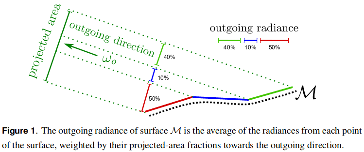
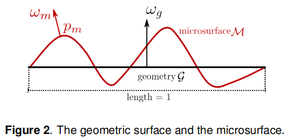
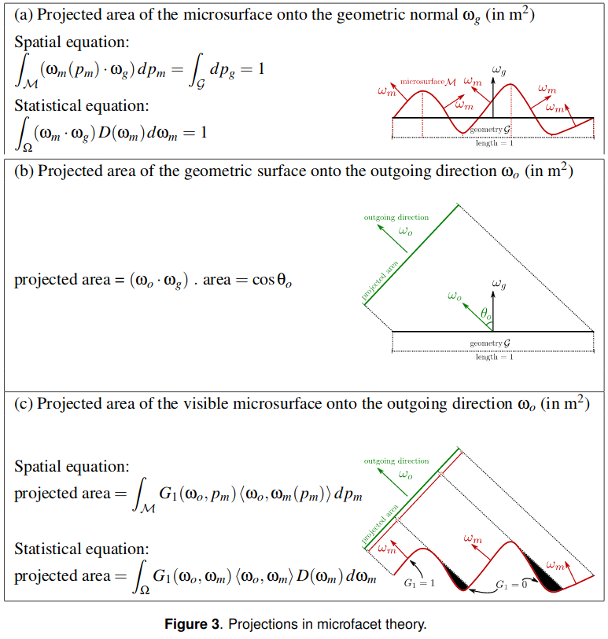
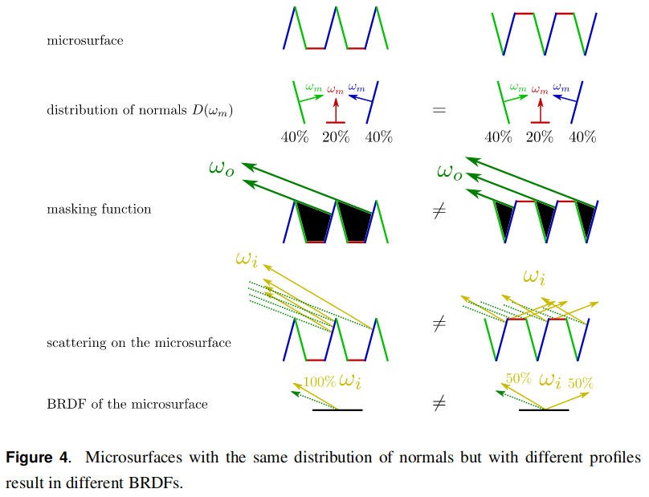

# Understanding the Masking-Shadowing Function in Microfacet-Based BRDFs, JCGT 2014

## 1. まえがき(Introduction)

マイクロファセット理論は元々、表面上の散乱を研究するために光物性(optical physics)の分野で開発された。グラフィクス界隈では物理ベースのBRDFを導入するために使われ、こんにちの3DCGには欠かせない技術となっている。2012年と2013年のSIGGRAPHにはマイクロファセット理論を扱うコースもあり、そこではアーティストによる調整のしやすさや計算の効率性などについても議論されている。マイクロファセットは、要素の組み合わせの数だけ可能性が存在するため、今なお盛んな分野である。しかし、要素の適切な選び方が明白でないことままあるため、混乱の主な原因になっている。

### この文書で取り上げること(What This Document Is About)

この文書では、マイクロファセットベースのBRDFにおけるmasking-shadowing関数の選び方に関する、新しい見方と長年の疑問に対する答えを提供する。

### この文書で取り上げないこと(What This Document Is Not About)

一般的に使われているモデルでのみ議論するのであって、新しいBRDFモデルを提案したりはしない。理解を深めるためにモデルについての背景知識を提供するのが目的であって、他のモデルを差し置いて特定のモデルをおすすめしたりはしない。物理パラメータの理解に注力するのであって、すでに使用実績があるからといってその実装や特定のレンダリング技法での使われ方を想定しない。

### マイクロファセットモデルにおける"物理ベース"が意味する所(On The Meaning Of "Physically Based" Regarding Microfacet Models)

物理的モデルとは、解析、説明、挙動の予測が可能であるシステムまたは物理現象の簡略表現である。

###

マイクロファセット理論において、研究対象であるモデルは、巨視的尺度(macroscopic scale)で見ると平坦な幾何的表面だが、微視的尺度(microscopic scale)で見るとその界面(interface)は荒く、マイクロファセットで構成されている。この表現は、幾何学的表面の界面(geometric surface interface)で発生する散乱現象(scattering events)を説明したり予測したりするときに使われる。

有意義なマイクロファセットモデルは、どれだけマイクロファセットが指定の方向を統計的に見て向いているかを示す法線分布と、どのようにマイクロファセットがマイクロサーフェス上に組織されているかを示すマイクロファセットプロファイルによって説明される。このような有意義なマイクロファセットモデルから導き出された方程式を持つマイクロファセットBRDFは、マイクロサーフェスモデルに基づくことから、まさしく"物理ベース"と呼ばれる。逆に、マイクロサーフェスモデルからBRDFが導けないなら、それは"物理ベース"とは呼ばれない。masking-shadowing関数は、マイクロファセットBRDFの一部で、マイクロファセットが出射方向から(masking)か入射方向から(shadowing)のいずれかから見えている確率を表す。BRDFのときと同様に、マイクロサーフェスモデルから導き出される場合のみ、masking-shadowing関数は"物理ベース"と呼ばれる。

本文書では、マイクロサーフェスモデルが正式にはどのように説明されているか、そこから物理ベースのmasking-shadowing関数がどのように導き出されるかを解説する。これが関連する物理ベースBRDFの導出にどうつながるかも紹介する。

ただし、マイクロファセットモデルは、幾何光学のみを扱う、完全な鏡面および拡散反射、複数回の散乱を考慮しない、といったマイクロサーフェスの光学的な振る舞いに関する仮定に基づく、単なる**モデル**であることに注意すべきである。したがって、"物理ベース"と呼ばれるそれは、現実の物理表面の測定値を正確に予測することができるという意味ではない、ということを頭に入れておく必要がある。仮定したものが間違っていれば、計測データと比較したとき、数学的に厳密な"物理ベース"のそれより経験則的モデルのほうが正確であることも十分にあり得る。

### アイデアとOrganization(Ideas and Organization)

この文書で述べられるアイデアは以下の3つの先行研究に強く影響を受けている:

- Smithのmasking関数は、コンピュータグラフィクスの文献のなかで最も有名なものの一つである。しかし、この関数が、正しいmasking関数から期待される性質である、可視射影面積(visible projected area)を保持することを保証する性質を持つことを文書の最後に指摘していることはあまり知られていない。

- Ashikhminらは可視射影面積(visible projected area)が幾何学的表面からマイクロサーフェスに至るまで保存されている量であることを見つけ出した。この知見は、正しく正規化されていることとエネルギーが保存されていることを保証する、正しいmasking項の一般式を導出するために使われた。この導出の最中には、自然とSmithのmasking関数を再発明していた。彼らのmasking項は積分形式で表されており、閉形式を導くことはできない。彼らは数値的に前計算を行い、ルックアップテーブルに格納する方法を取った。

- Rossらは海面の反射率に関する研究を提案した。ガウス的な荒い表面(Beckmann分布)で海面をモデル化し、Smithのmasking-shadowing関数を組み込んだ正規化済みBRDFを計算した。彼らはガウス的表面ではBRDFの正規化係数とSmithのmasking関数が打ち消し合う?似通った式を持つことを発見した。この性質は計算機処理目的では便利だが、彼らはこれが発生する物理的理由を示さなかった。

###

この文書では、可視射影面積(visible projected area)の保存の観点からこれまでのすべての研究結果を直接導き出せる、統一されたマイクロファセットフレームワークを提案する。

<<各章の概要>>

## 2. Masking関数の導出(Derivation of the Masking Function)

### 2.1 表面上での放射輝度の計測(Measuring Radiance on a Surface)

放射輝度(radiance)は立体角からある領域を通過するエネルギー密度で、単位は$W/sr/m^2$である。方向$omega_o$に出射する面$\mathcal M$の放射輝度$L(\boldsymbol{\omega}_o, \mathcal{M})$は、出射方向に観測される射影面積(projected area)により重み付けされた、表面上の各区間(patch)の中心点$p_m$と出射方向$\boldsymbol{\omega}_o$に対する放射輝度$L(\boldsymbol{\omega}_o, p_m)$を積分したものである。

\[
L(\boldsymbol{\omega}_o, \mathcal M) = \frac{\int_{\mathcal M} \text{projected area}(p_m) L(\boldsymbol{\omega}_o, p_m) dp_m}{\int_{\mathcal M} \text{projected area}(p_m) dp_m}
\tag{1}
\]

出射方向に投影される表面上の各地点での面積は視点依存であり、分母の積分$\int_{\mathcal M} \text{projected area}(p_m) dp_m$は正規化係数である。この正規化係数は式全体が放射輝度を単位とするよう調整している。

### 2.2 マイクロファセット統計学(Microfacet Statistics)

幾何学的表面$\mathcal G$と呼ばれる表面の平面領域を考える。その面積は慣例に従い、$\int_{\mathcal G}dp_g = 1 [\text{m}^2]$である。マイクロファセットモデルは、マイクロサーフェス$\mathcal M$と呼ばれるマイクロファセットの集合の形に幾何学的表面からオフセットしたものが真の表面であると仮定する。正確に言うならば、ジオメトリ$\mathcal G$の法線が$\boldsymbol{\omega}_g$であるとすると、$\mathcal M$は$\boldsymbol{\omega}_g$方向に$\mathcal G$上に投影されたマイクロファセットの点の集合である。マイクロサーフェス$\mathcal M$の各点$p_m$は法線$\boldsymbol{\omega}_m(p_m)$を持つ。すなわち、$\boldsymbol{\omega}_m : \mathcal{M} \rightarrow \Omega$は、マイクロサーフェス上の点からその点の面法線ベクトルへの写像である。このベクトルは$(x_m, y_m, z_m)$として表される。

マイクロファセット理論はマイクロサーフェスの散乱の特性を統計学的にモデル化したものである。したがって、数式は空間的に記述するよりも統計学的に記述したほうがこの研究では便利に扱うことができる。マイクロファセット理論において、球領域$\Omega$における法線空間として定義される。

#### 法線分布(The Distribution of Normals)

マイクロサーフェス上の積分を球上の積分に関係を持たせるため、すなわち、空間的な積分から統計学的な積分に変換するため、領域を切り替えるときの面積の変化を計測するツールとして、法線分布(the distribution of normals)を導入する。これは$\text{m}^2/\text{sr}$を単位とし、以下で定義される。

\[
D(\boldsymbol{\omega}) = \int_{\mathcal M} \delta_\boldsymbol{\omega}(\boldsymbol{\omega}_m(p_m)) d p_m
\tag{2}
\]

ここで、Diracのデルタ分布は、その引数の逆数である、$1/\text{sr}$を単位とする。
単位球$\Omega$のある領域$\Omega' \subset \Omega$と、すべての点を含むマイクロサーフェス$\mathcal M$の部分集合$\mathcal M' \subset \mathcal M$を考えたとき、$\boldsymbol{\omega}_m(p_m)$が$\Omega'$の要素であるとすると以下が成り立つ。

\[
p_m \in \mathcal{M}' \iff \boldsymbol{\omega}_m(p_m) \in \Omega'
\tag{3}
\]

つまり、単位球$\Omega$のいずれの領域$\Omega' \subset \Omega$上での法線分布の積分が、$\Omega'$に対応する法線を有するすべての点の集合$\mathcal M'$の面積として求められる、という性質を持つ。

\[
\int_{\mathcal M'} dp_m = \int_{\Omega'} D(\boldsymbol{\omega}_m)d\boldsymbol{\omega}_m
\tag{4}
\]

結果として、法線分布の積分はマイクロサーフェスの面積と同じになる。

\[
\text{microsurface area} = \int_{\mathcal M} dp_m = \int_{\Omega} D(\boldsymbol{\omega}_m)d\boldsymbol{\omega}_m
\tag{5}
\]

#### 空間的な数式と統計学的な数式(Spatial and Statistical Equations)

$D$の定義の結果として、$f(\boldsymbol{\omega}_m)$がいかなるマイクロサーフェスの法線の関数であっても、$f$の空間的な積分は統計学的な積分に入れ替えることができる。

\[
\int_{\mathcal M} f(\boldsymbol{\omega}_m(p_m))dp_m = \int_{\Omega}f(\boldsymbol{\omega}_m) D(\boldsymbol{\omega}_m)d\boldsymbol{\omega}_m
\tag{6}
\]

ここで、左辺は空間的な積分であり、右辺は統計学的な積分である。この性質は、図3(a)にて$f$が内積の場合として用いられている。

#### 確率学的関数(Statistical Functions)

$g(p_m)$がマイクロサーフェス上に定義された空間的な関数であるとすると、関連する統計的な関数$g(\boldsymbol{\omega}_m)$を定義することができる。

\[
g(\boldsymbol{\omega}) = \frac{\int_{\mathcal M} \delta_\boldsymbol{\omega}(\boldsymbol{\omega}(p_m)) g(p_m) dp_m}{\int_{\mathcal M} \delta_\boldsymbol{\omega}(\boldsymbol{\omega}_m(p_m)) dp_m}
\tag{7}
\]

この統計学的な関数は、以下のような統計学的な積分で用いることができる。

\[
\int_{\mathcal M} g(p_m)dp_m = \int_{\Omega}g(\boldsymbol{\omega}_m) D(\boldsymbol{\omega}_m)d\boldsymbol{\omega}_m
\tag{8}
\]

この性質は、図3(c)にて$g$がmasking関数$G_1$の場合として用いられている。

### 2.3 マイクロファセットの射影(Microfacet Projections)

#### (a) 幾何学的な法線$\boldsymbol{\omega}_g$の方向に射影したときのマイクロサーフェスの射影面積

幾何学的な法線の方向に射影したマイクロサーフェスの面積は幾何学的表面の面積であり、その値は慣例的に$1\text{ m}^2$である(図3(a))。したがって、ジオメトリへの法線分布の射影は正規化される。

\[
\int_\Omega (\boldsymbol{\omega}_m \cdot \boldsymbol{\omega}_g) D(\boldsymbol{\omega}_m) d\boldsymbol{\omega}_m = \int_\mathcal{M} (\boldsymbol{\omega}_m(p_m) \cdot \boldsymbol{\omega}_g) dp_m = \int_\mathcal{G} dp_g = 1 \text{ [m}^2]
\tag{9}
\]

#### (b) 出射方向$\boldsymbol{\omega}_o$に射影したときの幾何学的表面の射影面積

幾何学的表面は$1\text{ [m}^2]$であり、それが出射方向$\boldsymbol{\omega}_o$に射影したときの射影面積は、入射角$\theta_o$のコサインをかけた面積に等しい(図3(b))。

\[
\text{projected area} = (\boldsymbol{\omega}_o \cdot \boldsymbol{\omega}_g) . \text{area} = \cos \theta_o
\tag{10}
\]

#### (c) 出射方向$\boldsymbol{\omega}_o$に射影したときの可視(visible)マイクロサーフェスの射影面積

出射方向に射影したときの幾何学的表面の面積は、射影された"見えている(visible)"マイクロサーフェスの面積である(図3(c))。これはそれぞれの可視マイクロサーフェスの射影面積を合計したものである。法線$\boldsymbol{\omega}_m$を持つマイクロファセットの射影面積はgeometric projection factor$\langle \boldsymbol{\omega}_o, \boldsymbol{\omega}_m \rangle$として現れる[^clamped_dot_product]。マイクロサーフェスに遮蔽されているマイクロファセットは射影面積にその影響を与えず、合計からは除外されなければならない。これは、点$p_m$が遮蔽されていれば$0$を、見えていれば$1$を返す空間的なmasking関数$G_1(\boldsymbol{\omega}_o, p_m)$をかけることにより達成される。この射影面積は以下で求められる。

[^clamped_dot_product]: _ $\langle \boldsymbol{\omega}_o, \boldsymbol{\omega}_m \rangle$は$[0, 1]$にクランプされる内積であり、背面を向いたマイクロファセットは見えないことを表す。

\[
\text{projected area} = \int_\mathcal{M} G_1(\boldsymbol{\omega}_o, p_m) \langle \boldsymbol{\omega}_o, \boldsymbol{\omega}_m(p_m) \rangle dp_m
\tag{11}
\]

統計学的なmasking関数$G_1(\boldsymbol{\omega}_o, \boldsymbol{\omega}_m)$は範囲$[0, 1]$を持ち、以下の出射方向$\boldsymbol{\omega}_o$に対して可視である法線$\boldsymbol{\omega}_m$を持つマイクロファセットの分数式により求められる。

\[
G_1(\boldsymbol{\omega}_o, \boldsymbol{\omega}) = \frac{\int_\mathcal{M}\delta_\boldsymbol{\omega}(\boldsymbol{\omega}_m(p_m))G_1(\boldsymbol{\omega}_o, p_m)dp_m}{\int_\mathcal{M}\delta_\boldsymbol{\omega}(\boldsymbol{\omega}_m(p_m))dp_m}
\tag{12}
\]

統計学的な数式は以下として求められる。

\[
\text{projected area} = \int_\Omega G_1(\boldsymbol{\omega}_o, \boldsymbol{\omega}_m) \langle \boldsymbol{\omega}_o, \boldsymbol{\omega}_m \rangle D(\boldsymbol{\omega}_m) d\boldsymbol{\omega}_m
\tag{13}
\]

### 2.4 masking関数の制約(A Constraint on the Masking Function)

図3では、式$\eqref{eq:13}$で示される可視マイクロサーフェスの射影面積は、式$\eqref{eq:10}$で示される幾何学的表面の射影面積にピタリと一致する、というマイクロファセット理論の根本的な性質を取り上げた。この等価性は統計学的なmasking関数に以下の式で表される制約を課す。

\[
\cos \theta_o = \int_\Omega G_1(\boldsymbol{\omega}_o, \boldsymbol{\omega}_m) \langle \boldsymbol{\omega}_o, \boldsymbol{\omega}_m \rangle D(\boldsymbol{\omega}_m) d\boldsymbol{\omega}_m
\label{eq:14} \tag{14}
\]

物理ベースのmasking関数$G_1$はこの制約を常に満たさなければならない。しかし、この制約は$G_1$を完全に決定するものではない。なぜなら、masking関数$G_1$は$\boldsymbol{\omega}_o$と $\boldsymbol{\omega}_m)$の2つを取る関数であり、出射方向$\boldsymbol{\omega}_o$を定めても、この制約を満たす$G_1$は無限に存在するためである。そこで、解をひとつに定めるため、著者らは第２の制約としてマイクロサーフェス・プロファイル(microsurface profile)を導入する。

これを直感的に理解する方法は、法線分布はマイクロサーフェス上の各法線の割合のみを示すヒストグラムのようなものだと考えることである。そうすると、法線分布からは法線がどのように組織しているかという情報が得られないことが分かる。そのため、マイクロサーフェス・プロファイルが必要になる。さらに、図4に示す通り、プロファイルの選択は、出来上がるBRDFの形状に重大な影響力を持ち得る。マイクロサーフェス・プロファイルが決まれば、masking関数は完全に決定され、その完全形式(exact form)を導き出すことができる。

### 2.5 まとめ(Summary)

"masking関数(または、幾何減衰因数(geometric attenuation factor))の中から一体どれを使えば良いの？それって物理ベースなの？"、というmasking関数に関するよくある質問がある。
この章では以下を示した。

- いずれの方向に射影しても、可視マイクロサーフェスの射影面積は幾何学的表面の射影面積と等価である。
- masking関数はこの等価性により制約を受ける。より正しく言うなら、物理ベースのmasking関数は式$\eqref{eq:14}$で示される数式を常に満たす。
- とはいえ、masking関数はこの制約により完全に定まるものではない。
- masking関数はマイクロサーフェス・プロファイルを選択することで一意に定まる。
- マイクロサーフェス・プロファイルはBRDFの形状に影響を及ぼす。

## 3. マイクロファセットベースBRDF(Microfacet-Based BRDFs)

TODO
